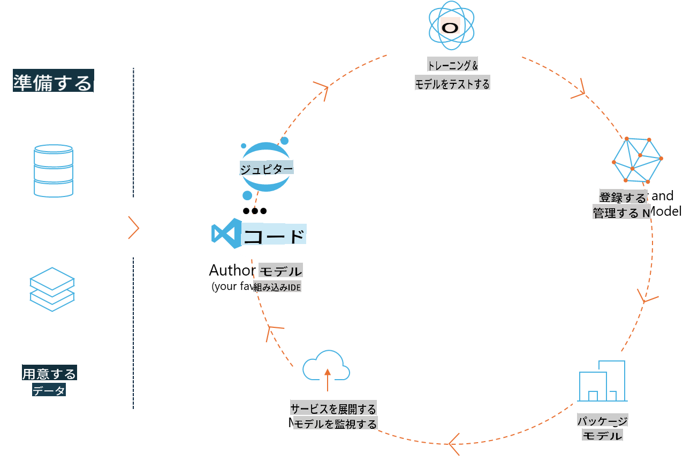
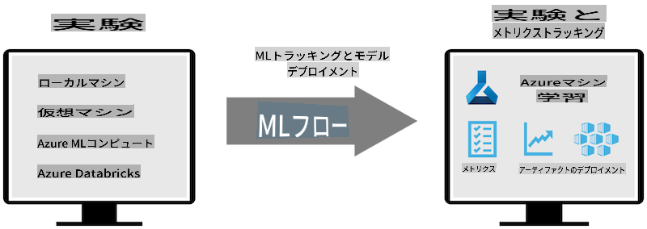
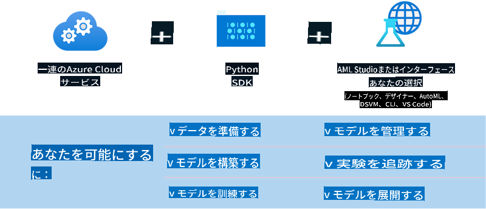

# MLflow

[MLflow](https://mlflow.org/) は、機械学習ライフサイクル全体を管理するために設計されたオープンソースプラットフォームです。



MLFlowは、実験、再現性、デプロイメント、中央モデルレジストリなどのMLライフサイクルを管理するために使用され、現在4つのコンポーネントを提供しています。

- **MLflow Tracking:** 実験、コード、データ設定、結果を記録およびクエリ。
- **MLflow Projects:** データサイエンスコードを任意のプラットフォームで実行できる形式でパッケージ化。
- **Mlflow Models:** 多様なサービング環境に機械学習モデルをデプロイ。
- **Model Registry:** モデルを中央リポジトリに保存、注釈付け、および管理。

実験の追跡、再現可能な実行へのコードのパッケージ化、モデルの共有とデプロイの機能を含んでいます。MLFlowはDatabricksに統合されており、様々なMLライブラリをサポートしているため、ライブラリに依存しません。REST APIとCLIを提供しているため、任意のプログラミング言語で使用できます。



MLFlowの主な機能には次のものがあります：

- **Experiment Tracking:** パラメータと結果の記録および比較。
- **Model Management:** 様々なサービングおよび推論プラットフォームへのモデルのデプロイ。
- **Model Registry:** バージョン管理や注釈を含むMLflowモデルのライフサイクルを協力して管理。
- **Projects:** 共有または本番使用のためにMLコードをパッケージ化。
MLFlowは、データの準備、モデルの登録と管理、実行のためのモデルのパッケージ化、サービスのデプロイ、モデルの監視を含むMLOpsループもサポートしています。特にクラウドやエッジ環境でプロトタイプから本番ワークフローに移行するプロセスを簡素化することを目指しています。

## E2Eシナリオ - ラッパーの構築とPhi-3をMLFlowモデルとして使用

このE2Eサンプルでは、Phi-3小型言語モデル（SLM）をラップする2つの異なるアプローチを示し、それをローカルまたはクラウド、例えばAzure Machine LearningワークスペースでMLFlowモデルとして実行します。



| プロジェクト | 説明 | 場所 |
| ------------ | ----------- | -------- |
| Transformer Pipeline | Transformer Pipelineは、HuggingFaceモデルをMLFlowの実験的なトランスフォーマーフレーバーで使用する場合、ラッパーを構築する最も簡単なオプションです。 | [**TransformerPipeline.ipynb**](../../../../code/06.E2E/E2E_Phi-3-MLflow_TransformerPipeline.ipynb) |
| Custom Python Wrapper | 記述時点では、トランスフォーマーパイプラインは、実験的なoptimum Pythonパッケージを使用しても、ONNX形式のHuggingFaceモデルのためのMLFlowラッパー生成をサポートしていませんでした。このような場合には、MLFlowモード用のカスタムPythonラッパーを構築できます。 | [**CustomPythonWrapper.ipynb**](../../../../code/06.E2E/E2E_Phi-3-MLflow_CustomPythonWrapper.ipynb) |

## プロジェクト: Transformer Pipeline

1. MLFlowとHuggingFaceから関連するPythonパッケージが必要です：

    ``` Python
    import mlflow
    import transformers
    ```

2. 次に、HuggingFaceレジストリのターゲットPhi-3モデルを参照してトランスフォーマーパイプラインを開始します。_Phi-3-mini-4k-instruct_のモデルカードからわかるように、そのタスクは「テキスト生成」タイプです：

    ``` Python
    pipeline = transformers.pipeline(
        task = "text-generation",
        model = "microsoft/Phi-3-mini-4k-instruct"
    )
    ```

3. Phi-3モデルのトランスフォーマーパイプラインをMLFlow形式で保存し、ターゲットアーティファクトパス、特定のモデル設定、および推論APIタイプなどの詳細を提供できます：

    ``` Python
    model_info = mlflow.transformers.log_model(
        transformers_model = pipeline,
        artifact_path = "phi3-mlflow-model",
        model_config = model_config,
        task = "llm/v1/chat"
    )
    ```

## プロジェクト: Custom Python Wrapper

1. ここでは、Microsoftの[ONNX Runtime generate() API](https://github.com/microsoft/onnxruntime-genai)を使用して、ONNXモデルの推論とトークンのエンコード/デコードを行います。以下の例では、ターゲットコンピュートとしてCPUを対象にした_onnxruntime_genai_パッケージを選択します：

    ``` Python
    import mlflow
    from mlflow.models import infer_signature
    import onnxruntime_genai as og
    ```

1. 私たちのカスタムクラスは、Phi-3 Mini 4K Instructの**ONNXモデル**、**生成パラメータ**、**トークナイザー**を初期化するための_load_context()_メソッドと、提供されたプロンプトの出力トークンを生成するための_predict()_メソッドの2つのメソッドを実装します：

    ``` Python
    class Phi3Model(mlflow.pyfunc.PythonModel):
        def load_context(self, context):
            # Retrieving model from the artifacts
            model_path = context.artifacts["phi3-mini-onnx"]
            model_options = {
                 "max_length": 300,
                 "temperature": 0.2,         
            }
        
            # Defining the model
            self.phi3_model = og.Model(model_path)
            self.params = og.GeneratorParams(self.phi3_model)
            self.params.set_search_options(**model_options)
            
            # Defining the tokenizer
            self.tokenizer = og.Tokenizer(self.phi3_model)
    
        def predict(self, context, model_input):
            # Retrieving prompt from the input
            prompt = model_input["prompt"][0]
            self.params.input_ids = self.tokenizer.encode(prompt)
    
            # Generating the model's response
            response = self.phi3_model.generate(self.params)
    
            return self.tokenizer.decode(response[0][len(self.params.input_ids):])
    ```

1. 次に_mlflow.pyfunc.log_model()_関数を使用して、Phi-3モデルのカスタムPythonラッパー（ピクル形式）を生成し、元のONNXモデルと必要な依存関係を含めることができます：

    ``` Python
    model_info = mlflow.pyfunc.log_model(
        artifact_path = artifact_path,
        python_model = Phi3Model(),
        artifacts = {
            "phi3-mini-onnx": "cpu_and_mobile/cpu-int4-rtn-block-32-acc-level-4",
        },
        input_example = input_example,
        signature = infer_signature(input_example, ["Run"]),
        extra_pip_requirements = ["torch", "onnxruntime_genai", "numpy"],
    )
    ```

## 生成されたMLFlowモデルのシグネチャ

1. 上記のTransformer Pipelineプロジェクトのステップ3では、MLFlowモデルのタスクを「_llm/v1/chat_」に設定しました。この指示により、以下に示すようにOpenAIのChat APIと互換性のあるモデルのAPIラッパーが生成されます：

    ``` Python
    {inputs: 
      ['messages': Array({content: string (required), name: string (optional), role: string (required)}) (required), 'temperature': double (optional), 'max_tokens': long (optional), 'stop': Array(string) (optional), 'n': long (optional), 'stream': boolean (optional)],
    outputs: 
      ['id': string (required), 'object': string (required), 'created': long (required), 'model': string (required), 'choices': Array({finish_reason: string (required), index: long (required), message: {content: string (required), name: string (optional), role: string (required)} (required)}) (required), 'usage': {completion_tokens: long (required), prompt_tokens: long (required), total_tokens: long (required)} (required)],
    params: 
      None}
    ```

1. その結果、以下の形式でプロンプトを送信できます：

    ``` Python
    messages = [{"role": "user", "content": "What is the capital of Spain?"}]
    ```

1. 次に、OpenAI API互換の後処理を使用して、例えば_response[0][‘choices’][0][‘message’][‘content’]_のように出力を整形して次のようにします：

    ``` JSON
    Question: What is the capital of Spain?
    
    Answer: The capital of Spain is Madrid. It is the largest city in Spain and serves as the political, economic, and cultural center of the country. Madrid is located in the center of the Iberian Peninsula and is known for its rich history, art, and architecture, including the Royal Palace, the Prado Museum, and the Plaza Mayor.
    
    Usage: {'prompt_tokens': 11, 'completion_tokens': 73, 'total_tokens': 84}
    ```

1. 上記のCustom Python Wrapperプロジェクトのステップ3では、与えられた入力例からモデルのシグネチャを生成するようにMLFlowパッケージに指示します。私たちのMLFlowラッパーのシグネチャは次のようになります：

    ``` Python
    {inputs: 
      ['prompt': string (required)],
    outputs: 
      [string (required)],
    params: 
      None}
    ```

1. したがって、プロンプトには「prompt」辞書キーを含める必要があります。例えば次のように：

    ``` Python
    {"prompt": "<|system|>You are a stand-up comedian.<|end|><|user|>Tell me a joke about atom<|end|><|assistant|>",}
    ```

1. モデルの出力は文字列形式で提供されます：

    ``` JSON
    Alright, here's a little atom-related joke for you!
    
    Why don't electrons ever play hide and seek with protons?
    
    Because good luck finding them when they're always "sharing" their electrons!
    
    Remember, this is all in good fun, and we're just having a little atomic-level humor!
    ```

**免責事項**:
この文書は機械ベースのAI翻訳サービスを使用して翻訳されています。正確性を期していますが、自動翻訳には誤りや不正確さが含まれる場合があることをご了承ください。元の言語の文書を権威ある情報源と見なすべきです。重要な情報については、専門の人間による翻訳をお勧めします。この翻訳の使用に起因する誤解や誤った解釈について、当社は責任を負いません。