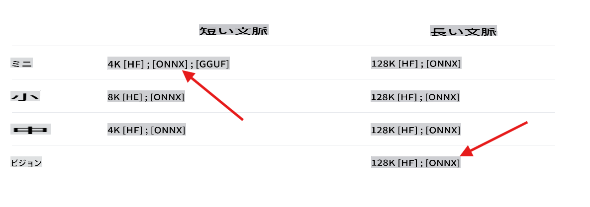
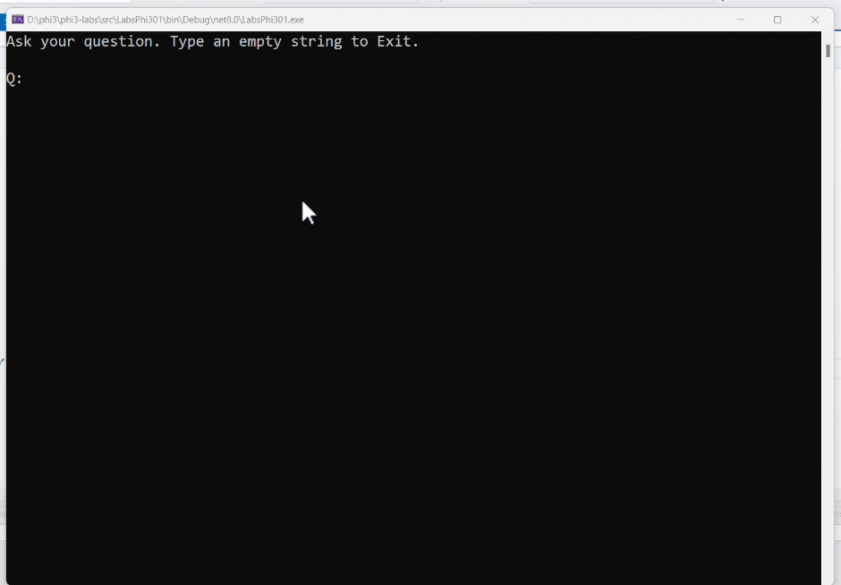
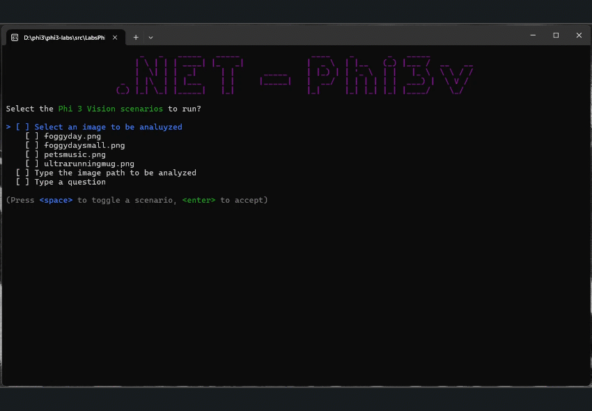

## Phi-3ラボへようこそ

ここでは、.NET環境で強力なPhi-3モデルの異なるバージョンを統合する方法を紹介するラボがいくつかあります。

## 前提条件
サンプルを実行する前に、以下がインストールされていることを確認してください:

**.NET 8:** [最新バージョンの.NET](https://dotnet.microsoft.com/download/dotnet/8.0?WT.mc_id=aiml-137032-kinfeylo)をマシンにインストールしてください。

**(オプション) Visual Studio または Visual Studio Code:** .NETプロジェクトを実行できるIDEまたはコードエディタが必要です。[Visual Studio](https://visualstudio.microsoft.com/) または [Visual Studio Code](https://code.visualstudio.com?WT.mc_id=aiml-137032-kinfeylo)を推奨します。

**gitを使用して**、[Hugging Face](https://huggingface.co)から利用可能なPhi-3バージョンのいずれかをローカルにクローンします。

**phi3-mini-4k-instruct-onnxモデルを**ローカルマシンにダウンロードします:

### モデルを保存するフォルダに移動します
```bash
cd c:\phi3\models
```
### lfsのサポートを追加します
```bash
git lfs install 
```
### mini 4K instructモデルをクローンしてダウンロードします
```bash
git clone https://huggingface.co/microsoft/Phi-3-mini-4k-instruct-onnx
```

### vision 128Kモデルをクローンしてダウンロードします
```
git clone https://huggingface.co/microsoft/Phi-3-vision-128k-instruct-onnx-cpu
```
**重要:** 現在のデモはモデルのONNXバージョンを使用するように設計されています。上記の手順で以下のモデルがクローンされます。



## ラボについて

メインのソリューションには、C#を使用してPhi-3モデルの機能を示すいくつかのサンプルラボがあります。

| プロジェクト | 説明 | 場所 |
| ------------ | ----------- | -------- |
| LabsPhi301    | これはローカルphi3モデルを使用して質問をするサンプルプロジェクトです。このプロジェクトでは、`Microsoft.ML.OnnxRuntime` libraries. | .\src\LabsPhi301\ |
| LabsPhi302    | This is a sample project that implement a Console chat using Semantic Kernel. | .\src\LabsPhi302\ |
| LabsPhi303 | This is a sample project that uses a local phi3 vision model to analyze images.. The project load a local ONNX Phi-3 Vision model using the `Microsoft.ML.OnnxRuntime` libraries. | .\src\LabsPhi303\ |
| LabsPhi304 | This is a sample project that uses a local phi3 vision model to analyze images.. The project load a local ONNX Phi-3 Vision model using the `Microsoft.ML.OnnxRuntime` libraries. The project also presents a menu with different options to interacti with the user. | .\src\LabsPhi304\ |
| LabsPhi305 | This is a sample project that uses a the Phi-3 hosted in ollama model to answer a question.  |**coming soon**|
| LabsPhi306 | This is a sample project that implement a Console chat using Semantic Kernel. |**coming soon**|
| LabsPhi307  | This is a sample project that implement a RAG using local embeddings and Semantic Kernel. |**coming soon**|


## How to Run the Projects

To run the projects, follow these steps:
1. Clone the repository to your local machine.

1. Open a terminal and navigate to the desired project. In example, let's run `LabsPhi301`を使用してローカルのONNX Phi-3モデルをロードします。
    ```bash
    cd .\src\LabsPhi301\
    ```

1. 以下のコマンドでプロジェクトを実行します
    ```bash
    dotnet run
    ```

1. サンプルプロジェクトはユーザー入力を求め、ローカルモードを使用して返信します。

    実行中のデモは以下のようになります:

    

    ***注:** 最初の質問にはタイプミスがありますが、Phi-3は正しい答えを共有するほど賢いです！*

1. プロジェクト `LabsPhi304` はユーザーに異なるオプションを選択させ、リクエストを処理します。例えば、ローカル画像を分析するなどです。

    実行中のデモは以下のようになります:

    

**免責事項**:
この文書は機械翻訳サービスを使用して翻訳されています。正確さを期すために努力していますが、自動翻訳には誤りや不正確さが含まれる場合があります。元の言語での文書が正式な情報源と見なされるべきです。重要な情報については、専門の人間による翻訳をお勧めします。この翻訳の使用に起因する誤解や誤った解釈について、当社は責任を負いません。