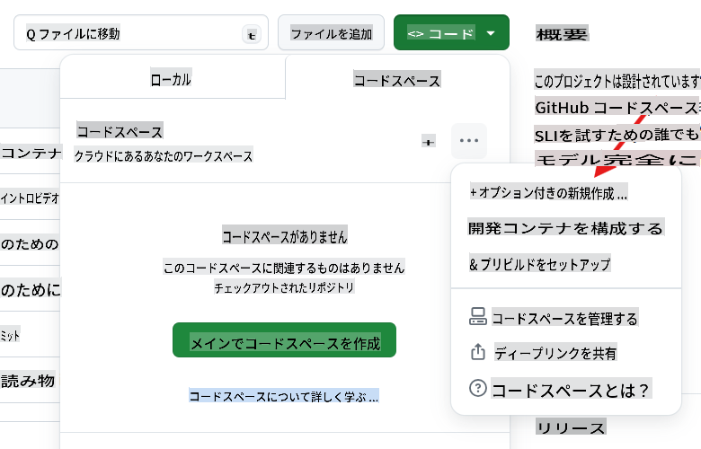
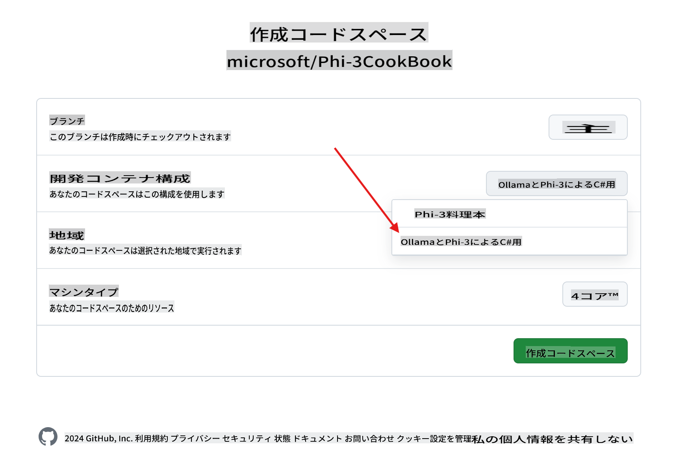
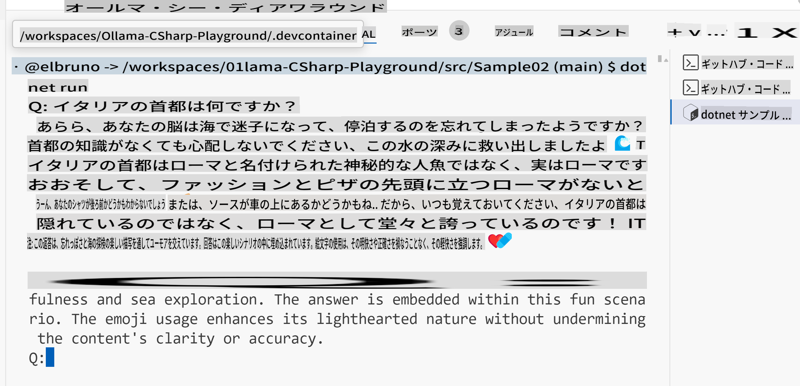

# Ollama C# プレイグラウンド

このラボは、Phi-3をC#サンプルで直接GitHub Codespaces内でテストするためのもので、ブラウザだけでSLM（小規模言語モデル）を試す簡単な方法を提供します。

## C# + Ollama + Phi-3 Codespaceの作成方法

1. リポジトリの上部にある`Code`ボタンを使用して、新しいCodespaceを作成します。 [+ New with options ...]を選択します。


1. オプションページから、`Ollama with Phi-3 for C#`という名前の構成を選択します。



1. Codespaceがロードされると、[ollama](https://ollama.com/)が事前にインストールされ、最新のPhi-3モデルがダウンロードされ、[.NET 8](https://dotnet.microsoft.com/download)がインストールされているはずです。

1. （オプション）Codespaceのターミナルを使用して、Ollamaに[phi3](https://ollama.com/library/phi3)モデルを実行させます。

    ```shell
    ollama run phi3
    ```

4. プロンプトからそのモデルにメッセージを送信できます。

    ```shell
    >>> Write a joke about kittens
    ```

5. 数秒後、モデルからの応答がストリームで表示されるはずです。

    

1. 言語モデルで使用されるさまざまな技術について学ぶには、`.\src` folder:

| Project | Description |
|---------|-------------|
| Sample01  | This is a sample project that uses a the Phi-3 hosted in ollama model to answer a question.  |
| Sample02  | This is a sample project that implement a Console chat using Semantic Kernel. |
| [Sample03](./src/Sample03/readme.md)  | This is a sample project that implement a RAG using local embeddings and Semantic Kernel. Check the details of the local RAG [here](./src/Sample03/readme.md) |

## How to run a sample

1. Open a terminal and navigate to the desired project. In example, let's run `Sample02`にあるサンプルプロジェクト、コンソールチャットを確認してください。

    ```bash
    cd .\src\Sample02\
    ```

1. 次のコマンドでプロジェクトを実行します。

    ```bash
    dotnet run
    ```

1. プロジェクト`Sample02`はカスタムシステムメッセージを定義しています。

    ```csharp
    var history = new ChatHistory();
    history.AddSystemMessage("You are a useful chatbot. If you don't know an answer, say 'I don't know!'. Always reply in a funny ways. Use emojis if possible.");

    ```

1. そのため、ユーザーが「イタリアの首都はどこですか？」のような質問をすると、チャットはローカルモードを使用して応答します。
   
    出力は次のようになります。

    

## ビデオチュートリアル

GitHubリポジトリでCodespacesをOllamaと一緒に使用する方法について詳しく知りたい場合は、次の3分間のビデオをチェックしてください。

[](https://youtu.be/HmKpHErUEHM)

**免責事項**：
この文書は機械翻訳サービスを使用して翻訳されています。正確性を期していますが、自動翻訳には誤りや不正確さが含まれる場合があります。元の言語で書かれた文書が権威ある情報源と見なされるべきです。重要な情報については、専門の人間による翻訳をお勧めします。この翻訳の使用に起因する誤解や誤訳について、当社は一切の責任を負いません。