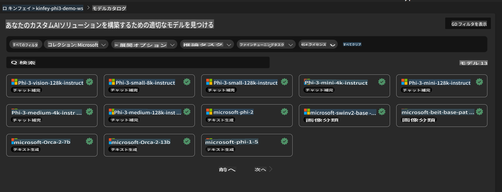
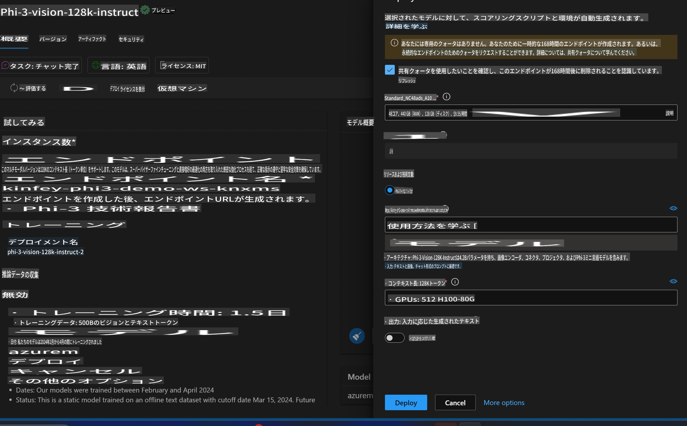
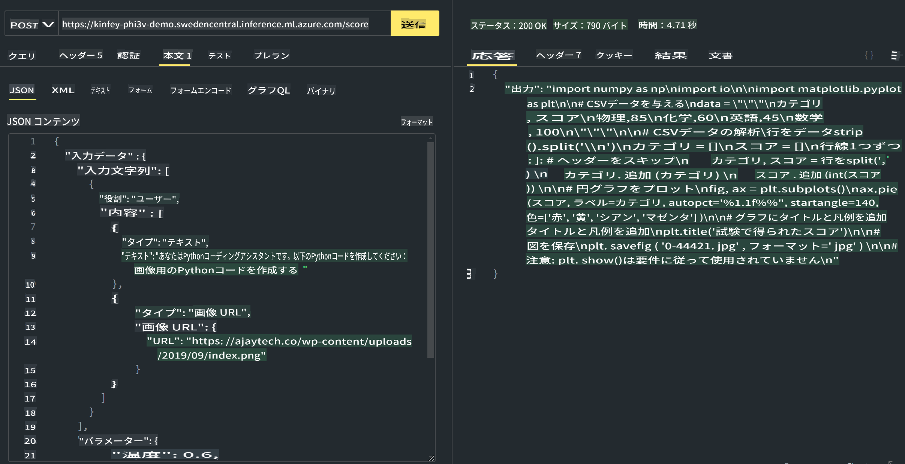

# **Lab 3 - Azure Machine Learning ServiceでPhi-3-visionをデプロイ**

NPUを使ってローカルコードのプロダクションデプロイを完了した後、PHI-3-VISIONの機能を導入して、画像からコードを生成する能力を紹介します。

このイントロダクションでは、Azure Machine Learning ServiceでModel As Service Phi-3 Visionサービスを迅速に構築する方法を説明します。

***Note***： Phi-3 Visionはコンテンツを高速で生成するために計算能力が必要です。クラウドコンピューティングの力を借りてこれを実現します。


### **1. Azure Machine Learning Serviceを作成**

Azure PortalでAzure Machine Learning Serviceを作成する必要があります。方法を学びたい場合は、このリンクをご覧ください [https://learn.microsoft.com/azure/machine-learning/quickstart-create-resources?view=azureml-api-2](https://learn.microsoft.com/azure/machine-learning/quickstart-create-resources?view=azureml-api-2)


### **2. Azure Machine Learning ServiceでPhi-3 Visionを選択**




### **3. Phi-3-VisionをAzureにデプロイ**





### **4. Postmanでエンドポイントをテスト**





***Note***

1. 送信するパラメータには、Authorization、azureml-model-deployment、Content-Typeを含める必要があります。これらはデプロイ情報を確認して取得してください。

2. パラメータを送信するために、Phi-3-Visionは画像リンクを送信する必要があります。GPT-4-Visionの方法を参照してパラメータを送信してください。例えば

```json

{
  "input_data":{
    "input_string":[
      {
        "role":"user",
        "content":[ 
          {
            "type": "text",
            "text": "You are a Python coding assistant.Please create Python code for image "
          },
          {
              "type": "image_url",
              "image_url": {
                "url": "https://ajaytech.co/wp-content/uploads/2019/09/index.png"
              }
          }
        ]
      }
    ],
    "parameters":{
          "temperature": 0.6,
          "top_p": 0.9,
          "do_sample": false,
          "max_new_tokens": 2048
    }
  }
}

```

3. Postメソッドを使用して**/score**を呼び出します

**おめでとうございます**！PHI-3-VISIONの迅速なデプロイを完了し、画像からコードを生成する方法を試しました。次に、NPUとクラウドを組み合わせてアプリケーションを構築することができます。

**免責事項**:
この文書は機械ベースのAI翻訳サービスを使用して翻訳されています。正確さを期していますが、自動翻訳には誤りや不正確さが含まれる可能性がありますのでご注意ください。原文の母国語の文書が権威ある情報源と見なされるべきです。重要な情報については、専門の人間による翻訳をお勧めします。この翻訳の使用に起因する誤解や誤解釈について、当社は一切の責任を負いません。