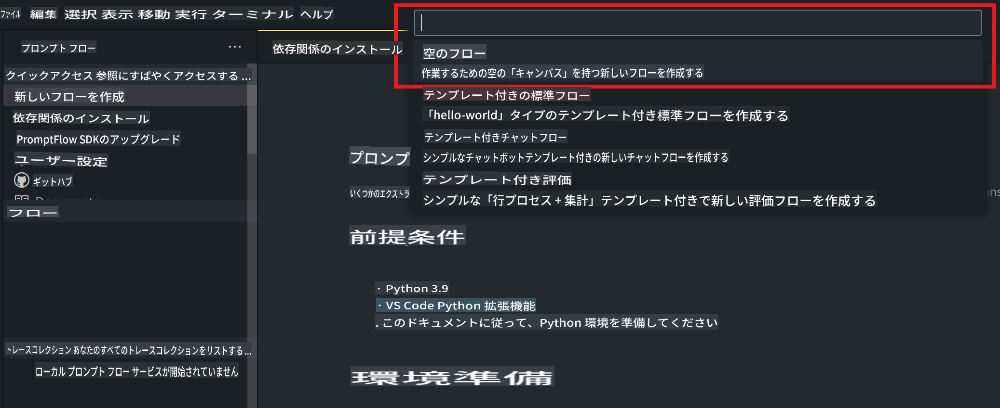
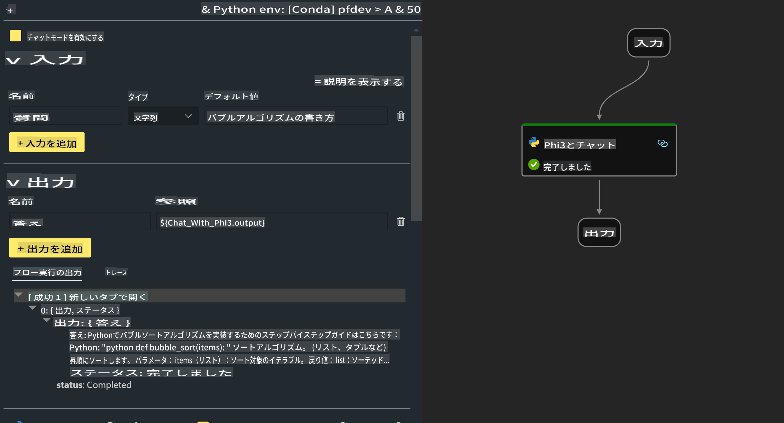

# **Lab 2 - AIPCでPhi-3-miniを使ったPrompt flowの実行**

## **Prompt flowとは**

Prompt flowは、LLMベースのAIアプリケーションのアイデア出し、プロトタイピング、テスト、評価から本番展開、監視までのエンドツーエンドの開発サイクルを効率化するための開発ツール群です。プロンプトエンジニアリングを簡単にし、プロダクション品質のLLMアプリを構築できるようにします。

Prompt flowを使用すると、以下のことが可能になります：

- LLM、プロンプト、Pythonコード、その他のツールをリンクさせ、実行可能なワークフローを作成できます。

- フローをデバッグし、特にLLMとの対話を簡単に繰り返し改善できます。

- フローを評価し、大規模なデータセットで品質とパフォーマンス指標を計算できます。

- テストと評価をCI/CDシステムに統合し、フローの品質を確保できます。

- 選択した提供プラットフォームにフローを展開したり、アプリのコードベースに簡単に統合できます。

- （オプションですが非常に推奨）Azure AIのクラウド版Prompt flowを活用してチームとコラボレーションできます。


## **Apple Silicon上での生成コードフローの構築**

***Note*** ：環境インストールがまだ完了していない場合は、[Lab 0 -Installations](./01.Installations.md)を参照してください。

1. Visual Studio CodeでPrompt flow Extensionを開き、空のフロープロジェクトを作成します



2. 入力と出力のパラメータを追加し、新しいフローとしてPythonコードを追加します




この構造（flow.dag.yaml）を参照してフローを構築できます

```yaml

inputs:
  prompt:
    type: string
    default: Write python code for Fibonacci serie. Please use markdown as output
outputs:
  result:
    type: string
    reference: ${gen_code_by_phi3.output}
nodes:
- name: gen_code_by_phi3
  type: python
  source:
    type: code
    path: gen_code_by_phi3.py
  inputs:
    prompt: ${inputs.prompt}


```

3. phi-3-miniを量子化

ローカルデバイスでSLMをより良く実行するために、通常、モデルを量子化します（INT4、FP16、FP32）


```bash

python -m mlx_lm.convert --hf-path microsoft/Phi-3-mini-4k-instruct

```

**Note:** デフォルトのフォルダはmlx_modelです 

4. ***Chat_With_Phi3.py***にコードを追加します


```python


from promptflow import tool

from mlx_lm import load, generate


# tool関数の引数に基づいてinputsセクションが変更されます。コードを保存した後
# 引数と戻り値にタイプを追加すると、システムがタイプを適切に表示するのに役立ちます
# 必要に応じて関数名/シグネチャを更新してください
@tool
def my_python_tool(prompt: str) -> str:

    model_id = './mlx_model_phi3_mini'

    model, tokenizer = load(model_id)

    # <|user|>\nWrite python code for Fibonacci serie. Please use markdown as output<|end|>\n<|assistant|>

    response = generate(model, tokenizer, prompt="<|user|>\n" + prompt  + "<|end|>\n<|assistant|>", max_tokens=2048, verbose=True)

    return response


```

4. フローをデバッグまたは実行して、生成コードが正しいかどうかを確認できます 


5. ターミナルで開発APIとしてフローを実行します

```

pf flow serve --source ./ --port 8080 --host localhost   

```

Postman / Thunder Clientでテストできます


### **Note**

1. 初回の実行には時間がかかります。Hugging face CLIからphi-3モデルをダウンロードすることをお勧めします。

2. Intel NPUの計算能力が限られていることを考慮して、Phi-3-mini-4k-instructを使用することをお勧めします。

3. INT4変換を量子化するためにIntel NPUアクセラレーションを使用していますが、サービスを再実行する場合は、キャッシュとnc_workshopフォルダを削除する必要があります。


## **リソース**

1. Promptflowを学ぶ [https://microsoft.github.io/promptflow/](https://microsoft.github.io/promptflow/)

2. Intel NPU Accelerationを学ぶ [https://github.com/intel/intel-npu-acceleration-library](https://github.com/intel/intel-npu-acceleration-library)

3. サンプルコード、ダウンロード [Local NPU Agent Sample Code](../../../../../../../code/07.Lab/01/AIPC/local-npu-agent)

