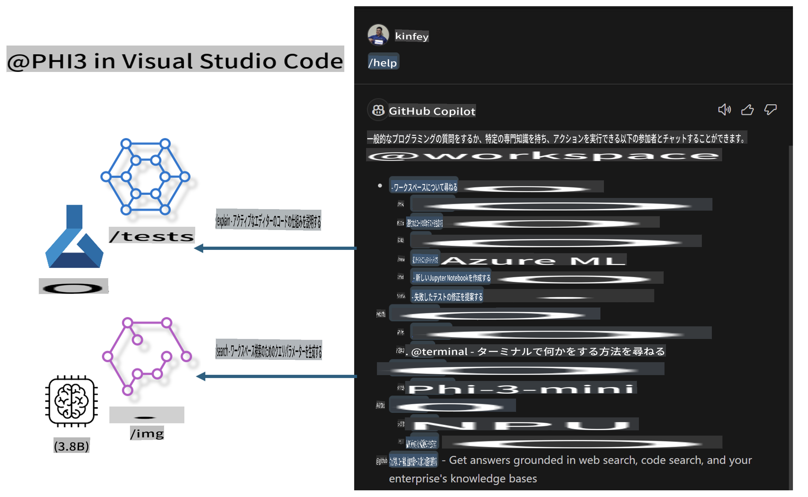

# **Microsoft Phi-3 ファミリーで独自の Visual Studio Code GitHub Copilot Chat を構築**

GitHub Copilot Chat のワークスペースエージェントを使ったことがありますか？自分のチーム用のコードエージェントを作りたいと思ったことはありませんか？このハンズオンラボでは、オープンソースモデルを組み合わせて、企業レベルのコードビジネスエージェントを構築することを目指します。

## **基礎**

### **なぜ Microsoft Phi-3 を選ぶのか**

Phi-3 はファミリーシリーズであり、テキスト生成、対話補完、コード生成のために異なるトレーニングパラメータに基づく phi-3-mini、phi-3-small、および phi-3-medium が含まれています。また、Vision に基づく phi-3-vision もあります。これは、オフラインの生成 AI ソリューションを作成するために企業や異なるチームに適しています。

このリンクを読むことをお勧めします [https://github.com/microsoft/Phi-3CookBook/blob/main/md/01.Introduce/Phi3Family.md](https://github.com/microsoft/Phi-3CookBook/blob/main/md/01.Introduce/Phi3Family.md)

### **Microsoft GitHub Copilot Chat**

GitHub Copilot Chat 拡張機能は、VS Code 内で GitHub Copilot と対話し、コーディングに関連する質問に直接答えるチャットインターフェースを提供します。これにより、ドキュメントを探したりオンラインフォーラムを検索したりする必要がありません。

Copilot Chat は、シンタックスハイライト、インデント、その他のフォーマット機能を使用して生成された応答を明確にすることがあります。ユーザーからの質問の種類に応じて、応答にはソースコードファイルやドキュメントなどのコンテキストへのリンクや、VS Code の機能にアクセスするためのボタンが含まれることがあります。

- Copilot Chat は開発者のフローに統合され、必要な場所で支援を提供します：

- コーディング中にエディタやターミナルから直接インラインチャットを開始してヘルプを求める

- チャットビューを使用して、いつでも AI アシスタントをサイドに配置

- クイックチャットを起動して簡単な質問をし、すぐに作業に戻る

GitHub Copilot Chat は、以下のようなシナリオで使用できます：

- 問題を最適に解決する方法についてのコーディング質問に答える

- 他人のコードを説明し、改善を提案する

- コード修正を提案する

- ユニットテストケースを生成する

- コードドキュメントを生成する

このリンクを読むことをお勧めします [https://code.visualstudio.com/docs/copilot/copilot-chat](https://code.visualstudio.com/docs/copilot/copilot-chat?WT.mc_id=aiml-137032-kinfeylo)

###  **Microsoft GitHub Copilot Chat @workspace**

Copilot Chat で **@workspace** を参照することで、コードベース全体について質問することができます。質問に基づいて、Copilot は関連するファイルやシンボルをインテリジェントに取得し、それをリンクやコード例として回答に引用します。

質問に答えるために、**@workspace** は開発者が VS Code 内でコードベースをナビゲートするときに使用するのと同じソースを検索します：

- .gitignore ファイルによって無視されているファイルを除く、ワークスペース内のすべてのファイル

- ネストされたフォルダとファイル名を含むディレクトリ構造

- ワークスペースが GitHub リポジトリであり、コード検索によってインデックス化されている場合、GitHub のコード検索インデックス

- ワークスペース内のシンボルと定義

- 現在選択されているテキストまたはアクティブなエディタ内の表示されているテキスト

注意: .gitignore がバイパスされるのは、無視されたファイルを開いている場合や、無視されたファイル内のテキストを選択している場合です。

このリンクを読むことをお勧めします [[https://code.visualstudio.com/docs/copilot/copilot-chat](https://code.visualstudio.com/docs/copilot/workspace-context?WT.mc_id=aiml-137032-kinfeylo)]

## **このラボについてもっと知る**

GitHub Copilot は企業のプログラミング効率を大幅に向上させ、すべての企業が GitHub Copilot の関連機能をカスタマイズしたいと考えています。多くの企業は、自社のビジネスシナリオやオープンソースモデルに基づいて、GitHub Copilot に似た拡張機能をカスタマイズしています。企業にとって、カスタマイズされた拡張機能は管理しやすいですが、これもユーザーエクスペリエンスに影響を与えます。結局のところ、GitHub Copilot は一般的なシナリオや専門性においてより強力な機能を持っています。エクスペリエンスを一貫させることができれば、企業独自の拡張機能をカスタマイズする方が良いでしょう。GitHub Copilot Chat は、企業がチャットエクスペリエンスを拡張するための関連 API を提供しています。一貫したエクスペリエンスを維持し、カスタマイズされた機能を持つことが、より良いユーザーエクスペリエンスです。

このラボでは主に Phi-3 モデルを使用し、ローカル NPU と Azure ハイブリッドを組み合わせて、GitHub Copilot Chat 内でカスタムエージェント ***@PHI3*** を構築し、企業の開発者がコード生成***(@PHI3 /gen)***および画像に基づいたコード生成***(@PHI3 /img)***を完了するのを支援します。

### ***注意:*** 

このラボは現在、Intel CPU および Apple Silicon の AIPC で実装されています。Qualcomm バージョンの NPU も引き続き更新していきます。

## **ラボ**

| 名前 | 説明 | AIPC | Apple |
| ------------ | ----------- | -------- |-------- |
| Lab0 - インストール(✅) | 関連環境およびインストールツールの設定とインストール | [Go](./HOL/AIPC/01.Installations.md) |[Go](./HOL/Apple/01.Installations.md) |
| Lab1 - Phi-3-mini でプロンプトフローを実行(✅) | AIPC / Apple Silicon と組み合わせて、ローカル NPU を使用して Phi-3-mini を通じてコード生成を作成 | [Go](./HOL/AIPC/02.PromptflowWithNPU.md) |  [Go](./HOL/Apple/02.PromptflowWithMLX.md) |
| Lab2 - Azure Machine Learning Service に Phi-3-vision をデプロイ(✅) | Azure Machine Learning Service のモデルカタログ - Phi-3-vision 画像をデプロイしてコードを生成 | [Go](./HOL/AIPC/03.DeployPhi3VisionOnAzure.md) |[Go](./HOL/Apple/03.DeployPhi3VisionOnAzure.md) |
| Lab3 - GitHub Copilot Chat で @phi-3 エージェントを作成(✅)  | GitHub Copilot Chat でカスタム Phi-3 エージェントを作成し、コード生成、グラフ生成コード、RAG などを完了 | [Go](./HOL/AIPC/04.CreatePhi3AgentInVSCode.md) | [Go](./HOL/Apple/04.CreatePhi3AgentInVSCode.md) |
| サンプルコード (✅)  | サンプルコードをダウンロード | [Go](../../../../../code/07.Lab/01/AIPC) | [Go](../../../../../code/07.Lab/01/Apple) |

## **リソース**

1. Phi-3 Cookbook [https://github.com/microsoft/Phi-3CookBook](https://github.com/microsoft/Phi-3CookBook)

2. GitHub Copilot について詳しく学ぶ [https://learn.microsoft.com/training/paths/copilot/](https://learn.microsoft.com/training/paths/copilot/?WT.mc_id=aiml-137032-kinfeylo)

3. GitHub Copilot Chat について詳しく学ぶ [https://learn.microsoft.com/training/paths/accelerate-app-development-using-github-copilot/](https://learn.microsoft.com/training/paths/accelerate-app-development-using-github-copilot/?WT.mc_id=aiml-137032-kinfeylo)

4. GitHub Copilot Chat API について詳しく学ぶ [https://code.visualstudio.com/api/extension-guides/chat](https://code.visualstudio.com/api/extension-guides/chat?WT.mc_id=aiml-137032-kinfeylo)

5. Azure AI Foundry について詳しく学ぶ [https://learn.microsoft.com/training/paths/create-custom-copilots-ai-studio/](https://learn.microsoft.com/training/paths/create-custom-copilots-ai-studio/?WT.mc_id=aiml-137032-kinfeylo)

6. Azure AI Foundry のモデルカタログについて詳しく学ぶ [https://learn.microsoft.com/azure/ai-studio/how-to/model-catalog-overview](https://learn.microsoft.com/azure/ai-studio/how-to/model-catalog-overview)

**免責事項**:
この文書は機械翻訳AIサービスを使用して翻訳されています。正確性を期していますが、自動翻訳には誤りや不正確さが含まれる場合があります。元の言語での原文を信頼できる情報源と見なしてください。重要な情報については、専門の人間による翻訳をお勧めします。この翻訳の使用に起因する誤解や誤解について、当社は一切の責任を負いません。