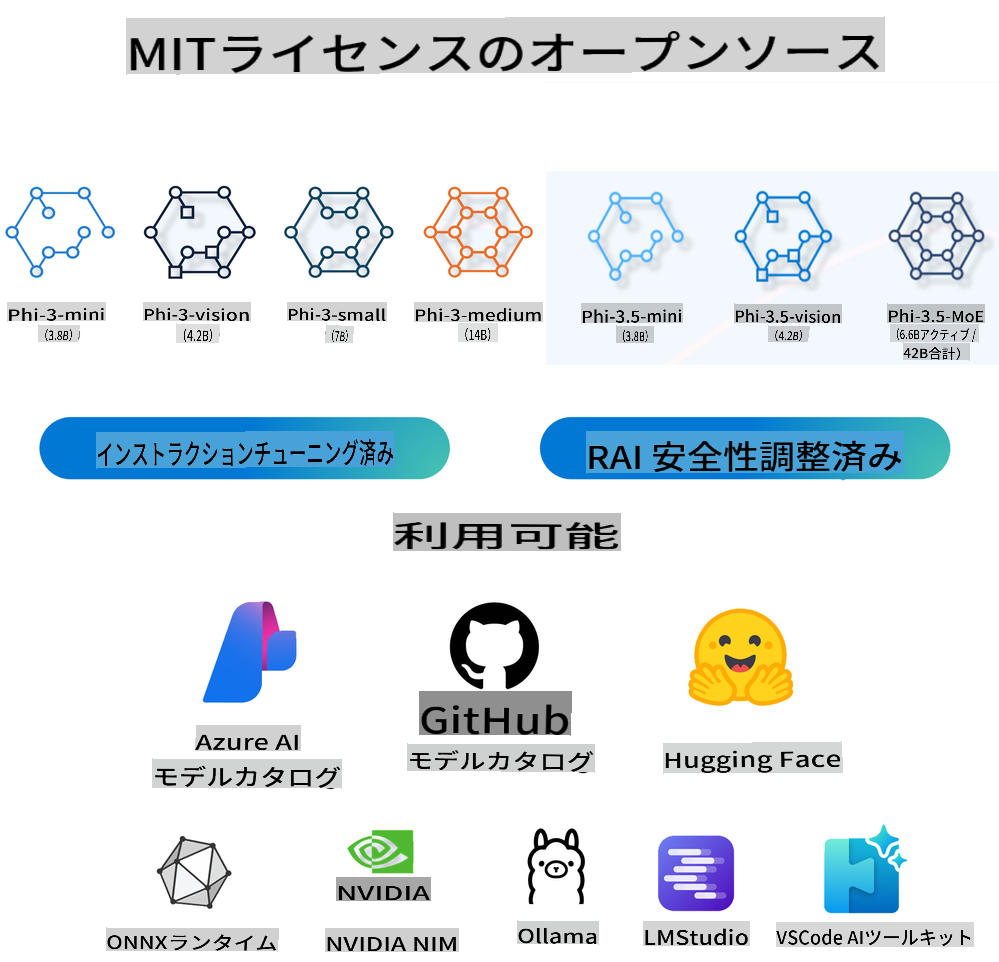
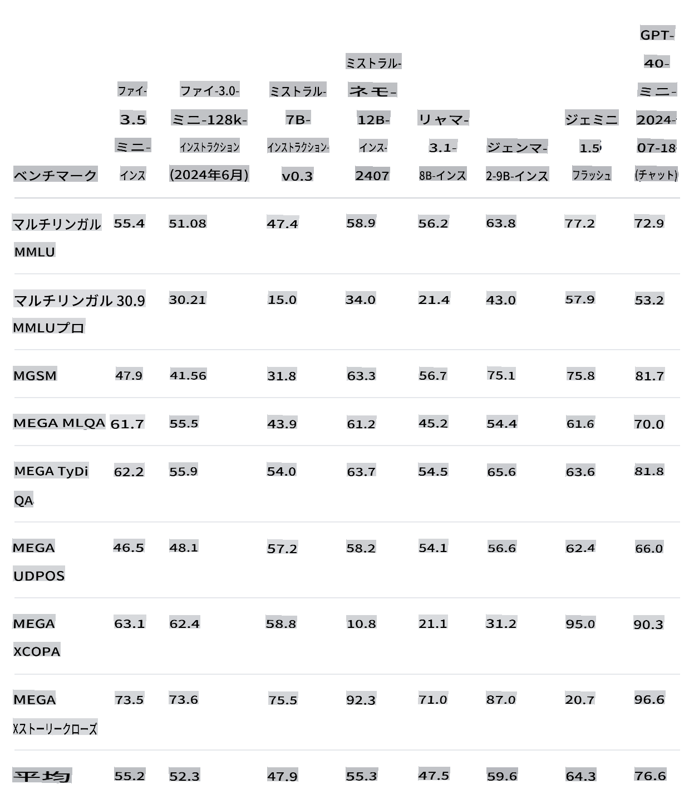
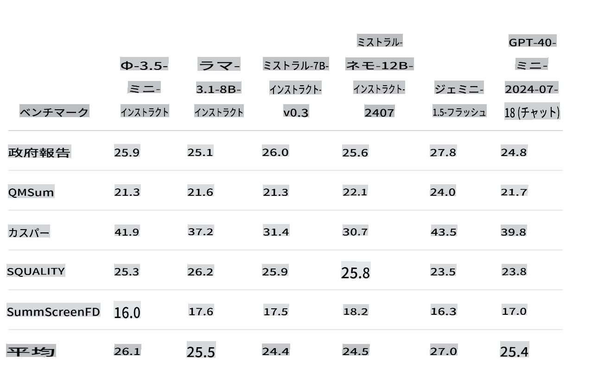
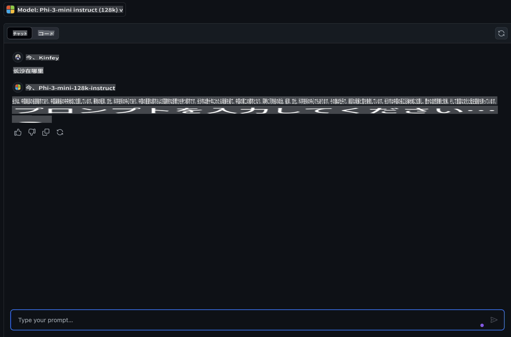
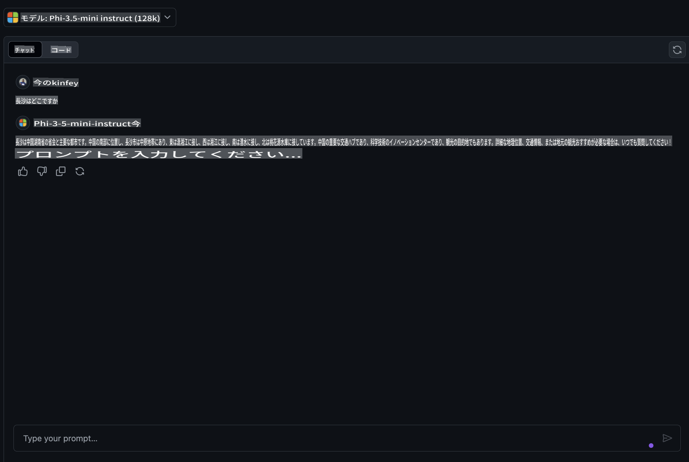
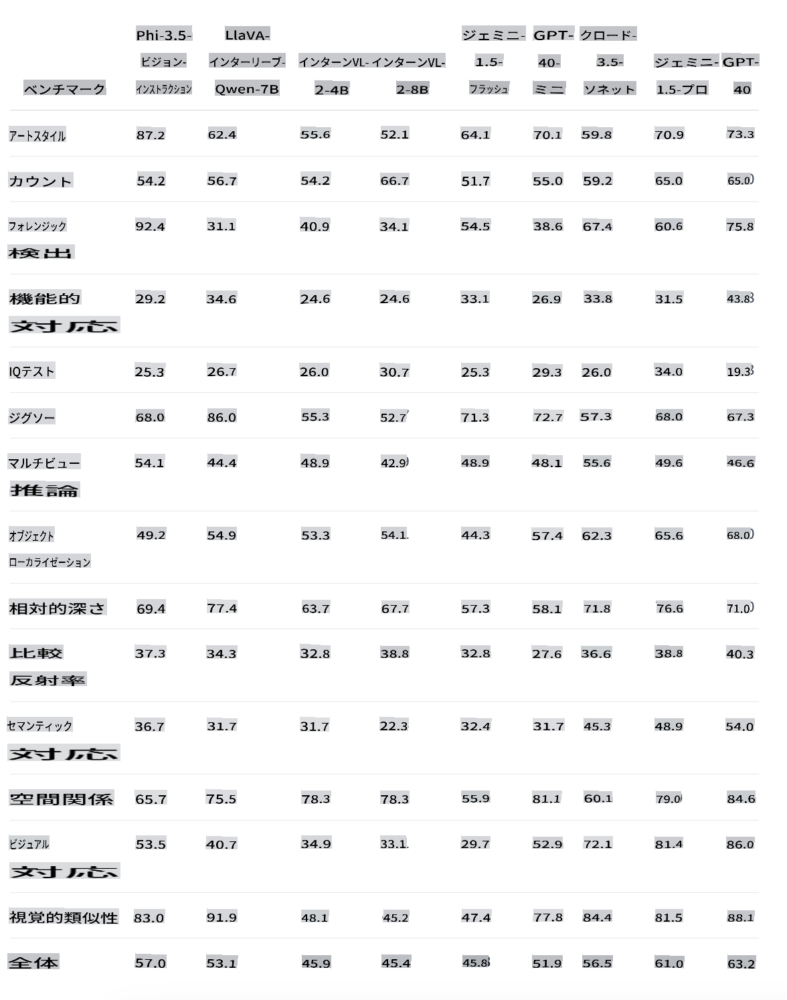
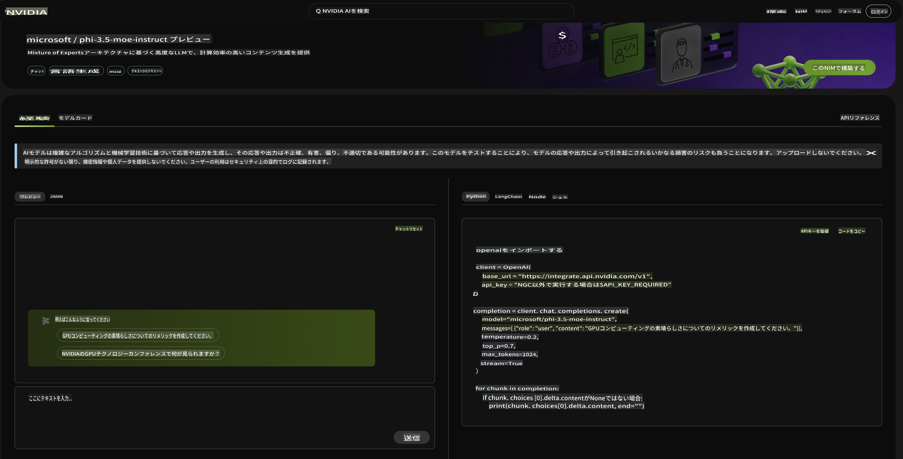

# **Phi-3.5ファミリーの新機能**

Phi-3ファミリーをすでに使っていますか？どのようなシナリオで利用していますか？2024年8月20日、Microsoftは多言語対応、ビジョン、AIエージェントの機能を強化した新しいPhi-3.5ファミリーをリリースしました。Hugging faceのモデルカードと併せて、詳細な紹介を行います。

## **Phi-3.5-mini-instruct**

Phi-3.5-miniは、Phi-3で使用されたデータセット（合成データとフィルタリングされた公開ウェブサイト）に基づいて構築された軽量で最先端のオープンモデルです。非常に高品質で推論密度の高いデータに焦点を当てています。このモデルはPhi-3モデルファミリーに属し、128Kトークンのコンテキスト長をサポートしています。モデルは厳格な強化プロセスを経て、教師ありファインチューニング、近接方策最適化、直接好み最適化を組み込んでおり、正確な指示遵守と堅牢な安全対策を確保しています。

ベンチマークの指標から、Phi-3-miniと比較してPhi-3.5-miniが複数言語および長文コンテンツのサポートが向上していることがわかります。これは、エッジアプリケーションにおけるPhi-3.5 miniの言語およびテキスト能力を強化するためのものです。

GitHub Modelsを通じて、中国語の知識能力を比較することができます。「长沙在哪里？」と尋ねたときのPhi-3-mini-128k-instructとPhi-3.5-mini-128k-instructの結果を比較してみましょう。

中国語コーパスのデータ強化により、Phi-3.5-miniが基本的なテキスト生成シナリオでより良い結果を出すことができることがわかります（***注:*** Phi-3.5-miniがより正確な回答を必要とする場合、アプリケーションシナリオに応じてファインチューニングすることをお勧めします）。

## **Phi-3.5-vision-instruct**

Phi-3.5-visionは、合成データとフィルタリングされた公開ウェブサイトを含むデータセットに基づいて構築された軽量で最先端のオープンマルチモーダルモデルです。非常に高品質で推論密度の高いデータに焦点を当てています。このモデルはPhi-3モデルファミリーに属し、マルチモーダルバージョンは128Kトークンのコンテキスト長をサポートしています。モデルは厳格な強化プロセスを経て、教師ありファインチューニングと直接好み最適化を組み込んでおり、正確な指示遵守と堅牢な安全対策を確保しています。

Visionを通じて、Phi-3.xファミリーの視覚機能を開放し、以下のシナリオを完了することができました。

1. メモリ/計算資源が制約される環境
2. レイテンシが重要なシナリオ
3. 一般的な画像理解
4. 光学文字認識
5. グラフや表の理解
6. 複数画像の比較
7. 複数画像またはビデオクリップの要約

Visionを通じて、Phiファミリーの視覚機能を開放し、以下のシナリオを完了します。

提供されたHugging faceのベンチマークを使用して、異なる視覚シナリオでの比較を理解することもできます。

Phi-3.5-vision-instructの無料トライアルを試したい場合は、[Nivida NIM](https://build.nvidia.com/microsoft/phi-3_5-vision-instruct)を使用して体験を完了することができます。

もちろん、Azure AI Studioを通じてデプロイを完了することもできます。

## **Phi-3.5-MoE-instruct**

Phi-3.5-MoEは、Phi-3で使用されたデータセット（合成データとフィルタリングされた公開ドキュメント）に基づいて構築された軽量で最先端のオープンモデルです。非常に高品質で推論密度の高いデータに焦点を当てています。このモデルは多言語対応で、128Kトークンのコンテキスト長をサポートしています。モデルは厳格な強化プロセスを経て、教師ありファインチューニング、近接方策最適化、直接好み最適化を組み込んでおり、正確な指示遵守と堅牢な安全対策を確保しています。

AIエージェントの発展に伴い、MoEモデルの需要は徐々に増加していきます。MoE（Mixed Expert Models）は、複数のエキスパートモデルを混合して形成された新しいモデルです。MoEは大きな問題をまず分割し、小さな問題を一つずつ解決し、最後に結論をまとめます。さらに、モデルの規模はモデルの性能を向上させるための重要な要素の一つです。限られた計算資源で、大きなモデルを少ないトレーニングステップでトレーニングする方が、小さなモデルを多くのステップでトレーニングするよりも良い結果をもたらすことがよくあります。

Phi-3.5-MoE-Instructモデルは、Phi-3.5-VisionおよびPhi-3.5-Instructよりも多くの計算能力を必要とします。Azure AI StudioやNvidia NIMなどのクラウドベースの方法を使用することをお勧めします。

### **🤖 Apple MLXを使用したPhi-3.5のサンプル**

| ラボ    | 紹介 | 進む |
| -------- | ------- |  ------- |
| 🚀 Lab-Introduce Phi-3.5 Instruct  | Phi-3.5 Instructの使用方法を学ぶ |  [進む](../../../../../code/09.UpdateSamples/Aug/phi3-instruct-demo.ipynb)    |
| 🚀 Lab-Introduce Phi-3.5 Vision (画像) | Phi-3.5 Visionを使用して画像を分析する方法を学ぶ |  [進む](../../../../../code/09.UpdateSamples/Aug/phi3-vision-demo.ipynb)    |
| 🚀 Lab-Introduce Phi-3.5 MoE   | Phi-3.5 Visionを使用して画像を分析する方法を学ぶ |  [進む](../../../../../code/09.UpdateSamples/Aug/phi3_moe_demo.ipynb)    |

## **リソース**

1. Hugging faceのPhiファミリー [https://huggingface.co/collections/microsoft/phi-3-6626e15e9585a200d2d761e3](https://huggingface.co/collections/microsoft/phi-3-6626e15e9585a200d2d761e3)

2. GitHub Modelsについて [https://gh.io/models](https://gh.io/models)

3. Azure AI Studioについて [https://ai.azure.com/](https://ai.azure.com/)

4. Nividia NIMについて [https://build.nvidia.com/explore/discover](https://build.nvidia.com/explore/discover)

免責事項: この翻訳はAIモデルによって元の文から翻訳されたものであり、完璧ではないかもしれません。
出力を確認し、必要に応じて修正を行ってください。