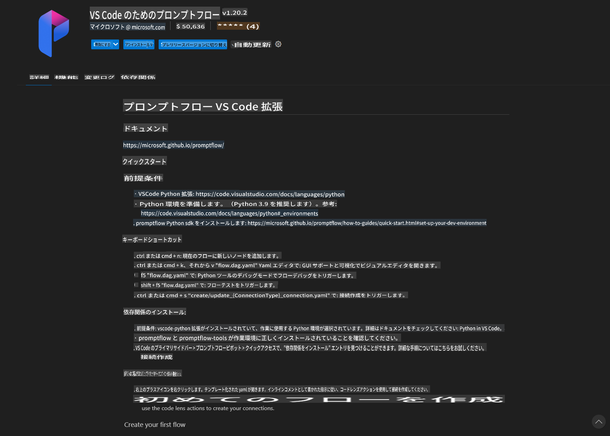
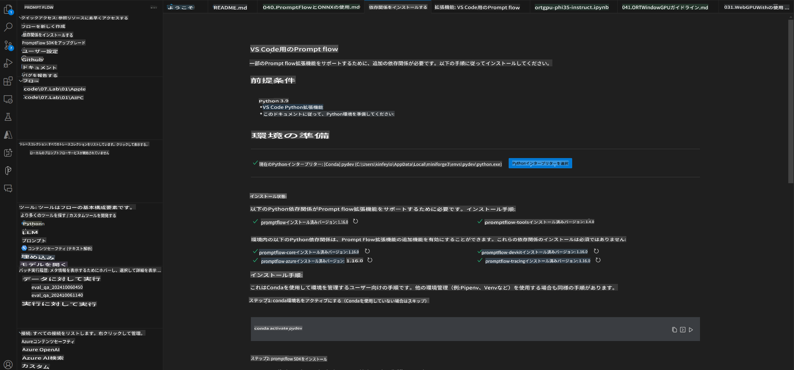
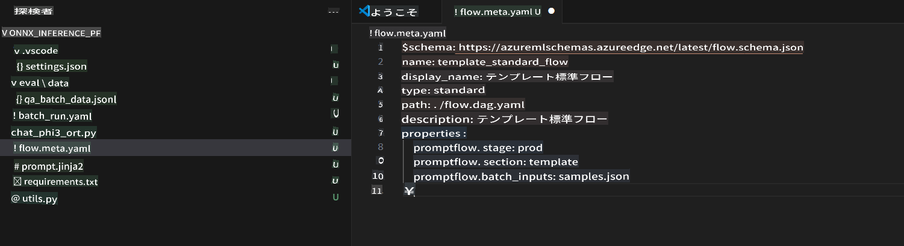
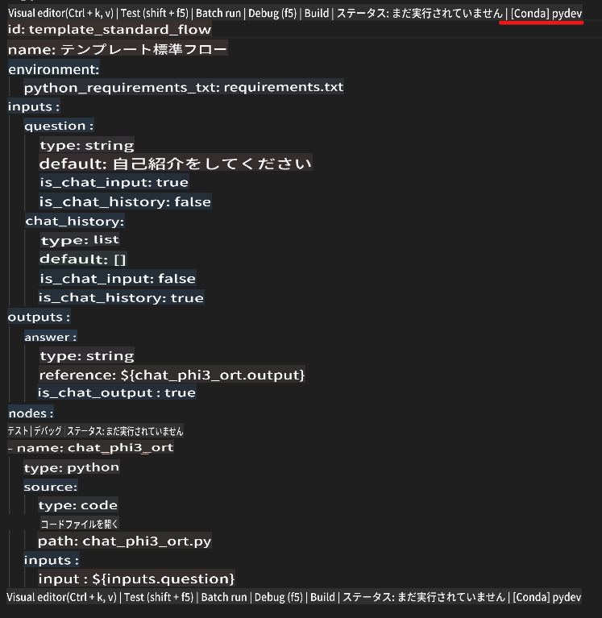
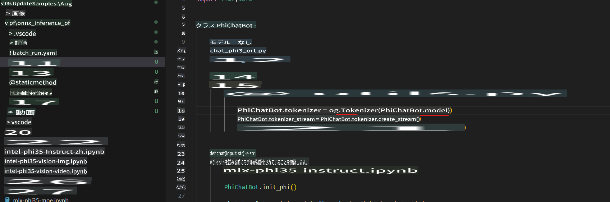
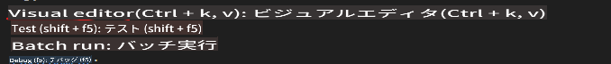
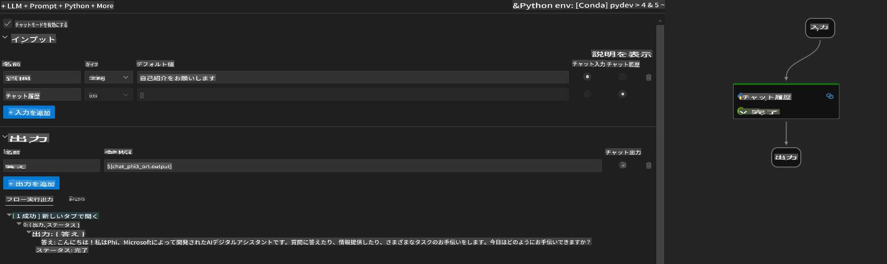
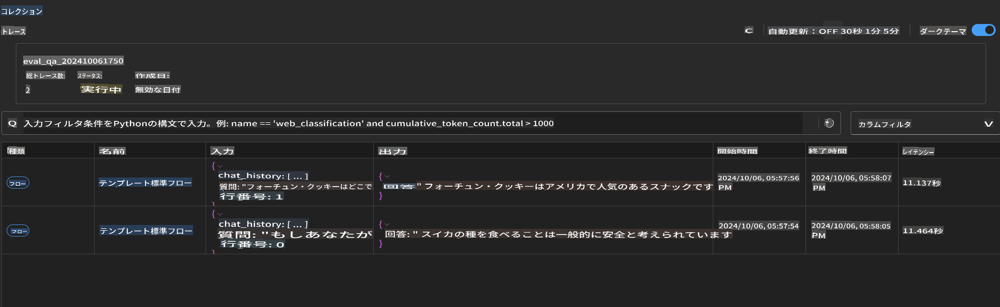

# Windows GPUを使用してPhi-3.5-Instruct ONNXでPrompt flowソリューションを作成する

以下のドキュメントは、Phi-3モデルに基づいたAIアプリケーションを開発するために、PromptFlowとONNX (Open Neural Network Exchange) を使用する方法の例です。

PromptFlowは、LLM（Large Language Model）ベースのAIアプリケーションのアイデア出しからプロトタイピング、テスト、評価までのエンドツーエンドの開発サイクルを効率化するための開発ツールスイートです。

PromptFlowとONNXを統合することで、開発者は以下のことが可能になります：

- モデルパフォーマンスの最適化：ONNXを活用して効率的なモデル推論とデプロイメントを実現。
- 開発の簡素化：PromptFlowを使用してワークフローを管理し、反復作業を自動化。
- コラボレーションの強化：統一された開発環境を提供することで、チームメンバー間のコラボレーションを促進。

**Prompt flow**は、LLMベースのAIアプリケーションのアイデア出し、プロトタイピング、テスト、評価から本番環境へのデプロイメントおよび監視までのエンドツーエンドの開発サイクルを効率化するための開発ツールスイートです。これにより、プロンプトエンジニアリングが非常に簡単になり、プロダクション品質のLLMアプリを構築することができます。

Prompt flowは、OpenAI、Azure OpenAI Service、およびカスタマイズ可能なモデル（Huggingface、ローカルLLM/SLM）に接続することができます。Phi-3.5の量子化されたONNXモデルをローカルアプリケーションにデプロイすることを目指しています。Prompt flowは、ビジネスの計画をより良くし、Phi-3.5に基づくローカルソリューションを完成させるのに役立ちます。この例では、ONNX Runtime GenAIライブラリを組み合わせて、Windows GPUに基づくPrompt flowソリューションを完成させます。

## **インストール**

### **Windows GPU用ONNX Runtime GenAI**

Windows GPU用ONNX Runtime GenAIを設定するためのガイドラインを読むには[こちらをクリック](./041.ORTWindowGPUGuideline.md)

### **VSCodeでPrompt flowをセットアップ**

1. Prompt flow VS Code Extensionをインストール



2. Prompt flow VS Code Extensionをインストールした後、エクステンションをクリックし、**Installation dependencies**を選択し、このガイドラインに従って環境にPrompt flow SDKをインストール



3. [サンプルコード](../../../../../code/09.UpdateSamples/Aug/pf/onnx_inference_pf)をダウンロードし、VS Codeでこのサンプルを開く



4. **flow.dag.yaml**を開いて、Python環境を選択



   **chat_phi3_ort.py**を開いて、Phi-3.5-instruct ONNXモデルの場所を変更



5. プロンプトフローを実行してテスト

**flow.dag.yaml**を開いて、ビジュアルエディタをクリック



これをクリックして実行し、テスト



6. ターミナルでバッチを実行して、より多くの結果を確認

```bash

pf run create --file batch_run.yaml --stream --name 'Your eval qa name'    

```

デフォルトのブラウザで結果を確認できます



**免責事項**:
この文書は機械翻訳AIサービスを使用して翻訳されています。正確さを期すために努力していますが、自動翻訳には誤りや不正確さが含まれる場合があります。元の言語の文書を権威ある情報源と見なしてください。重要な情報については、専門の人間による翻訳を推奨します。この翻訳の使用に起因する誤解や誤認について、当社は責任を負いません。