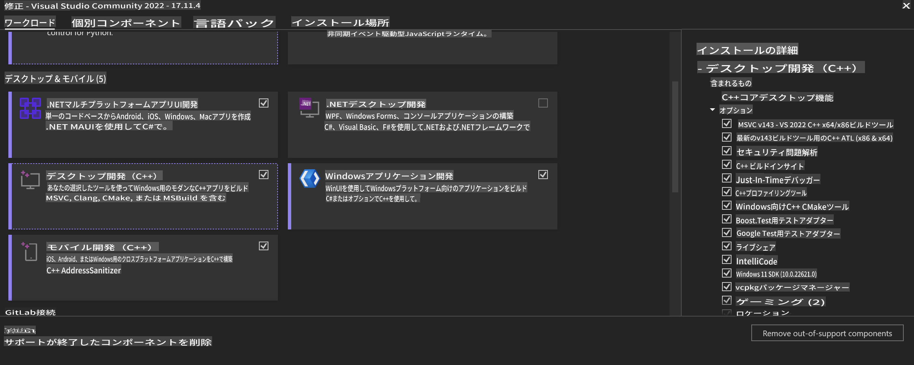
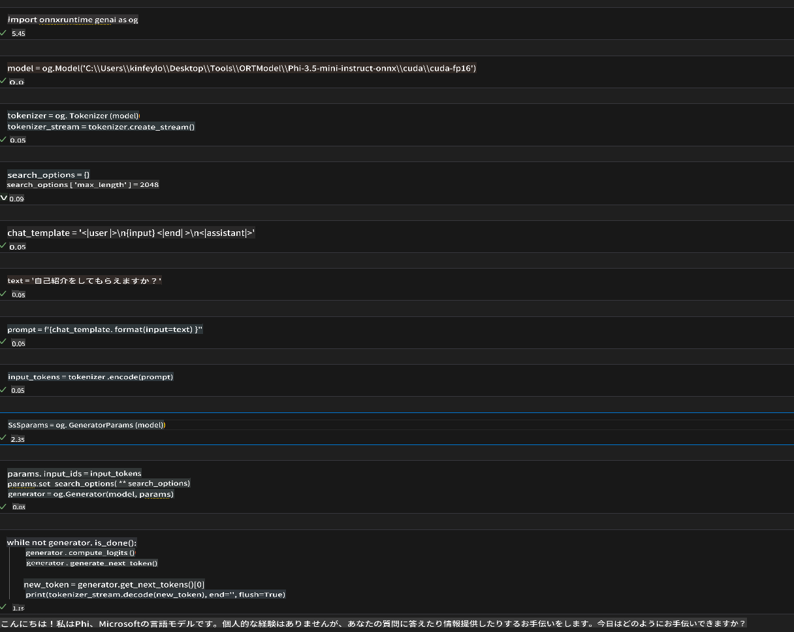
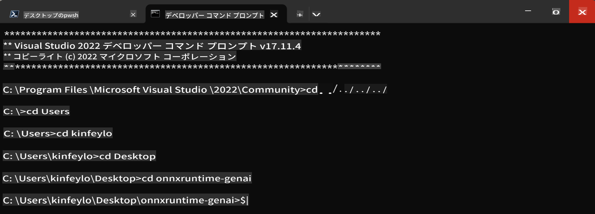

# **OnnxRuntime GenAI Windows GPU ガイドライン**

このガイドラインは、Windows上でGPUを使用してONNX Runtime (ORT)をセットアップおよび使用する手順を提供します。モデルのパフォーマンスと効率を向上させるために、GPUアクセラレーションを活用する方法を説明します。

このドキュメントでは以下の内容について説明します：

- 環境セットアップ：CUDA、cuDNN、およびONNX Runtimeなどの必要な依存関係のインストール手順。
- 設定：GPUリソースを効果的に利用するための環境およびONNX Runtimeの設定方法。
- 最適化のヒント：最適なパフォーマンスを得るためのGPU設定の微調整に関するアドバイス。

### **1. Python 3.10.x /3.11.8**

   ***Note*** Python環境として[miniforge](https://github.com/conda-forge/miniforge/releases/latest/download/Miniforge3-Windows-x86_64.exe)の使用を推奨します

   ```bash

   conda create -n pydev python==3.11.8

   conda activate pydev

   ```

   ***Reminder*** 既にPythonのONNXライブラリをインストールしている場合は、アンインストールしてください

### **2. wingetを使ってCMakeをインストールする**


   ```bash

   winget install -e --id Kitware.CMake

   ```

### **3. Visual Studio 2022 - Desktop Development with C++ をインストールする**

   ***Note*** コンパイルを行わない場合はこのステップをスキップできます




### **4. NVIDIAドライバをインストールする**

1. **NVIDIA GPU ドライバ**  [https://www.nvidia.com/en-us/drivers/](https://www.nvidia.com/en-us/drivers/)

2. **NVIDIA CUDA 12.4** [https://developer.nvidia.com/cuda-12-4-0-download-archive](https://developer.nvidia.com/cuda-12-4-0-download-archive)

3. **NVIDIA CUDNN 9.4**  [https://developer.nvidia.com/cudnn-downloads](https://developer.nvidia.com/cudnn-downloads)

***Reminder*** インストールフローのデフォルト設定を使用してください

### **5. NVIDIA環境を設定する**

NVIDIA CUDNN 9.4のlib, bin, includeをNVIDIA CUDA 12.4のlib, bin, includeにコピーします

- *'C:\Program Files\NVIDIA\CUDNN\v9.4\bin\12.6'* のファイルを *'C:\Program Files\NVIDIA GPU Computing Toolkit\CUDA\v12.4\bin'* にコピーする

- *'C:\Program Files\NVIDIA\CUDNN\v9.4\include\12.6'* のファイルを *'C:\Program Files\NVIDIA GPU Computing Toolkit\CUDA\v12.4\include'* にコピーする

- *'C:\Program Files\NVIDIA\CUDNN\v9.4\lib\12.6'* のファイルを *'C:\Program Files\NVIDIA GPU Computing Toolkit\CUDA\v12.4\lib\x64'* にコピーする


### **6. Phi-3.5-mini-instruct-onnxをダウンロードする**


   ```bash

   winget install -e --id Git.Git

   winget install -e --id GitHub.GitLFS

   git lfs install

   git clone https://huggingface.co/microsoft/Phi-3.5-mini-instruct-onnx

   ```

### **7. InferencePhi35Instruct.ipynbを実行する**

   [Notebook](../../../../../code/09.UpdateSamples/Aug/ortgpu-phi35-instruct.ipynb)を開いて実行します





### **8. ORT GenAI GPUをコンパイルする**


   ***Note*** 
   
   1. まず、すべてのonnx、onnxruntime、およびonnxruntime-genai関連のものをアンインストールしてください

   
   ```bash

   pip list 
   
   ```

   次に、すべてのonnxruntimeライブラリをアンインストールします。例えば：


   ```bash

   pip uninstall onnxruntime

   pip uninstall onnxruntime-genai

   pip uninstall onnxruntume-genai-cuda
   
   ```

   2. Visual Studio Extensionサポートを確認する

   C:\Program Files\NVIDIA GPU Computing Toolkit\CUDA\v12.4\extrasにC:\Program Files\NVIDIA GPU Computing Toolkit\CUDA\v12.4\extras\visual_studio_integrationが存在することを確認してください。
   
   存在しない場合は、他のCudaツールキットドライバフォルダを確認し、visual_studio_integrationフォルダとその内容をC:\Program Files\NVIDIA GPU Computing Toolkit\CUDA\v12.4\extras\visual_studio_integrationにコピーします。


   - コンパイルを行わない場合はこのステップをスキップできます


   ```bash

   git clone https://github.com/microsoft/onnxruntime-genai

   ```

   - [https://github.com/microsoft/onnxruntime/releases/download/v1.19.2/onnxruntime-win-x64-gpu-1.19.2.zip](https://github.com/microsoft/onnxruntime/releases/download/v1.19.2/onnxruntime-win-x64-gpu-1.19.2.zip) をダウンロードする

   - onnxruntime-win-x64-gpu-1.19.2.zipを解凍し、**ort**にリネームしてonnxruntime-genaiフォルダにコピーする

   - Windows Terminalを使用して、VS 2022用のDeveloper Command Promptを開き、onnxruntime-genaiフォルダに移動する



   - Python環境でコンパイルする

   
   ```bash

   cd onnxruntime-genai

   python build.py --use_cuda  --cuda_home "C:\Program Files\NVIDIA GPU Computing Toolkit\CUDA\v12.4" --config Release
 

   cd build/Windows/Release/Wheel

   pip install .whl

   ```

**免責事項**:
この文書は機械ベースのAI翻訳サービスを使用して翻訳されています。正確性を期しておりますが、自動翻訳には誤りや不正確さが含まれる可能性があることをご承知おきください。原文が権威ある情報源とみなされるべきです。重要な情報については、専門の人間による翻訳をお勧めします。この翻訳の使用に起因する誤解や誤訳について、当社は一切の責任を負いません。