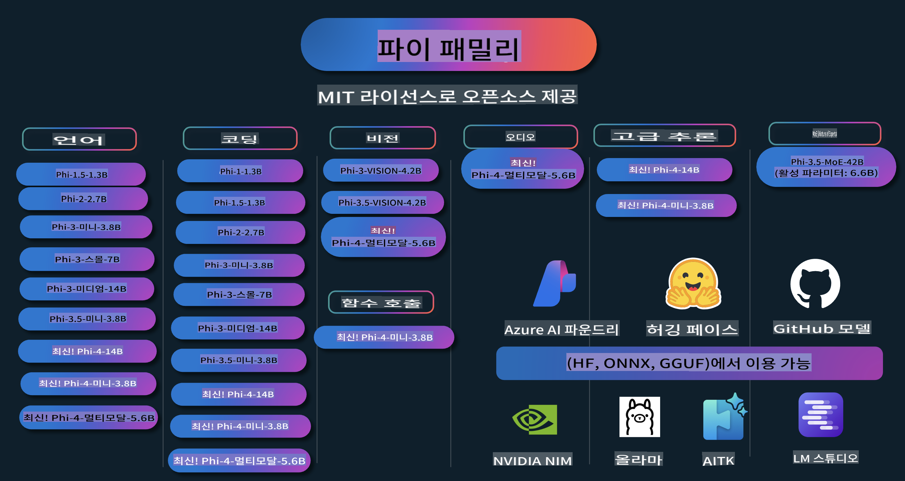

# Phi 요리책: Microsoft의 Phi 모델로 실습 예제

  

  
  
  

  
  

Phi는 Microsoft가 개발한 오픈 소스 AI 모델 시리즈입니다.

Phi는 현재 가장 강력하고 비용 효율적인 소형 언어 모델(SLM)로, 다국어, 추론, 텍스트/채팅 생성, 코딩, 이미지, 오디오 등 다양한 시나리오에서 우수한 벤치마크 성능을 보입니다.

Phi는 클라우드 또는 엣지 디바이스에 배포할 수 있으며, 제한된 컴퓨팅 자원으로 생성 AI 애플리케이션을 쉽게 구축할 수 있습니다.

다음 단계를 따라 리소스를 사용해 보세요:
1. **저장소 포크**: 를 클릭하세요.  
2. **저장소 클론**:   `git clone https://github.com/microsoft/PhiCookBook.git`  
3. [**Microsoft AI Discord 커뮤니티에 참여하여 전문가와 다른 개발자들을 만나보세요**](https://discord.com/invite/ByRwuEEgH4?WT.mc_id=aiml-137032-kinfeylo)

## 목차

- 소개  
  - [Phi 가족에 오신 것을 환영합니다](./md/01.Introduction/01/01.PhiFamily.md)  
  - [환경 설정하기](./md/01.Introduction/01/01.EnvironmentSetup.md)  
  - [핵심 기술 이해하기](./md/01.Introduction/01/01.Understandingtech.md)  
  - [Phi 모델을 위한 AI 안전성](./md/01.Introduction/01/01.AISafety.md)  
  - [Phi 하드웨어 지원](./md/01.Introduction/01/01.Hardwaresupport.md)  
  - [플랫폼별 Phi 모델 및 가용성](./md/01.Introduction/01/01.Edgeandcloud.md)  
  - [Guidance-ai와 Phi 사용하기](./md/01.Introduction/01/01.Guidance.md)  
  - [GitHub 마켓플레이스 모델](https://github.com/marketplace/models)  
  - [Azure AI 모델 카탈로그](https://ai.azure.com)

- 다양한 환경에서 Phi 추론  
    - [Hugging Face](./md/01.Introduction/02/01.HF.md)  
    - [GitHub 모델](./md/01.Introduction/02/02.GitHubModel.md)  
    - [Azure AI Foundry 모델 카탈로그](./md/01.Introduction/02/03.AzureAIFoundry.md)  
    - [Ollama](./md/01.Introduction/02/04.Ollama.md)  
    - [AI Toolkit VSCode (AITK)](./md/01.Introduction/02/05.AITK.md)  
    - [NVIDIA NIM](./md/01.Introduction/02/06.NVIDIA.md)

- Phi 가족 추론  
    - [iOS에서 Phi 추론](./md/01.Introduction/03/iOS_Inference.md)  
    - [Android에서 Phi 추론](./md/01.Introduction/03/Android_Inference.md)  
- [Jetson에서 Phi 추론하기](./md/01.Introduction/03/Jetson_Inference.md)  
    - [AI PC에서 Phi 추론하기](./md/01.Introduction/03/AIPC_Inference.md)  
    - [Apple MLX Framework을 사용해 Phi 추론하기](./md/01.Introduction/03/MLX_Inference.md)  
    - [로컬 서버에서 Phi 추론하기](./md/01.Introduction/03/Local_Server_Inference.md)  
    - [AI Toolkit을 사용해 원격 서버에서 Phi 추론하기](./md/01.Introduction/03/Remote_Interence.md)  
    - [Rust로 Phi 추론하기](./md/01.Introduction/03/Rust_Inference.md)  
    - [로컬에서 Phi--Vision 추론하기](./md/01.Introduction/03/Vision_Inference.md)  
    - [Kaito AKS, Azure Containers(공식 지원)와 함께 Phi 추론하기](./md/01.Introduction/03/Kaito_Inference.md)  

- [Phi 패밀리 양자화하기](./md/01.Introduction/04/QuantifyingPhi.md)  
    - [llama.cpp를 사용해 Phi-3.5 / 4 양자화하기](./md/01.Introduction/04/UsingLlamacppQuantifyingPhi.md)  
    - [onnxruntime의 생성형 AI 확장을 사용해 Phi-3.5 / 4 양자화하기](./md/01.Introduction/04/UsingORTGenAIQuantifyingPhi.md)  
    - [Intel OpenVINO를 사용해 Phi-3.5 / 4 양자화하기](./md/01.Introduction/04/UsingIntelOpenVINOQuantifyingPhi.md)  
    - [Apple MLX Framework을 사용해 Phi-3.5 / 4 양자화하기](./md/01.Introduction/04/UsingAppleMLXQuantifyingPhi.md)  

- Phi 평가  
    - [책임 있는 AI](./md/01.Introduction/05/ResponsibleAI.md)  
    - [평가를 위한 Azure AI Foundry](./md/01.Introduction/05/AIFoundry.md)  
    - [평가를 위한 Promptflow 사용하기](./md/01.Introduction/05/Promptflow.md)  

- Azure AI Search와 함께하는 RAG  
    - [Azure AI Search에서 Phi-4-mini 및 Phi-4-multimodal(RAG) 사용법](https://github.com/microsoft/PhiCookBook/blob/main/code/06.E2E/E2E_Phi-4-RAG-Azure-AI-Search.ipynb)  

- Phi 애플리케이션 개발 샘플  
  - 텍스트 & 채팅 애플리케이션  
    - Phi-4 샘플 🆕  
      - [📓] [Phi-4-mini ONNX 모델로 채팅하기](./md/02.Application/01.TextAndChat/Phi4/ChatWithPhi4ONNX/README.md)  
      - [Phi-4 로컬 ONNX 모델 .NET과 채팅하기](../../md/04.HOL/dotnet/src/LabsPhi4-Chat-01OnnxRuntime)  
      - [Sementic Kernel을 사용한 Phi-4 ONNX와 채팅하는 .NET 콘솔 앱](../../md/04.HOL/dotnet/src/LabsPhi4-Chat-02SK)  
    - Phi-3 / 3.5 샘플  
      - [브라우저에서 Phi3, ONNX Runtime Web 및 WebGPU를 사용한 로컬 챗봇](https://github.com/microsoft/onnxruntime-inference-examples/tree/main/js/chat)  
      - [OpenVino 채팅](./md/02.Application/01.TextAndChat/Phi3/E2E_OpenVino_Chat.md)  
      - [멀티 모델 - Phi-3-mini와 OpenAI Whisper의 상호작용](./md/02.Application/01.TextAndChat/Phi3/E2E_Phi-3-mini_with_whisper.md)  
      - [MLFlow - 래퍼 빌드 및 Phi-3을 MLFlow와 함께 사용하기](./md//02.Application/01.TextAndChat/Phi3/E2E_Phi-3-MLflow.md)  
      - [모델 최적화 - Olive를 사용해 ONNX Runtime Web에 최적화된 Phi-3-min 모델 만들기](https://github.com/microsoft/Olive/tree/main/examples/phi3)  
      - [WinUI3 앱과 Phi-3 mini-4k-instruct-onnx](https://github.com/microsoft/Phi3-Chat-WinUI3-Sample/)  
      - [WinUI3 멀티 모델 AI 기반 노트 앱 샘플](https://github.com/microsoft/ai-powered-notes-winui3-sample)  
      - [Prompt flow를 사용해 맞춤형 Phi-3 모델 미세 조정 및 통합하기](./md/02.Application/01.TextAndChat/Phi3/E2E_Phi-3-FineTuning_PromptFlow_Integration.md)  
      - [Azure AI Foundry에서 Prompt flow를 사용해 맞춤형 Phi-3 모델 미세 조정 및 통합하기](./md/02.Application/01.TextAndChat/Phi3/E2E_Phi-3-FineTuning_PromptFlow_Integration_AIFoundry.md)  
      - [Microsoft의 책임 있는 AI 원칙에 초점을 맞춰 Azure AI Foundry에서 미세 조정된 Phi-3 / Phi-3.5 모델 평가하기](./md/02.Application/01.TextAndChat/Phi3/E2E_Phi-3-Evaluation_AIFoundry.md)  
- [📓] [Phi-3.5-mini-instruct 언어 예측 샘플 (중국어/영어)](../../md/02.Application/01.TextAndChat/Phi3/phi3-instruct-demo.ipynb)
      - [Phi-3.5-Instruct WebGPU RAG 챗봇](./md/02.Application/01.TextAndChat/Phi3/WebGPUWithPhi35Readme.md)
      - [Windows GPU를 사용하여 Phi-3.5-Instruct ONNX로 프롬프트 플로우 솔루션 생성](./md/02.Application/01.TextAndChat/Phi3/UsingPromptFlowWithONNX.md)
      - [Microsoft Phi-3.5 tflite를 사용하여 Android 앱 생성](./md/02.Application/01.TextAndChat/Phi3/UsingPhi35TFLiteCreateAndroidApp.md)
      - [Microsoft.ML.OnnxRuntime를 사용하여 로컬 ONNX Phi-3 모델로 Q&A .NET 예제](../../md/04.HOL/dotnet/src/LabsPhi301)
      - [Semantic Kernel과 Phi-3을 활용한 콘솔 채팅 .NET 앱](../../md/04.HOL/dotnet/src/LabsPhi302)

  - Azure AI Inference SDK 코드 기반 샘플 
    - Phi-4 샘플 🆕
      - [📓] [Phi-4-multimodal을 사용하여 프로젝트 코드 생성](./md/02.Application/02.Code/Phi4/GenProjectCode/README.md)
    - Phi-3 / 3.5 샘플
      - [Microsoft Phi-3 패밀리를 사용하여 Visual Studio Code GitHub Copilot Chat 직접 구축](./md/02.Application/02.Code/Phi3/VSCodeExt/README.md)
      - [GitHub 모델을 활용하여 Phi-3.5로 Visual Studio Code Chat Copilot 에이전트 생성](/md/02.Application/02.Code/Phi3/CreateVSCodeChatAgentWithGitHubModels.md)

  - 고급 추론 샘플
    - Phi-4 샘플 🆕
      - [📓] [Phi-4-mini 추론 샘플](./md/02.Application/03.AdvancedReasoning/Phi4/AdvancedResoningPhi4mini/README.md)
  
  - 데모
      - [Hugging Face Spaces에서 호스팅된 Phi-4-mini 데모](https://huggingface.co/spaces/microsoft/phi-4-mini?WT.mc_id=aiml-137032-kinfeylo)
      - [Hugging Face Spaces에서 호스팅된 Phi-4-multimodal 데모](https://huggingface.co/spaces/microsoft/phi-4-multimodal?WT.mc_id=aiml-137032-kinfeylo)
  - 비전 샘플
    - Phi-4 샘플 🆕
      - [📓] [Phi-4-multimodal을 사용하여 이미지를 읽고 코드 생성](./md/02.Application/04.Vision/Phi4/CreateFrontend/README.md) 
    - Phi-3 / 3.5 샘플
      -  [📓][Phi-3-vision-이미지 텍스트를 텍스트로 변환](../../md/02.Application/04.Vision/Phi3/E2E_Phi-3-vision-image-text-to-text-online-endpoint.ipynb)
      - [Phi-3-vision-ONNX](https://onnxruntime.ai/docs/genai/tutorials/phi3-v.html)
      - [📓][Phi-3-vision CLIP 임베딩](../../md/02.Application/04.Vision/Phi3/E2E_Phi-3-vision-image-text-to-text-online-endpoint.ipynb)
      - [DEMO: Phi-3 재활용](https://github.com/jennifermarsman/PhiRecycling/)
      - [Phi-3-vision - 시각 언어 어시스턴트 - Phi3-Vision 및 OpenVINO 활용](https://docs.openvino.ai/nightly/notebooks/phi-3-vision-with-output.html)
      - [Phi-3 Vision Nvidia NIM](./md/02.Application/04.Vision/Phi3/E2E_Nvidia_NIM_Vision.md)
      - [Phi-3 Vision OpenVino](./md/02.Application/04.Vision/Phi3/E2E_OpenVino_Phi3Vision.md)
      - [📓][Phi-3.5 Vision 다중 프레임 또는 다중 이미지 샘플](../../md/02.Application/04.Vision/Phi3/phi3-vision-demo.ipynb)
      - [Microsoft.ML.OnnxRuntime .NET을 사용하여 로컬 ONNX 모델로 Phi-3 Vision](../../md/04.HOL/dotnet/src/LabsPhi303)
      - [Microsoft.ML.OnnxRuntime .NET을 사용한 메뉴 기반 Phi-3 Vision 로컬 ONNX 모델](../../md/04.HOL/dotnet/src/LabsPhi304)

  - 오디오 샘플
    - Phi-4 샘플 🆕
      - [📓] [Phi-4-multimodal을 사용하여 오디오 전사 추출](./md/02.Application/05.Audio/Phi4/Transciption/README.md)
      - [📓] [Phi-4-multimodal 오디오 샘플](../../md/02.Application/05.Audio/Phi4/Siri/demo.ipynb)
      - [📓] [Phi-4-multimodal 음성 번역 샘플](../../md/02.Application/05.Audio/Phi4/Translate/demo.ipynb)
      - [.NET 콘솔 애플리케이션을 사용하여 Phi-4-multimodal 오디오로 오디오 파일 분석 및 전사 생성](../../md/04.HOL/dotnet/src/LabsPhi4-MultiModal-02Audio)

  - MOE 샘플
    - Phi-3 / 3.5 샘플
      - [📓] [Phi-3.5 전문가 혼합 모델 (MoEs) 소셜 미디어 샘플](../../md/02.Application/06.MoE/Phi3/phi3_moe_demo.ipynb)
      - [📓] [NVIDIA NIM Phi-3 MOE, Azure AI Search, LlamaIndex를 활용한 검색 증강 생성 (RAG) 파이프라인 구축](../../md/02.Application/06.MoE/Phi3/azure-ai-search-nvidia-rag.ipynb)
  - 함수 호출 샘플
    - Phi-4 샘플 🆕
      -  [📓] [Phi-4-mini로 함수 호출 사용](./md/02.Application/07.FunctionCalling/Phi4/FunctionCallingBasic/README.md)
  - 멀티모달 믹싱 샘플
    - Phi-4 샘플 🆕
-  [📓] [기술 저널리스트로서 Phi-4-multimodal 사용하기](../../md/02.Application/08.Multimodel/Phi4/TechJournalist/phi_4_mm_audio_text_publish_news.ipynb)
      - [이미지 분석을 위해 Phi-4-multimodal을 사용하는 .NET 콘솔 애플리케이션](../../md/04.HOL/dotnet/src/LabsPhi4-MultiModal-01Images)

- Phi 샘플 미세 조정
  - [미세 조정 시나리오](./md/03.FineTuning/FineTuning_Scenarios.md)
  - [미세 조정 vs RAG](./md/03.FineTuning/FineTuning_vs_RAG.md)
  - [Phi-3를 산업 전문가로 만들기 위한 미세 조정](./md/03.FineTuning/LetPhi3gotoIndustriy.md)
  - [VS Code용 AI Toolkit을 사용한 Phi-3 미세 조정](./md/03.FineTuning/Finetuning_VSCodeaitoolkit.md)
  - [Azure Machine Learning Service를 사용한 Phi-3 미세 조정](./md/03.FineTuning/Introduce_AzureML.md)
  - [Lora를 사용한 Phi-3 미세 조정](./md/03.FineTuning/FineTuning_Lora.md)
  - [QLora를 사용한 Phi-3 미세 조정](./md/03.FineTuning/FineTuning_Qlora.md)
  - [Azure AI Foundry를 사용한 Phi-3 미세 조정](./md/03.FineTuning/FineTuning_AIFoundry.md)
  - [Azure ML CLI/SDK를 사용한 Phi-3 미세 조정](./md/03.FineTuning/FineTuning_MLSDK.md)
  - [Microsoft Olive를 사용한 미세 조정](./md/03.FineTuning/FineTuning_MicrosoftOlive.md)
  - [Microsoft Olive 핸즈온 랩을 사용한 미세 조정](./md/03.FineTuning/olive-lab/readme.md)
  - [Weights and Bias를 사용한 Phi-3-vision 미세 조정](./md/03.FineTuning/FineTuning_Phi-3-visionWandB.md)
  - [Apple MLX Framework를 사용한 Phi-3 미세 조정](./md/03.FineTuning/FineTuning_MLX.md)
  - [Phi-3-vision 미세 조정 (공식 지원)](./md/03.FineTuning/FineTuning_Vision.md)
  - [Kaito AKS, Azure Containers를 사용한 Phi-3 미세 조정 (공식 지원)](./md/03.FineTuning/FineTuning_Kaito.md)
  - [Phi-3 및 3.5 Vision 미세 조정](https://github.com/2U1/Phi3-Vision-Finetune)

- 핸즈온 랩
  - [최첨단 모델 탐구: LLMs, SLMs, 로컬 개발 등](https://github.com/microsoft/aitour-exploring-cutting-edge-models)
  - [NLP 잠재력 발휘: Microsoft Olive를 활용한 미세 조정](https://github.com/azure/Ignite_FineTuning_workshop)

- 학술 연구 논문 및 출판물
  - [Textbooks Are All You Need II: phi-1.5 기술 보고서](https://arxiv.org/abs/2309.05463)
  - [Phi-3 기술 보고서: 휴대폰에서 실행 가능한 고성능 언어 모델](https://arxiv.org/abs/2404.14219)
  - [Phi-4 기술 보고서](https://arxiv.org/abs/2412.08905)
  - [차량 내 함수 호출을 위한 소형 언어 모델 최적화](https://arxiv.org/abs/2501.02342)
  - [(WhyPHI) PHI-3을 다중 선택 질문 응답에 맞게 미세 조정하기: 방법론, 결과, 도전 과제](https://arxiv.org/abs/2501.01588)

## Phi 모델 사용하기

### Azure AI Foundry에서 Phi 사용

Microsoft Phi를 사용하는 방법과 다양한 하드웨어 장치에서 E2E 솔루션을 구축하는 방법을 배울 수 있습니다. Phi를 직접 경험하려면 모델을 사용해보고 시나리오에 맞게 Phi를 맞춤화하세요. [Azure AI Foundry Azure AI Model Catalog](https://aka.ms/phi3-azure-ai)에서 시작할 수 있으며, [Azure AI Foundry 시작하기](/md/02.QuickStart/AzureAIFoundry_QuickStart.md)에서 더 많은 정보를 확인할 수 있습니다.

**Playground**  
각 모델은 모델을 테스트할 수 있는 전용 플레이그라운드를 제공합니다. [Azure AI Playground](https://aka.ms/try-phi3).

### GitHub 모델에서 Phi 사용

Microsoft Phi를 사용하는 방법과 다양한 하드웨어 장치에서 E2E 솔루션을 구축하는 방법을 배울 수 있습니다. Phi를 직접 경험하려면 모델을 사용해보고 시나리오에 맞게 Phi를 맞춤화하세요. [GitHub Model Catalog](https://github.com/marketplace/models?WT.mc_id=aiml-137032-kinfeylo)에서 시작할 수 있으며, [GitHub Model Catalog 시작하기](/md/02.QuickStart/GitHubModel_QuickStart.md)에서 더 많은 정보를 확인할 수 있습니다.

**Playground**  
각 모델은 [모델 테스트를 위한 전용 플레이그라운드](/md/02.QuickStart/GitHubModel_QuickStart.md)를 제공합니다.

### Hugging Face에서의 Phi

이 모델은 [Hugging Face](https://huggingface.co/microsoft)에서도 확인할 수 있습니다.

**Playground**  
[Hugging Chat playground](https://huggingface.co/chat/models/microsoft/Phi-3-mini-4k-instruct)

## 책임 있는 AI

Microsoft는 고객이 AI 제품을 책임감 있게 사용할 수 있도록 지원하며, 이를 통해 학습한 내용을 공유하고 신뢰 기반의 파트너십을 구축하는 데 전념하고 있습니다. 이를 위해 투명성 노트와 영향 평가 같은 도구를 제공합니다. 관련 자료는 [https://aka.ms/RAI](https://aka.ms/RAI)에서 확인할 수 있습니다.  
Microsoft의 책임 있는 AI 접근 방식은 공정성, 신뢰성 및 안전성, 개인정보 보호 및 보안, 포괄성, 투명성, 책임이라는 AI 원칙에 기반을 두고 있습니다.

이 샘플에서 사용된 대규모 자연어, 이미지 및 음성 모델과 같은 기술은 부당하거나 신뢰할 수 없거나 공격적인 방식으로 작동할 가능성이 있어, 결과적으로 피해를 초래할 수 있습니다. 위험과 제한 사항에 대해 자세히 알고 싶다면 [Azure OpenAI 서비스 투명성 노트](https://learn.microsoft.com/legal/cognitive-services/openai/transparency-note?tabs=text)를 참조하세요.

이러한 위험을 완화하기 위한 권장 접근 방식은 유해한 행동을 감지하고 방지할 수 있는 안전 시스템을 아키텍처에 포함하는 것입니다. [Azure AI Content Safety](https://learn.microsoft.com/azure/ai-services/content-safety/overview)는 애플리케이션 및 서비스에서 사용자 생성 콘텐츠와 AI 생성 콘텐츠를 감지할 수 있는 독립적인 보호 계층을 제공합니다. Azure AI Content Safety는 텍스트 및 이미지 API를 통해 유해한 자료를 감지할 수 있도록 지원합니다. Azure AI Foundry에서는 Content Safety 서비스를 통해 다양한 형태의 유해 콘텐츠를 감지하기 위한 샘플 코드를 확인하고 탐색하며 테스트할 수 있습니다. [빠른 시작 문서](https://learn.microsoft.com/azure/ai-services/content-safety/quickstart-text?tabs=visual-studio%2Clinux&pivots=programming-language-rest)는 서비스 요청을 수행하는 방법을 안내합니다.

또 다른 중요한 고려 사항은 애플리케이션의 전반적인 성능입니다. 다중 모달 및 다중 모델 애플리케이션에서는 시스템이 사용자와 사용자의 기대에 부합하며 유해한 출력을 생성하지 않는 것이 성능의 핵심입니다. [성능 및 품질, 위험 및 안전 평가 도구](https://learn.microsoft.com/azure/ai-studio/concepts/evaluation-metrics-built-in)를 사용하여 애플리케이션 성능을 평가하는 것이 중요합니다. 또한 [사용자 정의 평가 도구](https://learn.microsoft.com/azure/ai-studio/how-to/develop/evaluate-sdk#custom-evaluators)를 생성하고 평가할 수도 있습니다.

[Azure AI Evaluation SDK](https://microsoft.github.io/promptflow/index.html)를 사용하여 개발 환경에서 AI 애플리케이션을 평가할 수 있습니다. 테스트 데이터셋 또는 목표를 기반으로, 생성 AI 애플리케이션의 출력은 기본 제공 평가 도구나 사용자가 선택한 사용자 정의 평가 도구를 통해 정량적으로 측정됩니다. Azure AI Evaluation SDK를 사용하여 시스템을 평가하려면 [빠른 시작 가이드](https://learn.microsoft.com/azure/ai-studio/how-to/develop/flow-evaluate-sdk)를 참조하세요. 평가 실행을 완료한 후에는 [Azure AI Foundry에서 결과를 시각화](https://learn.microsoft.com/azure/ai-studio/how-to/evaluate-flow-results)할 수 있습니다.

## 상표

이 프로젝트에는 프로젝트, 제품 또는 서비스와 관련된 상표나 로고가 포함될 수 있습니다. Microsoft 상표 또는 로고의 사용은 [Microsoft 상표 및 브랜드 가이드라인](https://www.microsoft.com/legal/intellectualproperty/trademarks/usage/general)을 준수해야 하며, Microsoft의 승인을 받은 사용이어야 합니다. 이 프로젝트의 수정된 버전에서 Microsoft 상표나 로고를 사용하는 경우 혼란을 초래하거나 Microsoft의 후원을 암시해서는 안 됩니다. 제삼자 상표나 로고의 사용은 해당 제삼자의 정책을 따라야 합니다.

**면책 조항**:  
이 문서는 AI 기반 기계 번역 서비스를 사용하여 번역되었습니다. 정확성을 위해 노력하고 있으나, 자동 번역에는 오류나 부정확성이 포함될 수 있습니다. 원문이 작성된 언어의 문서를 신뢰할 수 있는 권위 있는 자료로 간주해야 합니다. 중요한 정보의 경우, 전문적인 인간 번역을 권장합니다. 이 번역 사용으로 인해 발생하는 오해나 잘못된 해석에 대해 당사는 책임을 지지 않습니다.