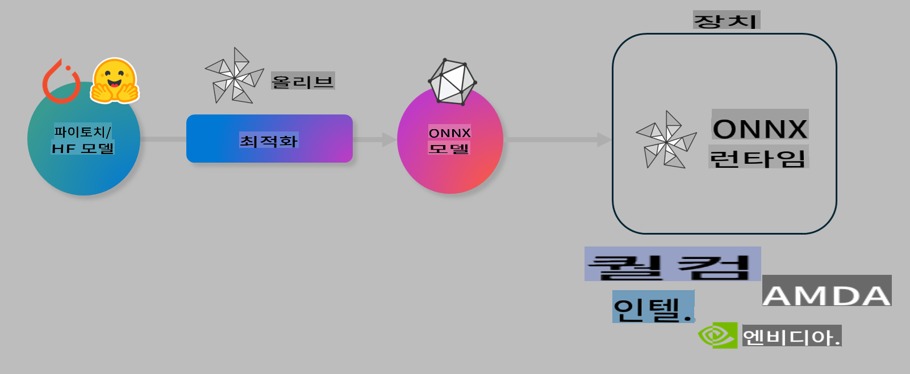

# Lab. AI 모델의 온디바이스 추론 최적화

## 소개

> [!IMPORTANT]
> 이 실습은 **Nvidia A10 또는 A100 GPU**와 해당 드라이버 및 CUDA 툴킷(버전 12+)이 설치되어 있어야 합니다.

> [!NOTE]
> 이 실습은 **35분** 동안 진행되며, OLIVE를 사용하여 온디바이스 추론을 위한 모델 최적화의 핵심 개념을 직접 체험할 수 있습니다.

## 학습 목표

이 실습이 끝나면, OLIVE를 사용하여 다음을 할 수 있습니다:

- AWQ 양자화 방법을 사용하여 AI 모델을 양자화합니다.
- 특정 작업을 위해 AI 모델을 미세 조정합니다.
- ONNX Runtime에서 효율적인 온디바이스 추론을 위한 LoRA 어댑터(미세 조정된 모델)를 생성합니다.

### Olive란 무엇인가

Olive (*O*NNX *live*)는 모델 최적화 툴킷으로, ONNX runtime +++https://onnxruntime.ai+++에서 품질과 성능을 제공하는 모델을 배포할 수 있게 하는 CLI를 포함하고 있습니다.



Olive의 입력은 일반적으로 PyTorch 또는 Hugging Face 모델이며, 출력은 ONNX runtime을 실행하는 장치(배포 대상)에서 실행되는 최적화된 ONNX 모델입니다. Olive는 Qualcomm, AMD, Nvidia 또는 Intel과 같은 하드웨어 벤더가 제공하는 배포 대상의 AI 가속기(NPU, GPU, CPU)에 맞춰 모델을 최적화합니다.

Olive는 *워크플로우*를 실행하는데, 이는 개별 모델 최적화 작업인 *패스*의 순서화된 시퀀스로 구성됩니다. 예시 패스에는 모델 압축, 그래프 캡처, 양자화, 그래프 최적화가 포함됩니다. 각 패스는 최상의 메트릭(예: 정확도 및 지연 시간)을 달성하기 위해 조정할 수 있는 매개 변수를 가지고 있으며, 이는 각각의 평가자가 평가합니다. Olive는 각 패스를 하나씩 또는 여러 패스를 함께 자동으로 조정하는 검색 알고리즘을 사용하는 검색 전략을 채택합니다.

#### Olive의 장점

- 그래프 최적화, 압축 및 양자화를 위한 다양한 기술을 시도하는 수작업 실험의 **시간과 좌절감을 줄입니다**. 품질과 성능 제약을 정의하면 Olive가 자동으로 최상의 모델을 찾아줍니다.
- **40개 이상의 내장된 모델 최적화 구성 요소**로 양자화, 압축, 그래프 최적화 및 미세 조정의 최신 기술을 다룹니다.
- 일반적인 모델 최적화 작업을 위한 **사용하기 쉬운 CLI**. 예를 들어, olive quantize, olive auto-opt, olive finetune.
- 모델 패키징 및 배포가 내장되어 있습니다.
- **Multi LoRA 서비스**를 위한 모델 생성 지원.
- 모델 최적화 및 배포 작업을 조정하기 위해 YAML/JSON을 사용하여 워크플로우를 구성합니다.
- **Hugging Face** 및 **Azure AI** 통합.
- **비용 절감**을 위한 내장 **캐싱** 메커니즘.

## 실습 지침
> [!NOTE]
> Lab 1에 따라 Azure AI Hub와 프로젝트를 준비하고 A100 컴퓨팅을 설정했는지 확인하세요.

### 단계 0: Azure AI 컴퓨팅에 연결

**VS Code**의 원격 기능을 사용하여 Azure AI 컴퓨팅에 연결합니다.

1. **VS Code** 데스크탑 애플리케이션을 엽니다:
1. **Shift+Ctrl+P**를 사용하여 **명령 팔레트**를 엽니다.
1. 명령 팔레트에서 **AzureML - remote: Connect to compute instance in New Window**를 검색합니다.
1. 화면의 지시에 따라 컴퓨팅에 연결합니다. 여기에는 Lab 1에서 설정한 Azure 구독, 리소스 그룹, 프로젝트 및 컴퓨팅 이름을 선택하는 과정이 포함됩니다.
1. Azure ML 컴퓨팅 노드에 연결되면 **Visual Code의 왼쪽 하단**에 표시됩니다 `><Azure ML: Compute Name`

### 단계 1: 이 저장소 클론하기

VS Code에서 **Ctrl+J**를 사용하여 새 터미널을 열고 이 저장소를 클론합니다:

터미널에서 다음 프롬프트를 볼 수 있습니다

```
azureuser@computername:~/cloudfiles/code$ 
```
솔루션을 클론합니다

```bash
cd ~/localfiles
git clone https://github.com/microsoft/phi-3cookbook.git
```

### 단계 2: VS Code에서 폴더 열기

터미널에서 다음 명령을 실행하여 관련 폴더에서 VS Code를 열면 새 창이 열립니다:

```bash
code phi-3cookbook/code/04.Finetuning/Olive-lab
```

또는 **파일** > **폴더 열기**를 선택하여 폴더를 열 수 있습니다.

### 단계 3: 종속성 설치

VS Code에서 Azure AI 컴퓨팅 인스턴스의 터미널 창을 열고(팁: **Ctrl+J**) 다음 명령을 실행하여 종속성을 설치합니다:

```bash
conda create -n olive-ai python=3.11 -y
conda activate olive-ai
pip install -r requirements.txt
az extension remove -n azure-cli-ml
az extension add -n ml
```

> [!NOTE]
> 모든 종속성을 설치하는 데 약 5분이 소요됩니다.

이 실습에서는 Azure AI 모델 카탈로그에 모델을 다운로드하고 업로드합니다. 모델 카탈로그에 접근할 수 있도록 Azure에 로그인해야 합니다:

```bash
az login
```

> [!NOTE]
> 로그인 시 구독을 선택하라는 메시지가 표시됩니다. 이 실습에 제공된 구독을 선택했는지 확인하세요.

### 단계 4: Olive 명령 실행

VS Code에서 Azure AI 컴퓨팅 인스턴스의 터미널 창을 열고(팁: **Ctrl+J**) `olive-ai` conda 환경이 활성화되어 있는지 확인합니다:

```bash
conda activate olive-ai
```

다음으로, 명령 줄에서 다음 Olive 명령을 실행합니다.

1. **데이터 검사:** 이 예제에서는 여행 관련 질문에 답변하는 데 특화된 Phi-3.5-Mini 모델을 미세 조정할 것입니다. 아래 코드는 JSON 라인 형식의 데이터셋의 첫 몇 개의 레코드를 표시합니다:
   
    ```bash
    head data/data_sample_travel.jsonl
    ```
1. **모델 양자화:** 모델을 훈련하기 전에, Active Aware Quantization (AWQ) +++https://arxiv.org/abs/2306.00978+++ 기술을 사용하는 다음 명령으로 먼저 양자화합니다. AWQ는 추론 중에 생성되는 활성화를 고려하여 모델의 가중치를 양자화합니다. 이는 양자화 과정이 활성화에서 실제 데이터 분포를 고려하므로 전통적인 가중치 양자화 방법에 비해 모델 정확도 보존이 더 잘 됩니다.
    
    ```bash
    olive quantize \
       --model_name_or_path microsoft/Phi-3.5-mini-instruct \
       --trust_remote_code \
       --algorithm awq \
       --output_path models/phi/awq \
       --log_level 1
    ```
    
    AWQ 양자화를 완료하는 데 **약 8분**이 소요되며, 이는 **모델 크기를 약 7.5GB에서 약 2.5GB로 줄입니다**.
   
   이 실습에서는 Hugging Face에서 모델을 가져오는 방법을 보여줍니다 (예: `microsoft/Phi-3.5-mini-instruct`). However, Olive also allows you to input models from the Azure AI catalog by updating the `model_name_or_path` argument to an Azure AI asset ID (for example:  `azureml://registries/azureml/models/Phi-3.5-mini-instruct/versions/4`). 

1. **Train the model:** Next, the `olive finetune` 명령은 양자화된 모델을 미세 조정합니다. 모델을 미세 조정하기 전에 양자화하는 것이 이후에 양자화하는 것보다 더 나은 정확도를 제공합니다. 미세 조정 과정에서 양자화로 인한 손실을 일부 회복하기 때문입니다.
    
    ```bash
    olive finetune \
        --method lora \
        --model_name_or_path models/phi/awq \
        --data_files "data/data_sample_travel.jsonl" \
        --data_name "json" \
        --text_template "<|user|>\n{prompt}<|end|>\n<|assistant|>\n{response}<|end|>" \
        --max_steps 100 \
        --output_path ./models/phi/ft \
        --log_level 1
    ```
    
    미세 조정을 완료하는 데 **약 6분**이 소요됩니다 (100 스텝).

1. **최적화:** 모델이 훈련되면, Olive의 `auto-opt` command, which will capture the ONNX graph and automatically perform a number of optimizations to improve the model performance for CPU by compressing the model and doing fusions. It should be noted, that you can also optimize for other devices such as NPU or GPU by just updating the `--device` and `--provider` 인수를 사용하여 모델을 최적화합니다 - 하지만 이 실습에서는 CPU를 사용합니다.

    ```bash
    olive auto-opt \
       --model_name_or_path models/phi/ft/model \
       --adapter_path models/phi/ft/adapter \
       --device cpu \
       --provider CPUExecutionProvider \
       --use_ort_genai \
       --output_path models/phi/onnx-ao \
       --log_level 1
    ```
    
    최적화를 완료하는 데 **약 5분**이 소요됩니다.

### 단계 5: 모델 추론 빠른 테스트

모델의 추론을 테스트하기 위해 **app.py**라는 Python 파일을 폴더에 생성하고 다음 코드를 복사하여 붙여넣습니다:

```python
import onnxruntime_genai as og
import numpy as np

print("loading model and adapters...", end="", flush=True)
model = og.Model("models/phi/onnx-ao/model")
adapters = og.Adapters(model)
adapters.load("models/phi/onnx-ao/model/adapter_weights.onnx_adapter", "travel")
print("DONE!")

tokenizer = og.Tokenizer(model)
tokenizer_stream = tokenizer.create_stream()

params = og.GeneratorParams(model)
params.set_search_options(max_length=100, past_present_share_buffer=False)
user_input = "what is the best thing to see in chicago"
params.input_ids = tokenizer.encode(f"<|user|>\n{user_input}<|end|>\n<|assistant|>\n")

generator = og.Generator(model, params)

generator.set_active_adapter(adapters, "travel")

print(f"{user_input}")

while not generator.is_done():
    generator.compute_logits()
    generator.generate_next_token()

    new_token = generator.get_next_tokens()[0]
    print(tokenizer_stream.decode(new_token), end='', flush=True)

print("\n")
```

다음 명령을 사용하여 코드를 실행합니다:

```bash
python app.py
```

### 단계 6: 모델을 Azure AI에 업로드

모델을 Azure AI 모델 저장소에 업로드하면 개발 팀의 다른 멤버와 모델을 공유할 수 있으며, 모델의 버전 관리를 처리할 수 있습니다. 모델을 업로드하려면 다음 명령을 실행합니다:

> [!NOTE]
> `{}` placeholders with the name of your resource group and Azure AI Project Name. 

To find your resource group `"resourceGroup"과 Azure AI 프로젝트 이름을 업데이트하고 다음 명령을 실행합니다

```
az ml workspace show
```

또는 +++ai.azure.com+++에 접속하여 **관리 센터** **프로젝트** **개요**를 선택합니다.

`{}` 자리 표시자를 리소스 그룹 이름과 Azure AI 프로젝트 이름으로 업데이트합니다.

```bash
az ml model create \
    --name ft-for-travel \
    --version 1 \
    --path ./models/phi/onnx-ao \
    --resource-group {RESOURCE_GROUP_NAME} \
    --workspace-name {PROJECT_NAME}
```
그런 다음 https://ml.azure.com/model/list에서 업로드된 모델을 확인하고 배포할 수 있습니다.

**면책 조항**:
이 문서는 기계 기반 AI 번역 서비스를 사용하여 번역되었습니다. 정확성을 기하기 위해 노력하고 있지만, 자동 번역에는 오류나 부정확성이 있을 수 있습니다. 원본 문서의 모국어 버전이 권위 있는 출처로 간주되어야 합니다. 중요한 정보의 경우, 전문적인 인간 번역을 권장합니다. 이 번역 사용으로 인해 발생하는 오해나 오역에 대해 당사는 책임을 지지 않습니다.