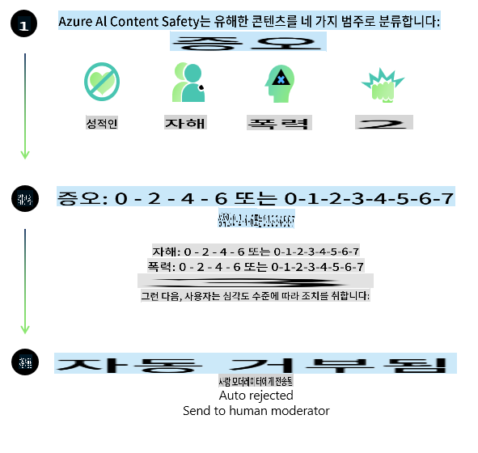
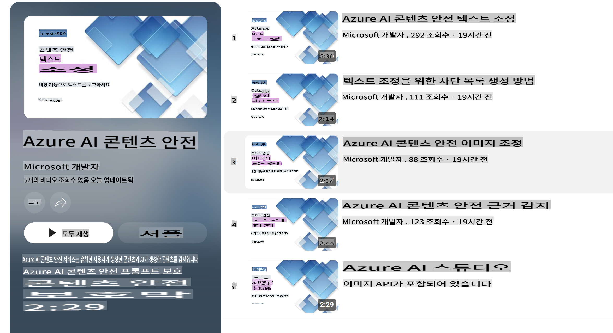

# Phi-3 모델을 위한 AI 안전성
Phi-3 모델군은 [Microsoft Responsible AI Standard](https://query.prod.cms.rt.microsoft.com/cms/api/am/binary/RE5cmFl)에 따라 개발되었습니다. 이 표준은 책임성, 투명성, 공정성, 신뢰성과 안전성, 개인정보 보호 및 보안, 포용성이라는 [Microsoft의 책임 있는 AI 원칙](https://www.microsoft.com/ai/responsible-ai)을 기반으로 한 회사 전체의 요구 사항 세트입니다.

이전의 Phi-3 모델과 마찬가지로, 다면적인 안전 평가 및 훈련 후 안전 접근 방식을 채택하였으며, 이번 릴리스의 다국어 기능을 고려한 추가 조치도 취했습니다. 다국어 및 위험 범주에 걸친 테스트를 포함한 안전 훈련 및 평가 접근 방식은 [Phi-3 Safety Post-Training Paper](https://arxiv.org/abs/2407.13833)에 설명되어 있습니다. Phi-3 모델은 이러한 접근 방식의 혜택을 받지만, 개발자는 특정 사용 사례와 문화적, 언어적 맥락에 따른 위험을 매핑하고 측정하며 완화하는 책임 있는 AI 모범 사례를 적용해야 합니다.

## 모범 사례

다른 모델들과 마찬가지로, Phi 모델군도 불공정하거나 신뢰할 수 없거나 공격적인 방식으로 행동할 가능성이 있습니다.

알아두어야 할 SLM 및 LLM의 제한적 행동에는 다음이 포함됩니다:

- **서비스 품질:** Phi 모델은 주로 영어 텍스트를 기반으로 훈련되었습니다. 영어 이외의 언어는 성능이 떨어질 수 있으며, 훈련 데이터에 덜 대표되는 영어 방언은 표준 미국 영어보다 성능이 떨어질 수 있습니다.
- **해악의 표현 및 고정관념의 지속:** 이 모델들은 특정 그룹의 사람들을 과도하게 또는 과소 대표하거나, 일부 그룹의 표현을 지우거나, 경멸적이거나 부정적인 고정관념을 강화할 수 있습니다. 안전 훈련 후에도 이러한 제한 사항은 여전히 존재할 수 있으며, 이는 다른 그룹의 대표 수준이나 훈련 데이터에 있는 부정적인 고정관념 예시의 빈도에 따라 달라질 수 있습니다.
- **부적절하거나 공격적인 콘텐츠:** 이 모델은 다른 유형의 부적절하거나 공격적인 콘텐츠를 생성할 수 있으며, 이는 추가적인 완화 조치 없이 민감한 맥락에서 배포하기에 부적절할 수 있습니다.
정보 신뢰성: 언어 모델은 비논리적인 콘텐츠를 생성하거나 합리적으로 들리지만 부정확하거나 오래된 콘텐츠를 만들어낼 수 있습니다.
- **코드의 제한된 범위:** Phi-3 훈련 데이터의 대부분은 Python을 기반으로 하며 "typing, math, random, collections, datetime, itertools"와 같은 일반적인 패키지를 사용합니다. 모델이 다른 패키지를 사용하거나 다른 언어로 된 스크립트를 생성하는 경우, 사용자가 모든 API 사용을 수동으로 검증할 것을 강력히 권장합니다.

개발자는 책임 있는 AI 모범 사례를 적용해야 하며, 특정 사용 사례가 관련 법률 및 규정을 준수하는지 확인할 책임이 있습니다 (예: 개인정보 보호, 무역 등).

## 책임 있는 AI 고려 사항

다른 언어 모델과 마찬가지로, Phi 시리즈 모델도 불공정하거나 신뢰할 수 없거나 공격적인 방식으로 행동할 가능성이 있습니다. 알아두어야 할 제한적 행동에는 다음이 포함됩니다:

**서비스 품질:** Phi 모델은 주로 영어 텍스트를 기반으로 훈련되었습니다. 영어 이외의 언어는 성능이 떨어질 수 있습니다. 훈련 데이터에 덜 대표되는 영어 방언은 표준 미국 영어보다 성능이 떨어질 수 있습니다.

**해악의 표현 및 고정관념의 지속:** 이 모델들은 특정 그룹의 사람들을 과도하게 또는 과소 대표하거나, 일부 그룹의 표현을 지우거나, 경멸적이거나 부정적인 고정관념을 강화할 수 있습니다. 안전 훈련 후에도 이러한 제한 사항은 여전히 존재할 수 있으며, 이는 다른 그룹의 대표 수준이나 훈련 데이터에 있는 부정적인 고정관념 예시의 빈도에 따라 달라질 수 있습니다.

**부적절하거나 공격적인 콘텐츠:** 이 모델은 다른 유형의 부적절하거나 공격적인 콘텐츠를 생성할 수 있으며, 이는 추가적인 완화 조치 없이 민감한 맥락에서 배포하기에 부적절할 수 있습니다.
정보 신뢰성: 언어 모델은 비논리적인 콘텐츠를 생성하거나 합리적으로 들리지만 부정확하거나 오래된 콘텐츠를 만들어낼 수 있습니다.

**코드의 제한된 범위:** Phi-3 훈련 데이터의 대부분은 Python을 기반으로 하며 "typing, math, random, collections, datetime, itertools"와 같은 일반적인 패키지를 사용합니다. 모델이 다른 패키지를 사용하거나 다른 언어로 된 스크립트를 생성하는 경우, 사용자가 모든 API 사용을 수동으로 검증할 것을 강력히 권장합니다.

개발자는 책임 있는 AI 모범 사례를 적용해야 하며, 특정 사용 사례가 관련 법률 및 규정을 준수하는지 확인할 책임이 있습니다 (예: 개인정보 보호, 무역 등). 고려해야 할 중요한 영역은 다음과 같습니다:

**할당:** 모델은 법적 상태나 자원 또는 생명 기회의 할당에 중대한 영향을 미칠 수 있는 시나리오 (예: 주택, 고용, 신용 등)에 적합하지 않을 수 있으며, 추가 평가 및 추가적인 편향 제거 기술이 필요할 수 있습니다.

**고위험 시나리오:** 개발자는 불공정하거나 신뢰할 수 없거나 공격적인 출력이 매우 비용이 많이 들거나 해를 끼칠 수 있는 고위험 시나리오에서 모델을 사용하는 적합성을 평가해야 합니다. 여기에는 정확성과 신뢰성이 중요한 민감하거나 전문적인 도메인에서 조언을 제공하는 경우 (예: 법률 또는 건강 조언)가 포함됩니다. 배포 맥락에 따라 애플리케이션 수준에서 추가적인 안전 장치를 구현해야 합니다.

**잘못된 정보:** 모델은 부정확한 정보를 생성할 수 있습니다. 개발자는 투명성 모범 사례를 따르고 최종 사용자에게 AI 시스템과 상호작용하고 있음을 알려야 합니다. 애플리케이션 수준에서 개발자는 피드백 메커니즘과 파이프라인을 구축하여 사용 사례별 맥락 정보에 기반한 응답을 생성하는 Retrieval Augmented Generation (RAG)이라는 기술을 사용할 수 있습니다.

**유해한 콘텐츠 생성:** 개발자는 출력물을 평가하여 맥락에 맞는지 확인하고 사용 사례에 적합한 안전 분류기나 맞춤형 솔루션을 사용해야 합니다.

**오용:** 사기, 스팸 또는 악성 소프트웨어 생성과 같은 다른 형태의 오용이 가능할 수 있으며, 개발자는 애플리케이션이 적용 가능한 법률 및 규정을 위반하지 않도록 해야 합니다.

### 미세 조정 및 AI 콘텐츠 안전성

모델을 미세 조정한 후에는 [Azure AI Content Safety](https://learn.microsoft.com/azure/ai-services/content-safety/overview) 조치를 활용하여 모델이 생성한 콘텐츠를 모니터링하고 잠재적 위험, 위협 및 품질 문제를 식별하고 차단하는 것을 강력히 권장합니다.

[Azure AI Content Safety](https://learn.microsoft.com/azure/ai-services/content-safety/overview)는 텍스트와 이미지 콘텐츠를 모두 지원합니다. 클라우드, 분리된 컨테이너, 엣지/임베디드 장치에 배포할 수 있습니다.

## Azure AI Content Safety 개요

Azure AI Content Safety는 일률적인 솔루션이 아니며, 비즈니스의 특정 정책에 맞게 맞춤화할 수 있습니다. 또한 다국어 모델을 통해 여러 언어를 동시에 이해할 수 있습니다.

- **Azure AI Content Safety**
- **Microsoft Developer**
- **5 videos**

Azure AI Content Safety 서비스는 애플리케이션 및 서비스에서 사용자 생성 및 AI 생성 유해 콘텐츠를 감지합니다. 텍스트 및 이미지 API를 포함하여 유해하거나 부적절한 자료를 감지할 수 있습니다.

[AI Content Safety Playlist](https://www.youtube.com/playlist?list=PLlrxD0HtieHjaQ9bJjyp1T7FeCbmVcPkQ)

면책 조항: 이 번역은 원본을 AI 모델에 의해 번역된 것이며 완벽하지 않을 수 있습니다.
출력을 검토하고 필요한 수정 사항을 반영해 주세요.