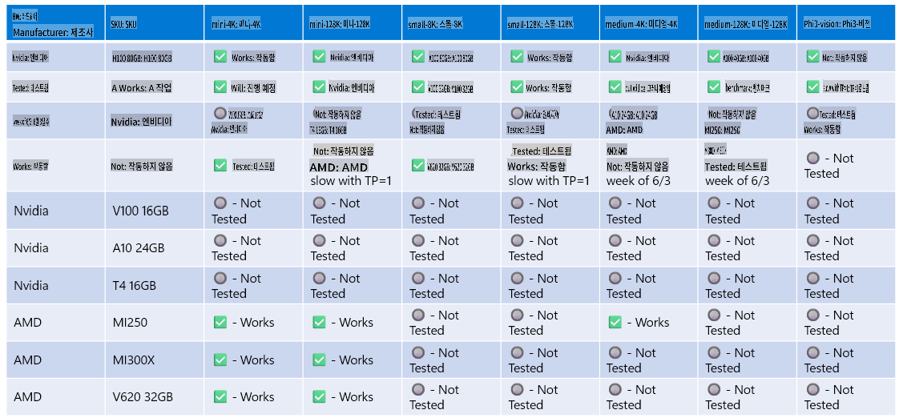

# Phi-3 하드웨어 지원

Microsoft Phi-3는 ONNX Runtime에 최적화되어 있으며 Windows DirectML을 지원합니다. GPU, CPU, 심지어 모바일 장치 등 다양한 하드웨어 유형에서 잘 작동합니다.

## 장치 하드웨어
구체적으로 지원되는 하드웨어는 다음과 같습니다:

- GPU SKU: RTX 4090 (DirectML)
- GPU SKU: 1 A100 80GB (CUDA)
- CPU SKU: Standard F64s v2 (64 vCPUs, 128 GiB 메모리)

## 모바일 SKU

- 안드로이드 - 삼성 갤럭시 S21
- 애플 아이폰 14 또는 그 이상 A16/A17 프로세서

## Phi-3 하드웨어 사양

- 최소 구성 요구 사항.
- Windows: DirectX 12 지원 GPU 및 최소 4GB의 통합 RAM

CUDA: Compute Capability >= 7.02를 갖춘 NVIDIA GPU



## 여러 GPU에서 onnxruntime 실행하기

현재 사용 가능한 Phi-3 ONNX 모델은 1개의 GPU만 지원합니다. Phi-3 모델에 대해 다중 GPU를 지원하는 것이 가능하지만, 2개의 GPU를 사용하는 ORT가 2개의 ORT 인스턴스에 비해 더 높은 처리량을 보장하지는 않습니다.

[Build 2024 the GenAI ONNX Team](https://youtu.be/WLW4SE8M9i8?si=EtG04UwDvcjunyfC)에서는 Phi 모델에 대해 다중 GPU 대신 다중 인스턴스를 활성화했다고 발표했습니다.

현재로서는 CUDA_VISIBLE_DEVICES 환경 변수를 사용하여 하나의 onnnxruntime 또는 onnxruntime-genai 인스턴스를 실행할 수 있습니다.

```Python
CUDA_VISIBLE_DEVICES=0 python infer.py
CUDA_VISIBLE_DEVICES=1 python infer.py
```

[Azure AI Studio](https://ai.azure.com)에서 Phi-3를 더 탐색해보세요.

**면책 조항**:
이 문서는 기계 기반 AI 번역 서비스를 사용하여 번역되었습니다. 정확성을 기하기 위해 노력하고 있지만, 자동 번역에는 오류나 부정확성이 있을 수 있음을 유의해 주십시오. 원본 문서가 해당 언어로 작성된 권위 있는 출처로 간주되어야 합니다. 중요한 정보에 대해서는 전문적인 인간 번역을 권장합니다. 이 번역 사용으로 인해 발생하는 오해나 잘못된 해석에 대해 당사는 책임을 지지 않습니다.