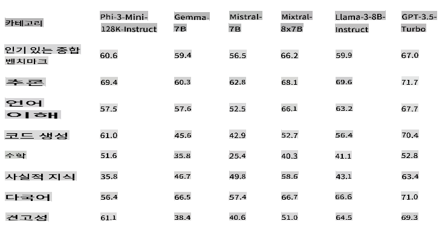
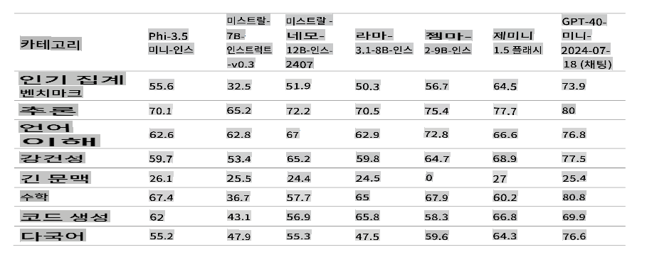
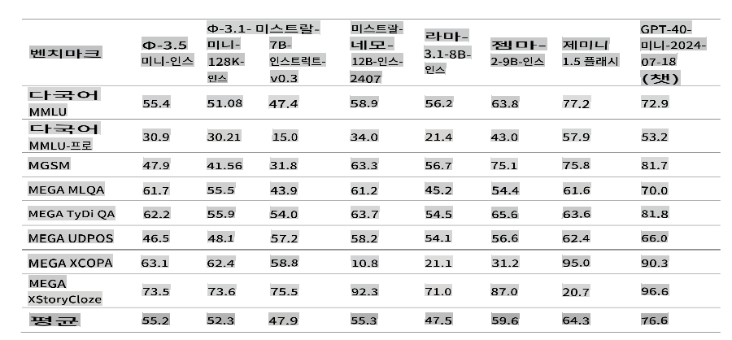
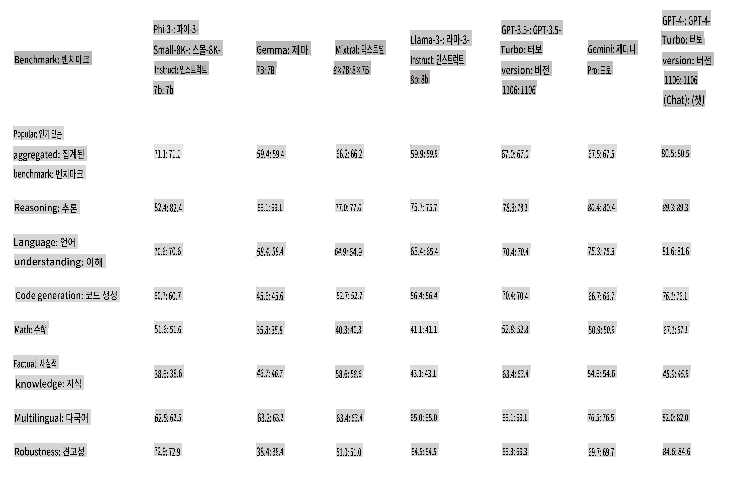
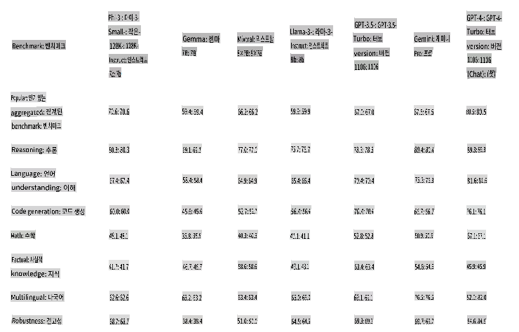
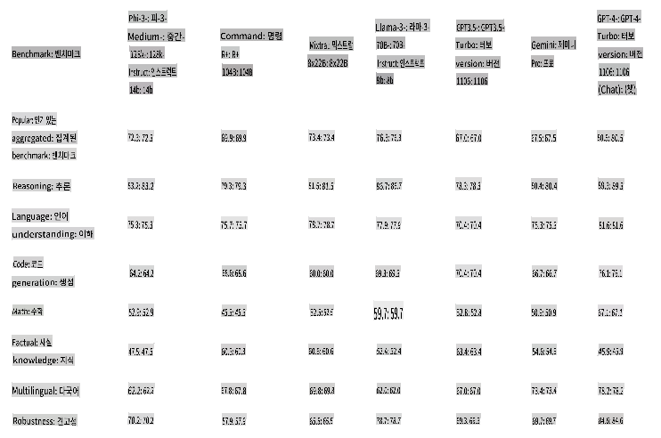
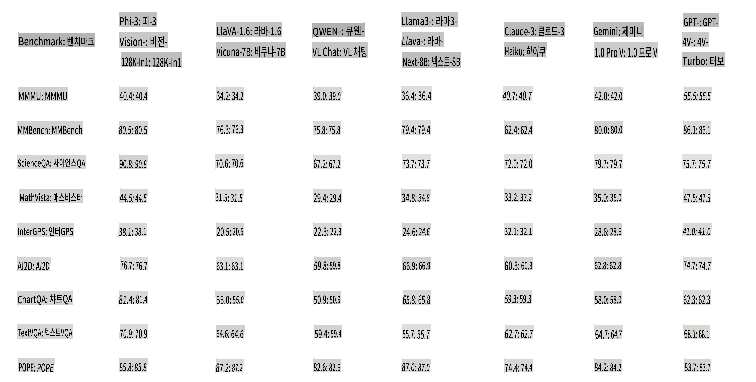
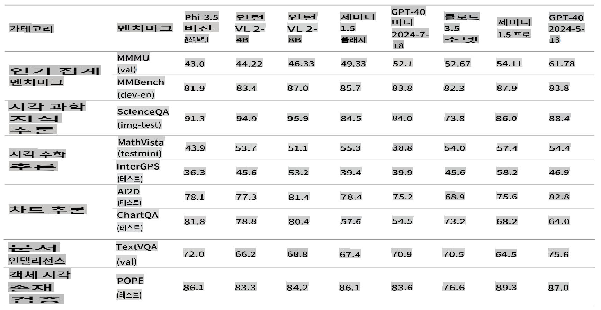
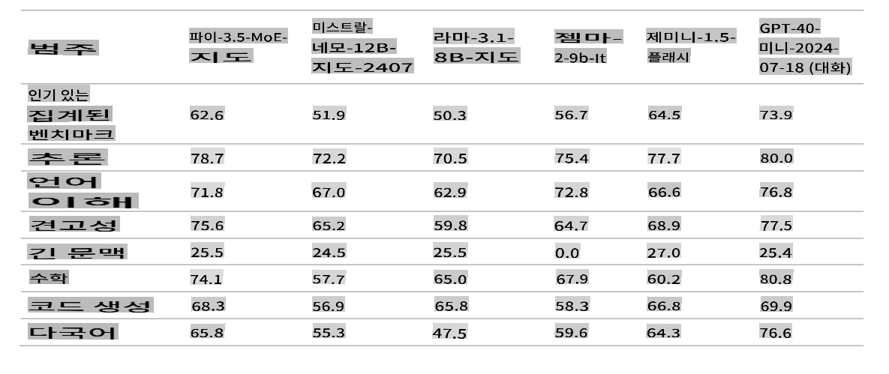

# Microsoft의 Phi-3 시리즈

Phi-3 모델은 다양한 언어, 추론, 코딩, 수학 벤치마크에서 동일한 크기와 그 이상의 모델들을 능가하는 가장 능력 있고 비용 효율적인 소형 언어 모델(SLM)입니다. 이번 출시를 통해 고객에게 고품질 모델의 선택 폭을 넓혀주어 생성형 AI 애플리케이션을 작성하고 구축하는 데 더 실용적인 선택지를 제공합니다.

Phi-3 시리즈에는 미니, 스몰, 미디엄 및 비전 버전이 포함되어 있으며, 다양한 애플리케이션 시나리오에 맞춰 다양한 매개변수 양을 기반으로 훈련되었습니다. 각 모델은 Microsoft의 책임 있는 AI, 안전 및 보안 표준에 따라 지침 조정이 되어 있으며, 바로 사용할 수 있도록 개발되었습니다. Phi-3-mini는 두 배 크기의 모델을 능가하며, Phi-3-small과 Phi-3-medium은 GPT-3.5T를 포함한 훨씬 더 큰 모델을 능가합니다.

## Phi-3 작업 예시

| | |
|-|-|
|작업|Phi-3|
|언어 작업|Yes|
|수학 및 추론|Yes|
|코딩|Yes|
|함수 호출|No|
|자체 오케스트레이션(어시스턴트)|No|
|전용 임베딩 모델|No|

## Phi-3-mini

Phi-3-mini는 3.8B 파라미터 언어 모델로, [Microsoft Azure AI Studio](https://ai.azure.com/explore/models?selectedCollection=phi), [Hugging Face](https://huggingface.co/collections/microsoft/phi-3-6626e15e9585a200d2d761e3), 그리고 [Ollama](https://ollama.com/library/phi3)에서 이용할 수 있습니다. 이 모델은 두 가지 컨텍스트 길이 [128K](https://ai.azure.com/explore/models/Phi-3-mini-128k-instruct/version/9/registry/azureml)와 [4K](https://ai.azure.com/explore/models/Phi-3-mini-4k-instruct/version/9/registry/azureml)를 제공합니다.

Phi-3-mini는 3.8억 개의 파라미터를 가진 Transformer 기반 언어 모델입니다. 교육적으로 유용한 정보를 포함한 고품질 데이터를 사용하여 훈련되었으며, 다양한 NLP 합성 텍스트와 내부 및 외부 채팅 데이터 세트로 구성된 새로운 데이터 소스를 추가하여 채팅 기능을 크게 향상시켰습니다. 또한, Phi-3-mini는 사전 훈련 후 감독된 미세 조정(SFT)과 직접 선호 최적화(DPO)를 통해 채팅 미세 조정을 거쳤습니다. 이 후 훈련을 통해 Phi-3-mini는 특히 정렬, 견고성 및 안전성에서 여러 기능에서 상당한 개선을 보여주었습니다. 이 모델은 Phi-3 시리즈의 일부로, 4K와 128K 두 가지 변형으로 제공되며 이는 지원할 수 있는 컨텍스트 길이(토큰 단위)를 나타냅니다.

## Phi-3.5-mini-instruct 

[Phi-3.5 mini](https://ai.azure.com/explore/models/Phi-3.5-mini-instruct/version/1/registry/azureml)는 Phi-3에서 사용된 데이터 세트 - 합성 데이터 및 필터링된 공개 웹사이트 - 를 기반으로 하여 매우 고품질의 추론 밀도 데이터에 중점을 둔 경량 최신 오픈 모델입니다. 이 모델은 Phi-3 모델 시리즈에 속하며 128K 토큰 컨텍스트 길이를 지원합니다. 이 모델은 정확한 지침 준수와 견고한 안전 조치를 보장하기 위해 감독된 미세 조정, 근접 정책 최적화 및 직접 선호 최적화를 포함한 엄격한 향상 과정을 거쳤습니다.

Phi-3.5 Mini는 3.8B 파라미터를 가지고 있으며 Phi-3 Mini와 동일한 토크나이저를 사용하는 밀집 디코더 전용 Transformer 모델입니다.

전반적으로, 이 모델은 3.8B 파라미터만으로도 다국어 언어 이해 및 추론 능력에서 훨씬 더 큰 모델과 유사한 수준을 달성합니다. 그러나 특정 작업에서는 크기 제한으로 인해 근본적으로 한계가 있습니다. 모델은 너무 많은 사실적 지식을 저장할 수 있는 용량이 부족하기 때문에 사용자는 사실적 부정확성을 경험할 수 있습니다. 그러나 이러한 약점은 특히 RAG 설정에서 모델을 사용할 때 검색 엔진을 통해 Phi-3.5를 보완함으로써 해결될 수 있다고 믿습니다.

### 언어 지원

아래 표는 다국어 MMLU, MEGA 및 다국어 MMLU-pro 데이터 세트에서 Phi-3의 다국어 기능을 강조합니다. 전반적으로, 활성 파라미터가 3.8B밖에 되지 않더라도, 모델은 훨씬 더 큰 활성 파라미터를 가진 다른 모델과 비교하여 다국어 작업에서 매우 경쟁력이 있습니다.

## Phi-3-small

Phi-3-small은 7B 파라미터 언어 모델로, 두 가지 컨텍스트 길이 [128K](https://ai.azure.com/explore/models/Phi-3-small-128k-instruct/version/2/registry/azureml)와 [8K.](https://ai.azure.com/explore/models/Phi-3-small-8k-instruct/version/2/registry/azureml)를 제공하며 다양한 언어, 추론, 코딩 및 수학 벤치마크에서 GPT-3.5T를 능가합니다.

Phi-3-small은 7억 개의 파라미터를 가진 Transformer 기반 언어 모델입니다. 교육적으로 유용한 정보를 포함한 고품질 데이터를 사용하여 훈련되었으며, 다양한 NLP 합성 텍스트와 내부 및 외부 채팅 데이터 세트로 구성된 새로운 데이터 소스를 추가하여 채팅 기능을 크게 향상시켰습니다. 또한, Phi-3-small은 사전 훈련 후 감독된 미세 조정(SFT)과 직접 선호 최적화(DPO)를 통해 채팅 미세 조정을 거쳤습니다. 이 후 훈련을 통해 Phi-3-small은 특히 정렬, 견고성 및 안전성에서 여러 기능에서 상당한 개선을 보여주었습니다. Phi-3-small은 Phi-3-Mini에 비해 다국어 데이터 세트에서 더 집중적으로 훈련되었습니다. 모델 시리즈는 8K와 128K 두 가지 변형을 제공하며 이는 지원할 수 있는 컨텍스트 길이(토큰 단위)를 나타냅니다.

## Phi-3-medium

Phi-3-medium은 14B 파라미터 언어 모델로, 두 가지 컨텍스트 길이 [128K](https://ai.azure.com/explore/models/Phi-3-medium-128k-instruct/version/2/registry/azureml)와 [4K.](https://ai.azure.com/explore/models/Phi-3-medium-4k-instruct/version/2/registry/azureml)를 제공하며, Gemini 1.0 Pro를 능가합니다.

Phi-3-medium은 14억 개의 파라미터를 가진 Transformer 기반 언어 모델입니다. 교육적으로 유용한 정보를 포함한 고품질 데이터를 사용하여 훈련되었으며, 다양한 NLP 합성 텍스트와 내부 및 외부 채팅 데이터 세트로 구성된 새로운 데이터 소스를 추가하여 채팅 기능을 크게 향상시켰습니다. 또한, Phi-3-medium은 사전 훈련 후 감독된 미세 조정(SFT)과 직접 선호 최적화(DPO)를 통해 채팅 미세 조정을 거쳤습니다. 이 후 훈련을 통해 Phi-3-medium은 특히 정렬, 견고성 및 안전성에서 여러 기능에서 상당한 개선을 보여주었습니다. 모델 시리즈는 4K와 128K 두 가지 변형을 제공하며 이는 지원할 수 있는 컨텍스트 길이(토큰 단위)를 나타냅니다.

[!NOTE]
Phi-3-medium의 업그레이드로 Phi-3.5-MoE로 전환하는 것을 권장합니다. MoE 모델이 훨씬 더 우수하고 비용 효율적입니다.

## Phi-3-vision

[Phi-3-vision](https://ai.azure.com/explore/models/Phi-3-vision-128k-instruct/version/2/registry/azureml)은 언어 및 비전 기능을 갖춘 4.2B 파라미터 멀티모달 모델로, 일반 시각적 추론, OCR, 표 및 차트 이해 작업에서 Claude-3 Haiku 및 Gemini 1.0 Pro V와 같은 더 큰 모델을 능가합니다.

Phi-3-vision은 Phi-3 시리즈의 첫 번째 멀티모달 모델로, 텍스트와 이미지를 결합합니다. Phi-3-vision은 실제 이미지를 통해 추론하고 이미지에서 텍스트를 추출하고 추론하는 데 사용할 수 있습니다. 또한 차트 및 다이어그램 이해를 위해 최적화되었으며, 통찰력을 생성하고 질문에 답하는 데 사용할 수 있습니다. Phi-3-vision은 Phi-3-mini의 언어 기능을 기반으로 하여 작은 크기에서도 강력한 언어 및 이미지 추론 품질을 계속 유지합니다.

## Phi-3.5-vision
[Phi-3.5 Vision](https://ai.azure.com/explore/models/Phi-3.5-vision-instruct/version/1/registry/azureml)은 매우 고품질의 텍스트 및 비전 데이터에 중점을 둔 합성 데이터 및 필터링된 공개 웹사이트를 포함한 데이터 세트를 기반으로 구축된 최신 오픈 멀티모달 모델입니다. 이 모델은 Phi-3 모델 시리즈에 속하며, 멀티모달 버전은 지원할 수 있는 128K 컨텍스트 길이(토큰 단위)를 제공합니다. 이 모델은 정확한 지침 준수와 견고한 안전 조치를 보장하기 위해 감독된 미세 조정과 직접 선호 최적화를 포함한 엄격한 향상 과정을 거쳤습니다.

Phi-3.5 Vision은 4.2B 파라미터를 가지고 있으며 이미지 인코더, 커넥터, 프로젝터 및 Phi-3 Mini 언어 모델을 포함합니다.

이 모델은 영어로 된 광범위한 상업 및 연구 사용을 위해 설계되었습니다. 이 모델은 시각 및 텍스트 입력 기능을 요구하는 범용 AI 시스템 및 애플리케이션에 사용됩니다.

1) 메모리/컴퓨팅 제한 환경.
2) 지연 시간 제한 시나리오.
3) 일반 이미지 이해.
4) OCR.
5) 차트 및 표 이해.
6) 여러 이미지 비교.
7) 여러 이미지 또는 비디오 클립 요약.

Phi-3.5-vision 모델은 효율적인 언어 및 멀티모달 모델에 대한 연구를 가속화하기 위해 설계되었으며, 생성형 AI 기능의 빌딩 블록으로 사용됩니다.

## Phi-3.5-MoE

[Phi-3.5 MoE](https://ai.azure.com/explore/models/Phi-3.5-MoE-instruct/version/1/registry/azureml)는 Phi-3에서 사용된 데이터 세트 - 합성 데이터 및 필터링된 공개 문서 - 를 기반으로 하여 매우 고품질의 추론 밀도 데이터에 중점을 둔 최신 오픈 모델입니다. 이 모델은 다국어를 지원하며 128K 컨텍스트 길이(토큰 단위)를 제공합니다. 이 모델은 정확한 지침 준수와 견고한 안전 조치를 보장하기 위해 감독된 미세 조정, 근접 정책 최적화 및 직접 선호 최적화를 포함한 엄격한 향상 과정을 거쳤습니다.

Phi-3 MoE는 16x3.8B 파라미터를 가지고 있으며 2명의 전문가를 사용할 때 6.6B 활성 파라미터를 가집니다. 이 모델은 32,064개의 어휘 크기를 가진 토크나이저를 사용하는 전문가 혼합 디코더 전용 Transformer 모델입니다.

이 모델은 영어로 된 광범위한 상업 및 연구 사용을 위해 설계되었습니다. 이 모델은 범용 AI 시스템 및 애플리케이션에 사용됩니다.

1) 메모리/컴퓨팅 제한 환경.
2) 지연 시간 제한 시나리오.
3) 강력한 추론(특히 수학 및 논리).

MoE 모델은 생성형 AI 기능의 빌딩 블록으로 사용하기 위해 언어 및 멀티모달 모델에 대한 연구를 가속화하도록 설계되었으며 추가 컴퓨팅 자원이 필요합니다.

> [!NOTE]
>
> Phi-3 모델은 작은 모델 크기로 인해 사실적 지식을 유지할 수 있는 용량이 적어 사실적 지식 벤치마크(예: TriviaQA)에서 성능이 떨어집니다.

## Phi 실리카

우리는 Copilot+ PC의 NPU를 위해 특별히 설계된 Phi 시리즈 모델에서 제작된 Phi Silica를 소개합니다. Windows는 NPU용으로 맞춤 제작된 최신 소형 언어 모델(SLM)을 최초로 플랫폼에 도입하였습니다. Phi Silica API는 OCR, Studio Effects, Live Captions 및 Recall User Activity API와 함께 6월에 Windows Copilot Library에서 제공될 예정입니다. Vector Embedding, RAG API 및 Text Summarization과 같은 더 많은 API가 나중에 추가될 예정입니다.

## **모든 Phi-3 모델 찾기**

- [Azure AI](https://ai.azure.com/explore/models?selectedCollection=phi)
- [Hugging Face](https://huggingface.co/collections/microsoft/phi-3-6626e15e9585a200d2d761e3)

## ONNX 모델

두 가지 ONNX 모델, “cpu-int4-rtn-block-32”와 “cpu-int4-rtn-block-32-acc-level-4”의 주요 차이점은 정확도 수준입니다. “acc-level-4” 모델은 지연 시간과 정확도 사이의 균형을 맞추기 위해 설계되었으며, 정확도에서 약간의 양보를 통해 더 나은 성능을 제공합니다. 이는 특히 모바일 장치에 적합할 수 있습니다.

## 모델 선택 예시

| | | | |
|-|-|-|-|
|고객 필요|작업|시작 모델|추가 세부 사항|
|메시지 스레드를 단순히 요약하는 모델이 필요|대화 요약|Phi-3 텍스트 모델|고객이 명확하고 간단한 언어 작업을 가지고 있다는 결정 요인|
|어린이를 위한 무료 수학 튜터 앱|수학 및 추론|Phi-3 텍스트 모델|앱이 무료이기 때문에 고객은 반복 비용이 들지 않는 솔루션을 원합니다|
|자체 순찰 차량 카메라|비전 분석|Phi-Vision|인터넷 없이 엣지에서 작동할 수 있는 솔루션이 필요합니다|
|AI 기반 여행 예약 에이전트를 구축하려는 경우|복잡한 계획, 함수 호출 및 오케스트레이션 필요|GPT 모델|정보를 수집하고 실행하기 위해 API를 호출하는 능력이 필요합니다|
|직원을 위한 코파일럿을 구축하려는 경우|RAG, 다중 도메인, 복잡하고 개방형|GPT 모델|개방형 시나리오로, 더 넓은 세계 지식이 필요하므로 더 큰 모델이 더 적합합니다|

**면책 조항**:
이 문서는 기계 기반 AI 번역 서비스를 사용하여 번역되었습니다. 정확성을 위해 노력하고 있지만 자동 번역에는 오류나 부정확성이 있을 수 있음을 유의하시기 바랍니다. 원본 문서를 해당 언어로 작성된 것이 권위 있는 자료로 간주되어야 합니다. 중요한 정보의 경우, 전문 인간 번역을 권장합니다. 이 번역 사용으로 인해 발생하는 오해나 오역에 대해서는 책임을 지지 않습니다.