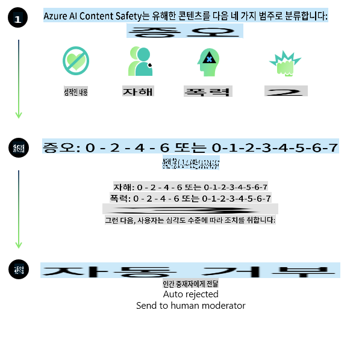
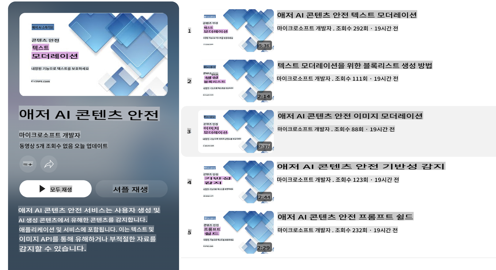

# Phi 모델을 위한 AI 안전성

Phi 모델 계열은 [Microsoft Responsible AI Standard](https://query.prod.cms.rt.microsoft.com/cms/api/am/binary/RE5cmFl)에 따라 개발되었습니다. 이 표준은 책임, 투명성, 공정성, 신뢰성과 안전성, 개인정보 보호 및 보안, 포용성을 기반으로 하는 [Microsoft의 책임 있는 AI 원칙](https://www.microsoft.com/ai/responsible-ai)에 기초한 회사 전반의 요구사항입니다.

이전 Phi 모델과 마찬가지로 다각적인 안전 평가 및 안전 사후 훈련 접근 방식을 채택했으며, 이번 릴리스의 다국어 기능을 고려한 추가 조치를 취했습니다. 다국어 및 위험 카테고리에 걸친 테스트를 포함한 안전 훈련 및 평가 접근 방식은 [Phi Safety Post-Training Paper](https://arxiv.org/abs/2407.13833)에 설명되어 있습니다. Phi 모델은 이러한 접근 방식의 혜택을 받지만, 개발자는 특정 사용 사례 및 문화적, 언어적 맥락과 관련된 위험을 매핑, 측정, 완화하는 등 책임 있는 AI 모범 사례를 적용해야 합니다.

## 모범 사례

다른 모델과 마찬가지로, Phi 모델 계열도 불공정하거나 신뢰할 수 없거나 불쾌한 방식으로 작동할 가능성이 있습니다.

SLM 및 LLM의 제한적 동작 중 알아두어야 할 사항은 다음과 같습니다:

- **서비스 품질:** Phi 모델은 주로 영어 텍스트를 기반으로 훈련되었습니다. 영어 외의 언어는 성능이 저하될 수 있으며, 훈련 데이터에서 덜 대표되는 영어 변종(예: 표준 미국 영어가 아닌 경우)은 더 낮은 성능을 경험할 수 있습니다.
- **해악의 표현 및 고정관념의 강화:** 이 모델은 특정 집단을 과도하게 또는 부족하게 표현하거나, 일부 집단의 표현을 지우거나, 경멸적이거나 부정적인 고정관념을 강화할 수 있습니다. 안전 사후 훈련에도 불구하고, 이러한 한계는 다양한 집단의 표현 수준 차이 또는 훈련 데이터에서 실세계 패턴과 사회적 편견을 반영하는 부정적 고정관념 사례의 빈도 차이로 인해 여전히 존재할 수 있습니다.
- **부적절하거나 불쾌한 콘텐츠:** 이 모델은 부적절하거나 불쾌한 다른 유형의 콘텐츠를 생성할 수 있으며, 특정 사용 사례에 맞는 추가적인 완화 조치 없이 민감한 맥락에서 배포하기에 부적합할 수 있습니다.
- **정보 신뢰성:** 언어 모델은 말이 되는 것처럼 들리지만 부정확하거나 오래된 내용을 생성하거나 비논리적인 콘텐츠를 생성할 수 있습니다.
- **코드의 제한된 범위:** Phi-3 훈련 데이터의 대부분은 Python에 기반하며 "typing, math, random, collections, datetime, itertools"와 같은 일반적인 패키지를 사용합니다. 모델이 다른 패키지를 사용하거나 다른 언어로 스크립트를 생성하는 경우, 모든 API 사용을 수동으로 검증할 것을 강력히 권장합니다.

개발자는 책임 있는 AI 모범 사례를 적용해야 하며, 특정 사용 사례가 관련 법률 및 규정을 준수하도록 보장할 책임이 있습니다(예: 개인정보 보호, 무역 등).

## 책임 있는 AI 고려사항

다른 언어 모델과 마찬가지로, Phi 시리즈 모델도 불공정하거나 신뢰할 수 없거나 불쾌한 방식으로 작동할 가능성이 있습니다. 알아두어야 할 제한적 동작은 다음과 같습니다:

**서비스 품질:** Phi 모델은 주로 영어 텍스트를 기반으로 훈련되었습니다. 영어 외의 언어는 성능이 저하될 수 있습니다. 훈련 데이터에서 덜 대표되는 영어 변종은 표준 미국 영어보다 낮은 성능을 경험할 수 있습니다.

**해악의 표현 및 고정관념의 강화:** 이 모델은 특정 집단을 과도하게 또는 부족하게 표현하거나, 일부 집단의 표현을 지우거나, 경멸적이거나 부정적인 고정관념을 강화할 수 있습니다. 안전 사후 훈련에도 불구하고, 이러한 한계는 다양한 집단의 표현 수준 차이 또는 훈련 데이터에서 실세계 패턴과 사회적 편견을 반영하는 부정적 고정관념 사례의 빈도 차이로 인해 여전히 존재할 수 있습니다.

**부적절하거나 불쾌한 콘텐츠:** 이 모델은 부적절하거나 불쾌한 다른 유형의 콘텐츠를 생성할 수 있으며, 특정 사용 사례에 맞는 추가적인 완화 조치 없이 민감한 맥락에서 배포하기에 부적합할 수 있습니다.  
**정보 신뢰성:** 언어 모델은 말이 되는 것처럼 들리지만 부정확하거나 오래된 내용을 생성하거나 비논리적인 콘텐츠를 생성할 수 있습니다.

**코드의 제한된 범위:** Phi-3 훈련 데이터의 대부분은 Python에 기반하며 "typing, math, random, collections, datetime, itertools"와 같은 일반적인 패키지를 사용합니다. 모델이 다른 패키지를 사용하거나 다른 언어로 스크립트를 생성하는 경우, 모든 API 사용을 수동으로 검증할 것을 강력히 권장합니다.

개발자는 책임 있는 AI 모범 사례를 적용해야 하며, 특정 사용 사례가 관련 법률 및 규정을 준수하도록 보장할 책임이 있습니다(예: 개인정보 보호, 무역 등). 고려해야 할 중요한 영역은 다음과 같습니다:

**할당:** 모델은 법적 지위나 자원 또는 삶의 기회 할당(예: 주택, 고용, 신용 등)에 중대한 영향을 미칠 수 있는 시나리오에는 추가적인 평가 및 편향 제거 기술 없이 적합하지 않을 수 있습니다.

**고위험 시나리오:** 개발자는 불공정하거나 신뢰할 수 없거나 불쾌한 출력이 매우 높은 비용을 초래하거나 피해를 줄 수 있는 고위험 시나리오에서 모델 사용 적합성을 평가해야 합니다. 이는 정확성과 신뢰성이 중요한 민감하거나 전문적인 도메인(예: 법률 또는 건강 조언)에서 조언을 제공하는 것을 포함합니다. 배포 맥락에 따라 애플리케이션 수준에서 추가적인 보호 장치를 구현해야 합니다.

**허위 정보:** 모델은 부정확한 정보를 생성할 수 있습니다. 개발자는 투명성 모범 사례를 따르고 최종 사용자가 AI 시스템과 상호 작용하고 있음을 알리도록 해야 합니다. 애플리케이션 수준에서는 피드백 메커니즘 및 특정 사용 사례에 맞는 맥락 정보에 기반한 응답을 제공하는 파이프라인을 구축할 수 있으며, 이를 검색 증강 생성(RAG)이라고 합니다.

**유해한 콘텐츠 생성:** 개발자는 출력물을 맥락에 따라 평가하고 사용 사례에 적합한 안전 분류기나 맞춤 솔루션을 활용해야 합니다.

**오용:** 사기, 스팸 또는 악성코드 생성과 같은 다른 형태의 오용이 가능할 수 있으며, 개발자는 애플리케이션이 관련 법률 및 규정을 위반하지 않도록 보장해야 합니다.

### 파인튜닝 및 AI 콘텐츠 안전

모델을 파인튜닝한 후에는 [Azure AI Content Safety](https://learn.microsoft.com/azure/ai-services/content-safety/overview) 조치를 활용하여 모델이 생성하는 콘텐츠를 모니터링하고, 잠재적 위험, 위협, 품질 문제를 식별하고 차단할 것을 강력히 권장합니다.

[Azure AI Content Safety](https://learn.microsoft.com/azure/ai-services/content-safety/overview)는 텍스트 및 이미지 콘텐츠를 모두 지원합니다. 클라우드, 독립 실행형 컨테이너, 엣지/임베디드 장치에서 배포할 수 있습니다.

## Azure AI Content Safety 개요

Azure AI Content Safety는 모든 상황에 맞는 단일 솔루션이 아니며, 비즈니스의 특정 정책에 맞게 맞춤화할 수 있습니다. 또한, 다국어 모델을 통해 여러 언어를 동시에 이해할 수 있습니다.

- **Azure AI Content Safety**  
- **Microsoft Developer**  
- **5개의 동영상**

Azure AI Content Safety 서비스는 애플리케이션 및 서비스에서 사용자 생성 콘텐츠와 AI 생성 콘텐츠의 유해성을 탐지합니다. 텍스트 및 이미지 API를 포함하여 유해하거나 부적절한 자료를 탐지할 수 있습니다.

[AI Content Safety Playlist](https://www.youtube.com/playlist?list=PLlrxD0HtieHjaQ9bJjyp1T7FeCbmVcPkQ)

**면책 조항**:  
이 문서는 AI 기반 기계 번역 서비스를 사용하여 번역되었습니다. 정확성을 위해 최선을 다하고 있지만, 자동 번역에는 오류나 부정확성이 포함될 수 있습니다. 원본 문서(모국어로 작성된 문서)를 신뢰할 수 있는 권위 있는 자료로 간주해야 합니다. 중요한 정보에 대해서는 전문적인 인간 번역을 권장합니다. 이 번역을 사용함으로 인해 발생하는 오해나 잘못된 해석에 대해 당사는 책임을 지지 않습니다.