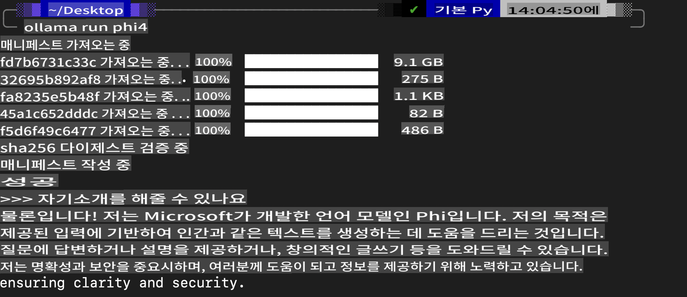
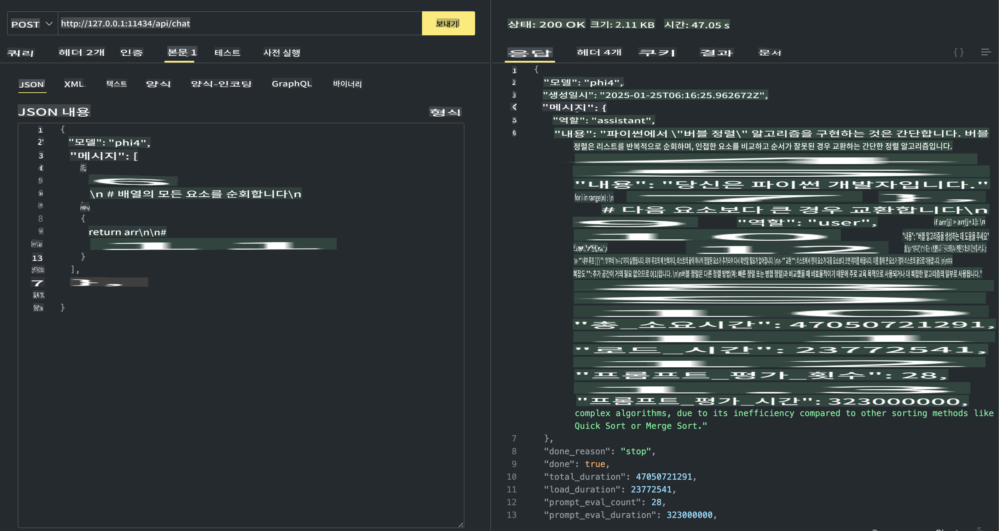

## Phi Family in Ollama

[Ollama](https://ollama.com)은 간단한 스크립트를 통해 더 많은 사람들이 오픈 소스 LLM 또는 SLM을 직접 배포할 수 있도록 하며, 로컬 Copilot 애플리케이션 시나리오를 지원하는 API를 구축할 수도 있습니다.

## **1. 설치**

Ollama는 Windows, macOS, Linux에서 실행을 지원합니다. Ollama는 이 링크를 통해 설치할 수 있습니다 ([https://ollama.com/download](https://ollama.com/download)). 설치가 완료되면 터미널 창에서 Ollama 스크립트를 사용해 Phi-3를 바로 호출할 수 있습니다. [Ollama에서 사용할 수 있는 라이브러리](https://ollama.com/library)를 모두 확인할 수 있습니다. 이 저장소를 Codespace에서 열면 Ollama가 이미 설치되어 있을 것입니다.

```bash

ollama run phi4

```

> [!NOTE]
> 처음 실행할 때 모델이 다운로드됩니다. 물론, 다운로드된 Phi-4 모델을 직접 지정할 수도 있습니다. WSL을 예로 들어 명령어를 실행해보겠습니다. 모델 다운로드가 완료되면 터미널에서 바로 상호작용할 수 있습니다.



## **2. Ollama에서 phi-4 API 호출하기**

Ollama가 생성한 Phi-4 API를 호출하려면, 이 명령어를 터미널에서 실행하여 Ollama 서버를 시작할 수 있습니다.

```bash

ollama serve

```

> [!NOTE]
> macOS나 Linux를 실행 중인 경우, **"Error: listen tcp 127.0.0.1:11434: bind: address already in use"**라는 오류가 발생할 수 있습니다. 이 오류는 명령어 실행 시 서버가 이미 실행 중임을 나타내는 경우가 많으므로 무시해도 되며, 필요시 Ollama를 중지하고 다시 시작할 수도 있습니다.

**macOS**

```bash

brew services restart ollama

```

**Linux**

```bash

sudo systemctl stop ollama

```

Ollama는 두 가지 API, generate와 chat을 지원합니다. 필요에 따라 Ollama가 제공하는 모델 API를 호출할 수 있으며, 11434 포트에서 실행 중인 로컬 서비스에 요청을 보냅니다.

**Chat**

```bash

curl http://127.0.0.1:11434/api/chat -d '{
  "model": "phi3",
  "messages": [
    {
      "role": "system",
      "content": "Your are a python developer."
    },
    {
      "role": "user",
      "content": "Help me generate a bubble algorithm"
    }
  ],
  "stream": false
  
}'

This is the result in Postman



## Additional Resources

Check the list of available models in Ollama in [their library](https://ollama.com/library).

Pull your model from the Ollama server using this command

```bash
ollama pull phi4
```

Run the model using this command

```bash
ollama run phi4
```

***Note:*** Visit this link [https://github.com/ollama/ollama/blob/main/docs/api.md](https://github.com/ollama/ollama/blob/main/docs/api.md) to learn more

## Calling Ollama from Python

You can use `requests` or `urllib3` to make requests to the local server endpoints used above. However, a popular way to use Ollama in Python is via the [openai](https://pypi.org/project/openai/) SDK, since Ollama provides OpenAI-compatible server endpoints as well.

Here is an example for phi3-mini:

```python
import openai

client = openai.OpenAI(
    base_url="http://localhost:11434/v1",
    api_key="nokeyneeded",
)

response = client.chat.completions.create(
    model="phi4",
    temperature=0.7,
    n=1,
    messages=[
        {"role": "system", "content": "You are a helpful assistant."},
        {"role": "user", "content": "Write a haiku about a hungry cat"},
    ],
)

print("Response:")
print(response.choices[0].message.content)
```

## Calling Ollama from JavaScript 

```javascript
// Phi-4로 파일 요약 예제
script({
    model: "ollama:phi4",
    title: "Summarize with Phi-4",
    system: ["system"],
})

// 요약 예제
const file = def("FILE", env.files)
$`Summarize ${file} in a single paragraph.`
```

## Calling Ollama from C#

Create a new C# Console application and add the following NuGet package:

```bash
dotnet add package Microsoft.SemanticKernel --version 1.34.0
```

Then replace this code in the `Program.cs` file

```csharp
using Microsoft.SemanticKernel;
using Microsoft.SemanticKernel.ChatCompletion;

// 로컬 Ollama 서버 엔드포인트를 사용하여 채팅 서비스 추가
#pragma warning disable SKEXP0001, SKEXP0003, SKEXP0010, SKEXP0011, SKEXP0050, SKEXP0052
builder.AddOpenAIChatCompletion(
    modelId: "phi4",
    endpoint: new Uri("http://localhost:11434/"),
    apiKey: "non required");

// 채팅 서비스에 간단한 프롬프트 호출
string prompt = "Write a joke about kittens";
var response = await kernel.InvokePromptAsync(prompt);
Console.WriteLine(response.GetValue<string>());
```

Run the app with the command:

```bash
dotnet run

**면책 조항**:  
이 문서는 AI 기반 기계 번역 서비스를 사용하여 번역되었습니다. 정확성을 위해 노력하고 있지만, 자동 번역에는 오류나 부정확성이 포함될 수 있음을 유의하시기 바랍니다. 원본 문서의 해당 언어 버전이 권위 있는 자료로 간주되어야 합니다. 중요한 정보의 경우, 전문 인간 번역을 권장합니다. 이 번역 사용으로 인해 발생하는 오해나 잘못된 해석에 대해 당사는 책임을 지지 않습니다.