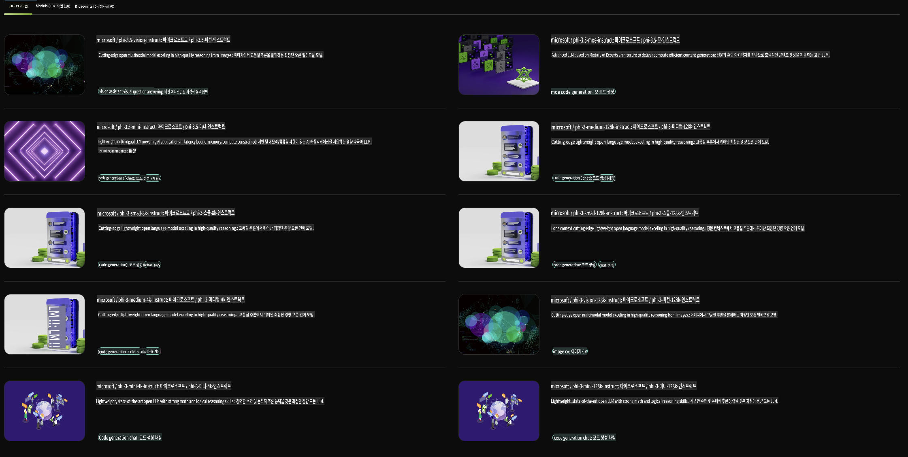

## NVIDIA NIM의 Phi 패밀리

NVIDIA NIM은 클라우드, 데이터 센터, 워크스테이션에서 생성 AI 모델 배포를 가속화하기 위해 설계된 사용하기 쉬운 마이크로서비스 모음입니다. NIM은 모델 패밀리와 개별 모델 기준으로 분류됩니다. 예를 들어, 대규모 언어 모델(LLM)을 위한 NVIDIA NIM은 최첨단 LLM의 강력한 성능을 기업 애플리케이션에 제공하여 뛰어난 자연어 처리 및 이해 기능을 제공합니다.

NIM은 IT 및 DevOps 팀이 대규모 언어 모델(LLM)을 자체 관리 환경에서 호스팅할 수 있도록 하면서도, 개발자들에게 강력한 코파일럿, 챗봇, AI 어시스턴트를 구축할 수 있는 업계 표준 API를 제공합니다. NVIDIA의 최첨단 GPU 가속 및 확장 가능한 배포 기능을 활용하여, NIM은 타의 추종을 불허하는 성능으로 가장 빠른 추론 경로를 제공합니다.

NVIDIA NIM을 사용하여 Phi 패밀리 모델의 추론을 수행할 수 있습니다.



### **샘플 - NVIDIA NIM의 Phi-3-Vision**

이미지(`demo.png`)가 있다고 가정하고, 이 이미지를 처리한 후 새로운 버전을 저장하는 Python 코드를 생성하고 싶다고 해봅시다(`phi-3-vision.jpg`).

위 코드는 다음 과정을 자동화합니다:

1. 환경 및 필요한 설정 구성.
2. 모델에게 필요한 Python 코드를 생성하라고 지시하는 프롬프트 생성.
3. 프롬프트를 모델에 보내고 생성된 코드를 수집.
4. 생성된 코드를 추출하고 실행.
5. 원본 이미지와 처리된 이미지를 표시.

이 접근 방식은 AI의 힘을 활용하여 이미지 처리 작업을 자동화하며, 목표를 더 쉽고 빠르게 달성할 수 있도록 합니다.

[샘플 코드 솔루션](../../../../../code/06.E2E/E2E_Nvidia_NIM_Phi3_Vision.ipynb)

전체 코드가 수행하는 작업을 단계별로 살펴보겠습니다:

1. **필요한 패키지 설치**:
    ```python
    !pip install langchain_nvidia_ai_endpoints -U
    ```
    이 명령은 `langchain_nvidia_ai_endpoints` 패키지를 최신 버전으로 설치합니다.

2. **필요한 모듈 가져오기**:
    ```python
    from langchain_nvidia_ai_endpoints import ChatNVIDIA
    import getpass
    import os
    import base64
    ```
    이 코드는 NVIDIA AI 엔드포인트와 상호작용하고, 비밀번호를 안전하게 처리하며, 운영 체제와 상호작용하고, 데이터를 base64 형식으로 인코딩/디코딩하기 위한 모듈을 가져옵니다.

3. **API 키 설정**:
    ```python
    if not os.getenv("NVIDIA_API_KEY"):
        os.environ["NVIDIA_API_KEY"] = getpass.getpass("Enter your NVIDIA API key: ")
    ```
    이 코드는 `NVIDIA_API_KEY` 환경 변수가 설정되어 있는지 확인하고, 설정되어 있지 않으면 사용자에게 API 키를 안전하게 입력하도록 요청합니다.

4. **모델 및 이미지 경로 정의**:
    ```python
    model = 'microsoft/phi-3-vision-128k-instruct'
    chat = ChatNVIDIA(model=model)
    img_path = './imgs/demo.png'
    ```
    사용할 모델을 설정하고, 지정된 모델로 `ChatNVIDIA` 인스턴스를 생성하며, 이미지 파일 경로를 정의합니다.

5. **텍스트 프롬프트 생성**:
    ```python
    text = "Please create Python code for image, and use plt to save the new picture under imgs/ and name it phi-3-vision.jpg."
    ```
    이 코드는 모델에게 이미지 처리를 위한 Python 코드를 생성하라고 지시하는 텍스트 프롬프트를 정의합니다.

6. **이미지를 Base64로 인코딩**:
    ```python
    with open(img_path, "rb") as f:
        image_b64 = base64.b64encode(f.read()).decode()
    image = f''
    ```
    이 코드는 이미지 파일을 읽고, base64로 인코딩한 후, 인코딩된 데이터를 포함하는 HTML 이미지 태그를 생성합니다.

7. **텍스트와 이미지를 프롬프트로 결합**:
    ```python
    prompt = f"{text} {image}"
    ```
    이 코드는 텍스트 프롬프트와 HTML 이미지 태그를 하나의 문자열로 결합합니다.

8. **ChatNVIDIA를 사용하여 코드 생성**:
    ```python
    code = ""
    for chunk in chat.stream(prompt):
        print(chunk.content, end="")
        code += chunk.content
    ```
    이 코드는 프롬프트를 `ChatNVIDIA` model and collects the generated code in chunks, printing and appending each chunk to the `code` 문자열로 보냅니다.

9. **생성된 콘텐츠에서 Python 코드 추출**:
    ```python
    begin = code.index('```python') + 9
    code = code[begin:]
    end = code.index('```')
    code = code[:end]
    ```
    이 코드는 생성된 콘텐츠에서 마크다운 포맷을 제거하여 실제 Python 코드를 추출합니다.

10. **생성된 코드 실행**:
    ```python
    import subprocess
    result = subprocess.run(["python", "-c", code], capture_output=True)
    ```
    이 코드는 추출된 Python 코드를 서브프로세스로 실행하고 그 출력을 캡처합니다.

11. **이미지 표시**:
    ```python
    from IPython.display import Image, display
    display(Image(filename='./imgs/phi-3-vision.jpg'))
    display(Image(filename='./imgs/demo.png'))
    ```
    이 코드는 `IPython.display` 모듈을 사용하여 이미지를 표시합니다.

**면책 조항**:  
이 문서는 AI 기반 기계 번역 서비스를 사용하여 번역되었습니다. 정확성을 위해 노력하고 있으나, 자동 번역에는 오류나 부정확성이 포함될 수 있습니다. 원어로 작성된 원본 문서를 신뢰할 수 있는 권위 있는 자료로 간주해야 합니다. 중요한 정보의 경우, 전문 번역가에 의한 번역을 권장합니다. 이 번역 사용으로 인해 발생하는 오해나 잘못된 해석에 대해 당사는 책임을 지지 않습니다.