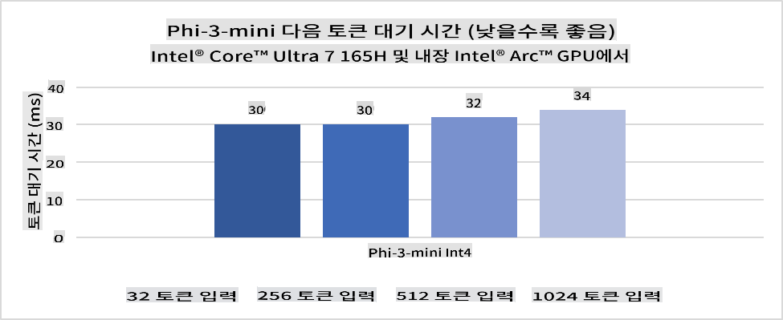
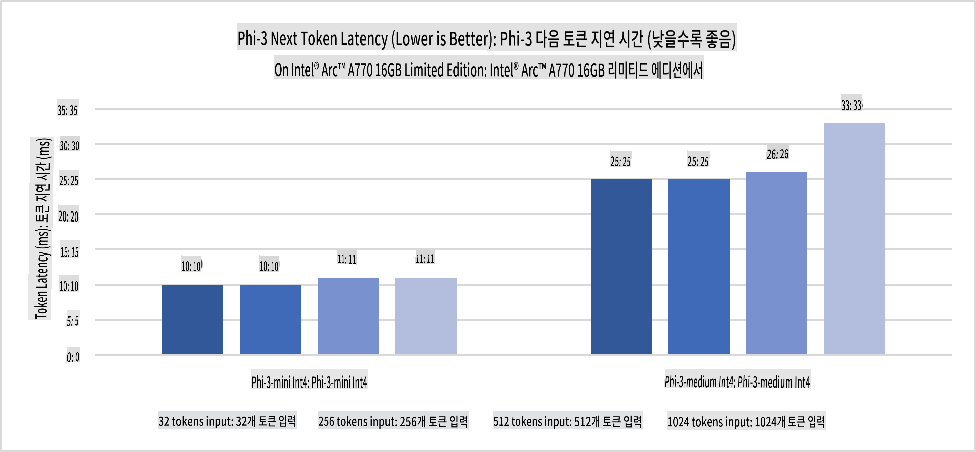
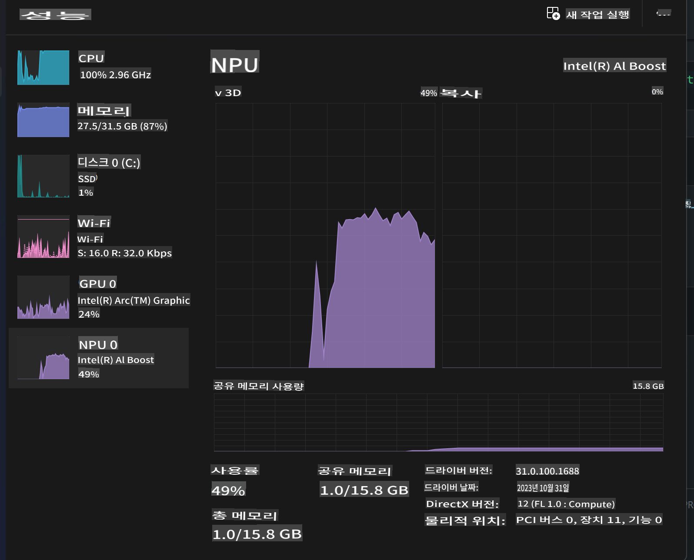
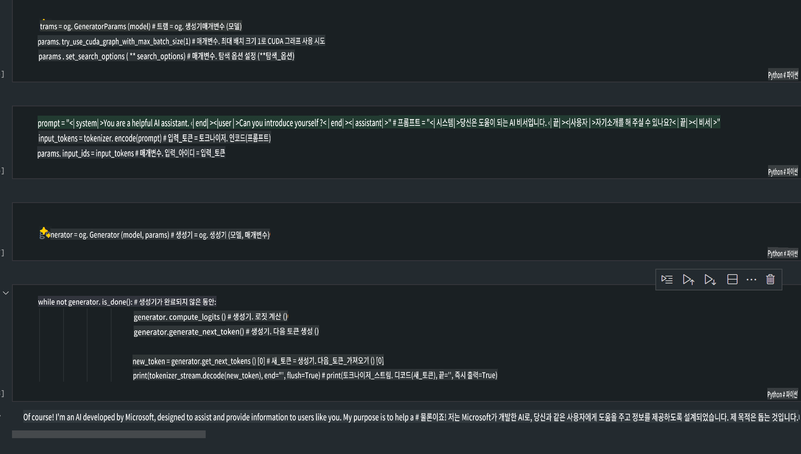
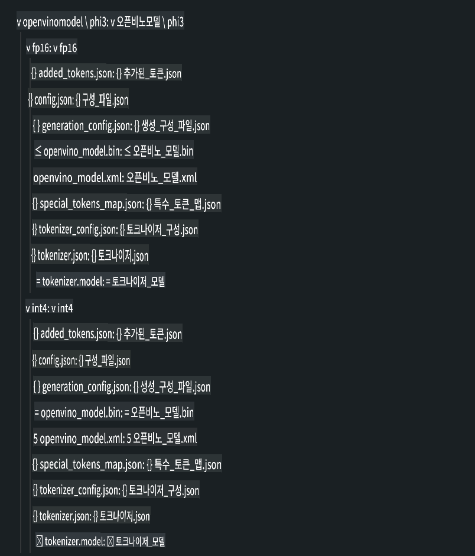
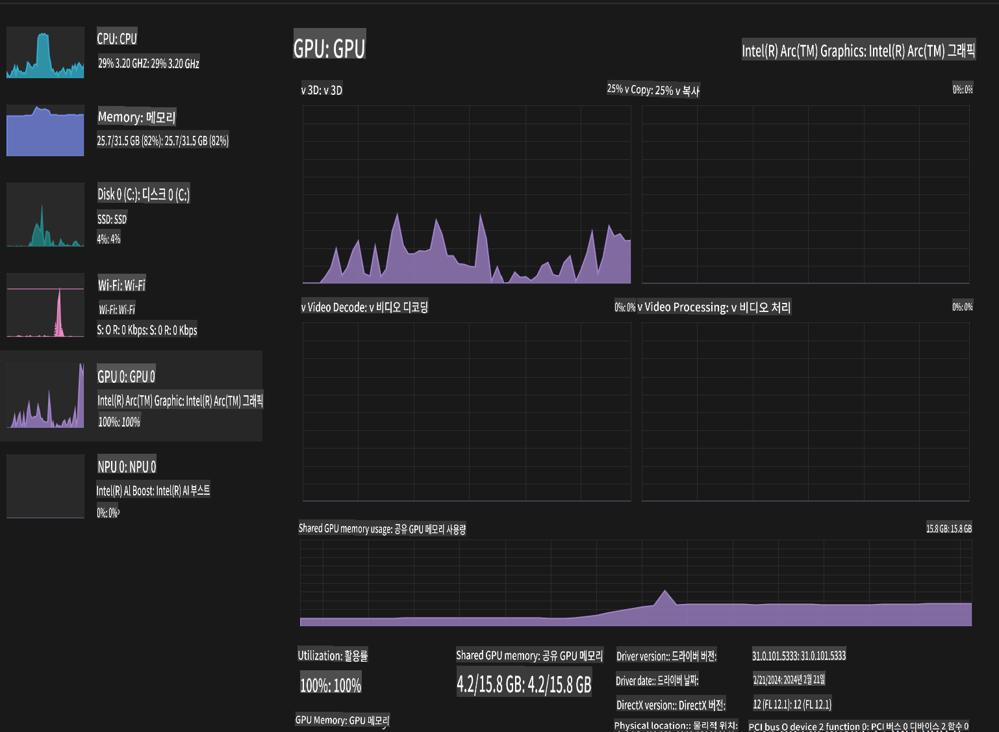

# **AI PC에서 Phi-3 모델 추론**

생성형 AI의 발전과 엣지 디바이스 하드웨어 성능의 향상으로 인해, 점점 더 많은 생성형 AI 모델들이 사용자의 개인 디바이스(BYOD)에 통합될 수 있게 되었습니다. AI PC도 이러한 모델 중 하나입니다. 2024년부터 Intel, AMD, Qualcomm은 PC 제조업체들과 협력하여 하드웨어 개조를 통해 로컬 생성형 AI 모델의 배포를 가능하게 하는 AI PC를 출시할 예정입니다. 이번 논의에서는 Intel AI PC에 초점을 맞추어 Intel AI PC에서 Phi-3를 배포하는 방법을 살펴보겠습니다.

### NPU란 무엇인가?

NPU(Neural Processing Unit)는 신경망 작업과 AI 작업을 가속화하기 위해 설계된 SoC 내의 전용 프로세서 또는 처리 유닛입니다. 일반적인 CPU나 GPU와 달리, NPU는 데이터 중심의 병렬 컴퓨팅에 최적화되어 있어, 대량의 멀티미디어 데이터(예: 동영상, 이미지)와 신경망 데이터를 처리하는 데 매우 효율적입니다. NPU는 음성 인식, 화상 통화 중 배경 흐림 처리, 객체 탐지와 같은 사진 및 비디오 편집 작업 등 AI 관련 작업을 처리하는 데 특히 유능합니다.

## NPU vs GPU

많은 AI 및 머신러닝 작업이 GPU에서 실행되지만, GPU와 NPU 간에는 중요한 차이가 있습니다.  
GPU는 병렬 컴퓨팅 성능으로 잘 알려져 있지만, 모든 GPU가 그래픽 처리 외의 작업에 동일한 효율성을 보이는 것은 아닙니다. 반면, NPU는 신경망 작업에 필요한 복잡한 계산을 위해 설계되어 AI 작업에 매우 효과적입니다.

결론적으로, NPU는 AI 계산을 가속화하는 수학적 천재이며, AI PC의 새로운 시대에서 중요한 역할을 담당합니다!

***이 예시는 Intel의 최신 Intel Core Ultra Processor를 기반으로 합니다.***

## **1. NPU를 활용한 Phi-3 모델 실행**

Intel® NPU 디바이스는 Intel® Core™ Ultra 세대 CPU(이전 코드명 Meteor Lake)부터 Intel 클라이언트 CPU에 통합된 AI 추론 가속기입니다. 이는 인공 신경망 작업을 에너지 효율적으로 실행할 수 있게 합니다.





**Intel NPU Acceleration Library**

Intel NPU Acceleration Library [https://github.com/intel/intel-npu-acceleration-library](https://github.com/intel/intel-npu-acceleration-library)는 Intel Neural Processing Unit(NPU)의 성능을 활용하여 호환 가능한 하드웨어에서 고속 계산을 수행함으로써 애플리케이션의 효율성을 높이기 위해 설계된 Python 라이브러리입니다.

Intel® Core™ Ultra 프로세서로 구동되는 AI PC에서 Phi-3-mini의 예제.


Python 라이브러리 설치는 pip 명령어를 사용합니다.

```bash

   pip install intel-npu-acceleration-library

```

***참고*** 이 프로젝트는 아직 개발 중이지만, 참고 모델은 이미 매우 완성도가 높습니다.

### **Intel NPU Acceleration Library를 사용하여 Phi-3 실행**

Intel NPU 가속을 사용할 경우, 이 라이브러리는 기존 인코딩 프로세스에 영향을 미치지 않습니다. 단순히 이 라이브러리를 사용하여 원본 Phi-3 모델을 FP16, INT8, INT4 등으로 양자화(quantization)하면 됩니다.

```python
from transformers import AutoTokenizer, pipeline,TextStreamer
from intel_npu_acceleration_library import NPUModelForCausalLM, int4
from intel_npu_acceleration_library.compiler import CompilerConfig
import warnings

model_id = "microsoft/Phi-3-mini-4k-instruct"

compiler_conf = CompilerConfig(dtype=int4)
model = NPUModelForCausalLM.from_pretrained(
    model_id, use_cache=True, config=compiler_conf, attn_implementation="sdpa"
).eval()

tokenizer = AutoTokenizer.from_pretrained(model_id)

text_streamer = TextStreamer(tokenizer, skip_prompt=True)
```

양자화가 성공적으로 완료되면, NPU를 호출하여 Phi-3 모델을 실행합니다.

```python
generation_args = {
   "max_new_tokens": 1024,
   "return_full_text": False,
   "temperature": 0.3,
   "do_sample": False,
   "streamer": text_streamer,
}

pipe = pipeline(
   "text-generation",
   model=model,
   tokenizer=tokenizer,
)

query = "<|system|>You are a helpful AI assistant.<|end|><|user|>Can you introduce yourself?<|end|><|assistant|>"

with warnings.catch_warnings():
    warnings.simplefilter("ignore")
    pipe(query, **generation_args)
```

코드 실행 시, 작업 관리자를 통해 NPU의 실행 상태를 확인할 수 있습니다.



***샘플*** : [AIPC_NPU_DEMO.ipynb](../../../../../code/03.Inference/AIPC/AIPC_NPU_DEMO.ipynb)

## **2. DirectML + ONNX Runtime을 활용한 Phi-3 모델 실행**

### **DirectML이란?**

[DirectML](https://github.com/microsoft/DirectML)은 머신러닝을 위한 고성능 하드웨어 가속 DirectX 12 라이브러리입니다. DirectML은 AMD, Intel, NVIDIA, Qualcomm과 같은 다양한 하드웨어 및 드라이버를 지원하며, DirectX 12를 지원하는 모든 GPU에서 머신러닝 작업을 가속화합니다.

DirectML API는 독립적으로 사용할 경우, 프레임워크, 게임, 기타 실시간 애플리케이션과 같은 고성능 저지연 애플리케이션에 적합한 저수준 DirectX 12 라이브러리입니다. DirectML은 Direct3D 12와의 원활한 상호운용성과 낮은 오버헤드, 하드웨어 간 일관성을 제공하여 고성능이 요구되면서도 하드웨어 간 결과의 신뢰성과 예측 가능성이 중요한 머신러닝 가속에 이상적입니다.

***참고*** : 최신 DirectML은 이미 NPU를 지원합니다(https://devblogs.microsoft.com/directx/introducing-neural-processor-unit-npu-support-in-directml-developer-preview/).

### DirectML과 CUDA의 기능 및 성능 비교:

**DirectML**은 Microsoft가 개발한 머신러닝 라이브러리입니다. Windows 디바이스(데스크톱, 노트북, 엣지 디바이스 등)에서 머신러닝 작업을 가속화하도록 설계되었습니다.
- DX12 기반: DirectML은 DirectX 12(DX12)를 기반으로 하며, NVIDIA와 AMD를 포함한 다양한 GPU를 지원합니다.
- 광범위한 지원: DX12를 활용하기 때문에 DirectML은 통합 GPU를 포함하여 DX12를 지원하는 모든 GPU에서 작동할 수 있습니다.
- 이미지 처리: DirectML은 이미지 인식, 객체 탐지 등과 같은 작업에 적합한 신경망을 사용하여 이미지를 처리합니다.
- 간편한 설정: DirectML은 설정이 간단하며, GPU 제조업체의 특정 SDK나 라이브러리가 필요하지 않습니다.
- 성능: 특정 작업에서는 DirectML이 CUDA보다 빠를 수 있습니다.
- 한계: 그러나 float16 대규모 배치 크기와 같은 경우에는 DirectML이 느릴 수 있습니다.

**CUDA**는 NVIDIA의 병렬 컴퓨팅 플랫폼 및 프로그래밍 모델입니다. 이는 NVIDIA GPU의 성능을 활용하여 머신러닝 및 과학 시뮬레이션과 같은 범용 컴퓨팅을 가능하게 합니다.
- NVIDIA 전용: CUDA는 NVIDIA GPU에 최적화되어 있습니다.
- 고도로 최적화: GPU 가속 작업에서 뛰어난 성능을 제공합니다.
- 널리 사용됨: TensorFlow, PyTorch와 같은 많은 머신러닝 프레임워크와 라이브러리가 CUDA를 지원합니다.
- 커스터마이징: 특정 작업에 대해 CUDA 설정을 세밀하게 조정할 수 있어 최적의 성능을 이끌어낼 수 있습니다.
- 한계: 그러나 NVIDIA 하드웨어에 의존하기 때문에 다양한 GPU와의 호환성은 제한적일 수 있습니다.

### DirectML과 CUDA 중 선택하기

DirectML과 CUDA 중 선택은 사용 사례, 하드웨어 가용성, 개인 선호도에 따라 달라집니다.  
더 넓은 호환성과 간편한 설정을 원한다면 DirectML이 적합할 수 있습니다. 반면, NVIDIA GPU를 보유하고 있고 고도로 최적화된 성능이 필요하다면 CUDA가 강력한 선택지입니다.  
결론적으로, DirectML과 CUDA 모두 장단점이 있으므로, 요구 사항과 가용 하드웨어를 고려하여 선택하십시오.

### **ONNX Runtime을 활용한 생성형 AI**

AI 시대에서는 AI 모델의 이식성이 매우 중요합니다. ONNX Runtime은 훈련된 모델을 다양한 디바이스에 쉽게 배포할 수 있도록 합니다. 개발자는 추론 프레임워크에 신경 쓰지 않고 통합된 API를 사용하여 모델 추론을 완료할 수 있습니다. 생성형 AI 시대에 ONNX Runtime은 코드 최적화(https://onnxruntime.ai/docs/genai/)도 수행합니다. 최적화된 ONNX Runtime을 통해 양자화된 생성형 AI 모델을 다양한 단말에서 추론할 수 있습니다.  
ONNX Runtime을 사용한 생성형 AI에서는 Python, C#, C/C++을 통해 AI 모델 API를 추론할 수 있습니다. 물론, iPhone에 배포할 때는 C++의 ONNX Runtime API를 활용할 수 있습니다.

[샘플 코드](https://github.com/Azure-Samples/Phi-3MiniSamples/tree/main/onnx)

***ONNX Runtime 라이브러리 컴파일***

```bash

winget install --id=Kitware.CMake  -e

git clone https://github.com/microsoft/onnxruntime.git

cd .\onnxruntime\

./build.bat --build_shared_lib --skip_tests --parallel --use_dml --config Release

cd ../

git clone https://github.com/microsoft/onnxruntime-genai.git

cd .\onnxruntime-genai\

mkdir ort

cd ort

mkdir include

mkdir lib

copy ..\onnxruntime\include\onnxruntime\core\providers\dml\dml_provider_factory.h ort\include

copy ..\onnxruntime\include\onnxruntime\core\session\onnxruntime_c_api.h ort\include

copy ..\onnxruntime\build\Windows\Release\Release\*.dll ort\lib

copy ..\onnxruntime\build\Windows\Release\Release\onnxruntime.lib ort\lib

python build.py --use_dml


```

**라이브러리 설치**

```bash

pip install .\onnxruntime_genai_directml-0.3.0.dev0-cp310-cp310-win_amd64.whl

```

실행 결과는 다음과 같습니다.



***샘플*** : [AIPC_DirectML_DEMO.ipynb](../../../../../code/03.Inference/AIPC/AIPC_DirectML_DEMO.ipynb)

## **3. Intel OpenVINO를 활용한 Phi-3 모델 실행**

### **OpenVINO란?**

[OpenVINO](https://github.com/openvinotoolkit/openvino)는 딥러닝 모델 최적화 및 배포를 위한 오픈소스 툴킷입니다. TensorFlow, PyTorch 등 인기 있는 프레임워크의 비전, 오디오, 언어 모델에 대해 딥러닝 성능을 향상시킵니다. OpenVINO는 CPU와 GPU를 조합하여 Phi-3 모델을 실행하는 데에도 사용할 수 있습니다.

***참고***: 현재 OpenVINO는 NPU를 지원하지 않습니다.

### **OpenVINO 라이브러리 설치**

```bash

 pip install git+https://github.com/huggingface/optimum-intel.git

 pip install git+https://github.com/openvinotoolkit/nncf.git

 pip install openvino-nightly

```

### **OpenVINO로 Phi-3 실행**

NPU와 마찬가지로 OpenVINO는 양자화된 모델을 실행하여 생성형 AI 모델을 호출합니다. 먼저 Phi-3 모델을 양자화해야 하며, 명령줄에서 optimum-cli를 통해 모델 양자화를 완료합니다.

**INT4**

```bash

optimum-cli export openvino --model "microsoft/Phi-3-mini-4k-instruct" --task text-generation-with-past --weight-format int4 --group-size 128 --ratio 0.6  --sym  --trust-remote-code ./openvinomodel/phi3/int4

```

**FP16**

```bash

optimum-cli export openvino --model "microsoft/Phi-3-mini-4k-instruct" --task text-generation-with-past --weight-format fp16 --trust-remote-code ./openvinomodel/phi3/fp16

```

변환된 형식은 다음과 같습니다.



모델 경로(model_dir), 관련 설정(ov_config = {"PERFORMANCE_HINT": "LATENCY", "NUM_STREAMS": "1", "CACHE_DIR": ""}), 하드웨어 가속 디바이스(GPU.0)를 OVModelForCausalLM을 통해 로드합니다.

```python

ov_model = OVModelForCausalLM.from_pretrained(
     model_dir,
     device='GPU.0',
     ov_config=ov_config,
     config=AutoConfig.from_pretrained(model_dir, trust_remote_code=True),
     trust_remote_code=True,
)

```

코드 실행 시, 작업 관리자를 통해 GPU의 실행 상태를 확인할 수 있습니다.



***샘플*** : [AIPC_OpenVino_Demo.ipynb](../../../../../code/03.Inference/AIPC/AIPC_OpenVino_Demo.ipynb)

### ***참고*** : 위의 세 가지 방법은 각각 장점이 있지만, AI PC 추론에는 NPU 가속을 사용하는 것이 권장됩니다.

**면책 조항**:  
이 문서는 기계 기반 AI 번역 서비스를 사용하여 번역되었습니다. 정확성을 위해 노력하고 있지만, 자동 번역에는 오류나 부정확성이 포함될 수 있음을 유의하시기 바랍니다. 원본 문서의 원어 버전이 권위 있는 자료로 간주되어야 합니다. 중요한 정보에 대해서는 전문적인 인간 번역을 권장합니다. 이 번역 사용으로 인해 발생하는 오해나 잘못된 해석에 대해 당사는 책임을 지지 않습니다.