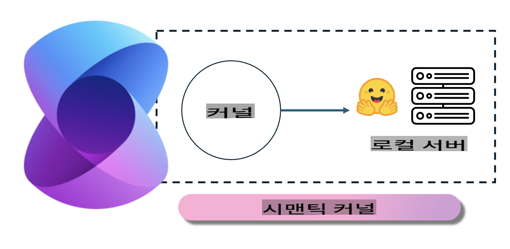
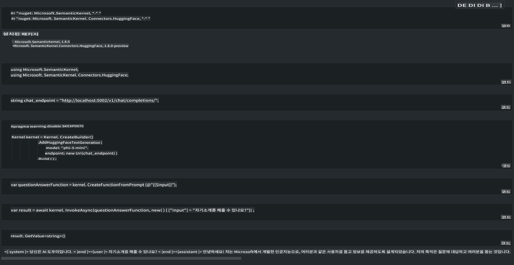

# **로컬 서버에서 Phi-3 추론**

Phi-3를 로컬 서버에 배포할 수 있습니다. 사용자는 [Ollama](https://ollama.com)나 [LM Studio](https://llamaedge.com) 솔루션을 선택하거나 직접 코드를 작성할 수 있습니다. [Semantic Kernel](https://github.com/microsoft/semantic-kernel?WT.mc_id=aiml-138114-kinfeylo) 또는 [Langchain](https://www.langchain.com/)을 통해 Phi-3의 로컬 서비스를 연결하여 Copilot 애플리케이션을 구축할 수 있습니다.

## **Semantic Kernel을 사용하여 Phi-3-mini에 접근하기**

Copilot 애플리케이션에서는 Semantic Kernel / LangChain을 통해 애플리케이션을 만듭니다. 이러한 유형의 애플리케이션 프레임워크는 일반적으로 Azure OpenAI Service / OpenAI 모델과 호환되며, Hugging Face의 오픈 소스 모델 및 로컬 모델도 지원할 수 있습니다. 그렇다면 Semantic Kernel을 사용하여 Phi-3-mini에 접근하려면 어떻게 해야 할까요? .NET을 예로 들어, Semantic Kernel의 Hugging Face Connector와 결합할 수 있습니다. 기본적으로 Hugging Face의 모델 ID에 대응할 수 있습니다(처음 사용할 때 모델이 Hugging Face에서 다운로드되며, 시간이 오래 걸릴 수 있습니다). 또한, 직접 구축한 로컬 서비스에 연결할 수도 있습니다. 두 가지 방법을 비교했을 때, 특히 기업 애플리케이션에서 자율성이 더 높은 후자를 사용하는 것을 권장합니다.

그림에서 보듯, Semantic Kernel을 통해 로컬 서비스에 접근하면 직접 구축한 Phi-3-mini 모델 서버에 쉽게 연결할 수 있습니다. 아래는 실행 결과입니다.

***샘플 코드*** https://github.com/kinfey/Phi3MiniSamples/tree/main/semantickernel

**면책 조항**:  
이 문서는 AI 기반 기계 번역 서비스를 사용하여 번역되었습니다. 정확성을 위해 최선을 다하고 있지만, 자동 번역에는 오류나 부정확성이 포함될 수 있습니다. 원본 문서의 모국어 버전이 권위 있는 자료로 간주되어야 합니다. 중요한 정보의 경우, 전문적인 인간 번역을 권장합니다. 이 번역 사용으로 인해 발생하는 오해나 오역에 대해 당사는 책임을 지지 않습니다.