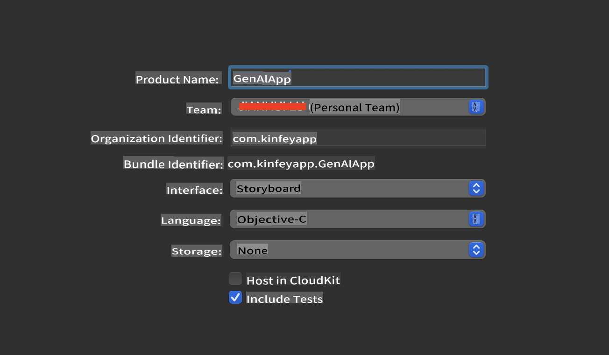
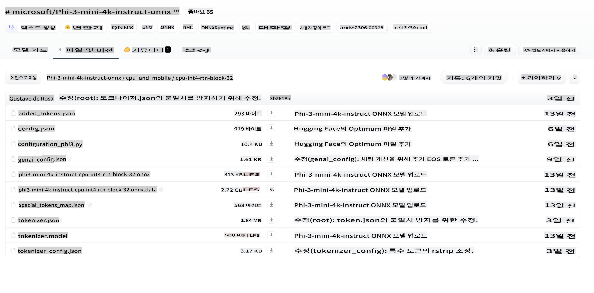
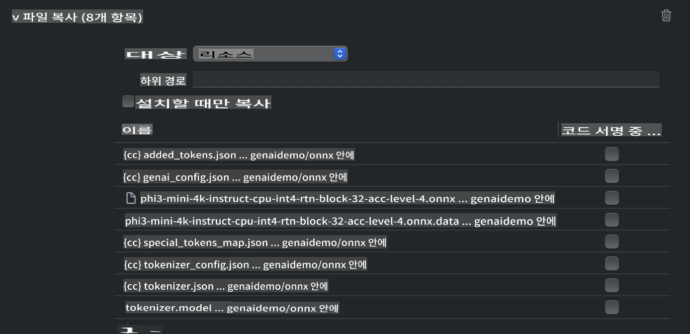
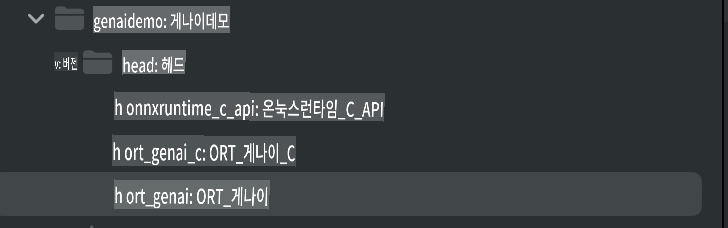
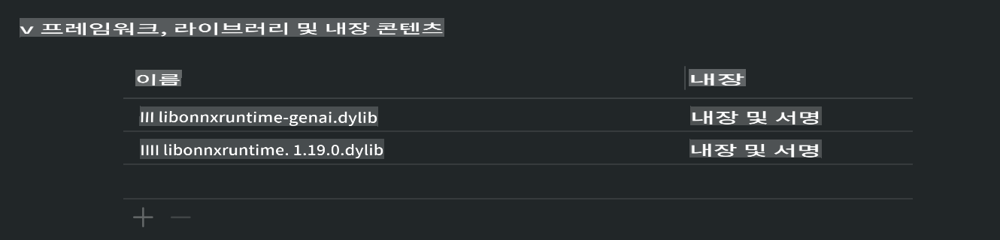
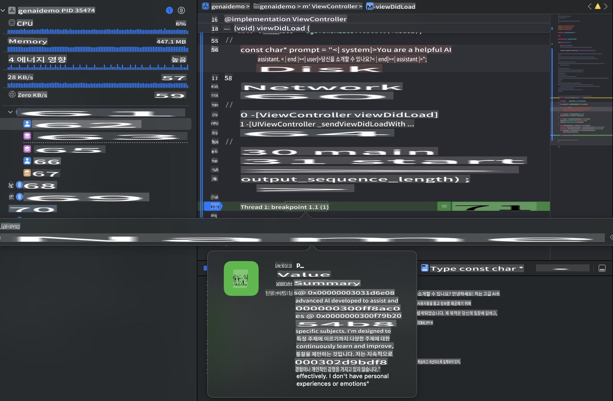

# **iOS에서 Phi-3 추론**

Phi-3-mini는 Microsoft에서 새롭게 선보이는 모델 시리즈로, 대규모 언어 모델(LLM)을 엣지 디바이스 및 IoT 디바이스에서 배포할 수 있게 해줍니다. Phi-3-mini는 iOS, Android, 엣지 디바이스 배포를 지원하며, BYOD 환경에서 생성형 AI를 배포할 수 있도록 설계되었습니다. 아래 예시는 iOS에서 Phi-3-mini를 배포하는 방법을 보여줍니다.

## **1. 준비**

- **a.** macOS 14 이상
- **b.** Xcode 15 이상
- **c.** iOS SDK 17.x (iPhone 14 A16 이상)
- **d.** Python 3.10 이상 설치 (Conda 권장)
- **e.** Python 라이브러리 설치: `python-flatbuffers`
- **f.** CMake 설치

### Semantic Kernel과 추론

Semantic Kernel은 Azure OpenAI Service, OpenAI 모델, 로컬 모델과 호환되는 애플리케이션을 생성할 수 있도록 지원하는 애플리케이션 프레임워크입니다. Semantic Kernel을 통해 로컬 서비스를 활용하면 자체 호스팅된 Phi-3-mini 모델 서버와 쉽게 통합할 수 있습니다.

### Ollama 또는 LlamaEdge로 양자화된 모델 호출

많은 사용자가 로컬에서 모델을 실행하기 위해 양자화된 모델을 선호합니다. [Ollama](https://ollama.com)와 [LlamaEdge](https://llamaedge.com)는 다양한 양자화된 모델을 호출할 수 있는 방법을 제공합니다:

#### **Ollama**

`ollama run phi3`를 직접 실행하거나 오프라인에서 설정을 구성할 수 있습니다. Modelfile을 생성하여 `gguf` 파일의 경로를 지정하세요. Phi-3-mini 양자화 모델을 실행하는 샘플 코드:

```gguf
FROM {Add your gguf file path}
TEMPLATE \"\"\"<|user|> .Prompt<|end|> <|assistant|>\"\"\"
PARAMETER stop <|end|>
PARAMETER num_ctx 4096
```

#### **LlamaEdge**

클라우드와 엣지 디바이스에서 `gguf`를 동시에 사용하려면, LlamaEdge가 훌륭한 선택이 될 수 있습니다.

## **2. iOS용 ONNX Runtime 컴파일**

```bash

git clone https://github.com/microsoft/onnxruntime.git

cd onnxruntime

./build.sh --build_shared_lib --ios --skip_tests --parallel --build_dir ./build_ios --ios --apple_sysroot iphoneos --osx_arch arm64 --apple_deploy_target 17.5 --cmake_generator Xcode --config Release

cd ../

```

### **유의사항**

- **a.** 컴파일 전에 Xcode가 제대로 구성되었는지 확인하고, 터미널에서 활성 개발자 디렉터리로 설정하세요:

    ```bash
    sudo xcode-select -switch /Applications/Xcode.app/Contents/Developer
    ```

- **b.** ONNX Runtime은 다양한 플랫폼에 맞게 컴파일해야 합니다. iOS의 경우 `arm64` or `x86_64`로 컴파일할 수 있습니다.

- **c.** 최신 iOS SDK를 사용하여 컴파일하는 것이 권장됩니다. 하지만 이전 SDK와의 호환성을 위해 더 오래된 버전을 사용할 수도 있습니다.

## **3. iOS용 ONNX Runtime을 활용한 생성형 AI 컴파일**

> **참고:** ONNX Runtime을 활용한 생성형 AI는 현재 프리뷰 상태이므로 변경 가능성이 있습니다.

```bash

git clone https://github.com/microsoft/onnxruntime-genai
 
cd onnxruntime-genai
 
mkdir ort
 
cd ort
 
mkdir include
 
mkdir lib
 
cd ../
 
cp ../onnxruntime/include/onnxruntime/core/session/onnxruntime_c_api.h ort/include
 
cp ../onnxruntime/build_ios/Release/Release-iphoneos/libonnxruntime*.dylib* ort/lib
 
export OPENCV_SKIP_XCODEBUILD_FORCE_TRYCOMPILE_DEBUG=1
 
python3 build.py --parallel --build_dir ./build_ios --ios --ios_sysroot iphoneos --ios_arch arm64 --ios_deployment_target 17.5 --cmake_generator Xcode --cmake_extra_defines CMAKE_XCODE_ATTRIBUTE_CODE_SIGNING_ALLOWED=NO

```

## **4. Xcode에서 App 애플리케이션 생성**

ONNX Runtime C++ API를 활용한 생성형 AI를 사용할 때, Objective-C가 더 나은 호환성을 제공하기 때문에 App 개발 방법으로 Objective-C를 선택했습니다. 물론, Swift 브리징을 통해 관련 호출을 완료할 수도 있습니다.



## **5. ONNX 양자화 INT4 모델을 App 애플리케이션 프로젝트에 복사**

ONNX 형식의 INT4 양자화 모델을 가져와야 하며, 이를 먼저 다운로드해야 합니다.



다운로드한 후, Xcode 프로젝트의 Resources 디렉터리에 추가해야 합니다.



## **6. ViewController에 C++ API 추가**

> **유의사항:**

- **a.** 프로젝트에 해당 C++ 헤더 파일을 추가하세요.

  

- **b.** `onnxruntime-genai` dynamic library in Xcode.

  

- **c.** Use the C Samples code for testing. You can also add additional features like ChatUI for more functionality.

- **d.** Since you need to use C++ in your project, rename `ViewController.m` to `ViewController.mm`을 포함하여 Objective-C++ 지원을 활성화하세요.

```objc

    NSString *llmPath = [[NSBundle mainBundle] resourcePath];
    char const *modelPath = llmPath.cString;

    auto model =  OgaModel::Create(modelPath);

    auto tokenizer = OgaTokenizer::Create(*model);

    const char* prompt = "<|system|>You are a helpful AI assistant.<|end|><|user|>Can you introduce yourself?<|end|><|assistant|>";

    auto sequences = OgaSequences::Create();
    tokenizer->Encode(prompt, *sequences);

    auto params = OgaGeneratorParams::Create(*model);
    params->SetSearchOption("max_length", 100);
    params->SetInputSequences(*sequences);

    auto output_sequences = model->Generate(*params);
    const auto output_sequence_length = output_sequences->SequenceCount(0);
    const auto* output_sequence_data = output_sequences->SequenceData(0);
    auto out_string = tokenizer->Decode(output_sequence_data, output_sequence_length);
    
    auto tmp = out_string;

```

## **7. 애플리케이션 실행**

설정이 완료되면 애플리케이션을 실행하여 Phi-3-mini 모델 추론 결과를 확인할 수 있습니다.



더 많은 샘플 코드와 자세한 지침은 [Phi-3 Mini Samples repository](https://github.com/Azure-Samples/Phi-3MiniSamples/tree/main/ios)를 방문하세요.

**면책 조항**:  
이 문서는 AI 기반 기계 번역 서비스를 사용하여 번역되었습니다. 정확성을 위해 노력하고 있지만, 자동 번역에는 오류나 부정확성이 포함될 수 있음을 유의하시기 바랍니다. 원본 문서를 해당 언어로 작성된 권위 있는 자료로 간주해야 합니다. 중요한 정보의 경우, 전문적인 인간 번역을 권장합니다. 이 번역 사용으로 인해 발생하는 오해나 잘못된 해석에 대해 당사는 책임을 지지 않습니다.