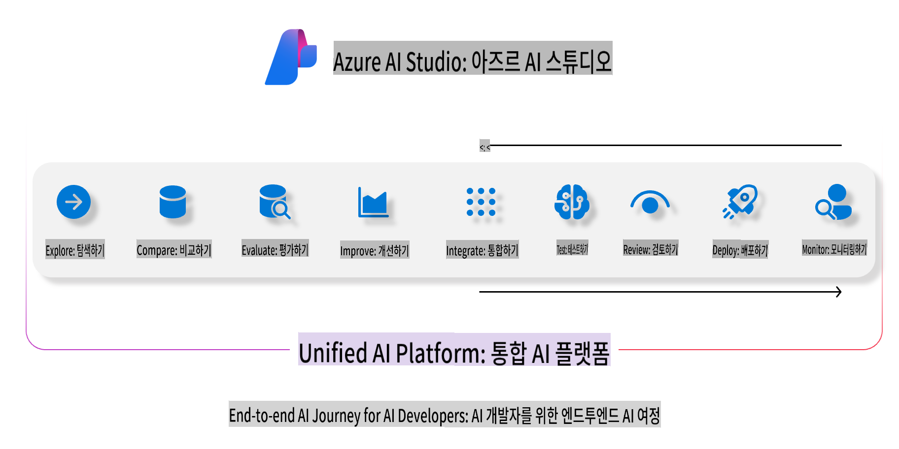
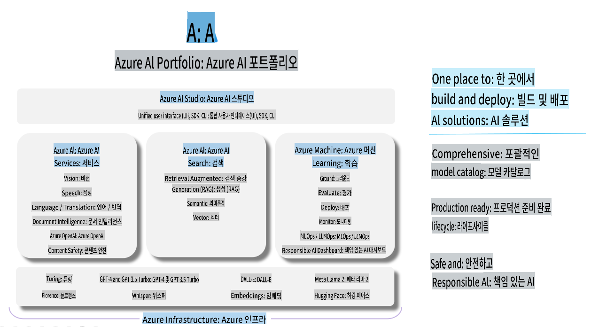

# **Azure AI Foundry를 사용한 평가**

[Azure AI Foundry](https://ai.azure.com?WT.mc_id=aiml-138114-kinfeylo)를 사용하여 생성형 AI 애플리케이션을 평가하는 방법입니다. 단일 대화 또는 다중 대화를 평가하든, Azure AI Foundry는 모델 성능과 안전성을 평가할 수 있는 도구를 제공합니다.

## Azure AI Foundry를 사용하여 생성형 AI 애플리케이션 평가하기
자세한 지침은 [Azure AI Foundry 문서](https://learn.microsoft.com/azure/ai-studio/how-to/evaluate-generative-ai-app?WT.mc_id=aiml-138114-kinfeylo)를 참조하세요.

다음은 시작하는 단계입니다:

## Azure AI Foundry에서 생성형 AI 모델 평가하기

**사전 요구사항**

- CSV 또는 JSON 형식의 테스트 데이터셋.
- 배포된 생성형 AI 모델(예: Phi-3, GPT 3.5, GPT 4, 또는 Davinci 모델).
- 평가를 실행할 컴퓨팅 인스턴스를 포함한 런타임.

## 내장된 평가 지표

Azure AI Foundry는 단일 대화와 복잡한 다중 대화를 모두 평가할 수 있습니다.  
모델이 특정 데이터에 기반한 Retrieval Augmented Generation (RAG) 시나리오에서는 내장된 평가 지표를 사용하여 성능을 평가할 수 있습니다.  
또한, 일반적인 단일 대화 질문 응답 시나리오(비 RAG)도 평가할 수 있습니다.

## 평가 실행 생성하기

Azure AI Foundry UI에서 Evaluate 페이지 또는 Prompt Flow 페이지로 이동합니다.  
평가 생성 마법사를 따라 평가 실행을 설정합니다. 평가에 대한 이름을 선택적으로 제공합니다.  
애플리케이션 목표에 맞는 시나리오를 선택합니다.  
모델 출력을 평가하기 위한 하나 이상의 평가 지표를 선택합니다.

## 사용자 정의 평가 흐름 (선택 사항)

더 큰 유연성을 위해 사용자 정의 평가 흐름을 설정할 수 있습니다.  
구체적인 요구사항에 맞게 평가 프로세스를 사용자 정의하세요.

## 결과 보기

평가 실행 후, Azure AI Foundry에서 상세한 평가 지표를 기록, 확인 및 분석합니다.  
애플리케이션의 역량과 한계에 대한 통찰을 얻으세요.

**참고** Azure AI Foundry는 현재 퍼블릭 프리뷰 상태로, 실험 및 개발 목적으로 사용하세요.  
프로덕션 워크로드의 경우 다른 옵션을 고려하십시오.  
자세한 정보와 단계별 지침은 공식 [AI Foundry 문서](https://learn.microsoft.com/azure/ai-studio/?WT.mc_id=aiml-138114-kinfeylo)를 확인하세요.

**면책 조항**:  
이 문서는 기계 기반 AI 번역 서비스를 사용하여 번역되었습니다. 정확성을 위해 노력하고 있지만, 자동 번역에는 오류나 부정확성이 포함될 수 있음을 유의하시기 바랍니다. 원문이 작성된 언어의 문서를 권위 있는 자료로 간주해야 합니다. 중요한 정보의 경우, 전문적인 인간 번역을 권장합니다. 이 번역 사용으로 인해 발생하는 오해나 잘못된 해석에 대해 당사는 책임을 지지 않습니다.