# Azure AI Foundry에서 Prompt Flow를 활용한 커스텀 Phi-3 모델 미세 조정 및 통합

이 엔드 투 엔드(E2E) 샘플은 Microsoft Tech Community의 가이드 "[Azure AI Foundry에서 Prompt Flow를 활용한 커스텀 Phi-3 모델 미세 조정 및 통합](https://techcommunity.microsoft.com/t5/educator-developer-blog/fine-tune-and-integrate-custom-phi-3-models-with-prompt-flow-in/ba-p/4191726?WT.mc_id=aiml-137032-kinfeylo)"를 기반으로 작성되었습니다. 이 가이드는 Azure AI Foundry에서 Prompt Flow를 활용해 커스텀 Phi-3 모델을 미세 조정, 배포 및 통합하는 과정을 소개합니다.  
로컬 환경에서 코드를 실행했던 "[Prompt Flow를 활용한 Phi-3 모델 미세 조정 및 통합](./E2E_Phi-3-FineTuning_PromptFlow_Integration.md)" 샘플과 달리, 본 튜토리얼은 Azure AI / ML Studio 내에서 모델을 미세 조정하고 통합하는 데 중점을 둡니다.

## 개요

이 E2E 샘플에서는 Azure AI Foundry에서 Prompt Flow를 활용하여 Phi-3 모델을 미세 조정하고 통합하는 방법을 배웁니다. Azure AI / ML Studio를 활용하여 커스텀 AI 모델을 배포하고 활용하는 워크플로를 구축하게 됩니다. 이 샘플은 세 가지 시나리오로 나뉩니다:

**시나리오 1: Azure 리소스 설정 및 미세 조정 준비**

**시나리오 2: Phi-3 모델 미세 조정 및 Azure Machine Learning Studio에서 배포**

**시나리오 3: Prompt Flow와 통합 및 Azure AI Foundry에서 커스텀 모델과 채팅**

다음은 이 E2E 샘플의 개요입니다.

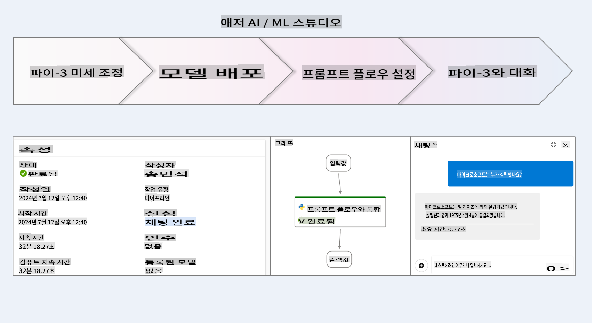

### 목차

1. **[시나리오 1: Azure 리소스 설정 및 미세 조정 준비](../../../../../../md/02.Application/01.TextAndChat/Phi3)**
    - [Azure Machine Learning 작업 영역 생성](../../../../../../md/02.Application/01.TextAndChat/Phi3)
    - [Azure 구독에서 GPU 할당량 요청](../../../../../../md/02.Application/01.TextAndChat/Phi3)
    - [역할 할당 추가](../../../../../../md/02.Application/01.TextAndChat/Phi3)
    - [프로젝트 설정](../../../../../../md/02.Application/01.TextAndChat/Phi3)
    - [미세 조정을 위한 데이터셋 준비](../../../../../../md/02.Application/01.TextAndChat/Phi3)

1. **[시나리오 2: Phi-3 모델 미세 조정 및 Azure Machine Learning Studio에서 배포](../../../../../../md/02.Application/01.TextAndChat/Phi3)**
    - [Phi-3 모델 미세 조정](../../../../../../md/02.Application/01.TextAndChat/Phi3)
    - [미세 조정된 Phi-3 모델 배포](../../../../../../md/02.Application/01.TextAndChat/Phi3)

1. **[시나리오 3: Prompt Flow와 통합 및 Azure AI Foundry에서 커스텀 모델과 채팅](../../../../../../md/02.Application/01.TextAndChat/Phi3)**
    - [커스텀 Phi-3 모델을 Prompt Flow와 통합](../../../../../../md/02.Application/01.TextAndChat/Phi3)
    - [커스텀 Phi-3 모델과 채팅](../../../../../../md/02.Application/01.TextAndChat/Phi3)

## 시나리오 1: Azure 리소스 설정 및 미세 조정 준비

### Azure Machine Learning 작업 영역 생성

1. 포털 페이지 상단의 **검색창**에 *azure machine learning*을 입력하고 나타나는 옵션 중 **Azure Machine Learning**을 선택합니다.

    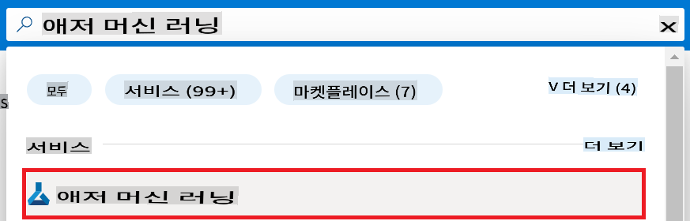

2. 탐색 메뉴에서 **+ 생성**을 선택합니다.

3. 탐색 메뉴에서 **새 작업 영역**을 선택합니다.

    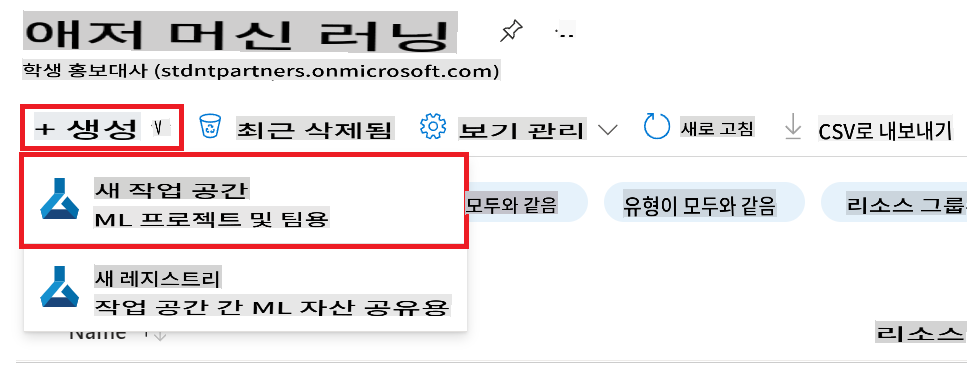

4. 다음 작업을 수행합니다:

    - Azure **구독**을 선택합니다.
    - 사용할 **리소스 그룹**을 선택합니다(필요한 경우 새로 생성).
    - **작업 영역 이름**을 입력합니다. 고유한 값이어야 합니다.
    - 사용할 **지역**을 선택합니다.
    - 사용할 **스토리지 계정**을 선택합니다(필요한 경우 새로 생성).
    - 사용할 **Key Vault**를 선택합니다(필요한 경우 새로 생성).
    - 사용할 **Application Insights**를 선택합니다(필요한 경우 새로 생성).
    - 사용할 **컨테이너 레지스트리**를 선택합니다(필요한 경우 새로 생성).

    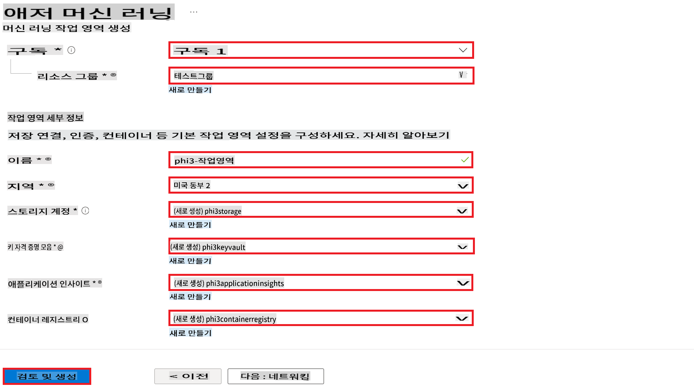

5. **검토 + 생성**을 선택합니다.

6. **생성**을 선택합니다.

### Azure 구독에서 GPU 할당량 요청

이 튜토리얼에서는 GPU를 사용하여 Phi-3 모델을 미세 조정하고 배포하는 방법을 배웁니다. 미세 조정을 위해 *Standard_NC24ads_A100_v4* GPU를 사용하며, 이는 할당량 요청이 필요합니다. 배포를 위해 *Standard_NC6s_v3* GPU를 사용하며, 이 역시 할당량 요청이 필요합니다.

> [!NOTE]
>
> GPU 할당은 Pay-As-You-Go 구독(표준 구독 유형)에서만 가능합니다. 혜택 구독은 현재 지원되지 않습니다.
>

1. [Azure ML Studio](https://ml.azure.com/home?wt.mc_id=studentamb_279723)를 방문합니다.

1. *Standard NCADSA100v4 Family* 할당량 요청을 위해 다음 작업을 수행합니다:

    - 왼쪽 탭에서 **할당량**을 선택합니다.
    - 사용할 **가상 머신 계열**을 선택합니다. 예: *Standard NCADSA100v4 Family Cluster Dedicated vCPUs*.
    - 탐색 메뉴에서 **할당량 요청**을 선택합니다.

        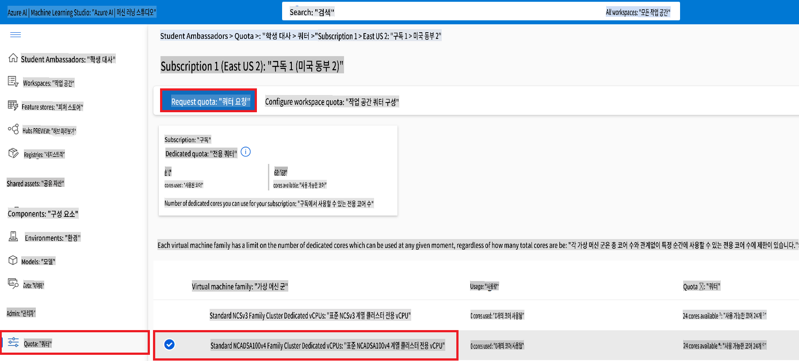

    - 요청 페이지에서 사용할 **새 코어 한도**를 입력합니다. 예: 24.
    - 요청 페이지에서 **제출**을 선택하여 GPU 할당량을 요청합니다.

1. *Standard NCSv3 Family* 할당량 요청을 위해 다음 작업을 수행합니다:

    - 왼쪽 탭에서 **할당량**을 선택합니다.
    - 사용할 **가상 머신 계열**을 선택합니다. 예: *Standard NCSv3 Family Cluster Dedicated vCPUs*.
    - 탐색 메뉴에서 **할당량 요청**을 선택합니다.
    - 요청 페이지에서 사용할 **새 코어 한도**를 입력합니다. 예: 24.
    - 요청 페이지에서 **제출**을 선택하여 GPU 할당량을 요청합니다.

### 역할 할당 추가

모델을 미세 조정하고 배포하려면 먼저 사용자 할당 관리 ID(UAI)를 생성하고 적절한 권한을 부여해야 합니다. 이 UAI는 배포 중 인증에 사용됩니다.

#### 사용자 할당 관리 ID(UAI) 생성

1. 포털 페이지 상단의 **검색창**에 *managed identities*를 입력하고 나타나는 옵션 중 **Managed Identities**를 선택합니다.

    

1. **+ 생성**을 선택합니다.

    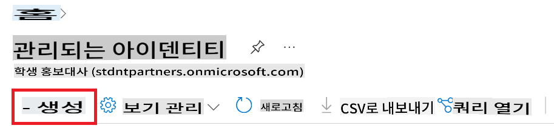

1. 다음 작업을 수행합니다:

    - Azure **구독**을 선택합니다.
    - 사용할 **리소스 그룹**을 선택합니다(필요한 경우 새로 생성).
    - 사용할 **지역**을 선택합니다.
    - **이름**을 입력합니다. 고유한 값이어야 합니다.

    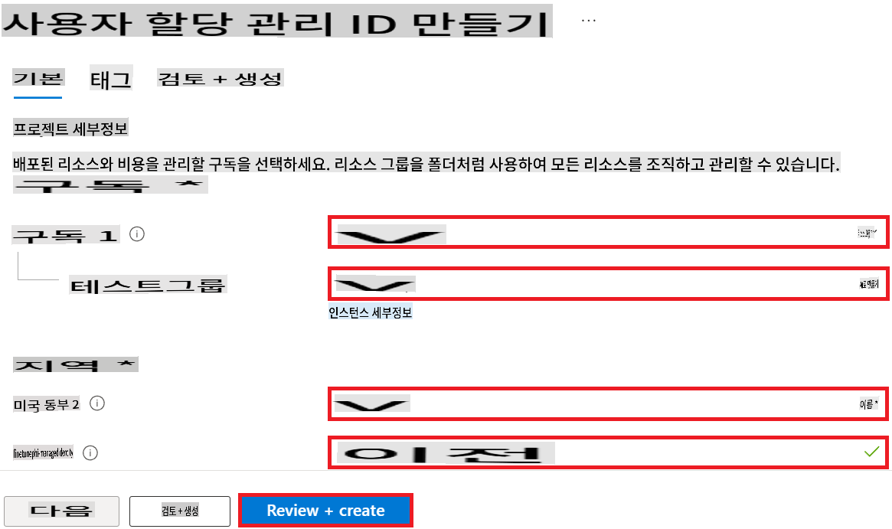

1. **검토 + 생성**을 선택합니다.

1. **+ 생성**을 선택합니다.

#### 관리 ID에 Contributor 역할 할당 추가

1. 생성한 관리 ID 리소스로 이동합니다.

1. 왼쪽 탭에서 **Azure 역할 할당**을 선택합니다.

1. 탐색 메뉴에서 **+ 역할 할당 추가**를 선택합니다.

1. 역할 할당 페이지에서 다음 작업을 수행합니다:
    - **범위**를 **리소스 그룹**으로 설정합니다.
    - Azure **구독**을 선택합니다.
    - 사용할 **리소스 그룹**을 선택합니다.
    - **역할**을 **Contributor**로 설정합니다.

    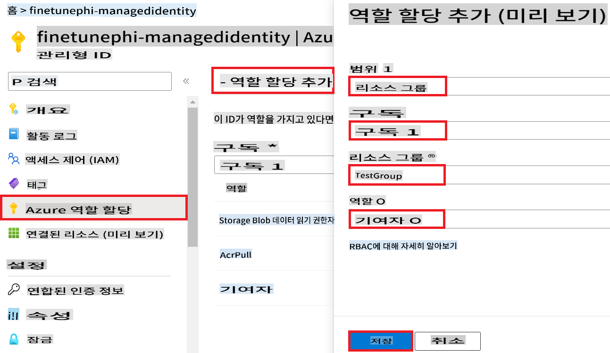

2. **저장**을 선택합니다.

#### 관리 ID에 Storage Blob Data Reader 역할 할당 추가

1. 포털 페이지 상단의 **검색창**에 *storage accounts*를 입력하고 나타나는 옵션 중 **Storage accounts**를 선택합니다.

    

1. 생성한 Azure Machine Learning 작업 영역과 연결된 스토리지 계정을 선택합니다. 예: *finetunephistorage*.

1. 역할 할당 페이지로 이동하려면 다음 작업을 수행합니다:

    - 생성한 Azure 스토리지 계정으로 이동합니다.
    - 왼쪽 탭에서 **액세스 제어(IAM)**를 선택합니다.
    - 탐색 메뉴에서 **+ 추가**를 선택합니다.
    - 탐색 메뉴에서 **역할 할당 추가**를 선택합니다.

    

1. 역할 할당 페이지에서 다음 작업을 수행합니다:

    - **역할** 페이지에서 *Storage Blob Data Reader*를 검색창에 입력하고 나타나는 옵션 중 **Storage Blob Data Reader**를 선택합니다.
    - **다음**을 선택합니다.
    - **멤버** 페이지에서 **액세스 할당 대상**을 **Managed identity**로 설정합니다.
    - **+ 멤버 선택**을 선택합니다.
    - **Managed identity**를 생성한 관리 ID로 설정합니다. 예: *finetunephi-managedidentity*.
    - **선택**을 클릭합니다.

    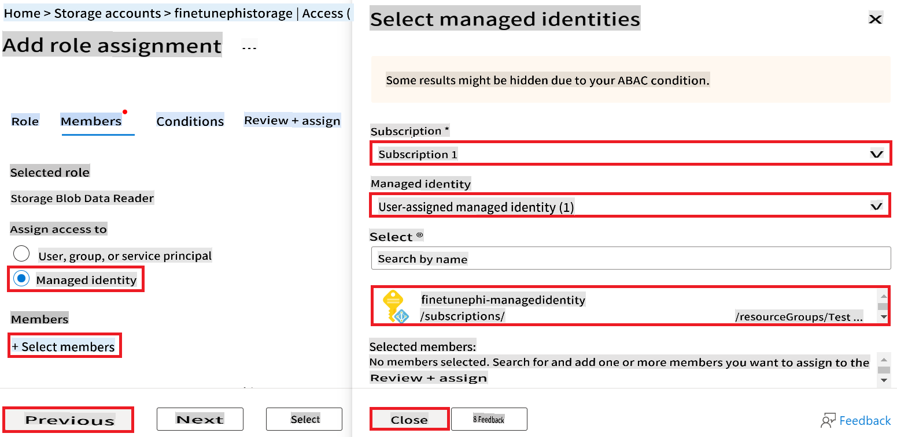

1. **검토 + 할당**을 선택합니다.

#### 관리 ID에 AcrPull 역할 할당 추가

1. 포털 페이지 상단의 **검색창**에 *container registries*를 입력하고 나타나는 옵션 중 **Container registries**를 선택합니다.

    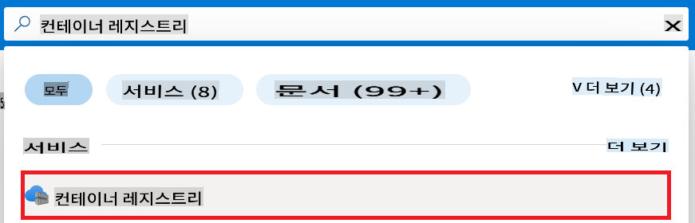

1. Azure Machine Learning 작업 영역과 연결된 컨테이너 레지스트리를 선택합니다. 예: *finetunephicontainerregistry*.

1. 역할 할당 페이지로 이동하려면 다음 작업을 수행합니다:

    - 왼쪽 탭에서 **액세스 제어(IAM)**를 선택합니다.
    - 탐색 메뉴에서 **+ 추가**를 선택합니다.
    - 탐색 메뉴에서 **역할 할당 추가**를 선택합니다.

1. 역할 할당 페이지에서 다음 작업을 수행합니다:

    - **역할** 페이지에서 *AcrPull*을 검색창에 입력하고 나타나는 옵션 중 **AcrPull**을 선택합니다.
    - **다음**을 선택합니다.
    - **멤버** 페이지에서 **액세스 할당 대상**을 **Managed identity**로 설정합니다.
    - **+ 멤버 선택**을 선택합니다.
    - **Managed identity**를 생성한 관리 ID로 설정합니다. 예: *finetunephi-managedidentity*.
    - **선택**을 클릭합니다.
    - **검토 + 할당**을 선택합니다.

### 프로젝트 설정

미세 조정에 필요한 데이터셋을 다운로드하려면 로컬 환경을 설정합니다.

이 연습에서는:

- 작업할 폴더를 생성합니다.
- 가상 환경을 생성합니다.
- 필요한 패키지를 설치합니다.
- 데이터셋 다운로드를 위한 *download_dataset.py* 파일을 생성합니다.

#### 작업할 폴더 생성

1. 터미널 창을 열고 다음 명령어를 입력하여 기본 경로에 *finetune-phi*라는 폴더를 생성합니다.

    ```console
    mkdir finetune-phi
    ```

2. 생성한 *finetune-phi* 폴더로 이동하려면 다음 명령어를 입력합니다.

    ```console
    cd finetune-phi
    ```

#### 가상 환경 생성

1. 다음 명령어를 입력하여 *.venv*라는 가상 환경을 생성합니다.

    ```console
    python -m venv .venv
    ```

2. 다음 명령어를 입력하여 가상 환경을 활성화합니다.

    ```console
    .venv\Scripts\activate.bat
    ```

> [!NOTE]
> 성공적으로 활성화되었다면 명령 프롬프트 앞에 *(.venv)*가 표시됩니다.

#### 필요한 패키지 설치

1. 다음 명령어를 입력하여 필요한 패키지를 설치합니다.

    ```console
    pip install datasets==2.19.1
    ```

#### `download_dataset.py` 생성

> [!NOTE]
> 폴더 구조 예시:
>
> ```text
> └── YourUserName
> .    └── finetune-phi
> .        └── download_dataset.py
> ```

1. **Visual Studio Code**를 엽니다.

1. 메뉴 바에서 **파일**을 선택합니다.

1. **폴더 열기**를 선택합니다.

1. 생성한 *finetune-phi* 폴더를 선택합니다. 예: *C:\Users\yourUserName\finetune-phi*.

    

1. Visual Studio Code의 왼쪽 창에서 마우스 오른쪽 버튼을 클릭한 후 **새 파일**을 선택하여 *download_dataset.py*라는 새 파일을 생성합니다.

    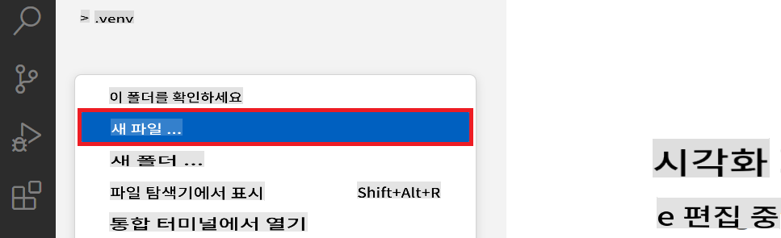

### 미세 조정을 위한 데이터셋 준비

이 연습에서는 *download_dataset.py* 파일을 실행하여 *ultrachat_200k* 데이터셋을 로컬 환경으로 다운로드합니다. 이후 이 데이터셋을 사용하여 Azure Machine Learning에서 Phi-3 모델을 미세 조정합니다.

이 연습에서는:

- *download_dataset.py* 파일에 데이터셋 다운로드 코드를 추가합니다.
- *download_dataset.py* 파일을 실행하여 데이터셋을 로컬 환경으로 다운로드합니다.

#### *download_dataset.py*를 사용하여 데이터셋 다운로드

1. Visual Studio Code에서 *download_dataset.py* 파일을 엽니다.

1. 아래 코드를 *download_dataset.py* 파일에 추가합니다.

    ```python
    import json
    import os
    from datasets import load_dataset

    def load_and_split_dataset(dataset_name, config_name, split_ratio):
        """
        Load and split a dataset.
        """
        # Load the dataset with the specified name, configuration, and split ratio
        dataset = load_dataset(dataset_name, config_name, split=split_ratio)
        print(f"Original dataset size: {len(dataset)}")
        
        # Split the dataset into train and test sets (80% train, 20% test)
        split_dataset = dataset.train_test_split(test_size=0.2)
        print(f"Train dataset size: {len(split_dataset['train'])}")
        print(f"Test dataset size: {len(split_dataset['test'])}")
        
        return split_dataset

    def save_dataset_to_jsonl(dataset, filepath):
        """
        Save a dataset to a JSONL file.
        """
        # Create the directory if it does not exist
        os.makedirs(os.path.dirname(filepath), exist_ok=True)
        
        # Open the file in write mode
        with open(filepath, 'w', encoding='utf-8') as f:
            # Iterate over each record in the dataset
            for record in dataset:
                # Dump the record as a JSON object and write it to the file
                json.dump(record, f)
                # Write a newline character to separate records
                f.write('\n')
        
        print(f"Dataset saved to {filepath}")

    def main():
        """
        Main function to load, split, and save the dataset.
        """
        # Load and split the ULTRACHAT_200k dataset with a specific configuration and split ratio
        dataset = load_and_split_dataset("HuggingFaceH4/ultrachat_200k", 'default', 'train_sft[:1%]')
        
        # Extract the train and test datasets from the split
        train_dataset = dataset['train']
        test_dataset = dataset['test']

        # Save the train dataset to a JSONL file
        save_dataset_to_jsonl(train_dataset, "data/train_data.jsonl")
        
        # Save the test dataset to a separate JSONL file
        save_dataset_to_jsonl(test_dataset, "data/test_data.jsonl")

    if __name__ == "__main__":
        main()

    ```

1. 터미널에서 다음 명령어를 입력하여 스크립트를 실행하고 데이터셋을 로컬 환경으로 다운로드합니다.

    ```console
    python download_dataset.py
    ```

1. 데이터셋이 로컬 *finetune-phi/data* 디렉토리에 성공적으로 저장되었는지 확인합니다.

> [!NOTE]
>
> #### 데이터셋 크기와 미세 조정 시간에 대한 참고 사항
>
> 이 튜토리얼에서는 데이터셋의 1%만 사용합니다(`split='train[:1%]'`). 이는 데이터 양을 크게 줄여 업로드 및 미세 조정 과정을 가속화합니다. 학습 시간과 모델 성능 간의 균형을 맞추기 위해 이 비율을 조정할 수 있습니다. 데이터셋의 작은 부분만 사용하면 미세 조정 시간이 단축되어 튜토리얼 과정이 보다 간단해집니다.

## 시나리오 2: Phi-3 모델 미세 조정 및 Azure Machine Learning Studio에서 배포

### Phi-3 모델 미세 조정

이 연습에서는 Azure Machine Learning Studio에서 Phi-3 모델을 미세 조정합니다.

이 연습에서는:

- 미세 조정을 위한 컴퓨팅 클러스터를 생성합니다.
- Azure Machine Learning Studio에서 Phi-3 모델을 미세 조정합니다.

#### 미세 조정을 위한 컴퓨팅 클러스터 생성
1. [Azure ML Studio](https://ml.azure.com/home?wt.mc_id=studentamb_279723)에 방문합니다.

1. 왼쪽 탭에서 **Compute**를 선택합니다.

1. 네비게이션 메뉴에서 **Compute clusters**를 선택합니다.

1. **+ New**를 선택합니다.

    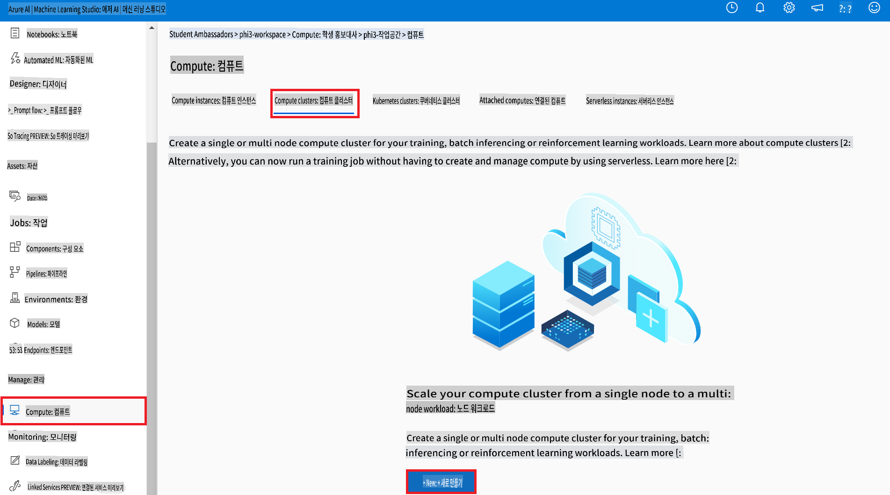

1. 다음 작업을 수행합니다:

    - 사용할 **Region**을 선택합니다.
    - **Virtual machine tier**를 **Dedicated**로 설정합니다.
    - **Virtual machine type**을 **GPU**로 설정합니다.
    - **Virtual machine size** 필터를 **Select from all options**로 설정합니다.
    - **Virtual machine size**를 **Standard_NC24ads_A100_v4**로 선택합니다.

    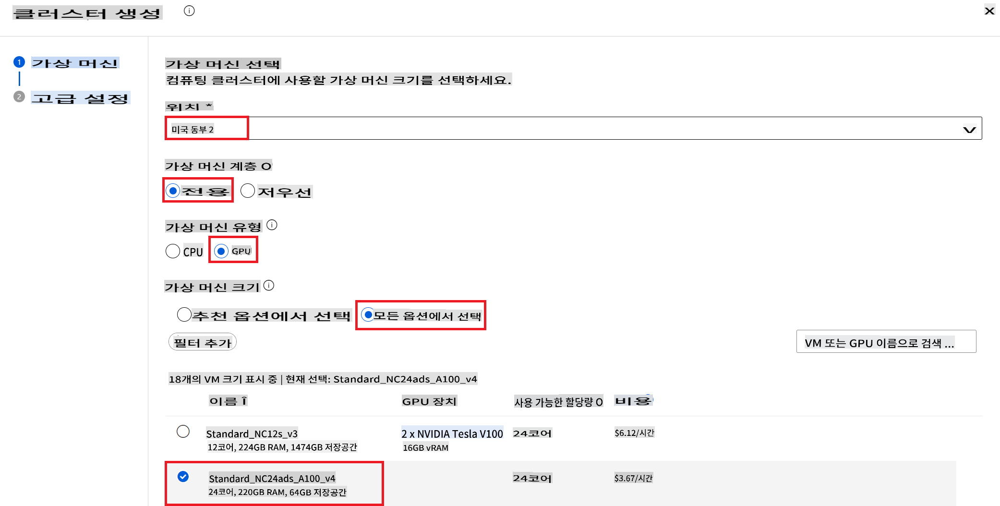

1. **Next**를 선택합니다.

1. 다음 작업을 수행합니다:

    - **Compute name**을 입력합니다. 고유한 값이어야 합니다.
    - **Minimum number of nodes**를 **0**으로 설정합니다.
    - **Maximum number of nodes**를 **1**로 설정합니다.
    - **Idle seconds before scale down**을 **120**으로 설정합니다.

    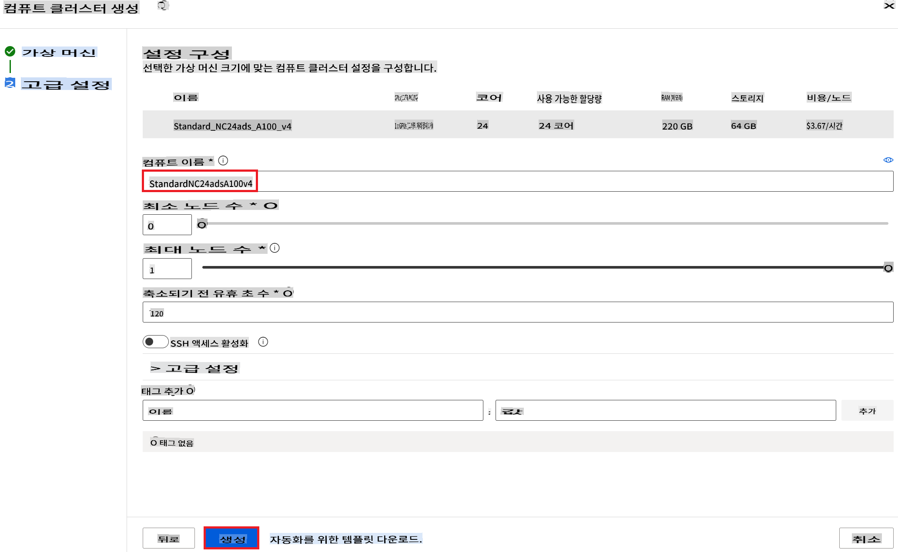

1. **Create**를 선택합니다.

#### Phi-3 모델 미세 조정하기

1. [Azure ML Studio](https://ml.azure.com/home?wt.mc_id=studentamb_279723)에 방문합니다.

1. 생성한 Azure Machine Learning 워크스페이스를 선택합니다.

    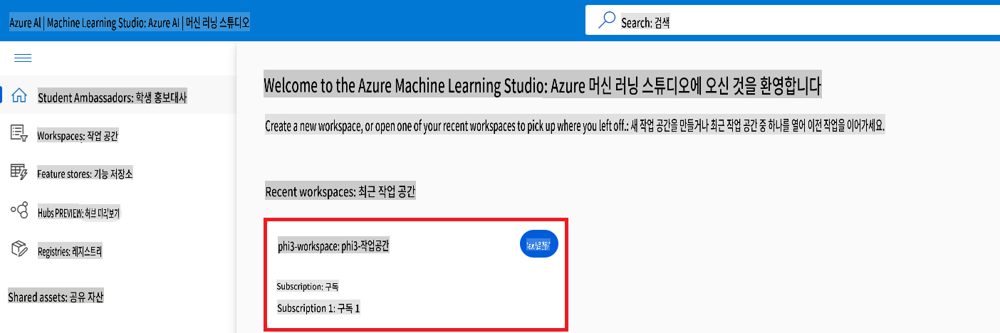

1. 다음 작업을 수행합니다:

    - 왼쪽 탭에서 **Model catalog**를 선택합니다.
    - **검색창**에 *phi-3-mini-4k*를 입력하고 나타나는 옵션 중 **Phi-3-mini-4k-instruct**를 선택합니다.

    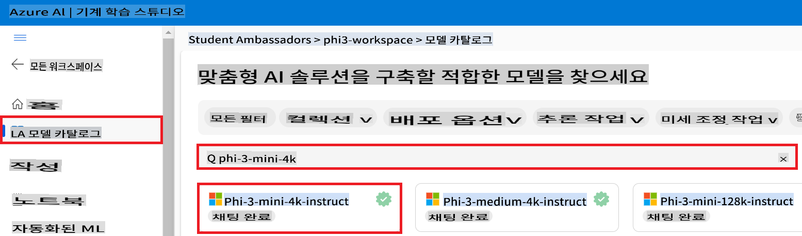

1. 네비게이션 메뉴에서 **Fine-tune**을 선택합니다.

    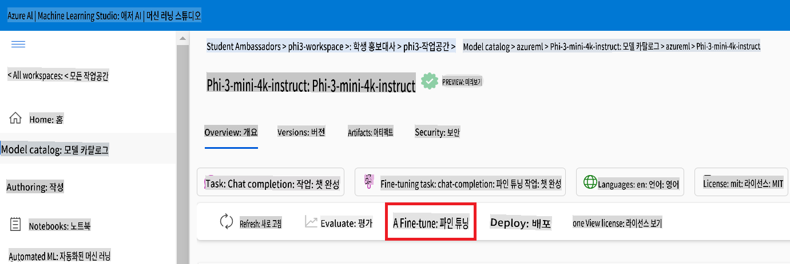

1. 다음 작업을 수행합니다:

    - **Select task type**을 **Chat completion**으로 설정합니다.
    - **+ Select data**를 선택하여 **Training data**를 업로드합니다.
    - 검증 데이터 업로드 유형을 **Provide different validation data**로 설정합니다.
    - **+ Select data**를 선택하여 **Validation data**를 업로드합니다.

    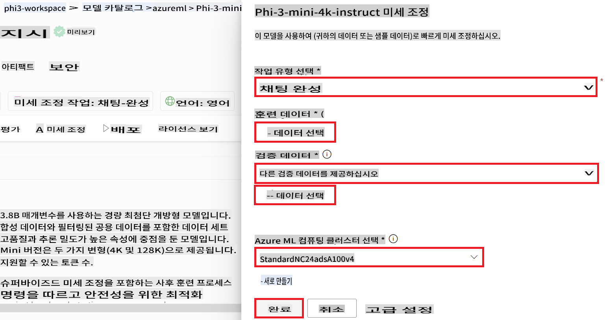

    > [!TIP]
    >
    > **Advanced settings**를 선택하여 **learning_rate**와 **lr_scheduler_type** 같은 설정을 사용자 정의하여 미세 조정 과정을 최적화할 수 있습니다.

1. **Finish**를 선택합니다.

1. 이 연습에서는 Azure Machine Learning을 사용하여 Phi-3 모델을 성공적으로 미세 조정했습니다. 미세 조정 작업은 상당한 시간이 소요될 수 있습니다. 미세 조정 작업 실행 후 완료될 때까지 기다려야 합니다. Azure Machine Learning 워크스페이스의 왼쪽 탭에서 Jobs 탭으로 이동하여 미세 조정 작업 상태를 모니터링할 수 있습니다. 다음 시리즈에서는 미세 조정된 모델을 배포하고 Prompt flow와 통합할 예정입니다.

    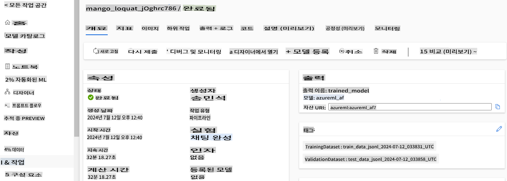

### 미세 조정된 Phi-3 모델 배포하기

미세 조정된 Phi-3 모델을 Prompt flow와 통합하려면 모델을 배포하여 실시간 추론에 사용할 수 있도록 해야 합니다. 이 과정에는 모델 등록, 온라인 엔드포인트 생성, 모델 배포가 포함됩니다.

이번 연습에서는:

- Azure Machine Learning 워크스페이스에 미세 조정된 모델을 등록합니다.
- 온라인 엔드포인트를 생성합니다.
- 등록된 미세 조정된 Phi-3 모델을 배포합니다.

#### 미세 조정된 모델 등록하기

1. [Azure ML Studio](https://ml.azure.com/home?wt.mc_id=studentamb_279723)에 방문합니다.

1. 생성한 Azure Machine Learning 워크스페이스를 선택합니다.

    

1. 왼쪽 탭에서 **Models**를 선택합니다.
1. **+ Register**를 선택합니다.
1. **From a job output**을 선택합니다.

    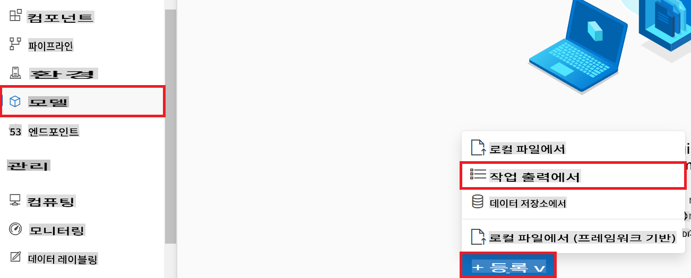

1. 생성한 작업을 선택합니다.

    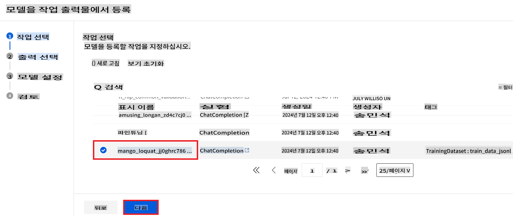

1. **Next**를 선택합니다.

1. **Model type**을 **MLflow**로 설정합니다.

1. **Job output**이 선택되어 있는지 확인합니다. 기본적으로 자동 선택되어 있어야 합니다.

    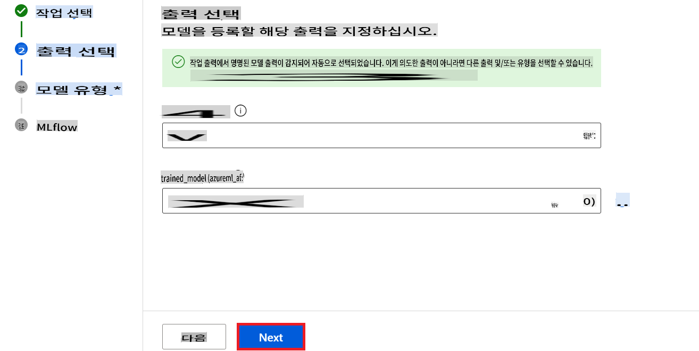

2. **Next**를 선택합니다.

3. **Register**를 선택합니다.

    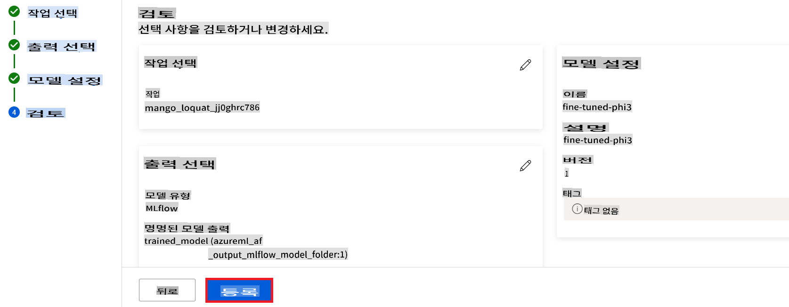

4. 왼쪽 탭에서 **Models** 메뉴로 이동하여 등록된 모델을 확인할 수 있습니다.

    

#### 미세 조정된 모델 배포하기

1. 생성한 Azure Machine Learning 워크스페이스로 이동합니다.

1. 왼쪽 탭에서 **Endpoints**를 선택합니다.

1. 네비게이션 메뉴에서 **Real-time endpoints**를 선택합니다.

    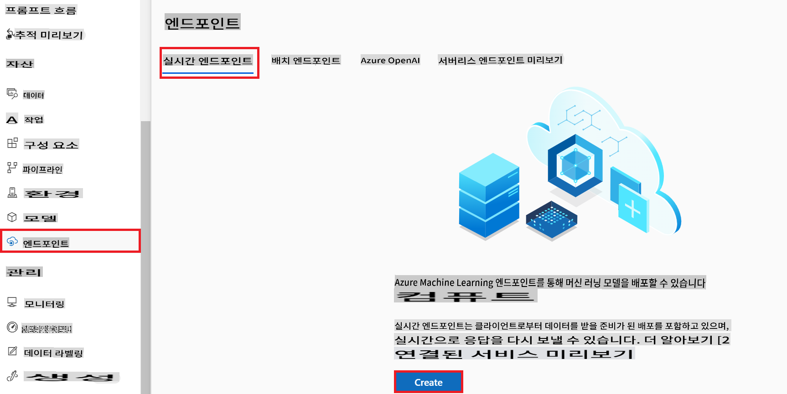

1. **Create**를 선택합니다.

1. 생성한 등록된 모델을 선택합니다.

    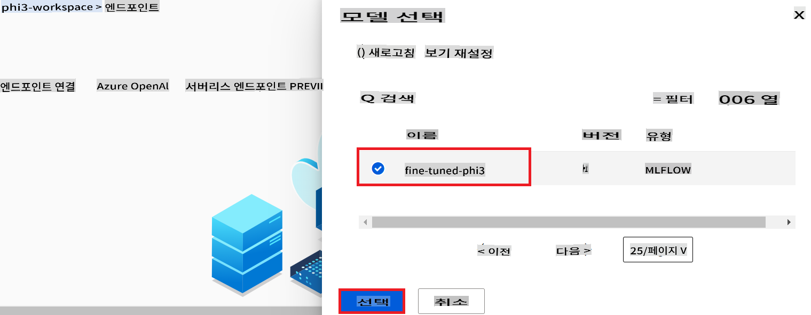

1. **Select**를 선택합니다.

1. 다음 작업을 수행합니다:

    - **Virtual machine**을 *Standard_NC6s_v3*로 선택합니다.
    - 사용할 **Instance count**를 선택합니다. 예: *1*.
    - **Endpoint**를 **New**로 설정하여 새로운 엔드포인트를 생성합니다.
    - **Endpoint name**을 입력합니다. 고유한 값이어야 합니다.
    - **Deployment name**을 입력합니다. 고유한 값이어야 합니다.

    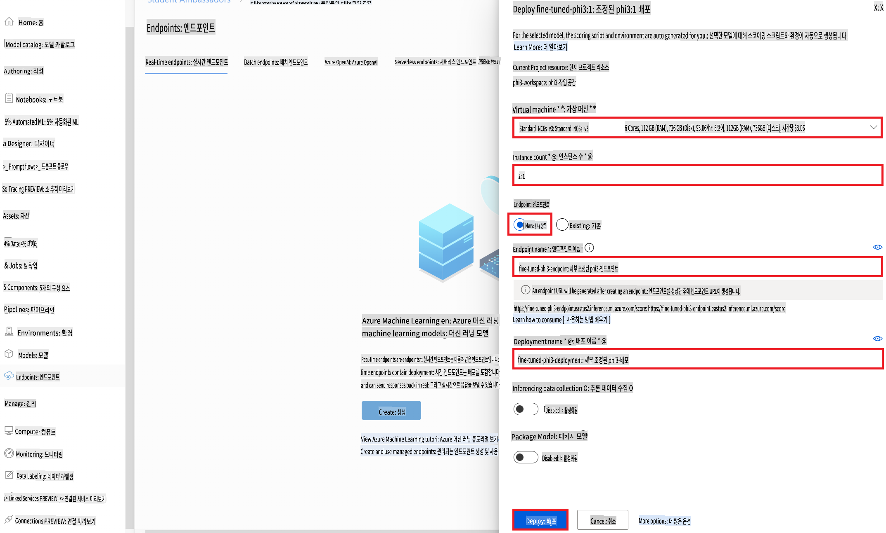

1. **Deploy**를 선택합니다.

> [!WARNING]
> 계정에 추가 요금이 발생하지 않도록 생성한 엔드포인트를 Azure Machine Learning 워크스페이스에서 삭제하세요.
>

#### Azure Machine Learning 워크스페이스에서 배포 상태 확인하기

1. 생성한 Azure Machine Learning 워크스페이스로 이동합니다.

1. 왼쪽 탭에서 **Endpoints**를 선택합니다.

1. 생성한 엔드포인트를 선택합니다.

    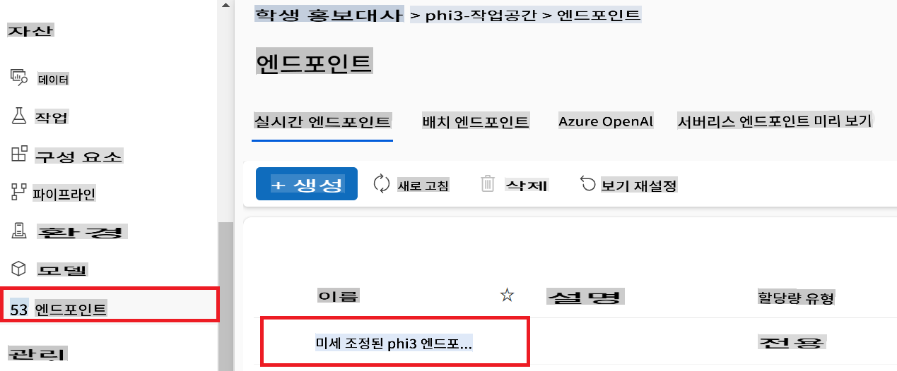

1. 이 페이지에서 배포 과정 중 엔드포인트를 관리할 수 있습니다.

> [!NOTE]
> 배포가 완료되면 **Live traffic**이 **100%**로 설정되어 있는지 확인하세요. 설정되어 있지 않다면 **Update traffic**을 선택하여 트래픽 설정을 조정하세요. 트래픽이 0%로 설정되어 있으면 모델을 테스트할 수 없습니다.
>
> 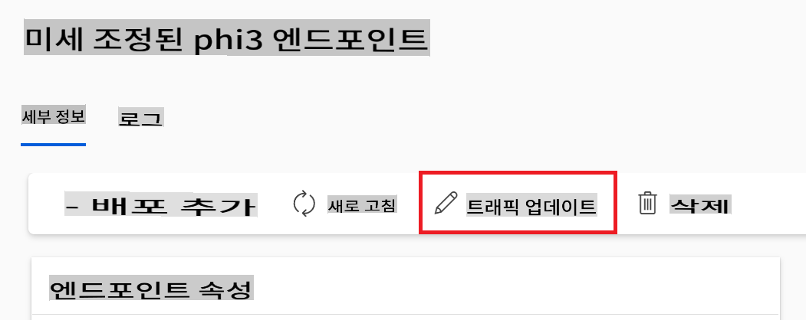
>

## 시나리오 3: Prompt flow와 통합하여 Azure AI Foundry에서 사용자 지정 모델과 대화하기

### 사용자 지정 Phi-3 모델을 Prompt flow와 통합하기

미세 조정된 모델을 성공적으로 배포한 후, 이제 Prompt flow와 통합하여 사용자 지정 Phi-3 모델을 실시간 애플리케이션에서 사용할 수 있습니다. 이를 통해 사용자 지정 Phi-3 모델과 다양한 상호작용 작업을 수행할 수 있습니다.

이번 연습에서는:

- Azure AI Foundry Hub 생성
- Azure AI Foundry Project 생성
- Prompt flow 생성
- 미세 조정된 Phi-3 모델을 위한 사용자 지정 연결 추가
- Prompt flow를 설정하여 사용자 지정 Phi-3 모델과 대화하기

> [!NOTE]
> Promptflow는 Azure ML Studio를 통해서도 통합할 수 있습니다. 동일한 통합 프로세스가 Azure ML Studio에도 적용됩니다.

#### Azure AI Foundry Hub 생성하기

Project를 생성하기 전에 Hub를 생성해야 합니다. Hub는 Resource Group과 비슷한 역할을 하며, Azure AI Foundry 내에서 여러 Project를 조직화하고 관리할 수 있도록 합니다.

1. [Azure AI Foundry](https://ai.azure.com/?WT.mc_id=aiml-137032-kinfeylo)에 방문합니다.

1. 왼쪽 탭에서 **All hubs**를 선택합니다.

1. 네비게이션 메뉴에서 **+ New hub**를 선택합니다.

    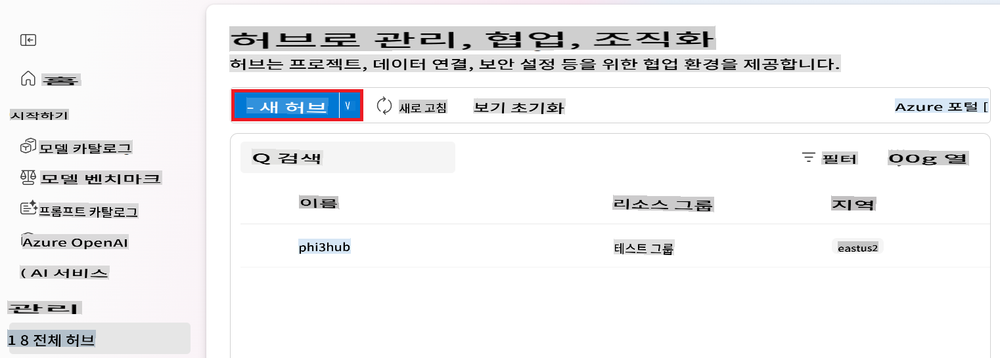

1. 다음 작업을 수행합니다:

    - **Hub name**을 입력합니다. 고유한 값이어야 합니다.
    - Azure **Subscription**을 선택합니다.
    - 사용할 **Resource group**을 선택합니다(필요시 새로 생성).
    - 사용할 **Location**을 선택합니다.
    - 사용할 **Connect Azure AI Services**를 선택합니다(필요시 새로 생성).
    - **Connect Azure AI Search**를 **Skip connecting**으로 설정합니다.

    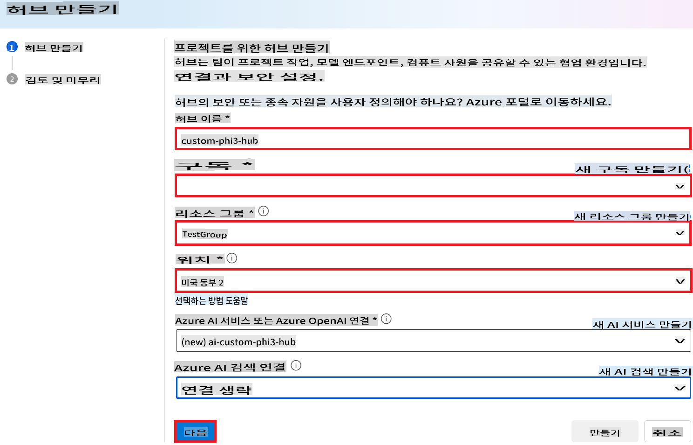

1. **Next**를 선택합니다.

#### Azure AI Foundry Project 생성하기

1. 생성한 Hub에서 왼쪽 탭에서 **All projects**를 선택합니다.

1. 네비게이션 메뉴에서 **+ New project**를 선택합니다.

    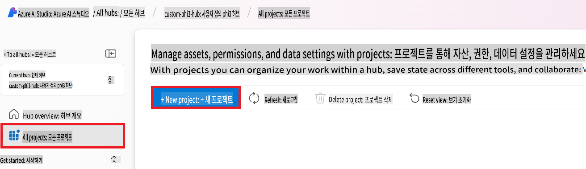

1. **Project name**을 입력합니다. 고유한 값이어야 합니다.

    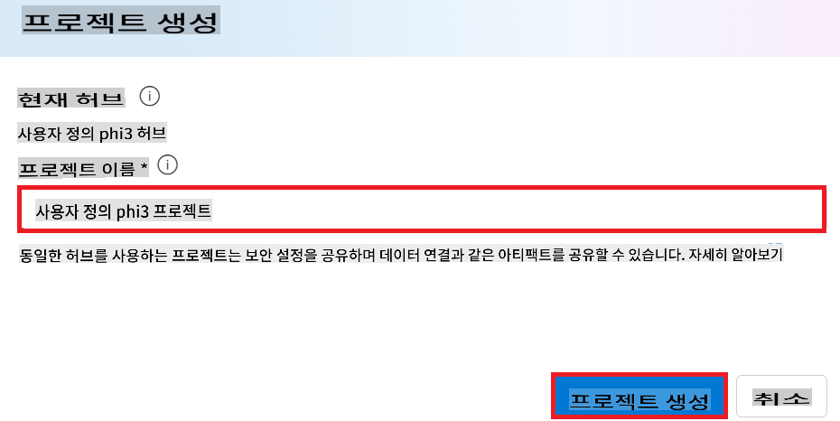

1. **Create a project**를 선택합니다.

#### 미세 조정된 Phi-3 모델을 위한 사용자 지정 연결 추가하기

사용자 지정 Phi-3 모델을 Prompt flow와 통합하려면 모델의 엔드포인트와 키를 사용자 지정 연결에 저장해야 합니다. 이를 통해 Prompt flow에서 사용자 지정 Phi-3 모델에 접근할 수 있습니다.

#### 미세 조정된 Phi-3 모델의 API 키와 엔드포인트 URI 설정하기

1. [Azure ML Studio](https://ml.azure.com/home?WT.mc_id=aiml-137032-kinfeylo)에 방문합니다.

1. 생성한 Azure Machine Learning 워크스페이스로 이동합니다.

1. 왼쪽 탭에서 **Endpoints**를 선택합니다.

    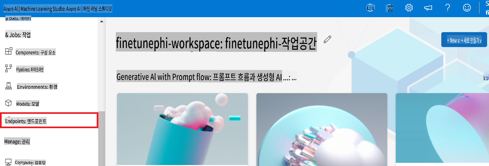

1. 생성한 엔드포인트를 선택합니다.

    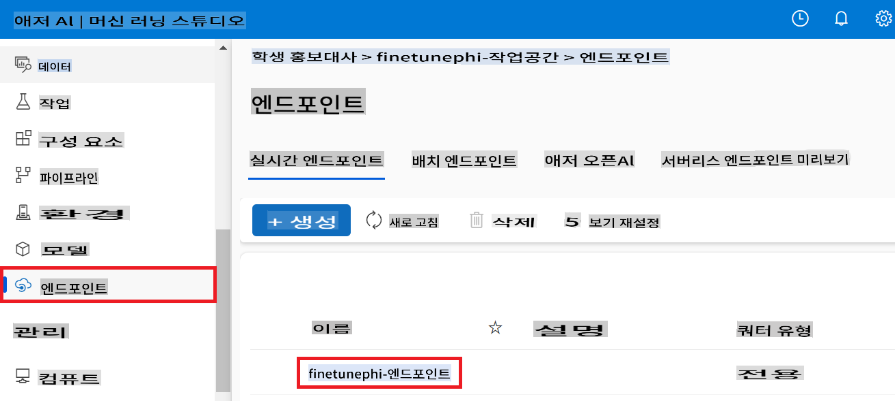

1. 네비게이션 메뉴에서 **Consume**을 선택합니다.

1. **REST endpoint**와 **Primary key**를 복사합니다.
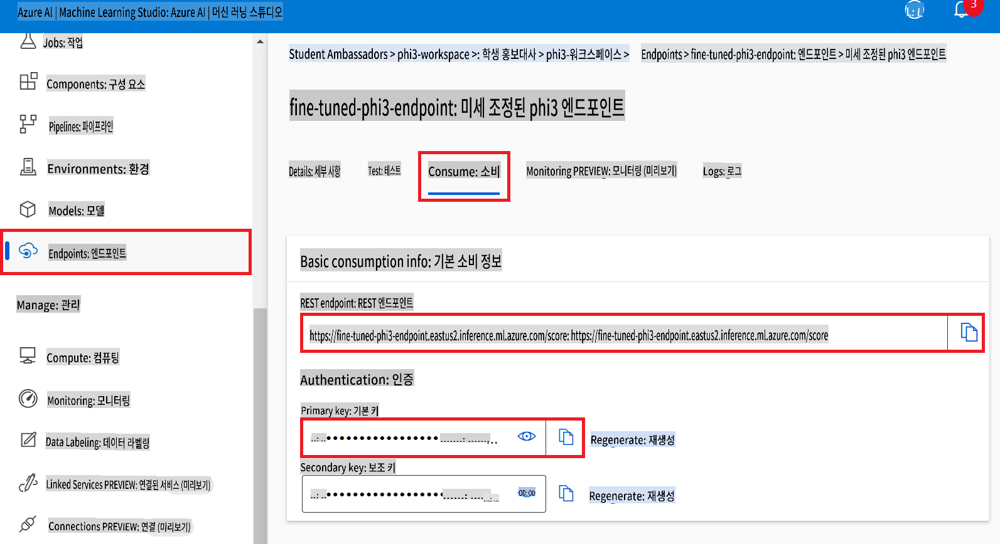

#### 사용자 지정 연결 추가하기

1. [Azure AI Foundry](https://ai.azure.com/?WT.mc_id=aiml-137032-kinfeylo)에 방문합니다.

1. 생성한 Azure AI Foundry 프로젝트로 이동합니다.

1. 생성한 프로젝트에서 왼쪽 탭에서 **Settings**를 선택합니다.

1. **+ New connection**을 선택합니다.

    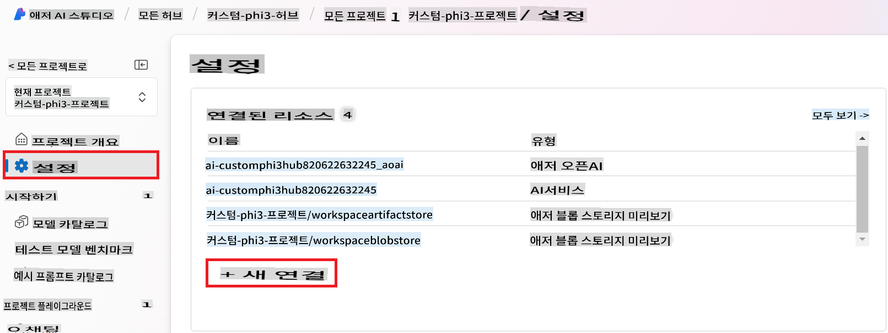

1. 탐색 메뉴에서 **Custom keys**를 선택합니다.

    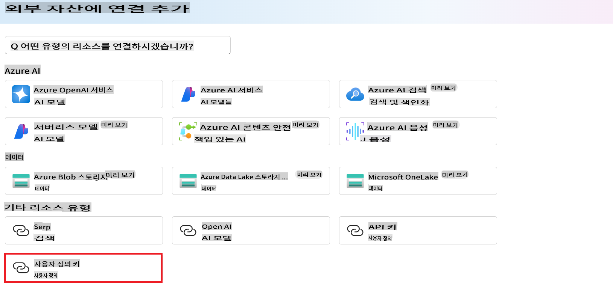

1. 다음 작업을 수행합니다:

    - **+ Add key value pairs**를 선택합니다.
    - 키 이름으로 **endpoint**를 입력하고, Azure ML Studio에서 복사한 엔드포인트를 값 필드에 붙여넣습니다.
    - 다시 **+ Add key value pairs**를 선택합니다.
    - 키 이름으로 **key**를 입력하고, Azure ML Studio에서 복사한 키를 값 필드에 붙여넣습니다.
    - 키를 추가한 후, 키가 노출되지 않도록 **is secret**을 선택합니다.

    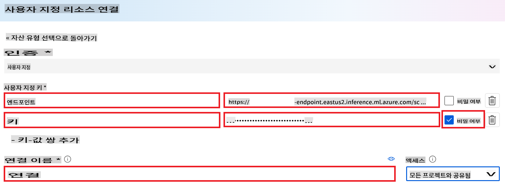

1. **Add connection**을 선택합니다.

#### 프롬프트 플로우 생성하기

Azure AI Foundry에 사용자 지정 연결을 추가했습니다. 이제 다음 단계를 따라 프롬프트 플로우를 생성해보겠습니다. 그런 다음, 이 프롬프트 플로우를 사용자 지정 연결에 연결하여 프롬프트 플로우 내에서 미세 조정된 모델을 사용할 수 있습니다.

1. 생성한 Azure AI Foundry 프로젝트로 이동합니다.

1. 왼쪽 탭에서 **Prompt flow**를 선택합니다.

1. 탐색 메뉴에서 **+ Create**를 선택합니다.

    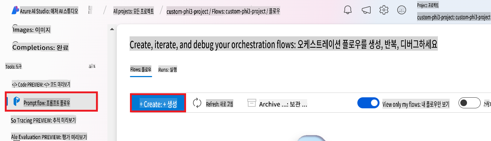

1. 탐색 메뉴에서 **Chat flow**를 선택합니다.

    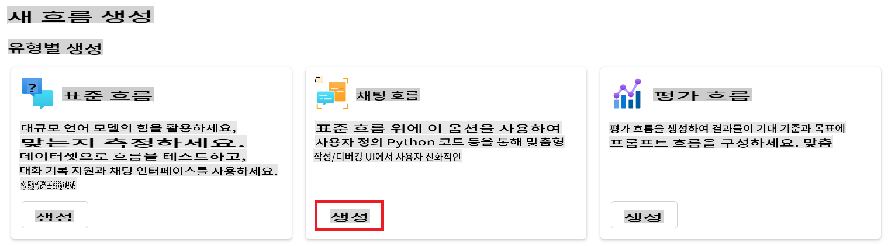

1. 사용할 **Folder name**을 입력합니다.

    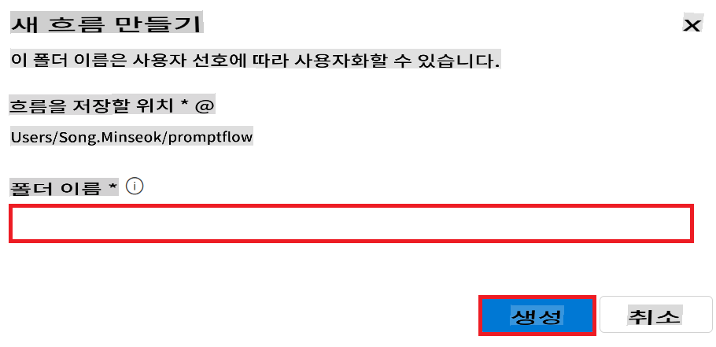

2. **Create**를 선택합니다.

#### 사용자 지정 Phi-3 모델과 채팅할 수 있도록 프롬프트 플로우 설정하기

미세 조정된 Phi-3 모델을 프롬프트 플로우에 통합해야 합니다. 그러나 기존 프롬프트 플로우는 이 목적에 맞게 설계되지 않았습니다. 따라서 사용자 지정 모델 통합이 가능하도록 프롬프트 플로우를 새롭게 설계해야 합니다.

1. 프롬프트 플로우에서 기존 플로우를 재구성하기 위해 다음 작업을 수행합니다:

    - **Raw file mode**를 선택합니다.
    - *flow.dag.yml* 파일의 기존 코드를 모두 삭제합니다.
    - 다음 코드를 *flow.dag.yml* 파일에 추가합니다.

        ```yml
        inputs:
          input_data:
            type: string
            default: "Who founded Microsoft?"

        outputs:
          answer:
            type: string
            reference: ${integrate_with_promptflow.output}

        nodes:
        - name: integrate_with_promptflow
          type: python
          source:
            type: code
            path: integrate_with_promptflow.py
          inputs:
            input_data: ${inputs.input_data}
        ```

    - **Save**를 선택합니다.

    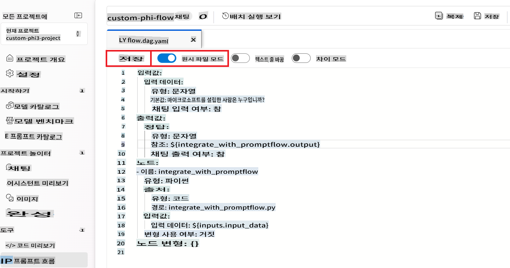

1. 사용자 지정 Phi-3 모델을 프롬프트 플로우에서 사용하려면 다음 코드를 *integrate_with_promptflow.py* 파일에 추가합니다.

    ```python
    import logging
    import requests
    from promptflow import tool
    from promptflow.connections import CustomConnection

    # Logging setup
    logging.basicConfig(
        format="%(asctime)s - %(levelname)s - %(name)s - %(message)s",
        datefmt="%Y-%m-%d %H:%M:%S",
        level=logging.DEBUG
    )
    logger = logging.getLogger(__name__)

    def query_phi3_model(input_data: str, connection: CustomConnection) -> str:
        """
        Send a request to the Phi-3 model endpoint with the given input data using Custom Connection.
        """

        # "connection" is the name of the Custom Connection, "endpoint", "key" are the keys in the Custom Connection
        endpoint_url = connection.endpoint
        api_key = connection.key

        headers = {
            "Content-Type": "application/json",
            "Authorization": f"Bearer {api_key}"
        }
        data = {
            "input_data": {
                "input_string": [
                    {"role": "user", "content": input_data}
                ],
                "parameters": {
                    "temperature": 0.7,
                    "max_new_tokens": 128
                }
            }
        }
        try:
            response = requests.post(endpoint_url, json=data, headers=headers)
            response.raise_for_status()
            
            # Log the full JSON response
            logger.debug(f"Full JSON response: {response.json()}")

            result = response.json()["output"]
            logger.info("Successfully received response from Azure ML Endpoint.")
            return result
        except requests.exceptions.RequestException as e:
            logger.error(f"Error querying Azure ML Endpoint: {e}")
            raise

    @tool
    def my_python_tool(input_data: str, connection: CustomConnection) -> str:
        """
        Tool function to process input data and query the Phi-3 model.
        """
        return query_phi3_model(input_data, connection)

    ```

    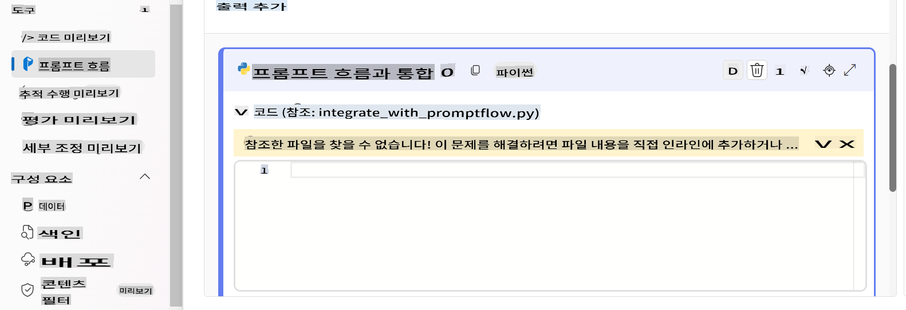

> [!NOTE]
> Azure AI Foundry에서 프롬프트 플로우 사용에 대한 자세한 내용은 [Prompt flow in Azure AI Foundry](https://learn.microsoft.com/azure/ai-studio/how-to/prompt-flow)를 참조하세요.

1. **Chat input**, **Chat output**을 선택하여 모델과 채팅을 활성화합니다.

    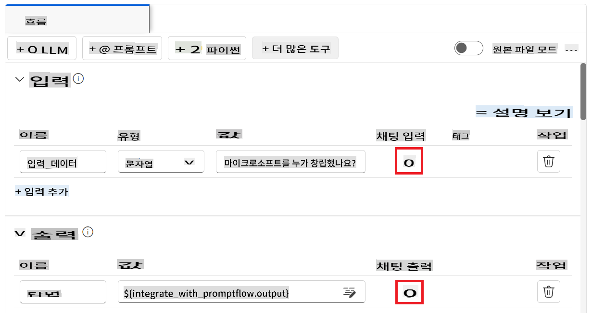

1. 이제 사용자 지정 Phi-3 모델과 채팅할 준비가 되었습니다. 다음 실습에서는 프롬프트 플로우를 시작하고 이를 사용하여 미세 조정된 Phi-3 모델과 채팅하는 방법을 배우게 됩니다.

> [!NOTE]
>
> 재구성된 플로우는 아래 이미지와 같아야 합니다:
>
> 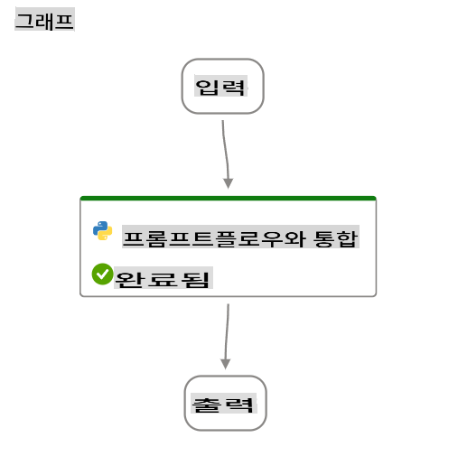
>

### 사용자 지정 Phi-3 모델과 채팅하기

이제 사용자 지정 Phi-3 모델을 미세 조정하고 이를 프롬프트 플로우에 통합했으므로, 모델과 상호작용을 시작할 준비가 되었습니다. 이 실습에서는 프롬프트 플로우를 설정하고 모델과 채팅을 시작하는 과정을 안내합니다. 이 단계를 따라 하면, 미세 조정된 Phi-3 모델의 기능을 다양한 작업과 대화에 완전히 활용할 수 있습니다.

- 프롬프트 플로우를 사용하여 사용자 지정 Phi-3 모델과 채팅하세요.

#### 프롬프트 플로우 시작하기

1. **Start compute sessions**를 선택하여 프롬프트 플로우를 시작합니다.

    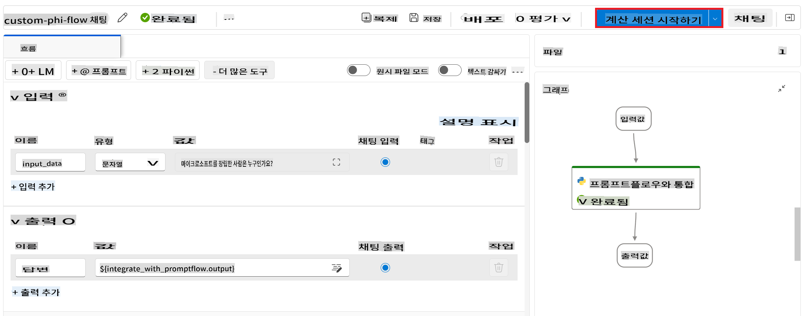

1. **Validate and parse input**을 선택하여 매개변수를 갱신합니다.

    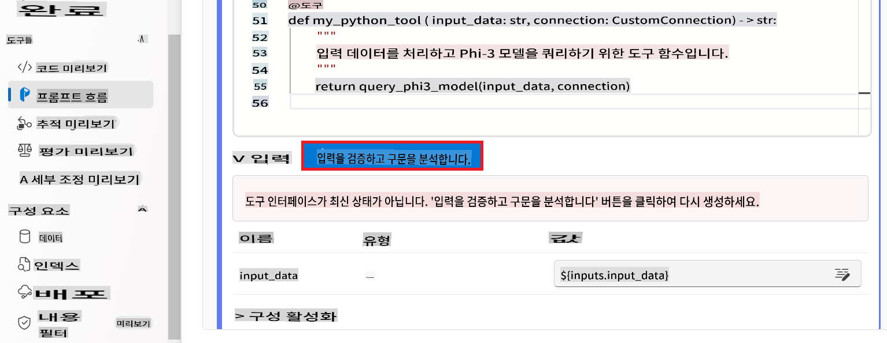

1. 생성한 사용자 지정 연결의 **connection** 값을 선택합니다. 예: *connection*.

    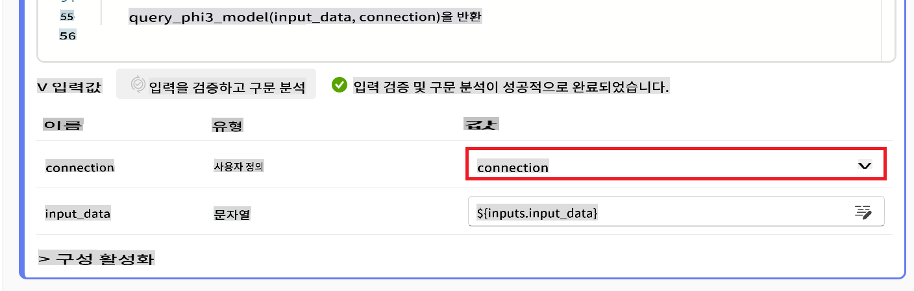

#### 사용자 지정 모델과 채팅하기

1. **Chat**을 선택합니다.

    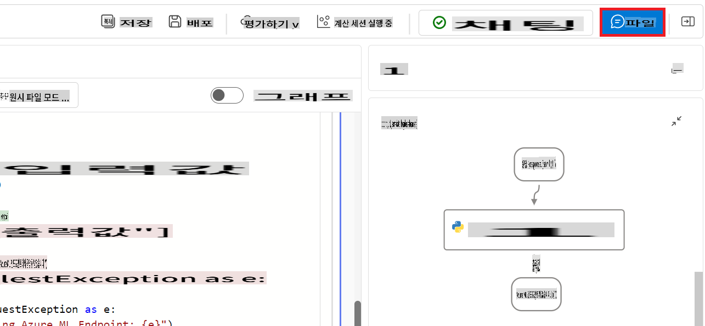

1. 다음은 결과 예시입니다: 이제 사용자 지정 Phi-3 모델과 채팅할 수 있습니다. 미세 조정에 사용된 데이터를 기반으로 질문하는 것이 권장됩니다.

    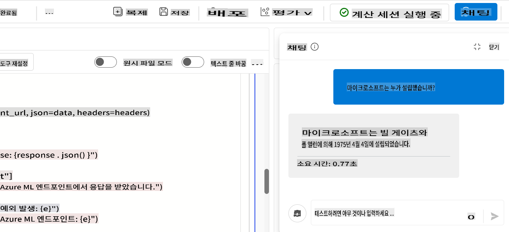

**면책 조항**:  
이 문서는 기계 기반 AI 번역 서비스를 사용하여 번역되었습니다. 정확성을 위해 최선을 다하고 있으나, 자동 번역에는 오류나 부정확성이 포함될 수 있습니다. 원본 문서(원어로 작성된 문서)를 신뢰할 수 있는 권위 있는 자료로 간주해야 합니다. 중요한 정보의 경우, 전문 번역가에 의한 번역을 권장합니다. 이 번역을 사용함으로 인해 발생하는 오해나 잘못된 해석에 대해 당사는 책임을 지지 않습니다.