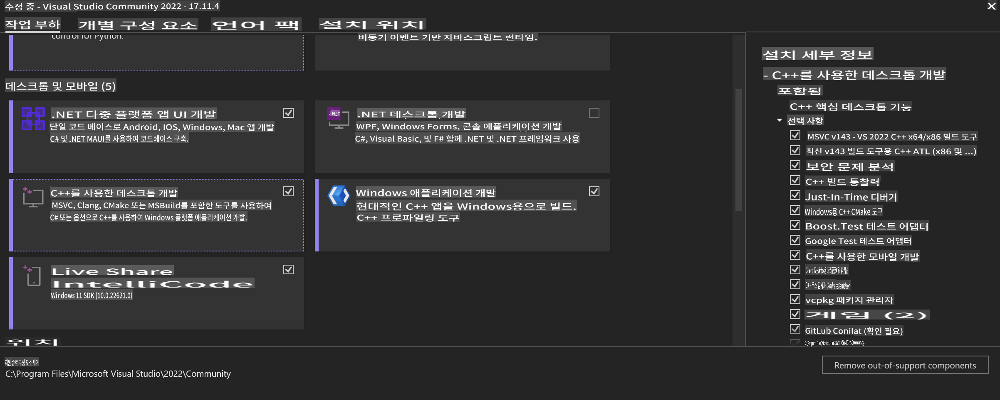
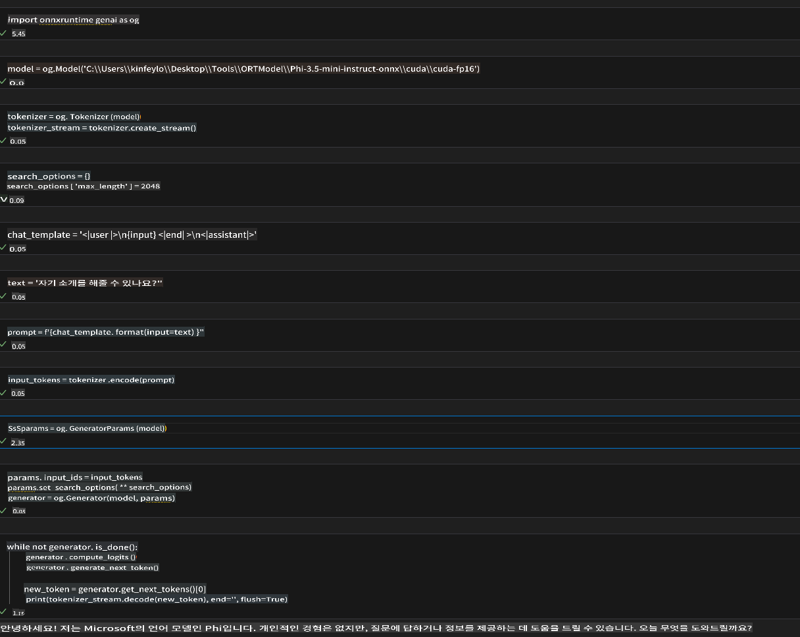

# **OnnxRuntime GenAI Windows GPU 가이드라인**

이 가이드라인은 Windows에서 GPU와 함께 ONNX Runtime(ORT)을 설정하고 사용하는 방법을 제공합니다. 모델의 성능과 효율성을 높이기 위해 GPU 가속을 활용하는 데 도움이 됩니다.

문서에서 다루는 내용은 다음과 같습니다:

- 환경 설정: CUDA, cuDNN, ONNX Runtime과 같은 필수 종속 항목 설치 방법
- 구성: GPU 리소스를 효과적으로 활용하기 위한 환경 및 ONNX Runtime 구성 방법
- 최적화 팁: 최적의 성능을 위해 GPU 설정을 세부 조정하는 방법

### **1. Python 3.10.x / 3.11.8**

   ***참고*** [miniforge](https://github.com/conda-forge/miniforge/releases/latest/download/Miniforge3-Windows-x86_64.exe)를 Python 환경으로 사용하는 것을 권장합니다.

   ```bash

   conda create -n pydev python==3.11.8

   conda activate pydev

   ```

   ***알림*** Python ONNX 라이브러리와 관련된 항목을 설치한 경우, 먼저 이를 제거하세요.

### **2. winget으로 CMake 설치**

   ```bash

   winget install -e --id Kitware.CMake

   ```

### **3. Visual Studio 2022 - C++ 데스크톱 개발 설치**

   ***참고*** 컴파일을 원하지 않는 경우 이 단계를 건너뛸 수 있습니다.



### **4. NVIDIA 드라이버 설치**

1. **NVIDIA GPU 드라이버** [https://www.nvidia.com/en-us/drivers/](https://www.nvidia.com/en-us/drivers/)

2. **NVIDIA CUDA 12.4** [https://developer.nvidia.com/cuda-12-4-0-download-archive](https://developer.nvidia.com/cuda-12-4-0-download-archive)

3. **NVIDIA CUDNN 9.4** [https://developer.nvidia.com/cudnn-downloads](https://developer.nvidia.com/cudnn-downloads)

***알림*** 설치 과정에서 기본 설정을 사용하세요.

### **5. NVIDIA 환경 설정**

NVIDIA CUDNN 9.4의 lib, bin, include 파일을 NVIDIA CUDA 12.4의 lib, bin, include 디렉터리로 복사합니다.

- *'C:\Program Files\NVIDIA\CUDNN\v9.4\bin\12.6'* 파일을 *'C:\Program Files\NVIDIA GPU Computing Toolkit\CUDA\v12.4\bin'*으로 복사

- *'C:\Program Files\NVIDIA\CUDNN\v9.4\include\12.6'* 파일을 *'C:\Program Files\NVIDIA GPU Computing Toolkit\CUDA\v12.4\include'*으로 복사

- *'C:\Program Files\NVIDIA\CUDNN\v9.4\lib\12.6'* 파일을 *'C:\Program Files\NVIDIA GPU Computing Toolkit\CUDA\v12.4\lib\x64'*으로 복사

### **6. Phi-3.5-mini-instruct-onnx 다운로드**

   ```bash

   winget install -e --id Git.Git

   winget install -e --id GitHub.GitLFS

   git lfs install

   git clone https://huggingface.co/microsoft/Phi-3.5-mini-instruct-onnx

   ```

### **7. InferencePhi35Instruct.ipynb 실행**

   [Notebook](../../../../../../code/09.UpdateSamples/Aug/ortgpu-phi35-instruct.ipynb)을 열고 실행합니다.



### **8. ORT GenAI GPU 컴파일**

   ***참고*** 
   
   1. 먼저 onnx, onnxruntime, onnxruntime-genai와 관련된 모든 항목을 제거하세요.

   ```bash

   pip list 
   
   ```

   그런 다음, 모든 onnxruntime 라이브러리를 제거합니다. 예:

   ```bash

   pip uninstall onnxruntime

   pip uninstall onnxruntime-genai

   pip uninstall onnxruntume-genai-cuda
   
   ```

   2. Visual Studio 확장 지원 확인

   C:\Program Files\NVIDIA GPU Computing Toolkit\CUDA\v12.4\extras에서 C:\Program Files\NVIDIA GPU Computing Toolkit\CUDA\v12.4\extras\visual_studio_integration 폴더가 있는지 확인하세요. 

   만약 없으면 다른 Cuda toolkit 드라이버 폴더를 확인한 뒤, visual_studio_integration 폴더와 내용을 C:\Program Files\NVIDIA GPU Computing Toolkit\CUDA\v12.4\extras\visual_studio_integration로 복사합니다.

   - 컴파일을 원하지 않는 경우 이 단계를 건너뛸 수 있습니다.

   ```bash

   git clone https://github.com/microsoft/onnxruntime-genai

   ```

   - [https://github.com/microsoft/onnxruntime/releases/download/v1.19.2/onnxruntime-win-x64-gpu-1.19.2.zip](https://github.com/microsoft/onnxruntime/releases/download/v1.19.2/onnxruntime-win-x64-gpu-1.19.2.zip) 다운로드

   - onnxruntime-win-x64-gpu-1.19.2.zip 파일을 압축 해제한 뒤 **ort**로 이름을 변경하고, ort 폴더를 onnxruntime-genai로 복사

   - Windows Terminal에서 VS 2022용 개발자 명령 프롬프트로 이동한 후 onnxruntime-genai로 이동


   - Python 환경에서 컴파일 실행

   ```bash

   cd onnxruntime-genai

   python build.py --use_cuda  --cuda_home "C:\Program Files\NVIDIA GPU Computing Toolkit\CUDA\v12.4" --config Release
 

   cd build/Windows/Release/Wheel

   pip install .whl

   ```

**면책 조항**:  
이 문서는 기계 기반 AI 번역 서비스를 사용하여 번역되었습니다. 정확성을 위해 노력하고 있지만, 자동 번역에는 오류나 부정확성이 포함될 수 있습니다. 원문이 작성된 언어의 문서를 신뢰할 수 있는 권위 있는 자료로 간주해야 합니다. 중요한 정보의 경우, 전문적인 인간 번역을 권장합니다. 이 번역 사용으로 인해 발생하는 오해나 잘못된 해석에 대해 당사는 책임을 지지 않습니다.