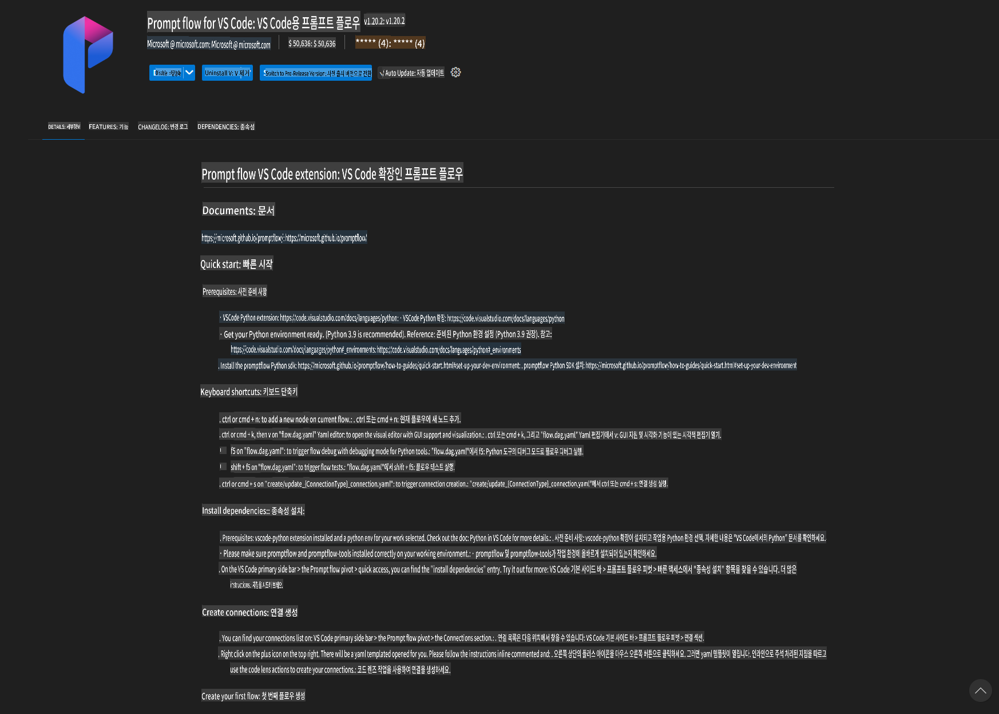
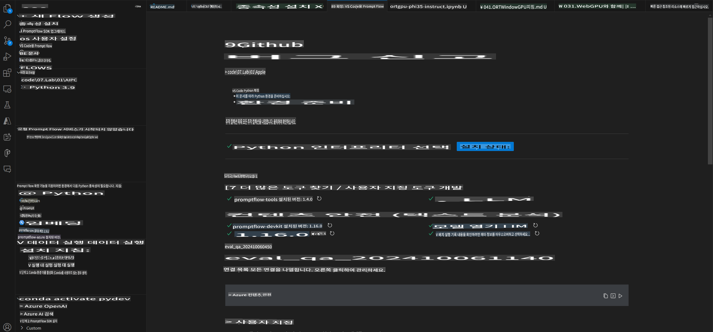
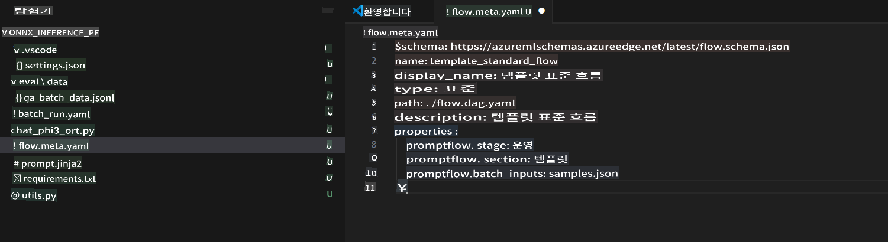
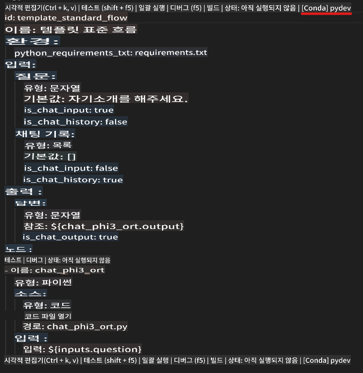
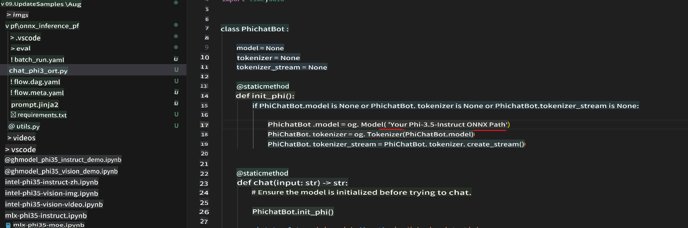
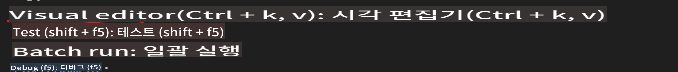
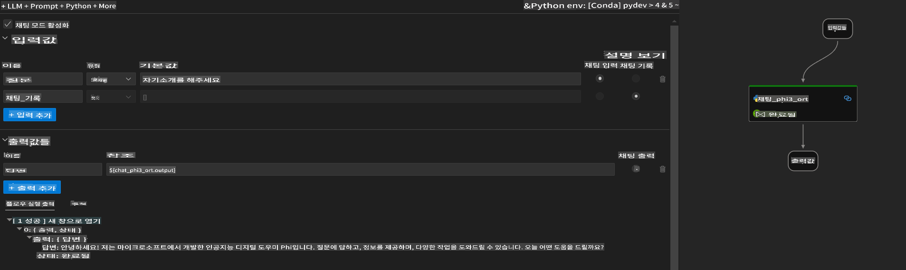
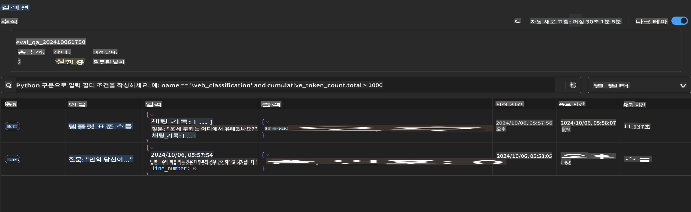

# Windows GPU를 사용하여 Phi-3.5-Instruct ONNX 기반 Prompt flow 솔루션 만들기

이 문서는 Phi-3 모델을 기반으로 AI 애플리케이션을 개발하기 위해 PromptFlow와 ONNX(Open Neural Network Exchange)를 사용하는 방법에 대한 예제입니다.

PromptFlow는 LLM(대규모 언어 모델) 기반 AI 애플리케이션의 아이디어 구상부터 프로토타입 제작, 테스트, 평가까지의 전체 개발 사이클을 간소화하도록 설계된 개발 도구 모음입니다.

PromptFlow와 ONNX를 통합하면 개발자는 다음과 같은 이점을 얻을 수 있습니다:

- **모델 성능 최적화**: ONNX를 활용하여 효율적인 모델 추론 및 배포 가능.
- **개발 간소화**: PromptFlow를 사용하여 워크플로를 관리하고 반복 작업을 자동화.
- **협업 강화**: 통합된 개발 환경을 제공하여 팀원 간의 협업을 촉진.

**Prompt flow**는 LLM 기반 AI 애플리케이션의 아이디어 구상, 프로토타입 제작, 테스트, 평가, 프로덕션 배포 및 모니터링까지의 전체 개발 사이클을 간소화하도록 설계된 개발 도구 모음입니다. 이를 통해 프롬프트 엔지니어링이 훨씬 쉬워지며, 프로덕션 품질의 LLM 애플리케이션을 구축할 수 있습니다.

Prompt flow는 OpenAI, Azure OpenAI Service, Huggingface, 로컬 LLM/SLM과 같은 맞춤형 모델에 연결할 수 있습니다. 우리는 Phi-3.5의 양자화된 ONNX 모델을 로컬 애플리케이션에 배포하고자 합니다. Prompt flow는 우리의 비즈니스 계획을 더 잘 수립하고 Phi-3.5를 기반으로 한 로컬 솔루션을 완성하는 데 도움을 줄 수 있습니다. 이 예제에서는 Windows GPU를 기반으로 ONNX Runtime GenAI Library를 결합하여 Prompt flow 솔루션을 완성할 것입니다.

## **설치**

### **Windows GPU용 ONNX Runtime GenAI**

Windows GPU용 ONNX Runtime GenAI 설정 가이드를 읽으려면 [여기를 클릭](./ORTWindowGPUGuideline.md)

### **VSCode에서 Prompt flow 설정**

1. Prompt flow VS Code 확장 설치



2. Prompt flow VS Code 확장을 설치한 후, 확장을 클릭하고 **Installation dependencies**를 선택하여 가이드에 따라 Prompt flow SDK를 환경에 설치



3. [샘플 코드](../../../../../../code/09.UpdateSamples/Aug/pf/onnx_inference_pf)를 다운로드하여 VS Code로 열기



4. **flow.dag.yaml**을 열어 Python 환경 선택



   **chat_phi3_ort.py**를 열어 Phi-3.5-instruct ONNX 모델 위치 변경



5. Prompt flow 실행 및 테스트

**flow.dag.yaml**을 열고 비주얼 에디터 클릭



이를 클릭한 후 실행하여 테스트



1. 터미널에서 배치를 실행하여 더 많은 결과 확인 가능


```bash

pf run create --file batch_run.yaml --stream --name 'Your eval qa name'    

```

기본 브라우저에서 결과를 확인할 수 있습니다.




**면책 조항**:  
이 문서는 AI 기반 기계 번역 서비스를 사용하여 번역되었습니다. 정확성을 위해 노력하고 있지만, 자동 번역에는 오류나 부정확성이 포함될 수 있습니다. 원본 문서(원어로 작성된 문서)를 권위 있는 출처로 간주해야 합니다. 중요한 정보에 대해서는 전문적인 인간 번역을 권장합니다. 이 번역 사용으로 인해 발생하는 오해나 잘못된 해석에 대해서는 당사가 책임을 지지 않습니다.