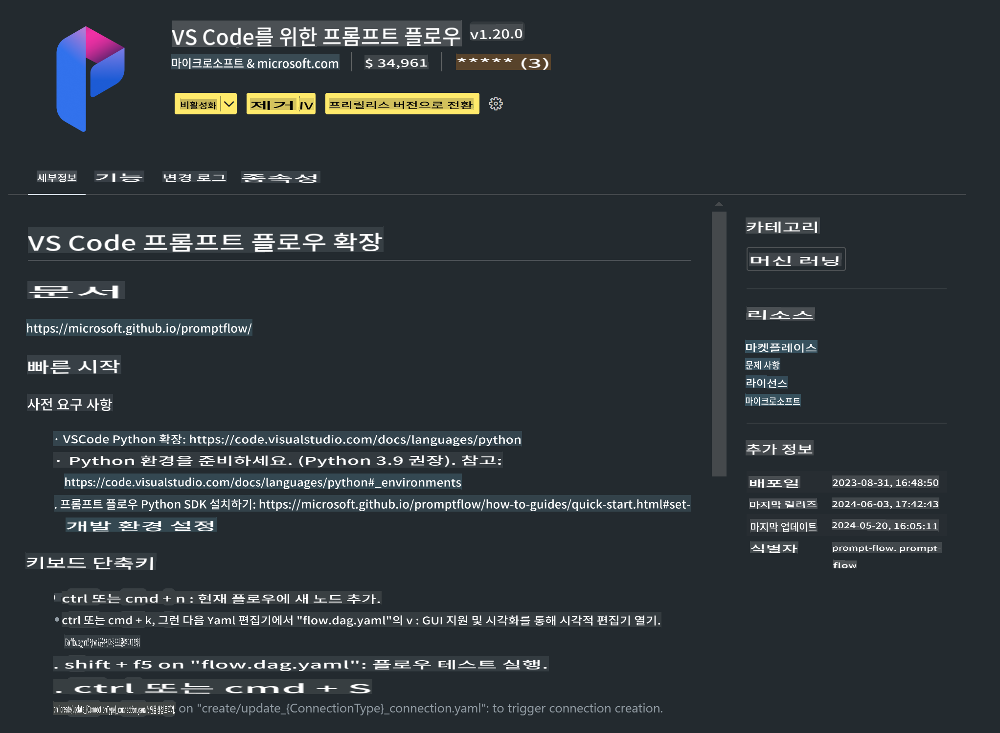

# **Lab 0 - 설치**

Lab에 들어가면 관련 환경을 구성해야 합니다:


### **1. Python 3.11+**

Python 환경을 구성하기 위해 miniforge를 사용하는 것을 권장합니다.

miniforge를 구성하려면 [https://github.com/conda-forge/miniforge](https://github.com/conda-forge/miniforge)를 참고하세요.

miniforge를 구성한 후, Power Shell에서 다음 명령어를 실행하세요.

```bash

conda create -n pyenv python==3.11.8 -y

conda activate pyenv

```


### **2. Prompt flow SDK 설치**

Lab 1에서는 Prompt flow를 사용하므로, Prompt flow SDK를 구성해야 합니다.

```bash

pip install promptflow --upgrade

```

Prompt flow SDK를 확인하려면 아래 명령어를 실행하세요.

```bash

pf --version

```


### **3. Visual Studio Code Prompt flow 확장 설치**




### **4. Apple's MLX Framework**

MLX는 Apple 실리콘에서 머신 러닝 연구를 위한 배열 프레임워크로, Apple 머신 러닝 연구팀에서 제공합니다. **Apple MLX 프레임워크**를 사용하면 Apple Silicon에서 LLM / SLM을 가속화할 수 있습니다. 더 알고 싶다면 [https://github.com/microsoft/PhiCookBook/blob/main/md/01.Introduction/03/MLX_Inference.md](https://github.com/microsoft/PhiCookBook/blob/main/md/01.Introduction/03/MLX_Inference.md)를 읽어보세요.

bash에서 MLX 프레임워크 라이브러리를 설치하세요.

```bash

pip install mlx-lm

```


### **5. 기타 Python 라이브러리**

requirements.txt를 생성하고 아래 내용을 추가하세요.

```txt

notebook
numpy 
scipy 
scikit-learn 
matplotlib 
pandas 
pillow 
graphviz

```


### **6. NVM 설치**

Powershell에서 nvm을 설치하세요.

```bash

brew install nvm

```

Node.js 18.20을 설치하세요.

```bash

nvm install 18.20.0

nvm use 18.20.0

```


### **7. Visual Studio Code 개발 지원 설치**

```bash

npm install --global yo generator-code

```

축하합니다! SDK 구성을 성공적으로 완료했습니다. 이제 실습 단계로 진행하세요.

**면책 조항**:  
이 문서는 기계 기반 AI 번역 서비스를 사용하여 번역되었습니다. 정확성을 위해 최선을 다하고 있으나, 자동 번역에는 오류나 부정확성이 포함될 수 있음을 유의하시기 바랍니다. 원본 문서의 원어 버전을 권위 있는 자료로 간주해야 합니다. 중요한 정보에 대해서는 전문적인 인간 번역을 권장합니다. 이 번역 사용으로 인해 발생하는 오해나 잘못된 해석에 대해 당사는 책임을 지지 않습니다.