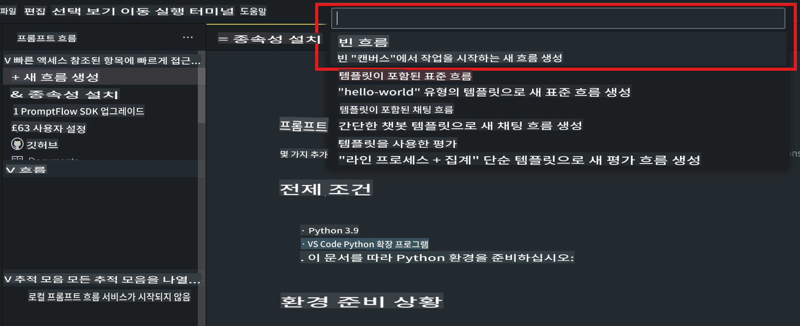
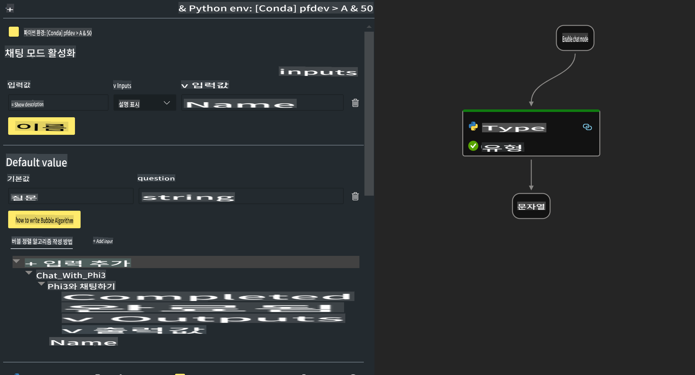

# **Lab 2 - AIPC에서 Phi-3-mini로 Prompt flow 실행하기**

## **Prompt flow란 무엇인가**

Prompt flow는 LLM 기반 AI 애플리케이션의 아이디어 구상, 프로토타이핑, 테스트, 평가부터 프로덕션 배포 및 모니터링까지의 전체 개발 주기를 간소화하기 위해 설계된 개발 도구 모음입니다. 이를 통해 프롬프트 엔지니어링이 훨씬 더 쉬워지며, 프로덕션 품질의 LLM 애플리케이션을 구축할 수 있습니다.

Prompt flow를 사용하면 다음과 같은 작업이 가능합니다:

- LLM, 프롬프트, Python 코드 및 기타 도구를 실행 가능한 워크플로로 연결하는 플로우를 생성할 수 있습니다.

- 특히 LLM과의 상호작용을 쉽게 디버그하고 반복적으로 개선할 수 있습니다.

- 플로우를 평가하고, 더 큰 데이터셋으로 품질 및 성능 지표를 계산할 수 있습니다.

- 테스트와 평가를 CI/CD 시스템에 통합하여 플로우의 품질을 보장할 수 있습니다.

- 선택한 서빙 플랫폼에 플로우를 배포하거나 애플리케이션 코드베이스에 쉽게 통합할 수 있습니다.

- (선택 사항이지만 강력히 권장) Azure AI의 클라우드 버전을 활용하여 팀과 협업할 수 있습니다.


## **Apple Silicon에서 코드 생성 플로우 구축하기**

***참고*** : 환경 설치를 완료하지 않았다면 [Lab 0 -Installations](./01.Installations.md)을 방문하세요.

1. Visual Studio Code에서 Prompt flow 확장을 열고 빈 플로우 프로젝트를 생성하세요.



2. 입력 및 출력 파라미터를 추가하고, Python 코드를 새 플로우로 추가하세요.



이 구조(flow.dag.yaml)를 참조하여 플로우를 구성할 수 있습니다.

```yaml

inputs:
  prompt:
    type: string
    default: Write python code for Fibonacci serie. Please use markdown as output
outputs:
  result:
    type: string
    reference: ${gen_code_by_phi3.output}
nodes:
- name: gen_code_by_phi3
  type: python
  source:
    type: code
    path: gen_code_by_phi3.py
  inputs:
    prompt: ${inputs.prompt}


```

3. phi-3-mini를 양자화하기

로컬 장치에서 SLM을 더 잘 실행하기를 원합니다. 일반적으로 모델을 양자화합니다(INT4, FP16, FP32).

```bash

python -m mlx_lm.convert --hf-path microsoft/Phi-3-mini-4k-instruct

```

**참고:** 기본 폴더는 mlx_model입니다.

4. ***Chat_With_Phi3.py***에 코드를 추가하세요.

```python


from promptflow import tool

from mlx_lm import load, generate


# The inputs section will change based on the arguments of the tool function, after you save the code
# Adding type to arguments and return value will help the system show the types properly
# Please update the function name/signature per need
@tool
def my_python_tool(prompt: str) -> str:

    model_id = './mlx_model_phi3_mini'

    model, tokenizer = load(model_id)

    # <|user|>\nWrite python code for Fibonacci serie. Please use markdown as output<|end|>\n<|assistant|>

    response = generate(model, tokenizer, prompt="<|user|>\n" + prompt  + "<|end|>\n<|assistant|>", max_tokens=2048, verbose=True)

    return response


```

4. Debug 또는 Run을 통해 플로우를 테스트하여 코드 생성이 제대로 되는지 확인하세요.


5. 터미널에서 개발 API로 플로우 실행하기

```

pf flow serve --source ./ --port 8080 --host localhost   

```

Postman / Thunder Client에서 테스트할 수 있습니다.


### **참고 사항**

1. 첫 실행은 시간이 오래 걸립니다. Hugging face CLI에서 phi-3 모델을 다운로드하는 것을 권장합니다.

2. Intel NPU의 제한된 컴퓨팅 성능을 고려하여 Phi-3-mini-4k-instruct를 사용하는 것이 좋습니다.

3. INT4 변환을 양자화하기 위해 Intel NPU 가속화를 사용하지만 서비스를 다시 실행하려면 캐시와 nc_workshop 폴더를 삭제해야 합니다.


## **리소스**

1. Promptflow 배우기 [https://microsoft.github.io/promptflow/](https://microsoft.github.io/promptflow/)

2. Intel NPU Acceleration 배우기 [https://github.com/intel/intel-npu-acceleration-library](https://github.com/intel/intel-npu-acceleration-library)

3. 샘플 코드 다운로드 [Local NPU Agent Sample Code](../../../../../../../../../code/07.Lab/01/AIPC/local-npu-agent)

**면책 조항**:  
이 문서는 기계 기반 AI 번역 서비스를 사용하여 번역되었습니다. 정확성을 위해 노력하고 있지만, 자동 번역에는 오류나 부정확성이 포함될 수 있습니다. 원어로 작성된 원본 문서를 신뢰할 수 있는 권위 있는 자료로 간주해야 합니다. 중요한 정보의 경우, 전문적인 인간 번역을 권장합니다. 이 번역 사용으로 인해 발생하는 오해나 잘못된 해석에 대해 당사는 책임을 지지 않습니다.