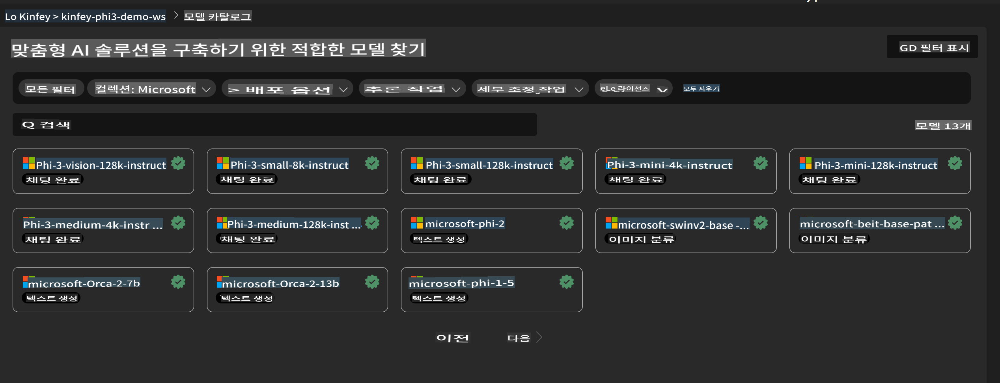
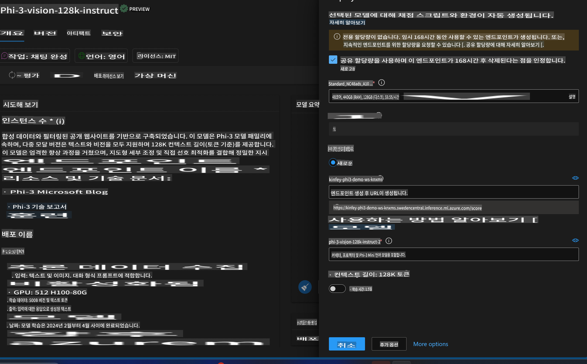
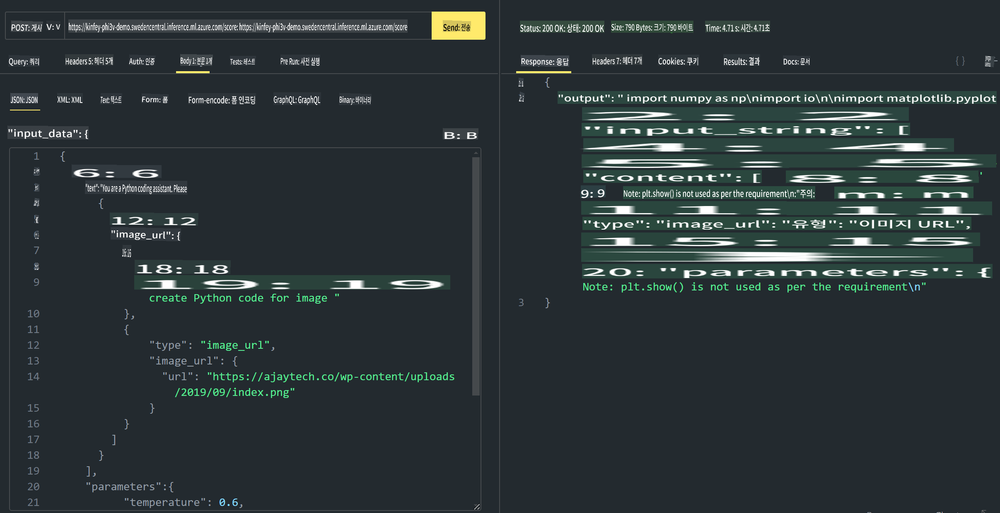

# **Lab 3 - Azure Machine Learning Service에 Phi-3-Vision 배포**

우리는 NPU를 사용하여 로컬 코드를 프로덕션 배포로 완성한 후, 이를 통해 PHI-3-VISION 기능을 도입하여 이미지를 코드로 생성하는 기능을 구현하고자 합니다.

이번 소개에서는 Azure Machine Learning Service에서 빠르게 Model As Service 형태의 Phi-3 Vision 서비스를 구축하는 방법을 알아보겠습니다.

***Note***: Phi-3 Vision은 콘텐츠를 더 빠르게 생성하기 위해 컴퓨팅 파워가 필요합니다. 이를 위해 클라우드 컴퓨팅 파워가 필요합니다.

### **1. Azure Machine Learning Service 생성**

Azure Portal에서 Azure Machine Learning Service를 생성해야 합니다. 생성 방법에 대한 자세한 내용은 다음 링크를 참조하세요: [https://learn.microsoft.com/azure/machine-learning/quickstart-create-resources?view=azureml-api-2](https://learn.microsoft.com/azure/machine-learning/quickstart-create-resources?view=azureml-api-2)

### **2. Azure Machine Learning Service에서 Phi-3 Vision 선택**



### **3. Azure에 Phi-3-Vision 배포**



### **4. Postman에서 Endpoint 테스트**



***Note***

1. 전달해야 할 매개변수에는 Authorization, azureml-model-deployment, Content-Type이 포함되어야 합니다. 이를 얻으려면 배포 정보를 확인해야 합니다.

2. 매개변수를 전달하려면 Phi-3-Vision은 이미지 링크를 전달해야 합니다. GPT-4-Vision 방식을 참고하여 매개변수를 전달하세요. 예를 들어:

```json

{
  "input_data":{
    "input_string":[
      {
        "role":"user",
        "content":[ 
          {
            "type": "text",
            "text": "You are a Python coding assistant.Please create Python code for image "
          },
          {
              "type": "image_url",
              "image_url": {
                "url": "https://ajaytech.co/wp-content/uploads/2019/09/index.png"
              }
          }
        ]
      }
    ],
    "parameters":{
          "temperature": 0.6,
          "top_p": 0.9,
          "do_sample": false,
          "max_new_tokens": 2048
    }
  }
}

```

3. Post 메서드를 사용하여 **/score**를 호출하세요.

**축하합니다**! 빠르게 PHI-3-VISION 배포를 완료하고, 이미지를 사용하여 코드를 생성하는 방법을 시도해 보았습니다. 이제 NPU와 클라우드를 결합하여 애플리케이션을 구축할 수 있습니다.

**면책 조항**:  
이 문서는 기계 기반 AI 번역 서비스를 사용하여 번역되었습니다. 정확성을 위해 최선을 다하고 있지만, 자동 번역에는 오류나 부정확성이 포함될 수 있음을 유의하시기 바랍니다. 원어로 작성된 원본 문서를 권위 있는 자료로 간주해야 합니다. 중요한 정보의 경우, 전문적인 인간 번역을 권장드립니다. 이 번역 사용으로 인해 발생하는 오해나 잘못된 해석에 대해 당사는 책임을 지지 않습니다.