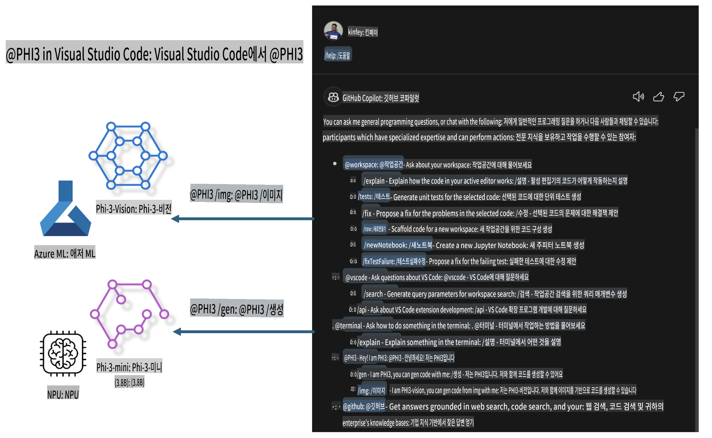

# **Microsoft Phi-3 패밀리로 Visual Studio Code GitHub Copilot Chat 직접 만들기**

GitHub Copilot Chat에서 워크스페이스 에이전트를 사용해 본 적이 있나요? 팀만의 코드 에이전트를 구축하고 싶으신가요? 이 실습에서는 오픈 소스 모델을 결합하여 엔터프라이즈 수준의 코드 비즈니스 에이전트를 구축하는 방법을 다룹니다.

## **기초**

### **Microsoft Phi-3를 선택하는 이유**

Phi-3는 다양한 훈련 파라미터를 기반으로 텍스트 생성, 대화 완성, 코드 생성 등을 지원하는 phi-3-mini, phi-3-small, phi-3-medium 시리즈로 구성된 패밀리입니다. 또한 Vision을 기반으로 한 phi-3-vision도 포함되어 있습니다. 이는 기업이나 다양한 팀이 오프라인 생성형 AI 솔루션을 구축하는 데 적합합니다.

추천 링크: [https://github.com/microsoft/PhiCookBook/blob/main/md/01.Introduction/01/01.PhiFamily.md](https://github.com/microsoft/PhiCookBook/blob/main/md/01.Introduction/01/01.PhiFamily.md)

### **Microsoft GitHub Copilot Chat**

GitHub Copilot Chat 확장은 채팅 인터페이스를 제공하여, VS Code 내에서 문서나 온라인 포럼을 검색하지 않고도 GitHub Copilot과 상호작용하며 코딩 관련 질문에 대한 답변을 받을 수 있습니다.

Copilot Chat은 구문 강조, 들여쓰기 및 기타 포맷팅 기능을 사용하여 생성된 응답을 더 명확하게 만듭니다. 사용자의 질문 유형에 따라, Copilot이 응답을 생성하는 데 사용한 소스 코드 파일이나 문서와 같은 컨텍스트에 대한 링크를 포함하거나 VS Code 기능에 접근할 수 있는 버튼을 결과에 포함할 수 있습니다.

- Copilot Chat은 개발자의 워크플로우에 통합되어 필요한 곳에서 도움을 제공합니다:

- 에디터나 터미널에서 직접 인라인 채팅을 시작하여 코딩 중 도움을 받을 수 있습니다.

- Chat 뷰를 사용하여 언제든지 AI 어시스턴트를 옆에 두고 도움을 받을 수 있습니다.

- Quick Chat을 실행하여 간단한 질문을 하고 작업으로 바로 복귀할 수 있습니다.

GitHub Copilot Chat은 다양한 시나리오에서 사용할 수 있습니다:

- 문제를 가장 잘 해결하는 방법에 대한 코딩 질문 답변

- 다른 사람의 코드를 설명하고 개선점을 제안

- 코드 수정 제안

- 유닛 테스트 케이스 생성

- 코드 문서화 생성

추천 링크: [https://code.visualstudio.com/docs/copilot/copilot-chat](https://code.visualstudio.com/docs/copilot/copilot-chat?WT.mc_id=aiml-137032-kinfeylo)

###  **Microsoft GitHub Copilot Chat @workspace**

Copilot Chat에서 **@workspace**를 참조하면 전체 코드베이스에 대해 질문할 수 있습니다. 질문에 따라 Copilot은 관련 파일과 심볼을 지능적으로 검색하여, 링크와 코드 예제로 답변을 제공합니다.

**@workspace**는 다음 소스들을 검색하여 질문에 답변합니다:

- .gitignore 파일에 의해 무시된 파일을 제외한 워크스페이스의 모든 파일

- 중첩된 폴더 및 파일 이름을 포함한 디렉토리 구조

- GitHub 저장소이고 코드 검색에 의해 인덱싱된 경우 GitHub의 코드 검색 인덱스

- 워크스페이스의 심볼 및 정의

- 현재 선택된 텍스트 또는 활성 에디터에 표시된 텍스트

참고: .gitignore는 무시된 파일을 열거나 텍스트를 선택한 경우 우회됩니다.

추천 링크: [https://code.visualstudio.com/docs/copilot/copilot-chat](https://code.visualstudio.com/docs/copilot/workspace-context?WT.mc_id=aiml-137032-kinfeylo)

## **이 실습에 대해 알아보기**

GitHub Copilot은 기업의 프로그래밍 효율성을 크게 향상시켰으며, 모든 기업은 GitHub Copilot의 관련 기능을 맞춤화하고 싶어 합니다. 많은 기업이 자체 비즈니스 시나리오와 오픈 소스 모델을 기반으로 GitHub Copilot과 유사한 확장을 맞춤화했습니다. 기업 입장에서는 맞춤화된 확장이 더 쉽게 제어되지만, 이는 사용자 경험에 영향을 미칠 수 있습니다. 결국 GitHub Copilot은 일반적인 시나리오와 전문성을 다루는 데 더 강력한 기능을 제공합니다. 경험을 일관되게 유지하면서 기업 고유의 확장을 맞춤화할 수 있다면 더 나은 사용자 경험이 될 것입니다. GitHub Copilot Chat은 기업이 Chat 경험에서 확장할 수 있는 관련 API를 제공합니다. 일관된 경험을 유지하면서 맞춤화된 기능을 갖추는 것이 더 나은 사용자 경험을 제공합니다.

이 실습에서는 Phi-3 모델을 로컬 NPU 및 Azure 하이브리드와 결합하여 GitHub Copilot Chat ***@PHI3***에서 맞춤형 에이전트를 구축하여 코드 생성 ***(@PHI3 /gen)*** 및 이미지를 기반으로 코드 생성 ***(@PHI3 /img)***을 지원합니다.

### ***참고:*** 

이 실습은 현재 Intel CPU와 Apple Silicon의 AIPC에서 구현됩니다. Qualcomm 버전의 NPU는 계속 업데이트될 예정입니다.

## **실습**

| 이름 | 설명 | AIPC | Apple |
| ------------ | ----------- | -------- |-------- |
| Lab0 - 설치(✅) | 관련 환경 및 설치 도구 구성 및 설치 | [Go](./HOL/AIPC/01.Installations.md) |[Go](./HOL/Apple/01.Installations.md) |
| Lab1 - Phi-3-mini로 프롬프트 플로우 실행(✅) | AIPC / Apple Silicon과 결합하여 로컬 NPU를 사용해 Phi-3-mini로 코드 생성 | [Go](./HOL/AIPC/02.PromptflowWithNPU.md) |  [Go](./HOL/Apple/02.PromptflowWithMLX.md) |
| Lab2 - Azure Machine Learning Service에 Phi-3-vision 배포(✅) | Azure Machine Learning Service의 모델 카탈로그 - Phi-3-vision 이미지를 배포하여 코드 생성 | [Go](./HOL/AIPC/03.DeployPhi3VisionOnAzure.md) |[Go](./HOL/Apple/03.DeployPhi3VisionOnAzure.md) |
| Lab3 - GitHub Copilot Chat에 @phi-3 에이전트 생성(✅)  | GitHub Copilot Chat에서 맞춤형 Phi-3 에이전트를 생성하여 코드 생성, 그래프 생성 코드, RAG 등을 수행 | [Go](./HOL/AIPC/04.CreatePhi3AgentInVSCode.md) | [Go](./HOL/Apple/04.CreatePhi3AgentInVSCode.md) |
| 샘플 코드 (✅)  | 샘플 코드 다운로드 | [Go](../../../../../../../code/07.Lab/01/AIPC) | [Go](../../../../../../../code/07.Lab/01/Apple) |

## **리소스**

1. Phi-3 Cookbook [https://github.com/microsoft/Phi-3CookBook](https://github.com/microsoft/Phi-3CookBook)

2. GitHub Copilot 자세히 알아보기 [https://learn.microsoft.com/training/paths/copilot/](https://learn.microsoft.com/training/paths/copilot/?WT.mc_id=aiml-137032-kinfeylo)

3. GitHub Copilot Chat 자세히 알아보기 [https://learn.microsoft.com/training/paths/accelerate-app-development-using-github-copilot/](https://learn.microsoft.com/training/paths/accelerate-app-development-using-github-copilot/?WT.mc_id=aiml-137032-kinfeylo)

4. GitHub Copilot Chat API 자세히 알아보기 [https://code.visualstudio.com/api/extension-guides/chat](https://code.visualstudio.com/api/extension-guides/chat?WT.mc_id=aiml-137032-kinfeylo)

5. Azure AI Foundry 자세히 알아보기 [https://learn.microsoft.com/training/paths/create-custom-copilots-ai-studio/](https://learn.microsoft.com/training/paths/create-custom-copilots-ai-studio/?WT.mc_id=aiml-137032-kinfeylo)

6. Azure AI Foundry의 모델 카탈로그 자세히 알아보기 [https://learn.microsoft.com/azure/ai-studio/how-to/model-catalog-overview](https://learn.microsoft.com/azure/ai-studio/how-to/model-catalog-overview)

**면책 조항**:  
이 문서는 기계 기반 AI 번역 서비스를 사용하여 번역되었습니다. 정확성을 위해 노력하고 있으나, 자동 번역에는 오류나 부정확성이 포함될 수 있음을 유의하시기 바랍니다. 원어로 작성된 원본 문서를 권위 있는 자료로 간주해야 합니다. 중요한 정보의 경우, 전문적인 인간 번역을 권장합니다. 이 번역 사용으로 인해 발생하는 오해나 잘못된 해석에 대해 당사는 책임을 지지 않습니다.