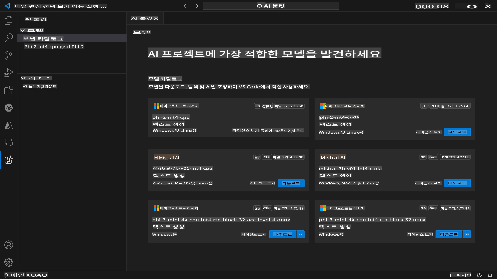
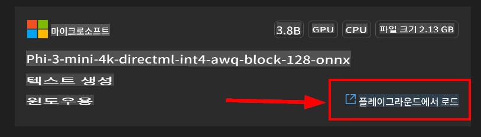

# VScode를 위한 AI Toolkit (Windows)

[AI Toolkit for VS Code](https://marketplace.visualstudio.com/items?itemName=ms-windows-ai-studio.windows-ai-studio)는 Azure AI Foundry Catalog와 Hugging Face와 같은 다른 카탈로그에서 제공하는 최첨단 AI 개발 도구와 모델을 결합하여 생성형 AI 앱 개발을 간소화합니다. Azure ML과 Hugging Face에서 제공하는 AI 모델 카탈로그를 탐색하고, 로컬로 다운로드하고, 미세 조정하고, 테스트하고, 애플리케이션에서 사용할 수 있습니다.

AI Toolkit Preview는 로컬에서 실행됩니다. 선택한 모델에 따라 일부 작업은 Windows 및 Linux에서만 지원됩니다.

로컬 추론 또는 미세 조정을 위해 선택한 모델에 따라 NVIDIA CUDA GPU와 같은 GPU가 필요할 수 있습니다.

원격으로 실행하는 경우 클라우드 리소스에 GPU가 있어야 하므로 환경을 확인하십시오. Windows + WSL에서 로컬로 실행하려면 WSL Ubuntu 배포판 18.4 이상이 설치되어 있어야 하며, AI Toolkit을 사용하기 전에 기본값으로 설정되어 있어야 합니다.

## 시작하기

[Windows용 Linux 하위 시스템 설치 방법 알아보기](https://learn.microsoft.com/windows/wsl/install?WT.mc_id=aiml-137032-kinfeylo)

그리고 [기본 배포판 변경](https://learn.microsoft.com/windows/wsl/install#change-the-default-linux-distribution-installed).

[AI Tooklit GitHub Repo](https://github.com/microsoft/vscode-ai-toolkit/)

- Windows 또는 Linux.
- **MacOS 지원 예정**
- Windows 및 Linux에서 미세 조정을 위해서는 Nvidia GPU가 필요합니다. 또한 **Windows**에서는 Ubuntu 배포판 18.4 이상의 Linux 하위 시스템이 필요합니다. [Windows용 Linux 하위 시스템 설치 방법 알아보기](https://learn.microsoft.com/windows/wsl/install) 및 [기본 배포판 변경](https://learn.microsoft.com/windows/wsl/install#change-the-default-linux-distribution-installed).

### AI Toolkit 설치

AI Toolkit은 [Visual Studio Code 확장](https://code.visualstudio.com/docs/setup/additional-components#_vs-code-extensions)으로 제공되므로 먼저 [VS Code](https://code.visualstudio.com/docs/setup/windows?WT.mc_id=aiml-137032-kinfeylo)를 설치하고 [VS Marketplace](https://marketplace.visualstudio.com/items?itemName=ms-windows-ai-studio.windows-ai-studio)에서 AI Toolkit을 다운로드해야 합니다.
[AI Toolkit은 Visual Studio Marketplace에서 사용할 수 있습니다](https://marketplace.visualstudio.com/items?itemName=ms-windows-ai-studio.windows-ai-studio) 및 다른 VS Code 확장처럼 설치할 수 있습니다.

VS Code 확장 설치에 익숙하지 않다면 다음 단계를 따르십시오:

### 로그인

1. VS Code의 활동 표시줄에서 **확장**을 선택합니다.
1. 확장 검색 창에 "AI Toolkit"을 입력합니다.
1. "AI Toolkit for Visual Studio code"를 선택합니다.
1. **설치**를 선택합니다.

이제 확장을 사용할 준비가 되었습니다!

GitHub에 로그인하라는 메시지가 표시되므로 계속하려면 "허용"을 클릭하십시오. GitHub 로그인 페이지로 리디렉션됩니다.

로그인하고 절차를 따르십시오. 성공적으로 완료되면 VS Code로 리디렉션됩니다.

확장이 설치되면 활동 표시줄에 AI Toolkit 아이콘이 나타납니다.

이제 사용할 수 있는 작업을 탐색해 봅시다!

### 사용 가능한 작업

AI Toolkit의 기본 사이드바는 다음과 같이 구성되어 있습니다.

- **모델**
- **리소스**
- **플레이그라운드**
- **미세 조정**

리소스 섹션에서 사용할 수 있습니다. 시작하려면 **모델 카탈로그**를 선택하십시오.

### 카탈로그에서 모델 다운로드

VS Code 사이드바에서 AI Toolkit을 실행하면 다음 옵션 중에서 선택할 수 있습니다:



- **모델 카탈로그**에서 지원되는 모델을 찾아 로컬로 다운로드
- **모델 플레이그라운드**에서 모델 추론 테스트
- **모델 미세 조정**에서 로컬 또는 원격으로 모델 미세 조정
- 명령 팔레트를 통해 미세 조정된 모델을 클라우드에 배포

> [!NOTE]
>
> **GPU 대 CPU**
>
> 모델 카드에는 모델 크기, 플랫폼 및 가속기 유형(CPU, GPU)이 표시됩니다. **GPU가 최소 하나 이상 있는 Windows 장치**에서 최적의 성능을 위해 Windows만 타겟으로 하는 모델 버전을 선택하십시오.
>
> 이렇게 하면 DirectML 가속기에 최적화된 모델을 사용할 수 있습니다.
>
> 모델 이름은 다음 형식입니다:
>
> - `{model_name}-{accelerator}-{quantization}-{format}`.
>
> Windows 장치에 GPU가 있는지 확인하려면 **작업 관리자**를 열고 **성능** 탭을 선택하십시오. GPU가 있는 경우 "GPU 0" 또는 "GPU 1"과 같은 이름으로 나열됩니다.

### 플레이그라운드에서 모델 실행

모든 매개변수를 설정한 후 **프로젝트 생성**을 클릭하십시오.

모델이 다운로드되면 카탈로그에서 모델 카드의 **플레이그라운드에서 로드**를 선택하십시오:

- 모델 다운로드 시작
- 모든 필수 구성 요소 및 종속성 설치
- VS Code 작업 공간 생성



모델이 다운로드되면 AI Toolkit에서 프로젝트를 시작할 수 있습니다.

> ***Note*** 원격으로 추론 또는 미세 조정 프리뷰 기능을 사용해 보려면 [이 가이드](https://github.com/microsoft/vscode-ai-toolkit/blob/main/archive/remote-overall.md)를 따르십시오.

### Windows 최적화 모델

모델 응답이 스트리밍되는 것을 볼 수 있습니다:

AI Toolkit은 이미 Windows에 최적화된 공개 AI 모델 모음을 제공합니다. 모델은 Hugging Face, GitHub 등 다양한 위치에 저장되어 있지만, 모든 모델을 한 곳에서 찾아 Windows 애플리케이션에서 다운로드하고 사용할 수 있습니다.


### 모델 선택

*Windows* 장치에 **GPU**가 없지만 다음을 선택한 경우

- Phi-3-mini-4k-**directml**-int4-awq-block-128-onnx 모델

모델 응답이 *매우 느릴* 것입니다.

대신 CPU 최적화 버전을 다운로드해야 합니다:

- Phi-3-mini-4k-**cpu**-int4-rtn-block-32-acc-level-4-onnx.

또한 다음을 변경할 수도 있습니다:

**컨텍스트 지침:** 모델이 요청의 더 큰 그림을 이해하도록 돕습니다. 이는 배경 정보, 원하는 예시/데모 또는 작업의 목적 설명일 수 있습니다.

**추론 매개변수:**

- *최대 응답 길이*: 모델이 반환할 최대 토큰 수입니다.
- *온도*: 모델 온도는 언어 모델의 출력이 얼마나 무작위적인지를 제어하는 매개변수입니다. 온도가 높을수록 모델이 더 많은 위험을 감수하여 다양한 단어 조합을 제공합니다. 반면, 온도가 낮을수록 모델은 더 집중되고 예측 가능한 응답을 제공합니다.
- *Top P*: 핵심 샘플링이라고도 하며, 언어 모델이 다음 단어를 예측할 때 고려하는 가능한 단어 또는 구문의 수를 제어하는 설정입니다.
- *빈도 페널티*: 모델이 출력에서 단어 또는 구문을 반복하는 빈도를 제어하는 매개변수입니다. 값이 높을수록(1.0에 가까울수록) 모델이 단어 또는 구문을 반복하지 않도록 장려합니다.
- *존재 페널티*: 생성형 AI 모델에서 생성된 텍스트의 다양성과 구체성을 장려하는 데 사용되는 매개변수입니다. 값이 높을수록(1.0에 가까울수록) 모델이 더 새로운 토큰을 포함하도록 장려합니다. 값이 낮을수록 모델이 일반적이거나 상투적인 구문을 생성할 가능성이 높습니다.

### 애플리케이션에서 REST API 사용

AI Toolkit은 [OpenAI 채팅 완료 형식](https://platform.openai.com/docs/api-reference/chat/create)을 사용하는 **포트 5272**의 로컬 REST API 웹 서버를 제공합니다.

이를 통해 클라우드 AI 모델 서비스에 의존하지 않고 로컬에서 애플리케이션을 테스트할 수 있습니다. 예를 들어, 다음 JSON 파일은 요청 본문을 구성하는 방법을 보여줍니다:

```json
{
    "model": "Phi-3-mini-4k-directml-int4-awq-block-128-onnx",
    "messages": [
        {
            "role": "user",
            "content": "what is the golden ratio?"
        }
    ],
    "temperature": 0.7,
    "top_p": 1,
    "top_k": 10,
    "max_tokens": 100,
    "stream": true
}
```

REST API를 (예: [Postman](https://www.postman.com/) 또는 CURL (Client URL) 유틸리티를 사용하여 테스트할 수 있습니다:

```bash
curl -vX POST http://127.0.0.1:5272/v1/chat/completions -H 'Content-Type: application/json' -d @body.json
```

### Python용 OpenAI 클라이언트 라이브러리 사용

```python
from openai import OpenAI

client = OpenAI(
    base_url="http://127.0.0.1:5272/v1/", 
    api_key="x" # required for the API but not used
)

chat_completion = client.chat.completions.create(
    messages=[
        {
            "role": "user",
            "content": "what is the golden ratio?",
        }
    ],
    model="Phi-3-mini-4k-cuda-int4-onnx",
)

print(chat_completion.choices[0].message.content)
```

### .NET용 Azure OpenAI 클라이언트 라이브러리 사용

NuGet을 사용하여 프로젝트에 [Azure OpenAI 클라이언트 라이브러리 for .NET](https://www.nuget.org/packages/Azure.AI.OpenAI/)을 추가합니다:

```bash
dotnet add {project_name} package Azure.AI.OpenAI --version 1.0.0-beta.17
```

프로젝트에 **OverridePolicy.cs**라는 C# 파일을 추가하고 다음 코드를 붙여넣습니다:

```csharp
// OverridePolicy.cs
using Azure.Core.Pipeline;
using Azure.Core;

internal partial class OverrideRequestUriPolicy(Uri overrideUri)
    : HttpPipelineSynchronousPolicy
{
    private readonly Uri _overrideUri = overrideUri;

    public override void OnSendingRequest(HttpMessage message)
    {
        message.Request.Uri.Reset(_overrideUri);
    }
}
```

다음으로, **Program.cs** 파일에 다음 코드를 붙여넣습니다:

```csharp
// Program.cs
using Azure.AI.OpenAI;

Uri localhostUri = new("http://localhost:5272/v1/chat/completions");

OpenAIClientOptions clientOptions = new();
clientOptions.AddPolicy(
    new OverrideRequestUriPolicy(localhostUri),
    Azure.Core.HttpPipelinePosition.BeforeTransport);
OpenAIClient client = new(openAIApiKey: "unused", clientOptions);

ChatCompletionsOptions options = new()
{
    DeploymentName = "Phi-3-mini-4k-directml-int4-awq-block-128-onnx",
    Messages =
    {
        new ChatRequestSystemMessage("You are a helpful assistant. Be brief and succinct."),
        new ChatRequestUserMessage("What is the golden ratio?"),
    }
};

StreamingResponse<StreamingChatCompletionsUpdate> streamingChatResponse
    = await client.GetChatCompletionsStreamingAsync(options);

await foreach (StreamingChatCompletionsUpdate chatChunk in streamingChatResponse)
{
    Console.Write(chatChunk.ContentUpdate);
}
```

## AI Toolkit을 사용한 미세 조정

- 모델 탐색 및 플레이그라운드 시작하기.
- 로컬 컴퓨팅 리소스를 사용한 모델 미세 조정 및 추론.
- Azure 리소스를 사용한 원격 미세 조정 및 추론

[AI Toolkit을 사용한 미세 조정](../04.Fine-tuning/Finetuning_VSCodeaitoolkit.md)

## AI Toolkit Q&A 리소스

가장 일반적인 문제와 해결책에 대해서는 [Q&A 페이지](https://github.com/microsoft/vscode-ai-toolkit/blob/main/archive/QA.md)를 참조하십시오.

**면책 조항**:
이 문서는 기계 기반 AI 번역 서비스를 사용하여 번역되었습니다. 정확성을 위해 노력하고 있지만 자동 번역에는 오류나 부정확성이 포함될 수 있습니다. 원본 문서를 해당 언어로 작성된 것이 권위 있는 자료로 간주되어야 합니다. 중요한 정보의 경우, 전문 인간 번역을 권장합니다. 이 번역 사용으로 인해 발생하는 오해나 잘못된 해석에 대해 당사는 책임을 지지 않습니다.