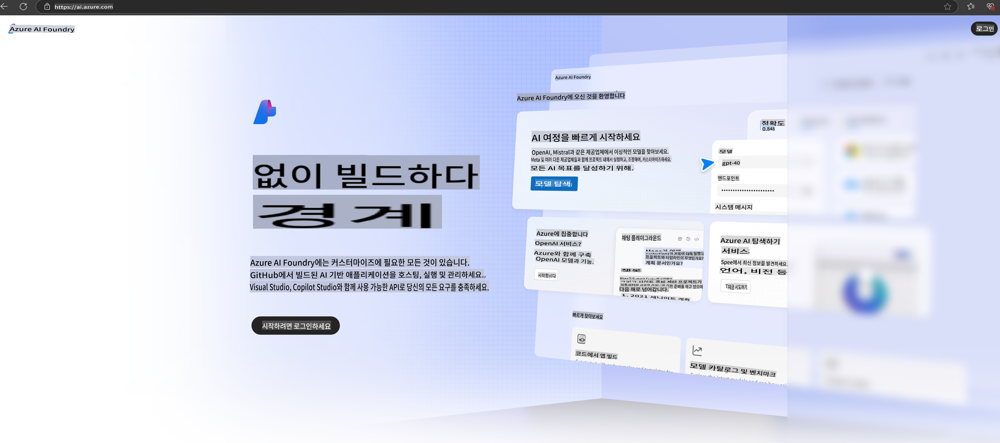

# **Azure AI Foundry에서 Phi-3 사용하기**

생성형 AI의 발전과 함께, 우리는 다양한 LLM 및 SLM 관리, 기업 데이터 통합, 세부 조정(RAG) 작업, LLM 및 SLM 통합 후 기업 비즈니스 평가 등을 통합적으로 관리할 수 있는 플랫폼을 통해 생성형 AI의 스마트 애플리케이션을 더 효과적으로 구현하고자 합니다. [Azure AI Foundry](https://ai.azure.com)는 엔터프라이즈급 생성형 AI 애플리케이션 플랫폼입니다.

Azure AI Foundry를 사용하면 대규모 언어 모델(LLM)의 응답을 평가하고, 프롬프트 플로우를 통해 프롬프트 애플리케이션 구성 요소를 조정하여 성능을 최적화할 수 있습니다. 이 플랫폼은 개념 증명을 완전한 프로덕션으로 손쉽게 전환할 수 있도록 확장성을 제공합니다. 지속적인 모니터링 및 개선 작업은 장기적인 성공을 지원합니다.

간단한 단계만으로 Azure AI Foundry에서 Phi-3 모델을 빠르게 배포한 후, Azure AI Foundry를 활용해 Phi-3 관련 Playground/Chat, 세부 조정, 평가 등의 작업을 수행할 수 있습니다.

## **1. 준비**

[Azure Developer CLI](https://learn.microsoft.com/azure/developer/azure-developer-cli/overview?WT.mc_id=aiml-138114-kinfeylo)가 이미 설치되어 있다면, 새로운 디렉터리에서 간단히 명령어를 실행하여 이 템플릿을 사용할 수 있습니다.

## 수동 생성

Microsoft Azure AI Foundry 프로젝트와 허브를 생성하는 것은 AI 작업을 조직화하고 관리하는 훌륭한 방법입니다. 다음은 시작하기 위한 단계별 가이드입니다.

### Azure AI Foundry에서 프로젝트 생성

1. **Azure AI Foundry로 이동**: Azure AI Foundry 포털에 로그인합니다.
2. **프로젝트 생성**:
   - 프로젝트에 있는 경우, 페이지 왼쪽 상단에서 "Azure AI Foundry"를 선택해 홈 페이지로 이동합니다.
   - "+ 프로젝트 생성"을 선택합니다.
   - 프로젝트 이름을 입력합니다.
   - 허브가 이미 있다면 기본적으로 선택됩니다. 여러 허브에 접근 권한이 있다면 드롭다운에서 다른 허브를 선택할 수 있습니다. 새로운 허브를 생성하려면 "새 허브 생성"을 선택하고 이름을 입력합니다.
   - "생성"을 선택합니다.

### Azure AI Foundry에서 허브 생성

1. **Azure AI Foundry로 이동**: Azure 계정으로 로그인합니다.
2. **허브 생성**:
   - 왼쪽 메뉴에서 관리 센터를 선택합니다.
   - "모든 리소스"를 선택한 다음 "+ 새 프로젝트" 옆 화살표를 클릭하고 "+ 새 허브"를 선택합니다.
   - "새 허브 생성" 대화 상자에서 허브 이름(예: contoso-hub)을 입력하고, 다른 필드를 원하는 대로 수정합니다.
   - "다음"을 선택하고 정보를 검토한 후 "생성"을 선택합니다.

더 자세한 내용은 공식 [Microsoft 문서](https://learn.microsoft.com/azure/ai-studio/how-to/create-projects)를 참조하세요.

생성이 완료되면 [ai.azure.com](https://ai.azure.com/)을 통해 생성된 스튜디오에 접근할 수 있습니다.

하나의 AI Foundry에는 여러 프로젝트가 있을 수 있습니다. AI Foundry에서 프로젝트를 생성하여 준비를 완료하세요.

Azure AI Foundry [빠른 시작](https://learn.microsoft.com/azure/ai-studio/quickstarts/get-started-code)

## **2. Azure AI Foundry에서 Phi 모델 배포**

프로젝트의 탐색 옵션을 클릭해 모델 카탈로그로 이동한 후 Phi-3을 선택합니다.

Phi-3-mini-4k-instruct를 선택합니다.

'배포'를 클릭하여 Phi-3-mini-4k-instruct 모델을 배포합니다.

> [!NOTE]
>
> 배포 시 컴퓨팅 파워를 선택할 수 있습니다.

## **3. Azure AI Foundry에서 Phi와 Playground 채팅**

배포 페이지로 이동하여 Playground를 선택하고 Azure AI Foundry의 Phi-3과 채팅을 시작하세요.

## **4. Azure AI Foundry에서 모델 배포**

Azure 모델 카탈로그에서 모델을 배포하려면 다음 단계를 따르세요:

- Azure AI Foundry에 로그인합니다.
- Azure AI Foundry 모델 카탈로그에서 배포하려는 모델을 선택합니다.
- 모델 세부 정보 페이지에서 배포를 선택한 후 Azure AI Content Safety를 사용하는 Serverless API를 선택합니다.
- 모델을 배포할 프로젝트를 선택합니다. Serverless API를 사용하려면 워크스페이스가 East US 2 또는 Sweden Central 지역에 속해야 합니다. 배포 이름을 사용자 정의할 수 있습니다.
- 배포 마법사에서 가격 및 이용 약관을 검토합니다.
- "배포"를 선택합니다. 배포가 완료될 때까지 기다린 후 배포 페이지로 리디렉션됩니다.
- "Playground에서 열기"를 선택하여 모델과 상호 작용을 시작합니다.
- 배포 페이지로 돌아가 배포를 선택하고, 엔드포인트의 Target URL과 Secret Key를 확인하여 배포를 호출하고 결과를 생성할 수 있습니다.
- Build 탭에서 Components 섹션의 Deployments를 선택하여 언제든지 엔드포인트의 세부 정보, URL 및 액세스 키를 확인할 수 있습니다.

> [!NOTE]
> 리소스 그룹에서 이 작업을 수행하려면 Azure AI 개발자 역할 권한이 계정에 있어야 합니다.

## **5. Azure AI Foundry에서 Phi API 사용**

Postman의 GET 요청을 통해 https://{Your project name}.region.inference.ml.azure.com/swagger.json에 접속하고 Key와 결합하여 제공되는 인터페이스를 확인할 수 있습니다.

요청 매개변수와 응답 매개변수를 매우 간편하게 확인할 수 있습니다.

**면책 조항**:  
이 문서는 기계 기반 AI 번역 서비스를 사용하여 번역되었습니다. 정확성을 위해 최선을 다하고 있지만, 자동 번역에는 오류나 부정확성이 포함될 수 있습니다. 원본 문서의 모국어 버전이 권위 있는 자료로 간주되어야 합니다. 중요한 정보의 경우, 전문적인 인간 번역을 권장합니다. 이 번역 사용으로 인해 발생하는 오해나 잘못된 해석에 대해 당사는 책임을 지지 않습니다.