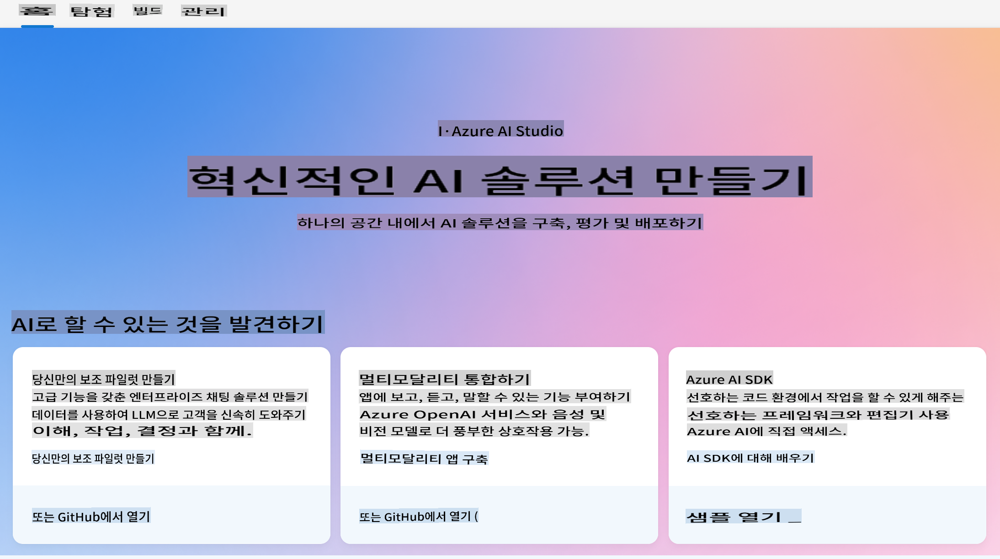
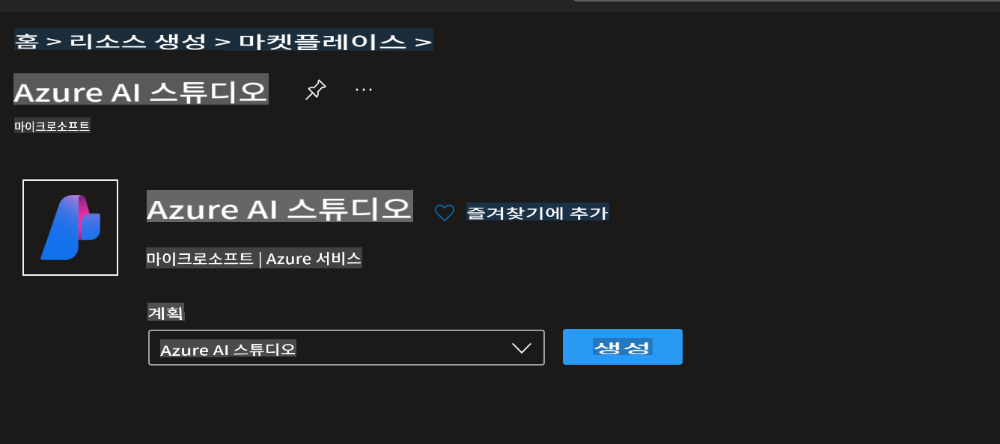
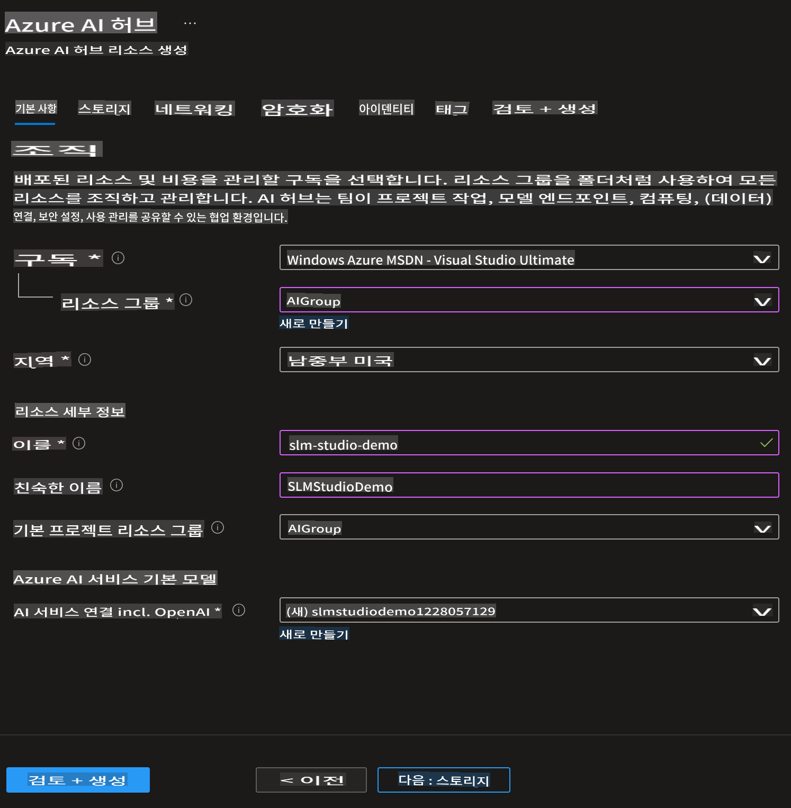
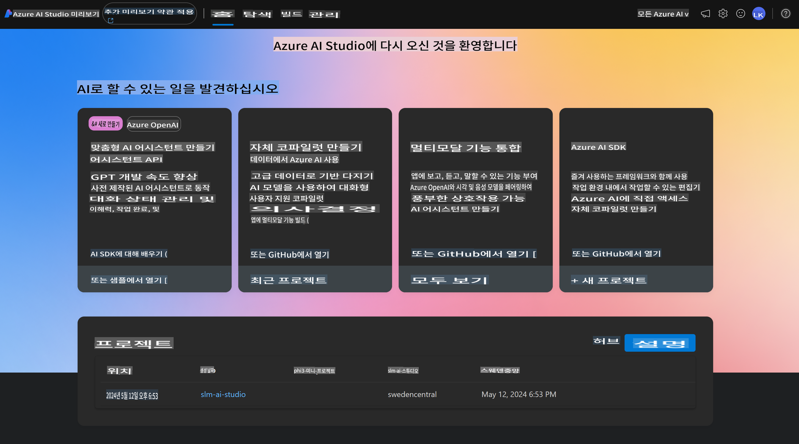
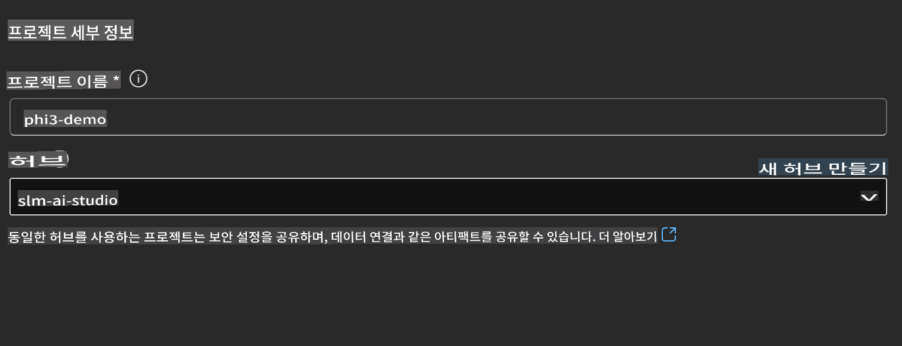
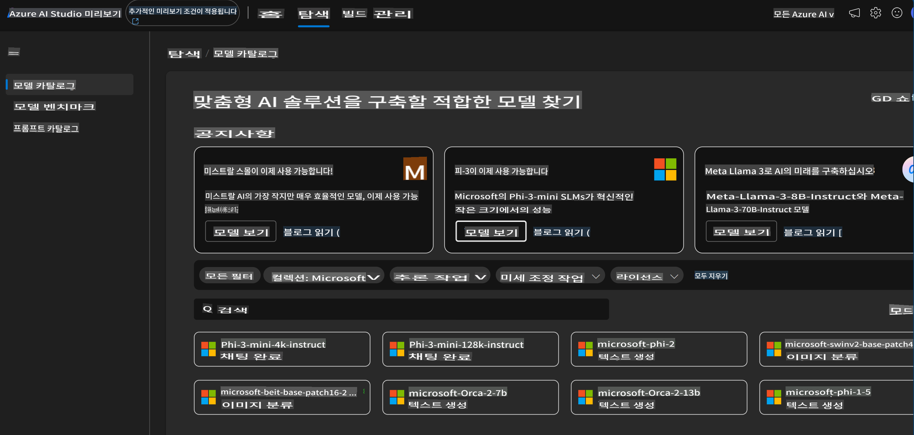
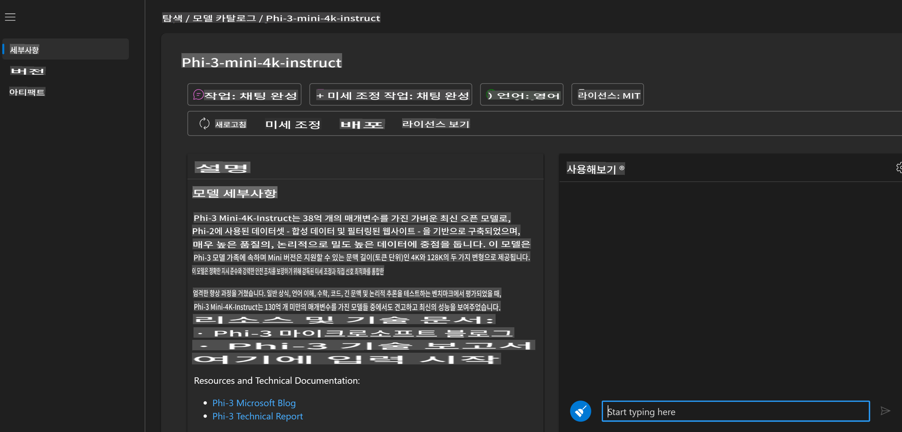
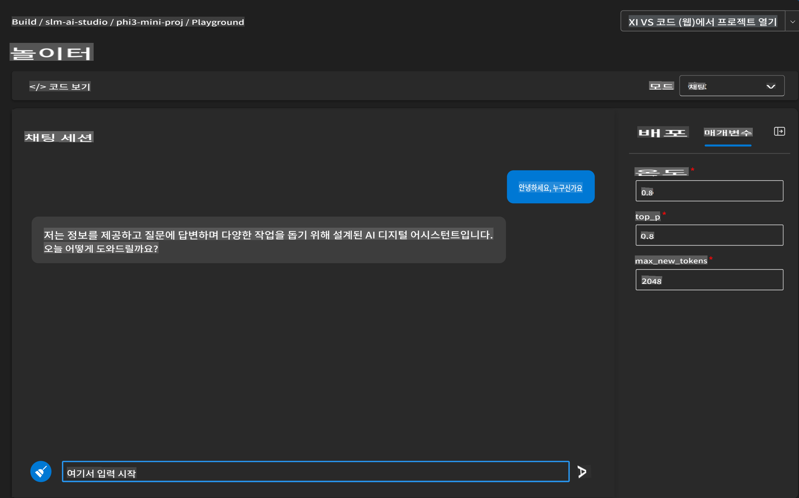
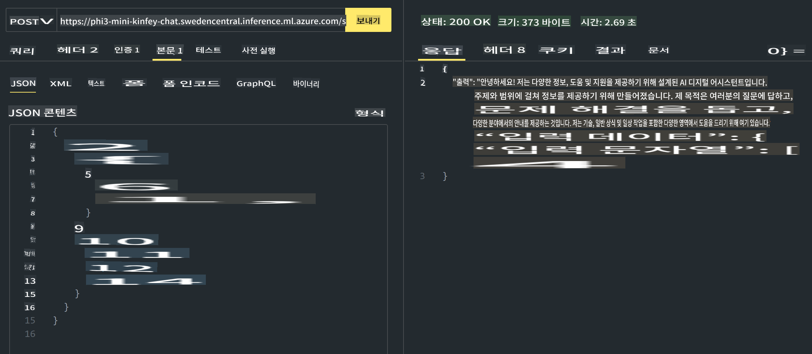

# **Azure AI Foundry에서 Phi-3 사용하기**

생성형 AI의 발전으로, 우리는 다양한 LLM과 SLM, 기업 데이터 통합, 미세 조정/RAG 작업, LLM과 SLM을 통합한 후의 다양한 기업 비즈니스 평가 등을 관리할 수 있는 통합 플랫폼을 사용하여 생성형 AI 스마트 애플리케이션을 더 잘 구현하기를 희망합니다. [Azure AI Foundry](https://ai.azure.com)는 기업 수준의 생성형 AI 애플리케이션 플랫폼입니다.



Azure AI Foundry를 사용하면 대형 언어 모델(LLM) 응답을 평가하고 프롬프트 흐름을 통해 프롬프트 애플리케이션 구성 요소를 조율하여 성능을 향상시킬 수 있습니다. 이 플랫폼은 개념 증명을 완전한 생산으로 쉽게 전환할 수 있도록 확장성을 제공합니다. 지속적인 모니터링과 개선을 통해 장기적인 성공을 지원합니다.

우리는 간단한 단계로 Azure AI Foundry에 Phi-3 모델을 빠르게 배포한 다음 Azure AI Foundry를 사용하여 Phi-3 관련 Playground/Chat, 미세 조정, 평가 등의 관련 작업을 완료할 수 있습니다.

## **1. 준비**

## [AZD AI Foundry 시작 템플릿](https://azure.github.io/awesome-azd/?name=AI+Studio)

### Azure AI Foundry 시작

이것은 Azure AI Foundry를 시작하는 데 필요한 모든 것을 배포하는 Bicep 템플릿입니다. 종속 리소스, AI 프로젝트, AI 서비스 및 온라인 엔드포인트가 포함된 AI 허브를 포함합니다.

### 빠른 사용

이미 [Azure Developer CLI](https://learn.microsoft.com/azure/developer/azure-developer-cli/overview?WT.mc_id=aiml-138114-kinfeylo)가 컴퓨터에 설치되어 있는 경우, 새 디렉터리에서 이 명령을 실행하기만 하면 됩니다.

### 터미널 명령어

```bash
azd init -t azd-aistudio-starter
```

또는
azd VS Code 확장을 사용하는 경우 이 URL을 VS Code 명령어 터미널에 붙여넣을 수 있습니다.

### 터미널 URL

```bash
azd-aistudio-starter
```

## 수동 생성

[Azure Portal](https://portal.azure.com?WT.mc_id=aiml-138114-kinfeylo)에서 Azure AI Foundry를 생성하세요.



스튜디오의 이름을 지정하고 지역을 설정한 후 생성할 수 있습니다.



성공적으로 생성된 후 [ai.azure.com](https://ai.azure.com/)을 통해 생성한 스튜디오에 액세스할 수 있습니다.



하나의 AI Foundry에는 여러 프로젝트가 있을 수 있습니다. AI Foundry에서 프로젝트를 생성하여 준비하세요.



## **2. Azure AI Foundry에 Phi-3 모델 배포하기**

프로젝트의 탐색 옵션을 클릭하여 모델 카탈로그에 들어가 Phi-3을 선택하세요.



Phi-3-mini-4k-instruct를 선택하세요.



'배포'를 클릭하여 Phi-3-mini-4k-instruct 모델을 배포하세요.

> [!NOTE]
>
> 배포 시 컴퓨팅 파워를 선택할 수 있습니다.

## **3. Azure AI Foundry에서 Playground Chat Phi-3 사용하기**

배포 페이지로 이동하여 Playground를 선택하고 Azure AI Foundry의 Phi-3와 채팅하세요.



## **4. Azure AI Foundry에서 모델 배포하기**

Azure 모델 카탈로그에서 모델을 배포하려면 다음 단계를 따르세요:

- Azure AI Foundry에 로그인하세요.
- Azure AI Foundry 모델 카탈로그에서 배포하려는 모델을 선택하세요.
- 모델의 세부 정보 페이지에서 배포를 선택한 후 Azure AI Content Safety와 함께 Serverless API를 선택하세요.
- 모델을 배포할 프로젝트를 선택하세요. Serverless API를 사용하려면 워크스페이스가 East US 2 또는 Sweden Central 지역에 속해야 합니다. 배포 이름을 사용자 지정할 수 있습니다.
- 배포 마법사에서 가격 및 이용 약관을 선택하여 가격 및 이용 약관에 대해 알아보세요.
- 배포를 선택하세요. 배포가 완료될 때까지 기다린 후 배포 페이지로 리디렉션됩니다.
- Playground에서 열기를 선택하여 모델과 상호 작용을 시작하세요.
- 언제든지 배포 페이지로 돌아가 배포를 선택하고 엔드포인트의 대상 URL과 비밀 키를 확인하여 배포를 호출하고 완료를 생성할 수 있습니다.
- Build 탭으로 이동하여 구성 요소 섹션에서 배포를 선택하면 엔드포인트의 세부 정보, URL 및 액세스 키를 항상 찾을 수 있습니다.

> [!NOTE]
> 이 단계를 수행하려면 계정에 Resource Group에 대한 Azure AI Developer 역할 권한이 있어야 합니다.

## **5. Azure AI Foundry에서 Phi-3 API 사용하기**

Postman GET을 통해 https://{Your project name}.region.inference.ml.azure.com/swagger.json에 액세스하고 Key와 결합하여 제공된 인터페이스에 대해 알아보세요.


예를 들어 score api에 접근하세요.


요청 매개변수와 응답 매개변수를 매우 편리하게 얻을 수 있습니다. 이것은 Postman 결과입니다.



**면책 조항**:
이 문서는 기계 기반 AI 번역 서비스를 사용하여 번역되었습니다. 정확성을 위해 노력하고 있지만, 자동 번역에는 오류나 부정확성이 있을 수 있습니다. 원어로 작성된 원본 문서를 권위 있는 자료로 간주해야 합니다. 중요한 정보에 대해서는 전문적인 인간 번역을 권장합니다. 이 번역 사용으로 인해 발생하는 오해나 오역에 대해 책임을 지지 않습니다.