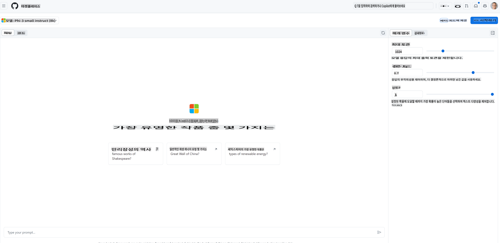
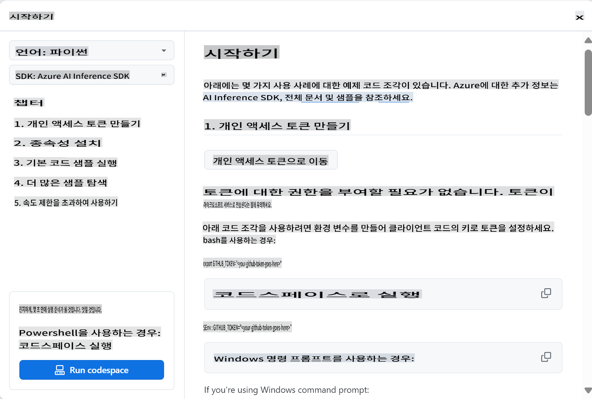
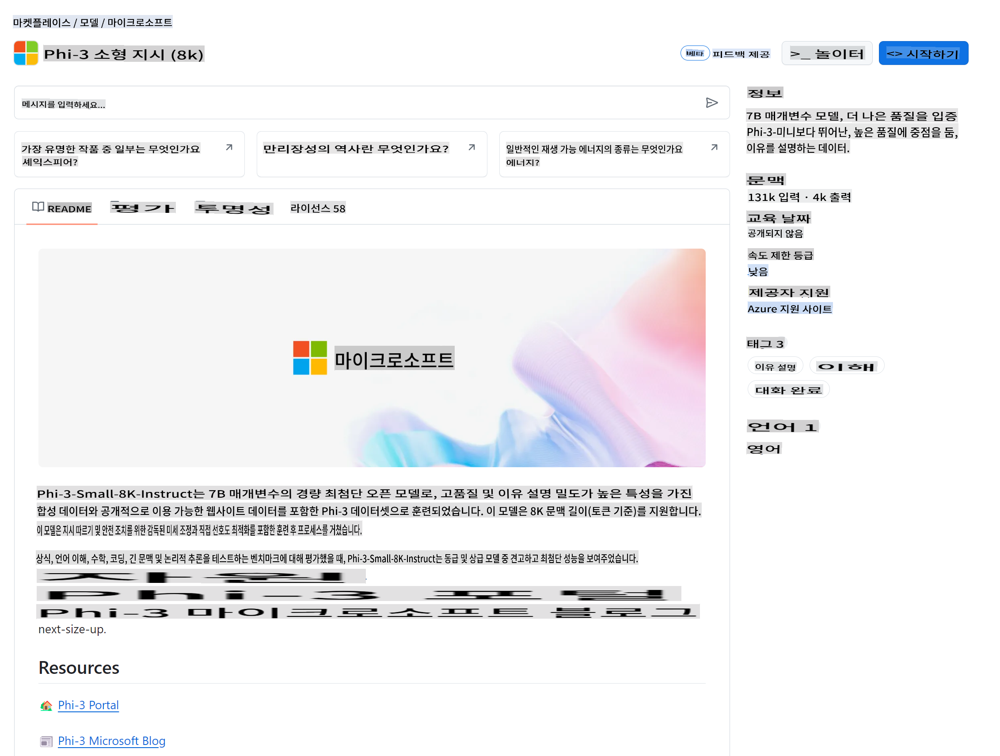

## GitHub Models - 제한된 공개 베타

[GitHub Models](https://github.com/marketplace/models)에 오신 것을 환영합니다! Azure AI에 호스팅된 AI 모델을 탐색할 준비가 되어 있습니다.


GitHub Models에서 사용할 수 있는 모델에 대한 자세한 정보는 [GitHub Model Marketplace](https://github.com/marketplace/models)를 참조하세요.

## 사용 가능한 모델

각 모델에는 전용 플레이그라운드와 샘플 코드가 있습니다.



### GitHub 모델 카탈로그의 Phi-3 모델

[Phi-3-Medium-128k-Instruct](https://github.com/marketplace/models/azureml/Phi-3-medium-128k-instruct)

[Phi-3-medium-4k-instruct](https://github.com/marketplace/models/azureml/Phi-3-medium-4k-instruct)

[Phi-3-mini-128k-instruct](https://github.com/marketplace/models/azureml/Phi-3-mini-128k-instruct)

[Phi-3-mini-4k-instruct](https://github.com/marketplace/models/azureml/Phi-3-mini-4k-instruct)

[Phi-3-small-128k-instruct](https://github.com/marketplace/models/azureml/Phi-3-small-128k-instruct)

[Phi-3-small-8k-instruct](https://github.com/marketplace/models/azureml/Phi-3-small-8k-instruct)

## 시작하기

실행할 준비가 된 몇 가지 기본 예제가 있습니다. 샘플 디렉토리에서 찾을 수 있습니다. 좋아하는 언어로 바로 이동하려면 다음 언어의 예제를 참조하세요:

- Python
- JavaScript
- cURL

샘플과 모델을 실행할 수 있는 전용 Codespaces 환경도 있습니다.



## 샘플 코드

아래는 몇 가지 사용 사례에 대한 예제 코드 스니펫입니다. Azure AI Inference SDK에 대한 추가 정보는 전체 문서와 샘플을 참조하세요.

## 설정

1. 개인 액세스 토큰 생성
토큰에 대한 권한을 부여할 필요는 없습니다. 토큰은 Microsoft 서비스로 전송됩니다.

아래 코드 스니펫을 사용하려면 환경 변수를 생성하여 클라이언트 코드의 키로 토큰을 설정하세요.

bash를 사용하는 경우:
```
export GITHUB_TOKEN="<your-github-token-goes-here>"
```
powershell을 사용하는 경우:

```
$Env:GITHUB_TOKEN="<your-github-token-goes-here>"
```

Windows 명령 프롬프트를 사용하는 경우:

```
set GITHUB_TOKEN=<your-github-token-goes-here>
```

## Python 샘플

### 종속성 설치
pip을 사용하여 Azure AI Inference SDK 설치 (필수: Python >=3.8):

```
pip install azure-ai-inference
```
### 기본 코드 샘플 실행

이 샘플은 채팅 완료 API에 대한 기본 호출을 보여줍니다. GitHub AI 모델 추론 엔드포인트와 GitHub 토큰을 사용합니다. 호출은 동기식입니다.

```
import os
from azure.ai.inference import ChatCompletionsClient
from azure.ai.inference.models import SystemMessage, UserMessage
from azure.core.credentials import AzureKeyCredential

endpoint = "https://models.inference.ai.azure.com"
# Replace Model_Name 
model_name = "Phi-3-small-8k-instruct"
token = os.environ["GITHUB_TOKEN"]

client = ChatCompletionsClient(
    endpoint=endpoint,
    credential=AzureKeyCredential(token),
)

response = client.complete(
    messages=[
        SystemMessage(content="You are a helpful assistant."),
        UserMessage(content="What is the capital of France?"),
    ],
    model=model_name,
    temperature=1.,
    max_tokens=1000,
    top_p=1.
)

print(response.choices[0].message.content)
```

### 다중 회전 대화 실행

이 샘플은 채팅 완료 API와의 다중 회전 대화를 보여줍니다. 채팅 애플리케이션에서 모델을 사용할 때는 대화 기록을 관리하고 최신 메시지를 모델에 보내야 합니다.

```
import os
from azure.ai.inference import ChatCompletionsClient
from azure.ai.inference.models import AssistantMessage, SystemMessage, UserMessage
from azure.core.credentials import AzureKeyCredential

token = os.environ["GITHUB_TOKEN"]
endpoint = "https://models.inference.ai.azure.com"
# Replace Model_Name
model_name = "Phi-3-small-8k-instruct"

client = ChatCompletionsClient(
    endpoint=endpoint,
    credential=AzureKeyCredential(token),
)

messages = [
    SystemMessage(content="You are a helpful assistant."),
    UserMessage(content="What is the capital of France?"),
    AssistantMessage(content="The capital of France is Paris."),
    UserMessage(content="What about Spain?"),
]

response = client.complete(messages=messages, model=model_name)

print(response.choices[0].message.content)
```

### 출력 스트리밍

더 나은 사용자 경험을 위해 모델의 응답을 스트리밍하여 첫 번째 토큰이 일찍 나타나고 긴 응답을 기다리지 않도록 하는 것이 좋습니다.

```
import os
from azure.ai.inference import ChatCompletionsClient
from azure.ai.inference.models import SystemMessage, UserMessage
from azure.core.credentials import AzureKeyCredential

token = os.environ["GITHUB_TOKEN"]
endpoint = "https://models.inference.ai.azure.com"
# Replace Model_Name
model_name = "Phi-3-small-8k-instruct"

client = ChatCompletionsClient(
    endpoint=endpoint,
    credential=AzureKeyCredential(token),
)

response = client.complete(
    stream=True,
    messages=[
        SystemMessage(content="You are a helpful assistant."),
        UserMessage(content="Give me 5 good reasons why I should exercise every day."),
    ],
    model=model_name,
)

for update in response:
    if update.choices:
        print(update.choices[0].delta.content or "", end="")

client.close()
```
## JavaScript

### 종속성 설치

Node.js를 설치하세요.

다음 텍스트를 복사하여 폴더 안에 package.json 파일로 저장하세요.

```
{
  "type": "module",
  "dependencies": {
    "@azure-rest/ai-inference": "latest",
    "@azure/core-auth": "latest",
    "@azure/core-sse": "latest"
  }
}
```

참고: @azure/core-sse는 채팅 완료 응답을 스트리밍할 때만 필요합니다.

이 폴더에서 터미널 창을 열고 npm install을 실행하세요.

아래의 각 코드 스니펫에 대해 내용을 sample.js 파일에 복사하고 node sample.js로 실행하세요.

### 기본 코드 샘플 실행

이 샘플은 채팅 완료 API에 대한 기본 호출을 보여줍니다. GitHub AI 모델 추론 엔드포인트와 GitHub 토큰을 사용합니다. 호출은 동기식입니다.

```
import ModelClient from "@azure-rest/ai-inference";
import { AzureKeyCredential } from "@azure/core-auth";

const token = process.env["GITHUB_TOKEN"];
const endpoint = "https://models.inference.ai.azure.com";
// Update your modelname
const modelName = "Phi-3-small-8k-instruct";

export async function main() {

  const client = new ModelClient(endpoint, new AzureKeyCredential(token));

  const response = await client.path("/chat/completions").post({
    body: {
      messages: [
        { role:"system", content: "You are a helpful assistant." },
        { role:"user", content: "What is the capital of France?" }
      ],
      model: modelName,
      temperature: 1.,
      max_tokens: 1000,
      top_p: 1.
    }
  });

  if (response.status !== "200") {
    throw response.body.error;
  }
  console.log(response.body.choices[0].message.content);
}

main().catch((err) => {
  console.error("The sample encountered an error:", err);
});
```

### 다중 회전 대화 실행

이 샘플은 채팅 완료 API와의 다중 회전 대화를 보여줍니다. 채팅 애플리케이션에서 모델을 사용할 때는 대화 기록을 관리하고 최신 메시지를 모델에 보내야 합니다.

```
import ModelClient from "@azure-rest/ai-inference";
import { AzureKeyCredential } from "@azure/core-auth";

const token = process.env["GITHUB_TOKEN"];
const endpoint = "https://models.inference.ai.azure.com";
// Update your modelname
const modelName = "Phi-3-small-8k-instruct";

export async function main() {

  const client = new ModelClient(endpoint, new AzureKeyCredential(token));

  const response = await client.path("/chat/completions").post({
    body: {
      messages: [
        { role: "system", content: "You are a helpful assistant." },
        { role: "user", content: "What is the capital of France?" },
        { role: "assistant", content: "The capital of France is Paris." },
        { role: "user", content: "What about Spain?" },
      ],
      model: modelName,
    }
  });

  if (response.status !== "200") {
    throw response.body.error;
  }

  for (const choice of response.body.choices) {
    console.log(choice.message.content);
  }
}

main().catch((err) => {
  console.error("The sample encountered an error:", err);
});
```

### 출력 스트리밍
더 나은 사용자 경험을 위해 모델의 응답을 스트리밍하여 첫 번째 토큰이 일찍 나타나고 긴 응답을 기다리지 않도록 하는 것이 좋습니다.

```
import ModelClient from "@azure-rest/ai-inference";
import { AzureKeyCredential } from "@azure/core-auth";
import { createSseStream } from "@azure/core-sse";

const token = process.env["GITHUB_TOKEN"];
const endpoint = "https://models.inference.ai.azure.com";
// Update your modelname
const modelName = "Phi-3-small-8k-instruct";

export async function main() {

  const client = new ModelClient(endpoint, new AzureKeyCredential(token));

  const response = await client.path("/chat/completions").post({
    body: {
      messages: [
        { role: "system", content: "You are a helpful assistant." },
        { role: "user", content: "Give me 5 good reasons why I should exercise every day." },
      ],
      model: modelName,
      stream: true
    }
  }).asNodeStream();

  const stream = response.body;
  if (!stream) {
    throw new Error("The response stream is undefined");
  }

  if (response.status !== "200") {
    stream.destroy();
    throw new Error(`Failed to get chat completions, http operation failed with ${response.status} code`);
  }

  const sseStream = createSseStream(stream);

  for await (const event of sseStream) {
    if (event.data === "[DONE]") {
      return;
    }
    for (const choice of (JSON.parse(event.data)).choices) {
        process.stdout.write(choice.delta?.content ?? ``);
    }
  }
}

main().catch((err) => {
  console.error("The sample encountered an error:", err);
});
```

## REST

### 기본 코드 샘플 실행

다음을 셸에 붙여넣으세요:

```
curl -X POST "https://models.inference.ai.azure.com/chat/completions" \
    -H "Content-Type: application/json" \
    -H "Authorization: Bearer $GITHUB_TOKEN" \
    -d '{
        "messages": [
            {
                "role": "system",
                "content": "You are a helpful assistant."
            },
            {
                "role": "user",
                "content": "What is the capital of France?"
            }
        ],
        "model": "Phi-3-small-8k-instruct"
    }'
```
### 다중 회전 대화 실행

채팅 완료 API를 호출하고 채팅 기록을 전달하세요:

```
curl -X POST "https://models.inference.ai.azure.com/chat/completions" \
    -H "Content-Type: application/json" \
    -H "Authorization: Bearer $GITHUB_TOKEN" \
    -d '{
        "messages": [
            {
                "role": "system",
                "content": "You are a helpful assistant."
            },
            {
                "role": "user",
                "content": "What is the capital of France?"
            },
            {
                "role": "assistant",
                "content": "The capital of France is Paris."
            },
            {
                "role": "user",
                "content": "What about Spain?"
            }
        ],
        "model": "Phi-3-small-8k-instruct"
    }'
```
### 출력 스트리밍

엔드포인트를 호출하고 응답을 스트리밍하는 예입니다.

```
curl -X POST "https://models.inference.ai.azure.com/chat/completions" \
    -H "Content-Type: application/json" \
    -H "Authorization: Bearer $GITHUB_TOKEN" \
    -d '{
        "messages": [
            {
                "role": "system",
                "content": "You are a helpful assistant."
            },
            {
                "role": "user",
                "content": "Give me 5 good reasons why I should exercise every day."
            }
        ],
        "stream": true,
        "model": "Phi-3-small-8k-instruct"
    }'
```

## GitHub Models의 무료 사용 및 요금 제한



[플레이그라운드 및 무료 API 사용에 대한 요금 제한](https://docs.github.com/en/github-models/prototyping-with-ai-models#rate-limits)은 모델을 실험하고 AI 애플리케이션을 프로토타입하는 데 도움이 됩니다. 이러한 한도를 초과하여 사용하고 애플리케이션을 확장하려면 Azure 계정에서 리소스를 프로비저닝하고 GitHub 개인 액세스 토큰 대신 거기에서 인증해야 합니다. 코드의 다른 부분은 변경할 필요가 없습니다. Azure AI의 무료 티어 한도를 초과하는 방법을 알아보려면 이 링크를 사용하세요.

### 공개사항

모델과 상호작용할 때 AI를 실험하고 있다는 점을 기억하세요. 콘텐츠 오류가 발생할 수 있습니다.

이 기능은 다양한 한도(분당 요청 수, 일일 요청 수, 요청당 토큰 수, 동시 요청 수)에 따라 제한되며, 프로덕션 사용 사례에 적합하지 않습니다.

GitHub Models는 Azure AI Content Safety를 사용합니다. 이러한 필터는 GitHub Models 경험의 일부로 비활성화할 수 없습니다. 유료 서비스를 통해 모델을 사용할 경우 콘텐츠 필터를 요구 사항에 맞게 구성하세요.

이 서비스는 GitHub의 사전 릴리스 약관에 따라 제공됩니다.

**면책 조항**:
이 문서는 기계 기반 AI 번역 서비스를 사용하여 번역되었습니다. 정확성을 위해 노력하지만 자동 번역에는 오류나 부정확성이 있을 수 있습니다. 원어로 작성된 원본 문서를 권위 있는 출처로 간주해야 합니다. 중요한 정보에 대해서는 전문 인간 번역을 권장합니다. 이 번역 사용으로 인해 발생하는 오해나 오역에 대해 당사는 책임을 지지 않습니다.