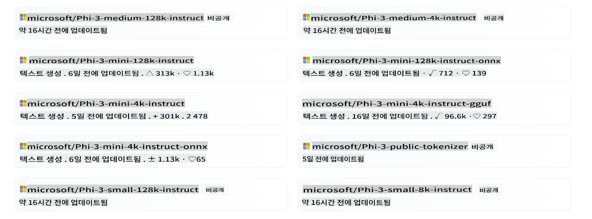
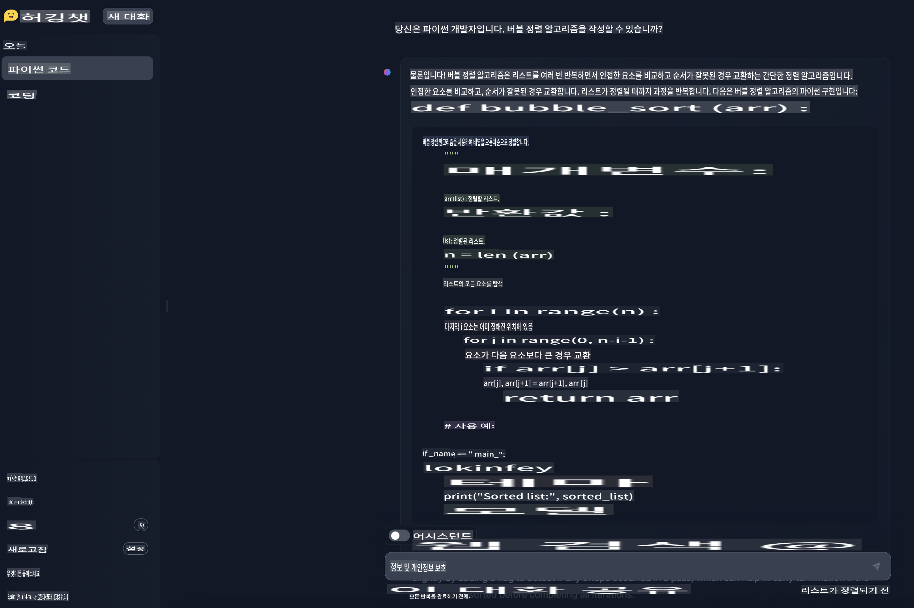

# **Hugging Face에서 Phi-3 사용하기**

[Hugging Face](https://huggingface.co/)는 풍부한 데이터와 오픈 소스 모델 자원을 가진 매우 인기 있는 AI 커뮤니티입니다. Microsoft, Meta, Mistral, Apple, Google 등 다양한 제조사들이 Hugging Face를 통해 오픈 소스 LLM과 SLM을 출시합니다.



Microsoft Phi-3가 Hugging Face에 출시되었습니다. 개발자는 시나리오와 비즈니스에 따라 해당 Phi-3 모델을 다운로드할 수 있습니다. Hugging Face에서 Phi-3 Pytorch 모델을 배포하는 것 외에도, GGUF 및 ONNX 형식을 사용하여 양자화된 모델도 출시하여 최종 사용자가 선택할 수 있도록 했습니다.

## **1. Hugging Face에서 Phi-3 다운로드하기**

```bash

git lfs install 

git clone https://huggingface.co/microsoft/Phi-3-mini-4k-instruct

```

## **2. Phi-3 프롬프트 템플릿 알아보기**

Phi-3를 훈련할 때 특정 데이터 템플릿이 있습니다. 따라서 Phi-3를 사용할 때 프롬프트를 보낼 때 템플릿을 통해 설정해야 합니다. 미세 조정 시에도 데이터를 템플릿에 따라 확장해야 합니다.

템플릿에는 시스템, 사용자, 어시스턴트라는 세 가지 역할이 있습니다.

```txt

<|system|>
Your Role<|end|>
<|user|>
Your Question?<|end|>
<|assistant|>

```

예를 들어

```txt

<|system|>
Your are a python developer.<|end|>
<|user|>
Help me generate a bubble algorithm<|end|>
<|assistant|>

```

## **3. Python으로 Phi-3 추론하기**

Phi-3를 사용한 추론은 입력 데이터에 기반하여 예측이나 출력을 생성하는 과정을 말합니다. Phi-3 모델은 Phi-3-Mini, Phi-3-Small, Phi-3-Medium과 같은 다양한 변형을 포함하는 작은 언어 모델(SLM) 계열로, 각기 다른 애플리케이션 시나리오와 다양한 매개변수 크기에 맞춰 설계되었습니다. 이 모델들은 고품질 데이터로 훈련되었으며, 채팅 기능, 정렬, 견고성, 안전성에 맞춰 미세 조정되었습니다. ONNX와 TensorFlow Lite를 사용하여 엣지와 클라우드 플랫폼 모두에서 배포할 수 있으며, Microsoft의 책임 있는 AI 원칙에 따라 개발되었습니다.

예를 들어, Phi-3-Mini는 38억 개의 매개변수를 가진 경량의 최첨단 오픈 모델로, 채팅 형식을 사용한 프롬프트에 적합하며 최대 128K 토큰의 컨텍스트 길이를 지원합니다. 이 무게 클래스에서 이렇게 긴 컨텍스트를 지원하는 첫 번째 모델입니다.

Phi-3 모델은 Azure AI MaaS, HuggingFace, NVIDIA, Ollama, ONNX와 같은 플랫폼에서 사용할 수 있으며, 실시간 상호작용, 자율 시스템, 저지연이 필요한 애플리케이션 등 다양한 용도로 사용할 수 있습니다.

Phi-3를 참조하는 방법은 여러 가지가 있습니다. 다양한 프로그래밍 언어를 사용하여 모델을 참조할 수 있습니다.

여기 Python 예제가 있습니다.

```python

import torch
from transformers import AutoModelForCausalLM, AutoTokenizer, pipeline

torch.random.manual_seed(0)

model = AutoModelForCausalLM.from_pretrained(
    "microsoft/Phi-3-mini-4k-instruct", 
    device_map="cuda", 
    torch_dtype="auto", 
    trust_remote_code=True, 
)
tokenizer = AutoTokenizer.from_pretrained("microsoft/Phi-3-mini-4k-instruct")

messages = [
    {"role": "system", "content": "Your are a python developer."},
    {"role": "user", "content": "Help me generate a bubble algorithm"},
]

pipe = pipeline(
    "text-generation",
    model=model,
    tokenizer=tokenizer,
)

generation_args = {
    "max_new_tokens": 600,
    "return_full_text": False,
    "temperature": 0.3,
    "do_sample": False,
}

output = pipe(messages, **generation_args)
print(output[0]['generated_text'])


```

> [!NOTE]
> 이 결과가 당신이 생각한 결과와 일치하는지 확인해 보세요

## **4. C#으로 Phi-3 추론하기**

.NET 콘솔 애플리케이션 예제가 있습니다.

C# 프로젝트에는 다음 패키지를 추가해야 합니다:

```bash
dotnet add package Microsoft.ML.OnnxRuntime --version 1.18.0
dotnet add package Microsoft.ML.OnnxRuntimeGenAI --version 0.3.0-rc2
dotnet add package Microsoft.ML.OnnxRuntimeGenAI.Cuda --version 0.3.0-rc2
```

여기 C# 코드가 있습니다.

```csharp
using System;
using Microsoft.ML.OnnxRuntimeGenAI;


// ONNX 모델 파일의 폴더 위치
var modelPath = @"..\models\Phi-3-mini-4k-instruct-onnx";
var model = new Model(modelPath);
var tokenizer = new Tokenizer(model);

var systemPrompt = "You are an AI assistant that helps people find information. Answer questions using a direct style. Do not share more information that the requested by the users.";

// 채팅 시작
Console.WriteLine(@"질문을 입력하세요. 빈 문자열을 입력하면 종료됩니다.");


// 채팅 루프
while (true)
{
    // 사용자 질문 받기
    Console.WriteLine();
    Console.Write(@"Q: ");
    var userQ = Console.ReadLine();    
    if (string.IsNullOrEmpty(userQ))
    {
        break;
    }

    // Phi3 응답 표시
    Console.Write("Phi3: ");
    var fullPrompt = $"<|system|>{systemPrompt}<|end|><|user|>{userQ}<|end|><|assistant|>";
    var tokens = tokenizer.Encode(fullPrompt);

    var generatorParams = new GeneratorParams(model);
    generatorParams.SetSearchOption("max_length", 2048);
    generatorParams.SetSearchOption("past_present_share_buffer", false);
    generatorParams.SetInputSequences(tokens);

    var generator = new Generator(model, generatorParams);
    while (!generator.IsDone())
    {
        generator.ComputeLogits();
        generator.GenerateNextToken();
        var outputTokens = generator.GetSequence(0);
        var newToken = outputTokens.Slice(outputTokens.Length - 1, 1);
        var output = tokenizer.Decode(newToken);
        Console.Write(output);
    }
    Console.WriteLine();
}
```

실행 데모는 다음과 유사합니다:


***참고:** 첫 번째 질문에 오타가 있지만, Phi-3는 충분히 똑똑해서 올바른 답을 공유합니다!*

## **5. Hugging Face Chat에서 Phi-3 사용하기**

Hugging Face 채팅은 관련 경험을 제공합니다. 브라우저에서 [여기서 Phi-3 채팅 시도](https://huggingface.co/chat/models/microsoft/Phi-3-mini-4k-instruct)를 입력하여 체험해보세요.



면책 조항: 이 번역은 원본을 AI 모델에 의해 번역된 것이며 완벽하지 않을 수 있습니다. 
출력을 검토하고 필요한 수정 사항을 반영해 주시기 바랍니다.