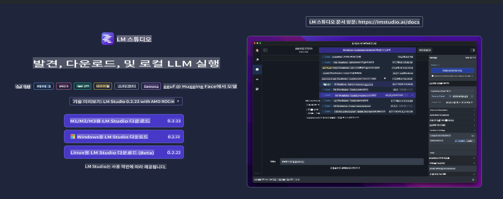
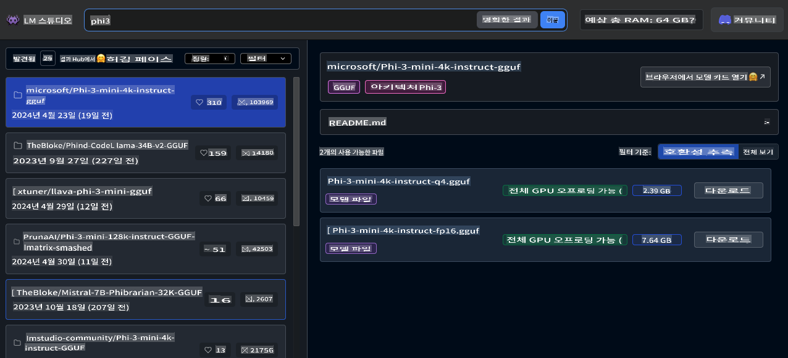
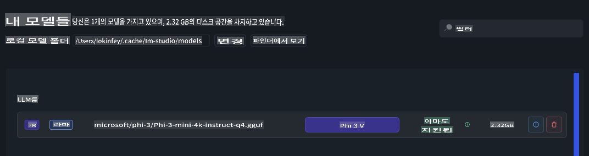
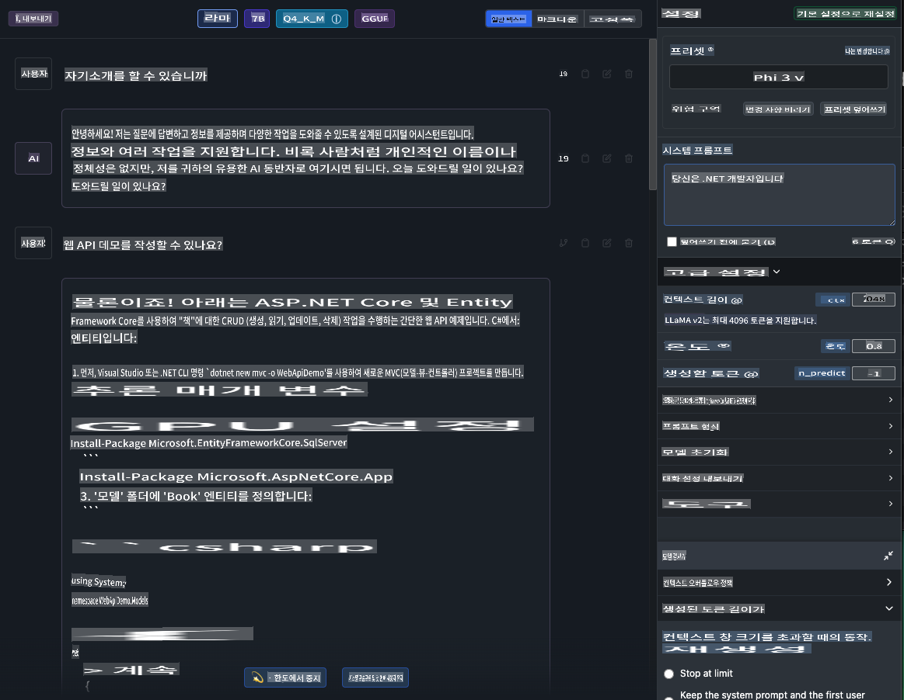
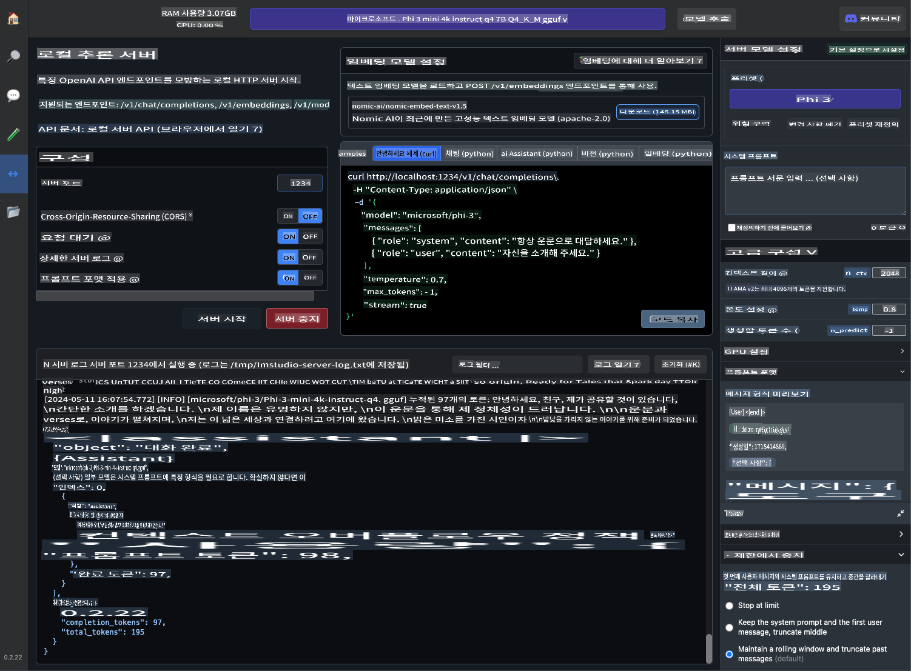
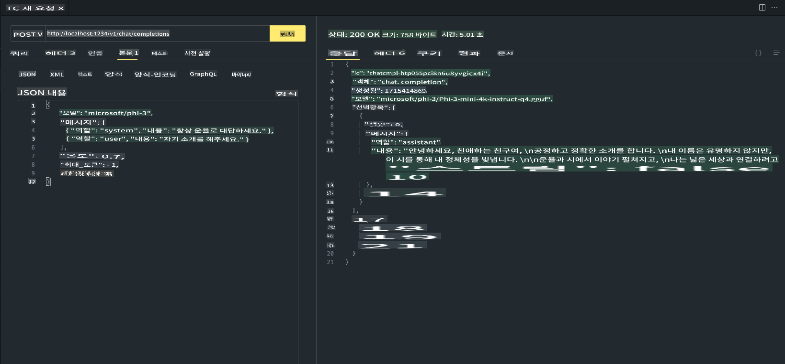

# **LM Studio에서 Phi-3 사용하기**

[LM Studio](https://lmstudio.ai)는 로컬 데스크탑 애플리케이션에서 SLM 및 LLM을 호출할 수 있는 애플리케이션입니다. 사용자는 다양한 모델을 쉽게 사용할 수 있으며, NVIDIA/AMD GPU/Apple Silicon을 사용한 가속 컴퓨팅을 지원합니다. LM Studio를 통해 사용자는 Hugging Face 기반의 다양한 오픈 소스 LLM 및 SLM을 다운로드, 설치 및 실행하여 코딩 없이 로컬에서 모델 성능을 테스트할 수 있습니다.

## **1. 설치**

LM Studio의 웹사이트 [https://lmstudio.ai/](https://lmstudio.ai/)를 통해 Windows, Linux, macOS 중 선택하여 설치할 수 있습니다.

## **2. LM Studio에서 Phi-3 다운로드하기**

LM Studio는 양자화된 gguf 형식의 오픈 소스 모델을 호출합니다. LM Studio Search UI에서 제공하는 플랫폼을 통해 직접 다운로드하거나, 직접 다운로드하여 관련 디렉토리에서 호출할 수 있습니다.

***LM Studio Search에서 Phi3를 검색하고 Phi-3 gguf 모델을 다운로드합니다***

***LM Studio를 통해 다운로드한 모델을 관리합니다***

## **3. LM Studio에서 Phi-3와 채팅하기**

LM Studio Chat에서 Phi-3를 선택하고 채팅 템플릿(Preset - Phi3)을 설정하여 Phi-3와 로컬 채팅을 시작합니다.

***참고***:

a. LM Studio 제어판에서 고급 설정을 통해 매개변수를 설정할 수 있습니다.

b. Phi-3는 특정 채팅 템플릿 요구 사항이 있기 때문에 Preset에서 반드시 Phi-3를 선택해야 합니다.

c. GPU 사용량 등 다양한 매개변수를 설정할 수도 있습니다.

## **4. LM Studio에서 Phi-3 API 호출하기**

LM Studio는 로컬 서비스의 빠른 배포를 지원하며, 코딩 없이 모델 서비스를 구축할 수 있습니다.

Postman에서의 결과는 다음과 같습니다.

**면책 조항**:
이 문서는 기계 기반 AI 번역 서비스를 사용하여 번역되었습니다. 정확성을 위해 노력하고 있지만, 자동 번역에는 오류나 부정확성이 포함될 수 있습니다. 원본 문서를 해당 언어로 작성된 원본 문서로 간주해야 합니다. 중요한 정보의 경우, 전문 인간 번역을 권장합니다. 이 번역 사용으로 인해 발생하는 오해나 잘못된 해석에 대해 우리는 책임을 지지 않습니다.