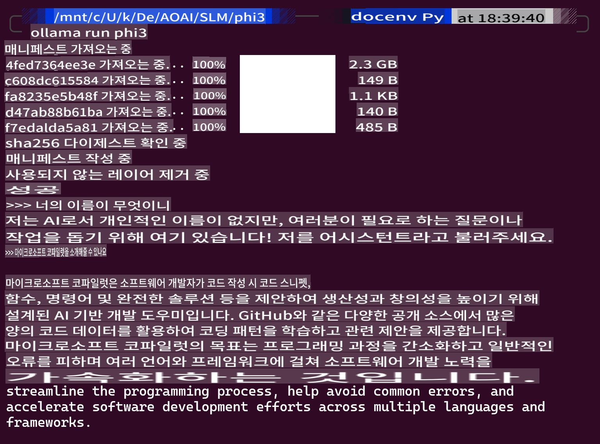
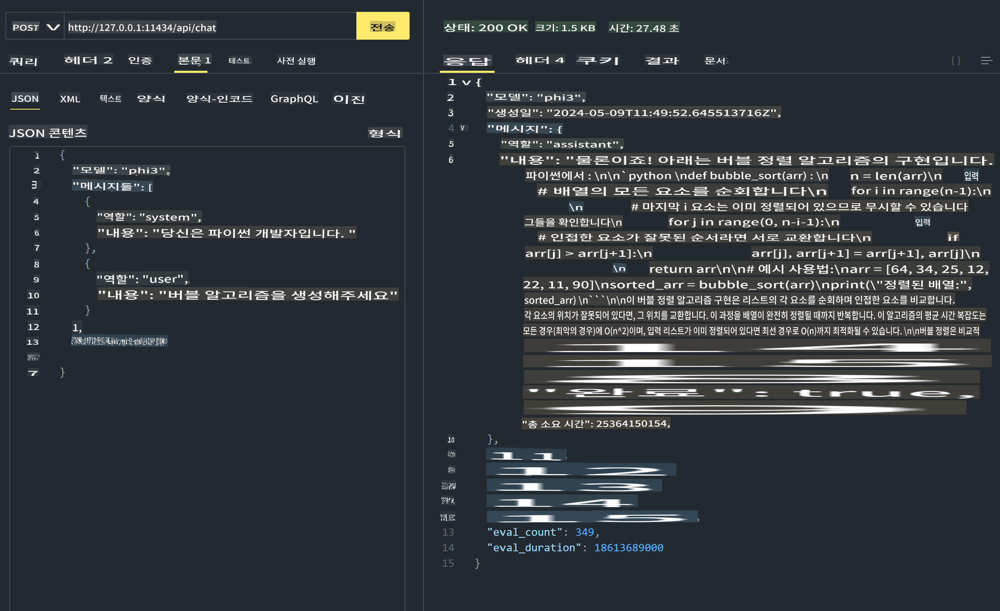
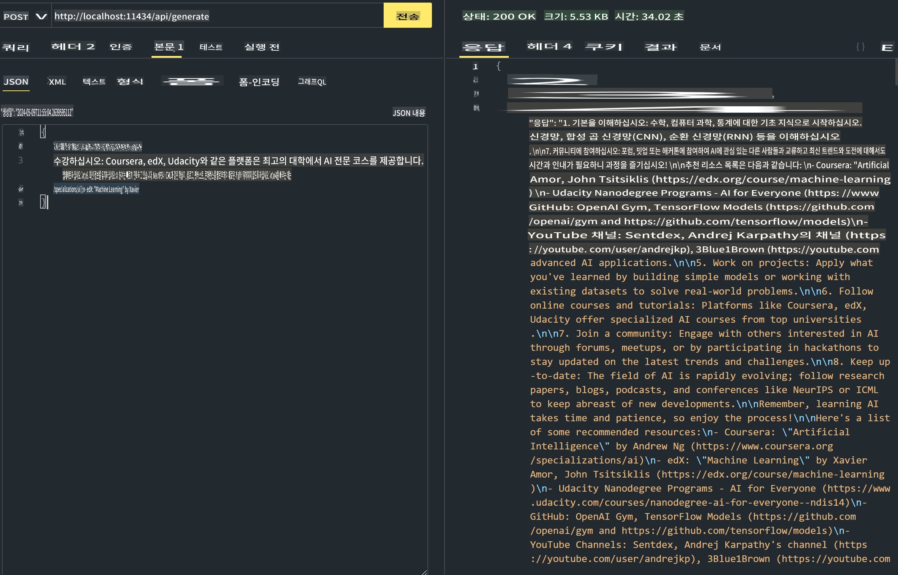

# **Ollama에서 Phi-3 사용하기**

[Ollama](https://ollama.com)은 간단한 스크립트를 통해 더 많은 사람들이 오픈 소스 LLM 또는 SLM을 직접 배포할 수 있게 하고, 로컬 Copilot 애플리케이션 시나리오를 돕기 위해 API를 구축할 수 있습니다.

## **1. 설치**

Ollama는 Windows, macOS, Linux에서 실행을 지원합니다. 이 링크 ([https://ollama.com/download](https://ollama.com/download))를 통해 Ollama를 설치할 수 있습니다. 설치가 완료되면 터미널 창에서 Ollama 스크립트를 사용하여 Phi-3을 호출할 수 있습니다. [Ollama의 모든 라이브러리](https://ollama.com/library)를 확인할 수 있습니다. 이 저장소를 Codespace에서 열면 Ollama가 이미 설치되어 있을 것입니다.

```bash

ollama run phi3

```

> [!NOTE]
> 처음 실행할 때 모델이 다운로드됩니다. 물론, 다운로드된 Phi-3 모델을 직접 지정할 수도 있습니다. WSL을 예로 들어 명령어를 실행해 보겠습니다. 모델 다운로드가 완료되면 터미널에서 바로 상호작용할 수 있습니다.



## **2. Ollama에서 phi-3 API 호출하기**

Ollama에서 생성된 Phi-3 API를 호출하려면, 터미널에서 이 명령어를 사용하여 Ollama 서버를 시작할 수 있습니다.

```bash

ollama serve

```

> [!NOTE]
> MacOS 또는 Linux를 실행 중인 경우, **"Error: listen tcp 127.0.0.1:11434: bind: address already in use"** 오류가 발생할 수 있습니다. 이 오류는 서버가 이미 실행 중임을 나타내는 경우가 많으므로 무시해도 되며, 아니면 Ollama를 중지하고 다시 시작할 수 있습니다:

**macOS**

```bash

brew services restart ollama

```

**Linux**

```bash

sudo systemctl stop ollama

```

Ollama는 두 가지 API를 지원합니다: generate와 chat. 필요에 따라 Ollama에서 제공하는 모델 API를 호출할 수 있으며, 로컬에서 11434 포트로 실행되는 서비스에 요청을 보낼 수 있습니다.

**Chat**

```bash

curl http://127.0.0.1:11434/api/chat -d '{
  "model": "phi3",
  "messages": [
    {
      "role": "system",
      "content": "Your are a python developer."
    },
    {
      "role": "user",
      "content": "Help me generate a bubble algorithm"
    }
  ],
  "stream": false
  
}'


```

Postman에서의 결과



```bash

curl http://127.0.0.1:11434/api/generate -d '{
  "model": "phi3",
  "prompt": "<|system|>Your are my AI assistant.<|end|><|user|>tell me how to learn AI<|end|><|assistant|>",
  "stream": false
}'


```

Postman에서의 결과



## 추가 자료

[Ollama의 라이브러리](https://ollama.com/library)에서 사용 가능한 모델 목록을 확인하세요.

이 명령어를 사용하여 Ollama 서버에서 모델을 가져오세요

```bash
ollama pull phi3
```

이 명령어를 사용하여 모델을 실행하세요

```bash
ollama run phi3
```

***참고:*** 더 자세히 알아보려면 이 링크를 방문하세요 [https://github.com/ollama/ollama/blob/main/docs/api.md](https://github.com/ollama/ollama/blob/main/docs/api.md)

## Python에서 Ollama 호출하기

`requests`나 `urllib3`를 사용하여 위에서 사용한 로컬 서버 엔드포인트에 요청을 보낼 수 있습니다. 그러나 Python에서 Ollama를 사용하는 인기 있는 방법은 [openai](https://pypi.org/project/openai/) SDK를 사용하는 것입니다. Ollama는 OpenAI 호환 서버 엔드포인트도 제공하기 때문입니다.

다음은 phi3-mini의 예입니다:

```python
import openai

client = openai.OpenAI(
    base_url="http://localhost:11434/v1",
    api_key="nokeyneeded",
)

response = client.chat.completions.create(
    model="phi3",
    temperature=0.7,
    n=1,
    messages=[
        {"role": "system", "content": "You are a helpful assistant."},
        {"role": "user", "content": "Write a haiku about a hungry cat"},
    ],
)

print("Response:")
print(response.choices[0].message.content)
```

## JavaScript에서 Ollama 호출하기 

```javascript
// Phi-3을 사용하여 파일 요약 예제
script({
    model: "ollama:phi3",
    title: "Summarize with Phi-3",
    system: ["system"],
})

// 요약 예제
const file = def("FILE", env.files)
$`Summarize ${file} in a single paragraph.`
```

## C#에서 Ollama 호출하기

새로운 C# 콘솔 애플리케이션을 만들고 다음 NuGet 패키지를 추가하세요:

```bash
dotnet add package Microsoft.SemanticKernel --version 1.13.0
```

그런 다음 `Program.cs` 파일에 다음 코드를 추가하세요

```csharp
using Microsoft.SemanticKernel;
using Microsoft.SemanticKernel.ChatCompletion;

// 로컬 Ollama 서버 엔드포인트를 사용하여 채팅 완료 서비스 추가
#pragma warning disable SKEXP0001, SKEXP0003, SKEXP0010, SKEXP0011, SKEXP0050, SKEXP0052
builder.AddOpenAIChatCompletion(
    modelId: "phi3.5",
    endpoint: new Uri("http://localhost:11434/"),
    apiKey: "non required");

// 채팅 서비스에 간단한 프롬프트 호출
string prompt = "Write a joke about kittens";
var response = await kernel.InvokePromptAsync(prompt);
Console.WriteLine(response.GetValue<string>());
```

이 명령어로 앱을 실행하세요:

```bash
dotnet run
```

면책 조항: 이 번역은 원본을 AI 모델에 의해 번역된 것으로, 완벽하지 않을 수 있습니다. 
출력을 검토하고 필요한 수정 사항을 반영해 주시기 바랍니다.