# Azure AI Foundry를 사용한 Phi-3 미니 모델의 파인튜닝

Microsoft의 Phi-3 Mini 언어 모델을 Azure AI Foundry를 통해 어떻게 파인튜닝할 수 있는지 살펴봅시다. 파인튜닝은 Phi-3 Mini를 특정 작업에 맞게 조정하여 더 강력하고 상황 인지적인 모델로 만드는 방법입니다.

## 고려사항

- **기능:** 어떤 모델이 파인튜닝 가능하며, 기본 모델을 어떤 작업에 맞게 조정할 수 있나요?
- **비용:** 파인튜닝의 가격 모델은 어떻게 되나요?
- **커스터마이징:** 기본 모델을 얼마나 수정할 수 있으며, 어떤 방식으로 수정할 수 있나요?
- **편의성:** 파인튜닝 과정은 어떻게 진행되나요? 커스텀 코드를 작성해야 하나요? 자체 컴퓨팅 자원을 가져와야 하나요?
- **안전성:** 파인튜닝된 모델은 안전성 문제가 있을 수 있는데, 의도치 않은 피해를 방지하기 위한 보호 장치가 있나요?

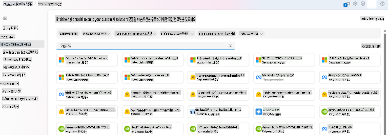

## 파인튜닝 준비

### 사전 준비 사항

> [!NOTE]
> Phi-3 계열 모델의 경우, 사용량 기반(pay-as-you-go) 모델 파인튜닝 제공은 **East US 2** 지역에서 생성된 허브에서만 가능합니다.

- Azure 구독. Azure 구독이 없다면 [유료 Azure 계정](https://azure.microsoft.com/pricing/purchase-options/pay-as-you-go)을 생성하여 시작하세요.

- [AI Foundry 프로젝트](https://ai.azure.com?WT.mc_id=aiml-138114-kinfeylo).
- Azure 역할 기반 액세스 제어(Azure RBAC)를 통해 Azure AI Foundry에서 작업에 대한 액세스를 부여합니다. 이 문서의 단계를 수행하려면 사용자 계정에 __Azure AI 개발자 역할__ 이 리소스 그룹에 할당되어 있어야 합니다.

### 구독 공급자 등록

구독이 `Microsoft.Network` 리소스 공급자에 등록되어 있는지 확인합니다.

1. [Azure 포털](https://portal.azure.com)에 로그인합니다.
1. 왼쪽 메뉴에서 **구독**을 선택합니다.
1. 사용할 구독을 선택합니다.
1. 왼쪽 메뉴에서 **AI 프로젝트 설정** > **리소스 공급자**를 선택합니다.
1. **Microsoft.Network**가 리소스 공급자 목록에 있는지 확인합니다. 없으면 추가합니다.

### 데이터 준비

모델을 파인튜닝하기 위해 학습 및 검증 데이터를 준비하세요. 학습 데이터와 검증 데이터 세트는 모델이 수행하기를 원하는 입력 및 출력 예제로 구성됩니다.

모든 학습 예제가 추론에 필요한 예상 형식을 따르는지 확인하세요. 효과적인 파인튜닝을 위해 균형 잡히고 다양한 데이터 세트를 준비하세요.

이는 데이터 균형을 유지하고, 다양한 시나리오를 포함하며, 학습 데이터를 주기적으로 개선하여 실제 기대치에 맞추는 과정을 포함합니다. 이를 통해 더 정확하고 균형 잡힌 모델 응답을 얻을 수 있습니다.

모델 유형에 따라 학습 데이터 형식이 다를 수 있습니다.

### 채팅 완성

사용할 학습 및 검증 데이터는 반드시 JSON Lines(JSONL) 문서 형식이어야 합니다. `Phi-3-mini-128k-instruct`의 경우, 파인튜닝 데이터 세트는 Chat completions API에서 사용되는 대화 형식으로 포맷되어야 합니다.

### 예제 파일 형식

```json
    {"messages": [{"role": "system", "content": "You are an Xbox customer support agent whose primary goal is to help users with issues they are experiencing with their Xbox devices. You are friendly and concise. You only provide factual answers to queries, and do not provide answers that are not related to Xbox."}, {"role": "user", "content": "Is Xbox better than PlayStation?"}, {"role": "assistant", "content": "I apologize, but I cannot provide personal opinions. My primary job is to assist you with any issues related to your Xbox device. Do you have any Xbox-related issues that need addressing?"}]}
    {"messages": [{"role": "system", "content": "You are an Xbox customer support agent whose primary goal is to help users with issues they are experiencing with their Xbox devices. You are friendly and concise. You only provide factual answers to queries, and do not provide answers that are not related to Xbox."}, {"role": "user", "content": "Can I play PC games on my Xbox?"}, {"role": "assistant", "content": "While Xbox consoles don't natively support PC games, they can play an array of Xbox games, many of which are also available on PC. Can I assist you with finding games compatible with your Xbox device?"}]}
    {"messages": [{"role": "system", "content": "You are an Xbox customer support agent whose primary goal is to help users with issues they are experiencing with their Xbox devices. You are friendly and concise. You only provide factual answers to queries, and do not provide answers that are not related to Xbox."}, {"role": "user", "content": "I'm having trouble connecting my Xbox to the Wi-Fi."}, {"role": "assistant", "content": "No worries, let's go through the network settings on your Xbox. Can you please tell me what happens when you try to connect it to the Wi-Fi?"}]}
```

지원되는 파일 형식은 JSON Lines입니다. 파일은 기본 데이터 저장소에 업로드되어 프로젝트에서 사용할 수 있습니다.

## Azure AI Foundry를 사용한 Phi-3 모델 파인튜닝

Azure AI Foundry를 사용하면 파인튜닝 과정을 통해 대규모 언어 모델을 개인 데이터 세트에 맞게 조정할 수 있습니다. 파인튜닝은 특정 작업 및 응용 프로그램에 맞게 사용자 정의 및 최적화를 가능하게 하여 성능 향상, 비용 효율성, 지연 시간 감소, 맞춤형 출력 등의 이점을 제공합니다.

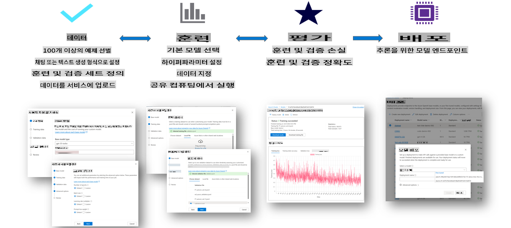

### 새 프로젝트 생성

1. [Azure AI Foundry](https://ai.azure.com)에 로그인합니다.

1. **+New project**를 선택하여 Azure AI Foundry에서 새 프로젝트를 생성합니다.

    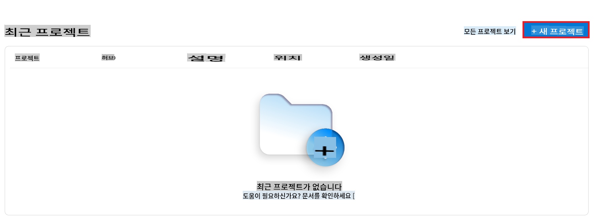

1. 다음 작업을 수행합니다:

    - 프로젝트 **허브 이름**을 입력합니다. 고유한 값이어야 합니다.
    - 사용할 **허브**를 선택합니다(필요한 경우 새로 생성).

    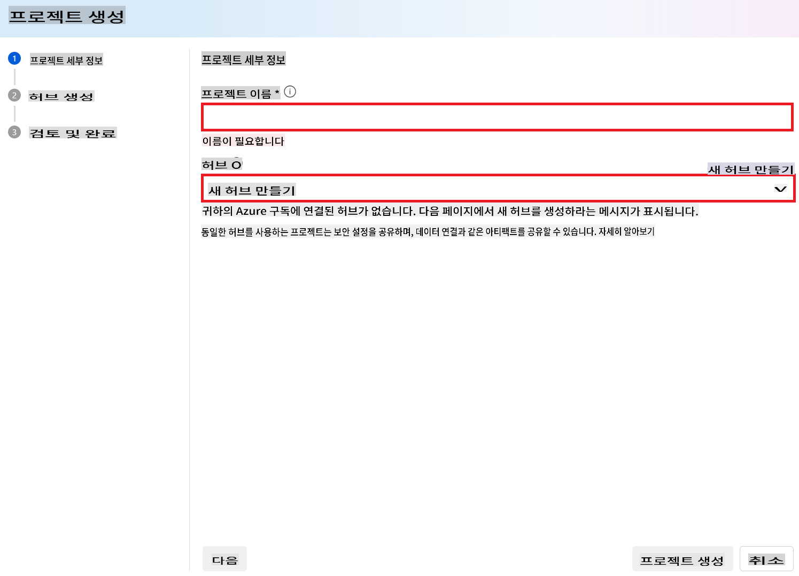

1. 새 허브를 생성하려면 다음 작업을 수행합니다:

    - **허브 이름**을 입력합니다. 고유한 값이어야 합니다.
    - Azure **구독**을 선택합니다.
    - 사용할 **리소스 그룹**을 선택합니다(필요한 경우 새로 생성).
    - 사용할 **위치**를 선택합니다.
    - 사용할 **Azure AI 서비스 연결**을 선택합니다(필요한 경우 새로 생성).
    - **Azure AI 검색 연결**에서 **연결 건너뛰기**를 선택합니다.

    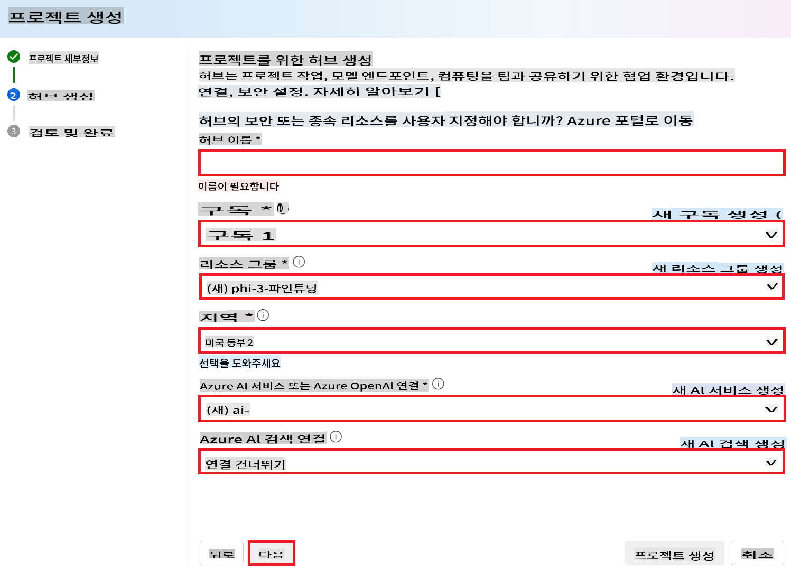

1. **다음**을 선택합니다.
1. **프로젝트 생성**을 선택합니다.

### 데이터 준비

파인튜닝 전에 채팅 지침, 질문-답변 쌍 또는 기타 관련 텍스트 데이터와 같은 작업과 관련된 데이터 세트를 수집하거나 생성하세요. 노이즈 제거, 누락된 값 처리, 텍스트 토큰화를 통해 데이터를 정리하고 전처리합니다.

### Azure AI Foundry에서 Phi-3 모델 파인튜닝

> [!NOTE]
> Phi-3 모델의 파인튜닝은 현재 East US 2에 위치한 프로젝트에서 지원됩니다.

1. 왼쪽 탭에서 **모델 카탈로그**를 선택합니다.

1. **검색창**에 *phi-3*을 입력하고 사용할 phi-3 모델을 선택합니다.

    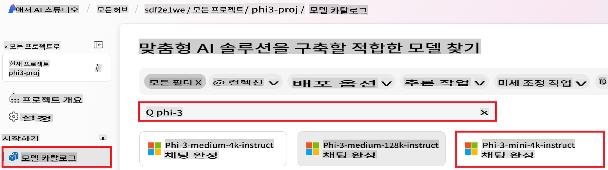

1. **Fine-tune**을 선택합니다.

    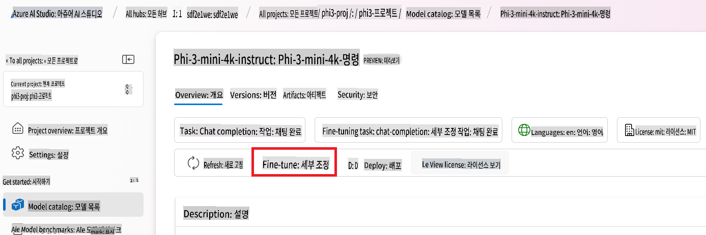

1. **파인튜닝된 모델 이름**을 입력합니다.

    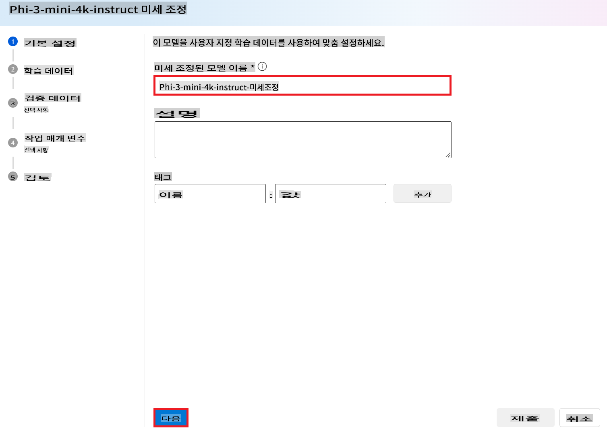

1. **다음**을 선택합니다.

1. 다음 작업을 수행합니다:

    - **작업 유형**을 **채팅 완성**으로 선택합니다.
    - 사용할 **학습 데이터**를 선택합니다. Azure AI Foundry의 데이터 또는 로컬 환경에서 업로드할 수 있습니다.

    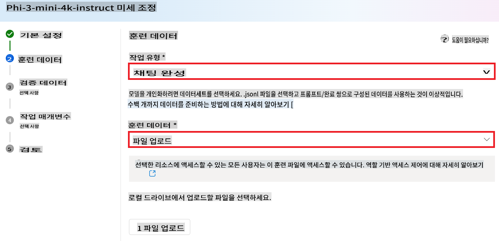

1. **다음**을 선택합니다.

1. 사용할 **검증 데이터**를 업로드합니다. 또는 **학습 데이터 자동 분할**을 선택할 수 있습니다.

    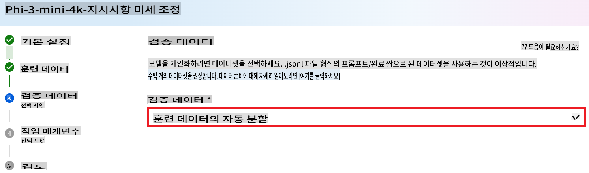

1. **다음**을 선택합니다.

1. 다음 작업을 수행합니다:

    - 사용할 **배치 크기 배수**를 선택합니다.
    - 사용할 **학습률**을 선택합니다.
    - 사용할 **에포크**를 선택합니다.

    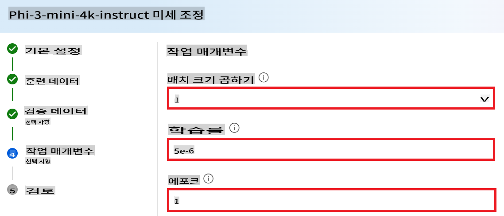

1. **제출**을 선택하여 파인튜닝 프로세스를 시작합니다.

    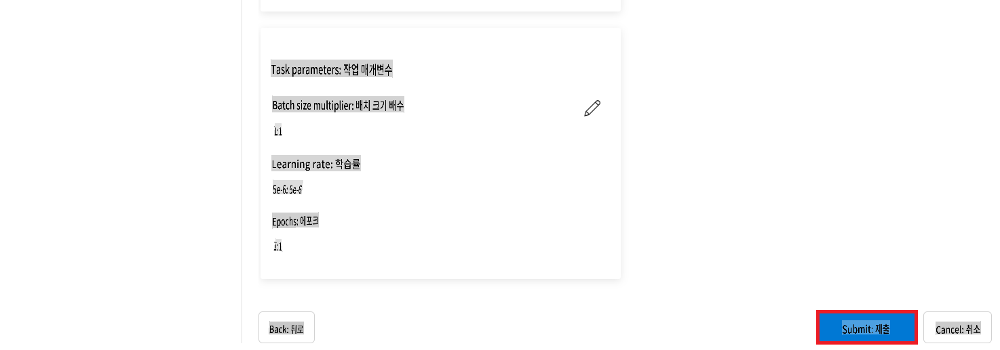

1. 모델 파인튜닝이 완료되면 상태가 **완료됨**으로 표시됩니다. 이제 모델을 배포하고, 애플리케이션, 플레이그라운드 또는 프롬프트 플로우에서 사용할 수 있습니다. 자세한 내용은 [Azure AI Foundry를 사용하여 Phi-3 계열 소형 언어 모델 배포](https://learn.microsoft.com/azure/ai-studio/how-to/deploy-models-phi-3?tabs=phi-3-5&pivots=programming-language-python)를 참조하세요.

    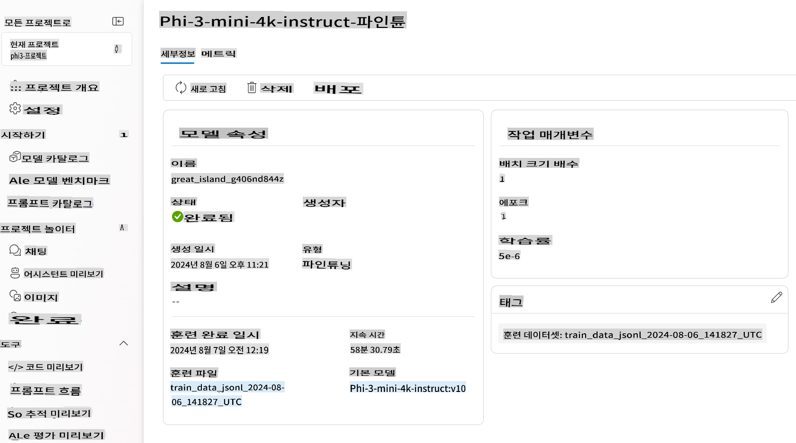

> [!NOTE]
> Phi-3 파인튜닝에 대한 자세한 내용은 [Azure AI Foundry에서 Phi-3 모델 파인튜닝](https://learn.microsoft.com/azure/ai-studio/how-to/fine-tune-phi-3?tabs=phi-3-mini)을 참조하세요.

## 파인튜닝된 모델 정리

파인튜닝된 모델은 [Azure AI Foundry](https://ai.azure.com)의 파인튜닝 모델 목록이나 모델 세부 정보 페이지에서 삭제할 수 있습니다. 파인튜닝 페이지에서 삭제할 모델을 선택한 후 **삭제** 버튼을 클릭하여 모델을 삭제합니다.

> [!NOTE]
> 배포가 존재하는 커스텀 모델은 삭제할 수 없습니다. 커스텀 모델을 삭제하기 전에 모델 배포를 먼저 삭제해야 합니다.

## 비용 및 할당량

### 서비스로 제공되는 Phi-3 모델의 비용 및 할당량 고려사항

서비스로 제공되는 Phi 모델은 Microsoft에서 제공하며 Azure AI Foundry와 통합되어 사용됩니다. 모델을 [배포](https://learn.microsoft.com/azure/ai-studio/how-to/deploy-models-phi-3?tabs=phi-3-5&pivots=programming-language-python)하거나 파인튜닝할 때 배포 마법사의 가격 및 약관 탭에서 가격을 확인할 수 있습니다.

## 콘텐츠 필터링

사용량 기반(pay-as-you-go)으로 서비스에 배포된 모델은 Azure AI Content Safety로 보호됩니다. 실시간 엔드포인트에 배포할 때 이 기능을 선택 해제할 수 있습니다. Azure AI 콘텐츠 안전이 활성화되면 프롬프트와 완성된 응답 모두 유해 콘텐츠 출력을 탐지하고 방지하기 위한 분류 모델 앙상블을 통과합니다. 콘텐츠 필터링 시스템은 입력 프롬프트와 출력 완성에서 잠재적으로 유해한 콘텐츠의 특정 범주를 탐지하고 이에 대해 조치를 취합니다. 자세한 내용은 [Azure AI Content Safety](https://learn.microsoft.com/azure/ai-studio/concepts/content-filtering)를 참조하세요.

**파인튜닝 구성**

하이퍼파라미터: 학습률, 배치 크기, 학습 에포크 수와 같은 하이퍼파라미터를 정의합니다.

**손실 함수**

작업에 적합한 손실 함수를 선택합니다(예: 교차 엔트로피).

**최적화 도구**

학습 중 그래디언트 업데이트를 위한 최적화 도구(예: Adam)를 선택합니다.

**파인튜닝 프로세스**

- 사전 학습된 모델 로드: Phi-3 Mini 체크포인트를 로드합니다.
- 커스텀 레이어 추가: 작업에 특화된 레이어(예: 채팅 지침을 위한 분류 헤드)를 추가합니다.

**모델 학습**
준비된 데이터 세트를 사용하여 모델을 파인튜닝합니다. 학습 진행 상황을 모니터링하고 필요에 따라 하이퍼파라미터를 조정합니다.

**평가 및 검증**

검증 세트: 데이터를 학습 세트와 검증 세트로 나눕니다.

**성능 평가**

정확도, F1 점수, 퍼플렉서티(perplexity)와 같은 지표를 사용하여 모델 성능을 평가합니다.

## 파인튜닝된 모델 저장

**체크포인트**
미래 사용을 위해 파인튜닝된 모델 체크포인트를 저장합니다.

## 배포

- 웹 서비스로 배포: 파인튜닝된 모델을 Azure AI Foundry에서 웹 서비스로 배포합니다.
- 엔드포인트 테스트: 배포된 엔드포인트에 테스트 쿼리를 전송하여 기능을 확인합니다.

## 반복 및 개선

반복: 성능이 만족스럽지 않은 경우, 하이퍼파라미터를 조정하거나 데이터를 추가하거나 추가 에포크 동안 파인튜닝하여 개선합니다.

## 모니터링 및 조정

모델의 동작을 지속적으로 모니터링하고 필요에 따라 조정합니다.

## 사용자 정의 및 확장

커스텀 작업: Phi-3 Mini는 채팅 지침 외에도 다양한 작업에 맞게 파인튜닝할 수 있습니다. 다른 사용 사례를 탐구하세요!
실험: 성능을 향상시키기 위해 다양한 아키텍처, 레이어 조합 및 기술을 시도해 보세요.

> [!NOTE]
> 파인튜닝은 반복적인 과정입니다. 실험하고 배우며 모델을 조정하여 특정 작업에서 최상의 결과를 얻으세요!

**면책 조항**:  
이 문서는 기계 기반 AI 번역 서비스를 사용하여 번역되었습니다. 정확성을 위해 노력하고 있지만, 자동 번역에는 오류나 부정확성이 포함될 수 있습니다. 원어로 작성된 원본 문서를 신뢰할 수 있는 권위 있는 자료로 간주해야 합니다. 중요한 정보의 경우, 전문적인 인간 번역을 권장합니다. 이 번역을 사용하여 발생하는 오해나 잘못된 해석에 대해 당사는 책임을 지지 않습니다.