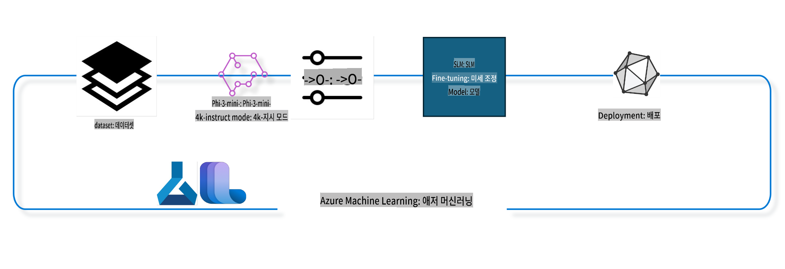

## Azure ML 시스템 레지스트리에서 채팅-완성 컴포넌트를 사용하여 모델 미세 조정하기

이 예제에서는 ultrachat_200k 데이터셋을 사용하여 두 사람 간의 대화를 완성하는 Phi-3-mini-4k-instruct 모델의 미세 조정을 수행합니다.



이 예제는 Azure ML SDK와 Python을 사용하여 미세 조정을 수행하고, 이후 미세 조정된 모델을 온라인 엔드포인트에 배포하여 실시간 추론을 수행하는 방법을 보여줍니다.

### 학습 데이터

우리는 ultrachat_200k 데이터셋을 사용할 것입니다. 이 데이터셋은 UltraChat 데이터셋의 강력히 필터링된 버전이며, 최첨단 7b 채팅 모델인 Zephyr-7B-β를 학습시키는 데 사용되었습니다.

### 모델

Phi-3-mini-4k-instruct 모델을 사용하여 채팅-완성 작업에 대해 사용자가 모델을 미세 조정하는 방법을 보여줍니다. 이 노트북을 특정 모델 카드에서 열었다면, 해당 모델 이름으로 대체하세요.

### 작업

- 미세 조정할 모델 선택
- 학습 데이터 선택 및 탐색
- 미세 조정 작업 구성
- 미세 조정 작업 실행
- 학습 및 평가 지표 검토
- 미세 조정된 모델 등록
- 실시간 추론을 위해 미세 조정된 모델 배포
- 리소스 정리

## 1. 사전 요구 사항 설정

- 종속성 설치
- AzureML 워크스페이스에 연결. SDK 인증 설정에 대한 자세한 내용은 여기에서 확인하세요. 아래의 <WORKSPACE_NAME>, <RESOURCE_GROUP>, <SUBSCRIPTION_ID>를 대체하세요.
- AzureML 시스템 레지스트리에 연결
- 실험 이름 설정 (선택 사항)
- 컴퓨팅 확인 또는 생성

> [!NOTE]
> 요구 사항: 단일 GPU 노드에는 여러 GPU 카드가 있을 수 있습니다. 예를 들어, Standard_NC24rs_v3 노드 하나에는 NVIDIA V100 GPU가 4개 있고, Standard_NC12s_v3에는 NVIDIA V100 GPU가 2개 있습니다. 이에 대한 정보는 문서를 참조하세요. 노드당 GPU 카드 수는 아래의 gpus_per_node 매개변수에서 설정됩니다. 이 값을 올바르게 설정하면 노드의 모든 GPU를 활용할 수 있습니다. 권장 GPU 컴퓨팅 SKU는 여기와 여기를 참조하세요.

### Python 라이브러리

아래 셀을 실행하여 종속성을 설치합니다. 새로운 환경에서 실행하는 경우 필수 단계입니다.

```bash
pip install azure-ai-ml
pip install azure-identity
pip install datasets==2.9.0
pip install mlflow
pip install azureml-mlflow
```

### Azure ML과 상호작용하기

1. 이 Python 스크립트는 Azure Machine Learning (Azure ML) 서비스와 상호작용하기 위해 사용됩니다. 주요 기능은 다음과 같습니다:

    - azure.ai.ml, azure.identity, azure.ai.ml.entities 패키지에서 필요한 모듈을 가져옵니다. 또한 time 모듈도 가져옵니다.

    - DefaultAzureCredential()을 사용하여 인증을 시도합니다. 이는 Azure 클라우드에서 애플리케이션을 빠르게 개발할 수 있도록 간소화된 인증 경험을 제공합니다. 실패할 경우 InteractiveBrowserCredential()로 대체하여 대화형 로그인 프롬프트를 제공합니다.

    - from_config 메서드를 사용하여 기본 구성 파일(config.json)에서 구성을 읽어 MLClient 인스턴스를 생성합니다. 실패할 경우 subscription_id, resource_group_name, workspace_name을 수동으로 제공하여 MLClient 인스턴스를 생성합니다.

    - "azureml"이라는 Azure ML 레지스트리를 위한 MLClient 인스턴스를 생성합니다. 이 레지스트리는 모델, 미세 조정 파이프라인 및 환경이 저장된 곳입니다.

    - 실험 이름을 "chat_completion_Phi-3-mini-4k-instruct"로 설정합니다.

    - 현재 시간을 초 단위로 가져와 정수로 변환한 후 문자열로 변환하여 고유한 타임스탬프를 생성합니다. 이 타임스탬프는 고유한 이름과 버전을 생성하는 데 사용할 수 있습니다.

    ```python
    # Import necessary modules from Azure ML and Azure Identity
    from azure.ai.ml import MLClient
    from azure.identity import (
        DefaultAzureCredential,
        InteractiveBrowserCredential,
    )
    from azure.ai.ml.entities import AmlCompute
    import time  # Import time module
    
    # Try to authenticate using DefaultAzureCredential
    try:
        credential = DefaultAzureCredential()
        credential.get_token("https://management.azure.com/.default")
    except Exception as ex:  # If DefaultAzureCredential fails, use InteractiveBrowserCredential
        credential = InteractiveBrowserCredential()
    
    # Try to create an MLClient instance using the default config file
    try:
        workspace_ml_client = MLClient.from_config(credential=credential)
    except:  # If that fails, create an MLClient instance by manually providing the details
        workspace_ml_client = MLClient(
            credential,
            subscription_id="<SUBSCRIPTION_ID>",
            resource_group_name="<RESOURCE_GROUP>",
            workspace_name="<WORKSPACE_NAME>",
        )
    
    # Create another MLClient instance for the Azure ML registry named "azureml"
    # This registry is where models, fine-tuning pipelines, and environments are stored
    registry_ml_client = MLClient(credential, registry_name="azureml")
    
    # Set the experiment name
    experiment_name = "chat_completion_Phi-3-mini-4k-instruct"
    
    # Generate a unique timestamp that can be used for names and versions that need to be unique
    timestamp = str(int(time.time()))
    ```

## 2. 미세 조정할 기본 모델 선택

1. Phi-3-mini-4k-instruct는 3.8B 파라미터를 가진 경량의 최첨단 오픈 모델로, Phi-2에 사용된 데이터셋을 기반으로 구축되었습니다. 이 모델은 Phi-3 모델 패밀리에 속하며, Mini 버전은 4K 및 128K 두 가지 변형으로 제공됩니다. 이 변형은 토큰 단위로 지원할 수 있는 컨텍스트 길이를 나타냅니다. 모델을 특정 목적에 맞게 사용하려면 미세 조정이 필요합니다. AzureML Studio의 모델 카탈로그에서 채팅-완성 작업으로 필터링하여 이러한 모델을 탐색할 수 있습니다. 이 예제에서는 Phi-3-mini-4k-instruct 모델을 사용합니다. 다른 모델을 위해 이 노트북을 열었다면 모델 이름과 버전을 적절히 변경하세요.

    > [!NOTE]
    > 모델의 id 속성은 미세 조정 작업에 입력으로 전달됩니다. 이는 AzureML Studio 모델 카탈로그의 모델 세부 정보 페이지에서 자산 ID 필드로도 확인할 수 있습니다.

2. 이 Python 스크립트는 Azure Machine Learning (Azure ML) 서비스와 상호작용합니다. 주요 기능은 다음과 같습니다:

    - model_name을 "Phi-3-mini-4k-instruct"로 설정합니다.

    - registry_ml_client 객체의 models 속성의 get 메서드를 사용하여 지정된 이름의 모델 최신 버전을 Azure ML 레지스트리에서 가져옵니다. get 메서드는 모델 이름과 최신 버전을 지정하는 라벨을 인수로 사용합니다.

    - 미세 조정에 사용할 모델의 이름, 버전, id를 콘솔에 출력합니다. 문자열의 format 메서드를 사용하여 이름, 버전, id를 메시지에 삽입합니다. 모델의 이름, 버전, id는 foundation_model 객체의 속성으로 접근합니다.

    ```python
    # Set the model name
    model_name = "Phi-3-mini-4k-instruct"
    
    # Get the latest version of the model from the Azure ML registry
    foundation_model = registry_ml_client.models.get(model_name, label="latest")
    
    # Print the model name, version, and id
    # This information is useful for tracking and debugging
    print(
        "\n\nUsing model name: {0}, version: {1}, id: {2} for fine tuning".format(
            foundation_model.name, foundation_model.version, foundation_model.id
        )
    )
    ```

## 3. 작업에 사용할 컴퓨팅 생성

미세 조정 작업은 GPU 컴퓨팅에서만 작동합니다. 컴퓨팅의 크기는 모델 크기에 따라 달라지며, 대부분의 경우 작업에 적합한 컴퓨팅을 식별하는 것이 까다로울 수 있습니다. 이 셀에서는 사용자가 작업에 적합한 컴퓨팅을 선택하도록 안내합니다.

> [!NOTE]
> 아래 나열된 컴퓨팅은 가장 최적화된 구성에서 작동합니다. 구성 변경은 Cuda Out Of Memory 오류를 초래할 수 있습니다. 이러한 경우 더 큰 컴퓨팅 크기로 업그레이드하세요.

> [!NOTE]
> 아래에서 compute_cluster_size를 선택할 때, 해당 컴퓨팅이 리소스 그룹에서 사용 가능한지 확인하세요. 특정 컴퓨팅이 사용 불가능하다면, 컴퓨팅 리소스에 대한 액세스를 요청할 수 있습니다.

### 미세 조정 지원 모델 확인

1. 이 Python 스크립트는 Azure Machine Learning (Azure ML) 모델과 상호작용합니다. 주요 기능은 다음과 같습니다:

    - ast 모듈을 가져옵니다. 이는 Python 추상 구문 트리를 처리하는 함수를 제공합니다.

    - foundation_model 객체(모델을 나타냄)에 finetune_compute_allow_list라는 태그가 있는지 확인합니다. Azure ML의 태그는 생성할 수 있는 키-값 쌍으로, 모델을 필터링하고 정렬하는 데 사용할 수 있습니다.

    - finetune_compute_allow_list 태그가 있는 경우, ast.literal_eval 함수를 사용하여 태그 값을 Python 리스트로 안전하게 구문 분석합니다. 그런 다음 이 리스트를 computes_allow_list 변수에 할당합니다. 이후 리스트에서 컴퓨팅을 생성하라는 메시지를 출력합니다.

    - finetune_compute_allow_list 태그가 없는 경우, computes_allow_list를 None으로 설정하고 모델 태그에 finetune_compute_allow_list 태그가 없다는 메시지를 출력합니다.

    - 요약하면, 이 스크립트는 모델 메타데이터에서 특정 태그를 확인하고, 태그 값이 존재하면 이를 리스트로 변환하며, 사용자에게 적절히 피드백을 제공합니다.

    ```python
    # Import the ast module, which provides functions to process trees of the Python abstract syntax grammar
    import ast
    
    # Check if the 'finetune_compute_allow_list' tag is present in the model's tags
    if "finetune_compute_allow_list" in foundation_model.tags:
        # If the tag is present, use ast.literal_eval to safely parse the tag's value (a string) into a Python list
        computes_allow_list = ast.literal_eval(
            foundation_model.tags["finetune_compute_allow_list"]
        )  # convert string to python list
        # Print a message indicating that a compute should be created from the list
        print(f"Please create a compute from the above list - {computes_allow_list}")
    else:
        # If the tag is not present, set computes_allow_list to None
        computes_allow_list = None
        # Print a message indicating that the 'finetune_compute_allow_list' tag is not part of the model's tags
        print("`finetune_compute_allow_list` is not part of model tags")
    ```

### 컴퓨팅 인스턴스 확인

1. 이 Python 스크립트는 Azure Machine Learning (Azure ML) 서비스와 상호작용하며 컴퓨팅 인스턴스에 대해 여러 가지 검사를 수행합니다. 주요 기능은 다음과 같습니다:

    - compute_cluster에 저장된 이름으로 Azure ML 워크스페이스에서 컴퓨팅 인스턴스를 검색하려고 시도합니다. 컴퓨팅 인스턴스의 프로비저닝 상태가 "failed"인 경우 ValueError를 발생시킵니다.

    - computes_allow_list가 None이 아닌지 확인합니다. None이 아닌 경우, 리스트의 모든 컴퓨팅 크기를 소문자로 변환한 후 현재 컴퓨팅 인스턴스 크기가 리스트에 있는지 확인합니다. 없으면 ValueError를 발생시킵니다.

    - computes_allow_list가 None인 경우, 현재 컴퓨팅 인스턴스 크기가 지원되지 않는 GPU VM 크기 리스트에 있는지 확인합니다. 있다면 ValueError를 발생시킵니다.

    - 워크스페이스에서 사용 가능한 모든 컴퓨팅 크기의 리스트를 검색합니다. 그런 다음 이 리스트를 반복하여 각 컴퓨팅 크기의 이름이 현재 컴퓨팅 인스턴스 크기와 일치하는지 확인합니다. 일치하면 해당 컴퓨팅 크기의 GPU 수를 검색하고 gpu_count_found를 True로 설정합니다.

    - gpu_count_found가 True인 경우 컴퓨팅 인스턴스의 GPU 수를 출력합니다. gpu_count_found가 False인 경우 ValueError를 발생시킵니다.

    - 요약하면, 이 스크립트는 Azure ML 워크스페이스에서 컴퓨팅 인스턴스에 대한 여러 검사를 수행하며, 여기에는 프로비저닝 상태, 허용 또는 금지 리스트에 대한 크기 확인, 그리고 GPU 수 확인이 포함됩니다.

    ```python
    # Print the exception message
    print(e)
    # Raise a ValueError if the compute size is not available in the workspace
    raise ValueError(
        f"WARNING! Compute size {compute_cluster_size} not available in workspace"
    )
    
    # Retrieve the compute instance from the Azure ML workspace
    compute = workspace_ml_client.compute.get(compute_cluster)
    # Check if the provisioning state of the compute instance is "failed"
    if compute.provisioning_state.lower() == "failed":
        # Raise a ValueError if the provisioning state is "failed"
        raise ValueError(
            f"Provisioning failed, Compute '{compute_cluster}' is in failed state. "
            f"please try creating a different compute"
        )
    
    # Check if computes_allow_list is not None
    if computes_allow_list is not None:
        # Convert all compute sizes in computes_allow_list to lowercase
        computes_allow_list_lower_case = [x.lower() for x in computes_allow_list]
        # Check if the size of the compute instance is in computes_allow_list_lower_case
        if compute.size.lower() not in computes_allow_list_lower_case:
            # Raise a ValueError if the size of the compute instance is not in computes_allow_list_lower_case
            raise ValueError(
                f"VM size {compute.size} is not in the allow-listed computes for finetuning"
            )
    else:
        # Define a list of unsupported GPU VM sizes
        unsupported_gpu_vm_list = [
            "standard_nc6",
            "standard_nc12",
            "standard_nc24",
            "standard_nc24r",
        ]
        # Check if the size of the compute instance is in unsupported_gpu_vm_list
        if compute.size.lower() in unsupported_gpu_vm_list:
            # Raise a ValueError if the size of the compute instance is in unsupported_gpu_vm_list
            raise ValueError(
                f"VM size {compute.size} is currently not supported for finetuning"
            )
    
    # Initialize a flag to check if the number of GPUs in the compute instance has been found
    gpu_count_found = False
    # Retrieve a list of all available compute sizes in the workspace
    workspace_compute_sku_list = workspace_ml_client.compute.list_sizes()
    available_sku_sizes = []
    # Iterate over the list of available compute sizes
    for compute_sku in workspace_compute_sku_list:
        available_sku_sizes.append(compute_sku.name)
        # Check if the name of the compute size matches the size of the compute instance
        if compute_sku.name.lower() == compute.size.lower():
            # If it does, retrieve the number of GPUs for that compute size and set gpu_count_found to True
            gpus_per_node = compute_sku.gpus
            gpu_count_found = True
    # If gpu_count_found is True, print the number of GPUs in the compute instance
    if gpu_count_found:
        print(f"Number of GPU's in compute {compute.size}: {gpus_per_node}")
    else:
        # If gpu_count_found is False, raise a ValueError
        raise ValueError(
            f"Number of GPU's in compute {compute.size} not found. Available skus are: {available_sku_sizes}."
            f"This should not happen. Please check the selected compute cluster: {compute_cluster} and try again."
        )
    ```

## 4. 모델 미세 조정을 위한 데이터셋 선택

1. 우리는 ultrachat_200k 데이터셋을 사용합니다. 이 데이터셋은 Supervised fine-tuning (sft)에 적합한 네 가지 분할을 가지고 있습니다. 분할당 예제 수는 다음과 같습니다:

    ```bash
    train_sft test_sft  train_gen  test_gen
    207865  23110  256032  28304
    ```

1. 다음 몇 개의 셀은 미세 조정을 위한 기본 데이터 준비를 보여줍니다:

### 데이터 행 시각화

이 샘플을 빠르게 실행하기 위해, 이미 다듬어진 행의 5%를 포함하는 train_sft, test_sft 파일을 저장합니다. 이는 미세 조정된 모델의 정확도가 낮아질 것을 의미하며, 따라서 실제 환경에서 사용해서는 안 됩니다.  
download-dataset.py는 ultrachat_200k 데이터셋을 다운로드하고 데이터셋을 미세 조정 파이프라인 컴포넌트에서 사용할 수 있는 형식으로 변환하는 데 사용됩니다. 또한 데이터셋이 크기 때문에 여기에서는 데이터셋의 일부만 사용합니다.

1. 아래 스크립트를 실행하면 데이터의 5%만 다운로드됩니다. dataset_split_pc 매개변수를 원하는 비율로 변경하여 이 비율을 늘릴 수 있습니다.

    > [!NOTE]
    > 일부 언어 모델은 서로 다른 언어 코드를 가지고 있으므로 데이터셋의 열 이름도 이를 반영해야 합니다.

1. 데이터가 어떻게 보여야 하는지에 대한 예시는 다음과 같습니다.  
채팅-완성 데이터셋은 각 항목이 다음 스키마를 사용하는 parquet 형식으로 저장됩니다:

    - 이는 JSON (JavaScript Object Notation) 문서입니다. 실행 가능한 코드가 아니라 데이터를 저장하고 전송하는 형식입니다. 구조는 다음과 같습니다:

    - "prompt": AI 어시스턴트에게 제시된 작업 또는 질문을 나타내는 문자열 값입니다.

    - "messages": 사용자와 AI 어시스턴트 간 대화의 메시지를 나타내는 객체 배열입니다. 각 메시지 객체는 다음 두 가지 키를 포함합니다:
        - "content": 메시지 내용을 나타내는 문자열 값입니다.
        - "role": 메시지를 보낸 엔티티의 역할을 나타내는 문자열 값입니다. "user" 또는 "assistant"일 수 있습니다.
    - "prompt_id": 프롬프트에 대한 고유 식별자를 나타내는 문자열 값입니다.

1. 이 특정 JSON 문서에서는 사용자가 AI 어시스턴트에게 디스토피아 스토리의 주인공을 생성하도록 요청하는 대화를 나타냅니다. 어시스턴트가 응답하고, 사용자가 추가 세부 정보를 요청하며, 어시스턴트가 이에 동의합니다. 전체 대화는 특정 프롬프트 ID와 연관됩니다.

    ```python
    {
        // The task or question posed to an AI assistant
        "prompt": "Create a fully-developed protagonist who is challenged to survive within a dystopian society under the rule of a tyrant. ...",
        
        // An array of objects, each representing a message in a conversation between a user and an AI assistant
        "messages":[
            {
                // The content of the user's message
                "content": "Create a fully-developed protagonist who is challenged to survive within a dystopian society under the rule of a tyrant. ...",
                // The role of the entity that sent the message
                "role": "user"
            },
            {
                // The content of the assistant's message
                "content": "Name: Ava\n\n Ava was just 16 years old when the world as she knew it came crashing down. The government had collapsed, leaving behind a chaotic and lawless society. ...",
                // The role of the entity that sent the message
                "role": "assistant"
            },
            {
                // The content of the user's message
                "content": "Wow, Ava's story is so intense and inspiring! Can you provide me with more details.  ...",
                // The role of the entity that sent the message
                "role": "user"
            }, 
            {
                // The content of the assistant's message
                "content": "Certainly! ....",
                // The role of the entity that sent the message
                "role": "assistant"
            }
        ],
        
        // A unique identifier for the prompt
        "prompt_id": "d938b65dfe31f05f80eb8572964c6673eddbd68eff3db6bd234d7f1e3b86c2af"
    }
    ```

### 데이터 다운로드

1. 이 Python 스크립트는 download-dataset.py라는 헬퍼 스크립트를 사용하여 데이터셋을 다운로드합니다. 주요 기능은 다음과 같습니다:

    - os 모듈을 가져옵니다. 이는 운영 체제 종속 기능을 이식 가능하게 사용할 수 있는 방법을 제공합니다.

    - os.system 함수를 사용하여 특정 명령줄 인수를 사용하여 download-dataset.py 스크립트를 셸에서 실행합니다. 인수는 다운로드할 데이터셋(HuggingFaceH4/ultrachat_200k), 다운로드할 디렉토리(ultrachat_200k_dataset), 데이터셋을 나눌 비율(5)을 지정합니다. os.system 함수는 실행한 명령의 종료 상태를 반환하며, 이 상태는 exit_status 변수에 저장됩니다.

    - exit_status가 0이 아닌지 확인합니다. Unix 계열 운영 체제에서 종료 상태가 0이면 명령이 성공했음을 나타내며, 다른 숫자는 오류를 나타냅니다. exit_status가 0이 아니면 데이터셋 다운로드 중 오류가 발생했음을 나타내는 메시지와 함께 예외를 발생시킵니다.

    - 요약하면, 이 스크립트는 헬퍼 스크립트를 사용하여 데이터셋을 다운로드하는 명령을 실행하며, 명령이 실패하면 예외를 발생시킵니다.

    ```python
    # Import the os module, which provides a way of using operating system dependent functionality
    import os
    
    # Use the os.system function to run the download-dataset.py script in the shell with specific command-line arguments
    # The arguments specify the dataset to download (HuggingFaceH4/ultrachat_200k), the directory to download it to (ultrachat_200k_dataset), and the percentage of the dataset to split (5)
    # The os.system function returns the exit status of the command it executed; this status is stored in the exit_status variable
    exit_status = os.system(
        "python ./download-dataset.py --dataset HuggingFaceH4/ultrachat_200k --download_dir ultrachat_200k_dataset --dataset_split_pc 5"
    )
    
    # Check if exit_status is not 0
    # In Unix-like operating systems, an exit status of 0 usually indicates that a command has succeeded, while any other number indicates an error
    # If exit_status is not 0, raise an Exception with a message indicating that there was an error downloading the dataset
    if exit_status != 0:
        raise Exception("Error downloading dataset")
    ```

### 데이터프레임으로 데이터 로드

1. 이 Python 스크립트는 JSON Lines 파일을 pandas 데이터프레임으로 로드하고 첫 5개의 행을 표시합니다. 주요 기능은 다음과 같습니다:

    - pandas 라이브러리를 가져옵니다. 이는 강력한 데이터 조작 및 분석 라이브러리입니다.

    - pandas의 표시 옵션에서 최대 열 너비를 0으로 설정합니다. 이는 데이터프레임을 출력할 때 각 열의 전체 텍스트가 잘리지 않고 표시되도록 합니다.

    - pd.read_json 함수를 사용하여 ultrachat_200k_dataset 디렉토리에서 train_sft.jsonl 파일을 데이터프레임으로 로드합니다. lines=True 인수는 파일이 JSON Lines 형식(각 줄이 별도의 JSON 객체)임을 나타냅니다.

    - head 메서드를 사용하여 데이터프레임의 첫 5개 행을 표시합니다. 데이터프레임에 5개 미만의 행이 있으면 모든 행을 표시합니다.

    - 요약하면, 이 스크립트는 JSON Lines 파일을 데이터프레임으로 로드하고 첫 5개 행을 전체 텍스트로 표시합니다.

    ```python
    # Import the pandas library, which is a powerful data manipulation and analysis library
    import pandas as pd
    
    # Set the maximum column width for pandas' display options to 0
    # This means that the full text of each column will be displayed without truncation when the DataFrame is printed
    pd.set_option("display.max_colwidth", 0)
    
    # Use the pd.read_json function to load the train_sft.jsonl file from the ultrachat_200k_dataset directory into a DataFrame
    # The lines=True argument indicates that the file is in JSON Lines format, where each line is a separate JSON object
    df = pd.read_json("./ultrachat_200k_dataset/train_sft.jsonl", lines=True)
    
    # Use the head method to display the first 5 rows of the DataFrame
    # If the DataFrame has less than 5 rows, it will display all of them
    df.head()
    ```

## 5. 모델과 데이터를 입력으로 사용하여 미세 조정 작업 제출

채팅-완성 파이프라인 컴포넌트를 사용하는 작업을 생성합니다. 미세 조정에 지원되는 모든 매개변수에 대해 자세히 알아보세요.

### 미세 조정 매개변수 정의

1. 미세 조정 매개변수는 두 가지 범주로 나눌 수 있습니다 - 학습 매개변수, 최적화 매개변수

1. 학습 매개변수는 다음과 같은 학습 측면을 정의합니다:

    - 사용할 옵티마이저, 스케줄러
    - 미세 조정을 최적화할 메트릭
    - 학습 단계 수, 배치 크기 등

1. 최적화 매개변수는 GPU 메모리를 최적화하고 컴퓨팅 자원을 효과적으로 사용하는 데 도움을 줍니다. 아래는 이 범주에 속하는 몇 가지 매개변수입니다. 최적화 매개변수는 각 모델마다 다르며, 이러한 변동을 처리하도록 모델과 함께 패키징됩니다.

    - DeepSpeed와 LoRA 활성화
    - 혼합 정밀 학습 활성화
    - 다중 노드 학습 활성화

> [!NOTE]
> 지도 학습 미세 조정은 정렬 손실이나 치명적인 망각을 초래할 수 있습니다. 이 문제를 확인하고 미세 조정 후 정렬 단계를 실행할 것을 권장합니다.

### 미세 조정 매개변수

1. 이 Python 스크립트는 머신러닝 모델을 미세 조정하기 위한 매개변수를 설정합니다. 주요 기능은 다음과 같습니다:

    - 학습 에포크 수, 학습 및 평가 배치 크기, 학습률, 학습률 스케줄러 유형과 같은 기본 학습 매개변수를 설정합니다.

    - Layer-wise Relevance Propagation (LoRa) 및 DeepSpeed 적용 여부, DeepSpeed 단계와 같은 기본 최적화 매개변수를 설정합니다.

    - 학습 및 최적화 매개변수를 finetune_parameters라는 단일 딕셔너리로 결합합니다.

    - foundation_model에 모델별 기본 매개변수가 있는지 확인합니다. 있는 경우 경고 메시지를 출력하고 ast.literal_eval 함수를 사용하여 모델별 기본값을 문자열에서 Python 딕셔너리로 변환한 후 finetune_parameters 딕셔너리를 업데이트합니다.

    - 실행에 사용할 최종 미세 조정 매개변수를 출력합니다.

    - 요약하면, 이 스크립트는 머신러닝 모델을 미세 조정하기 위한 매개변수를 설정하고, 모델별 기본값으로 기본값을 덮어쓸 수 있는 기능을 제공합니다.

    ```python
    # Set up default training parameters such as the number of training epochs, batch sizes for training and evaluation, learning rate, and learning rate scheduler type
    training_parameters = dict(
        num_train_epochs=3,
        per_device_train_batch_size=1,
        per_device_eval_batch_size=1,
        learning_rate=5e-6,
        lr_scheduler_type="cosine",
    )
    
    # Set up default optimization parameters such as whether to apply Layer-wise Relevance Propagation (LoRa) and DeepSpeed, and the DeepSpeed stage
    optimization_parameters = dict(
        apply_lora="true",
        apply_deepspeed="true",
        deepspeed_stage=2,
    )
    
    # Combine the training and optimization parameters into a single dictionary called finetune_parameters
    finetune_parameters = {**training_parameters, **optimization_parameters}
    
    # Check if the foundation_model has any model-specific default parameters
    # If it does, print a warning message and update the finetune_parameters dictionary with these model-specific defaults
    # The ast.literal_eval function is used to convert the model-specific defaults from a string to a Python dictionary
    if "model_specific_defaults" in foundation_model.tags:
        print("Warning! Model specific defaults exist. The defaults could be overridden.")
        finetune_parameters.update(
            ast.literal_eval(  # convert string to python dict
                foundation_model.tags["model_specific_defaults"]
            )
        )
    
    # Print the final set of fine-tuning parameters that will be used for the run
    print(
        f"The following finetune parameters are going to be set for the run: {finetune_parameters}"
    )
    ```

### 학습 파이프라인

1.
### 파이프라인 구성

이 Python 스크립트는 Azure Machine Learning SDK를 사용하여 머신러닝 파이프라인을 정의하고 구성합니다. 주요 내용은 다음과 같습니다:

1. Azure AI ML SDK에서 필요한 모듈을 가져옵니다.
2. 레지스트리에서 "chat_completion_pipeline"이라는 파이프라인 컴포넌트를 가져옵니다.
3. `@pipeline` 데코레이터를 사용해 파이프라인 작업을 정의합니다. `create_pipeline` 함수는 `pipeline_display_name`을 설정하며, `force_rerun`을 `True`로 설정하여 파이프라인을 항상 새로 실행하도록 지정합니다. `continue_on_step_failure`는 `False`로 설정하여 단계 실패 시 파이프라인이 중단되도록 합니다.
4. 요약하면, 이 스크립트는 Azure Machine Learning SDK를 사용해 채팅 완료 작업을 위한 머신러닝 파이프라인을 정의하고 구성합니다.

```python
    # Import necessary modules from the Azure AI ML SDK
    from azure.ai.ml.dsl import pipeline
    from azure.ai.ml import Input
    
    # Fetch the pipeline component named "chat_completion_pipeline" from the registry
    pipeline_component_func = registry_ml_client.components.get(
        name="chat_completion_pipeline", label="latest"
    )
    
    # Define the pipeline job using the @pipeline decorator and the function create_pipeline
    # The name of the pipeline is set to pipeline_display_name
    @pipeline(name=pipeline_display_name)
    def create_pipeline():
        # Initialize the fetched pipeline component with various parameters
        # These include the model path, compute clusters for different stages, dataset splits for training and testing, the number of GPUs to use for fine-tuning, and other fine-tuning parameters
        chat_completion_pipeline = pipeline_component_func(
            mlflow_model_path=foundation_model.id,
            compute_model_import=compute_cluster,
            compute_preprocess=compute_cluster,
            compute_finetune=compute_cluster,
            compute_model_evaluation=compute_cluster,
            # Map the dataset splits to parameters
            train_file_path=Input(
                type="uri_file", path="./ultrachat_200k_dataset/train_sft.jsonl"
            ),
            test_file_path=Input(
                type="uri_file", path="./ultrachat_200k_dataset/test_sft.jsonl"
            ),
            # Training settings
            number_of_gpu_to_use_finetuning=gpus_per_node,  # Set to the number of GPUs available in the compute
            **finetune_parameters
        )
        return {
            # Map the output of the fine tuning job to the output of pipeline job
            # This is done so that we can easily register the fine tuned model
            # Registering the model is required to deploy the model to an online or batch endpoint
            "trained_model": chat_completion_pipeline.outputs.mlflow_model_folder
        }
    
    # Create an instance of the pipeline by calling the create_pipeline function
    pipeline_object = create_pipeline()
    
    # Don't use cached results from previous jobs
    pipeline_object.settings.force_rerun = True
    
    # Set continue on step failure to False
    # This means that the pipeline will stop if any step fails
    pipeline_object.settings.continue_on_step_failure = False
    ```

### 작업 제출

1. 이 Python 스크립트는 Azure Machine Learning 작업 공간에 머신러닝 파이프라인 작업을 제출한 뒤 작업이 완료될 때까지 대기합니다. 주요 내용은 다음과 같습니다:
   - `workspace_ml_client`의 `jobs` 객체의 `create_or_update` 메서드를 호출하여 파이프라인 작업을 제출합니다. 실행할 파이프라인은 `pipeline_object`로 지정되며, 작업이 실행될 실험은 `experiment_name`으로 지정됩니다.
   - `workspace_ml_client`의 `jobs` 객체의 `stream` 메서드를 호출하여 파이프라인 작업이 완료될 때까지 대기합니다. 대기할 작업은 `pipeline_job` 객체의 `name` 속성으로 지정됩니다.
   - 요약하면, 이 스크립트는 Azure Machine Learning 작업 공간에 머신러닝 파이프라인 작업을 제출한 뒤 작업이 완료될 때까지 대기합니다.

```python
    # Submit the pipeline job to the Azure Machine Learning workspace
    # The pipeline to be run is specified by pipeline_object
    # The experiment under which the job is run is specified by experiment_name
    pipeline_job = workspace_ml_client.jobs.create_or_update(
        pipeline_object, experiment_name=experiment_name
    )
    
    # Wait for the pipeline job to complete
    # The job to wait for is specified by the name attribute of the pipeline_job object
    workspace_ml_client.jobs.stream(pipeline_job.name)
    ```

## 6. 작업 공간에 미세 조정된 모델 등록

미세 조정 작업의 출력 결과로부터 모델을 등록합니다. 이를 통해 미세 조정된 모델과 해당 작업 간의 계보를 추적할 수 있습니다. 미세 조정 작업은 또한 기본 모델, 데이터 및 학습 코드와의 계보를 추적합니다.

### 머신러닝 모델 등록

1. 이 Python 스크립트는 Azure Machine Learning 파이프라인에서 학습된 머신러닝 모델을 등록합니다. 주요 내용은 다음과 같습니다:
   - Azure AI ML SDK에서 필요한 모듈을 가져옵니다.
   - `workspace_ml_client`의 `jobs` 객체의 `get` 메서드를 호출하여 파이프라인 작업의 `outputs` 속성을 통해 학습된 모델 출력이 있는지 확인합니다.
   - 파이프라인 작업 이름과 출력 이름("trained_model")을 사용해 학습된 모델 경로를 구성합니다.
   - 기본 모델 이름에 "-ultrachat-200k"를 추가하고 슬래시를 하이픈으로 대체하여 미세 조정된 모델 이름을 정의합니다.
   - 모델 경로, 모델 유형(MLflow 모델), 모델 이름 및 버전, 모델 설명 등의 매개변수를 포함하는 `Model` 객체를 생성하여 모델 등록을 준비합니다.
   - `workspace_ml_client`의 `models` 객체의 `create_or_update` 메서드를 호출하여 `Model` 객체를 사용해 모델을 등록합니다.
   - 등록된 모델을 출력합니다.
   - 요약하면, 이 스크립트는 Azure Machine Learning 파이프라인에서 학습된 머신러닝 모델을 등록합니다.

```python
    # Import necessary modules from the Azure AI ML SDK
    from azure.ai.ml.entities import Model
    from azure.ai.ml.constants import AssetTypes
    
    # Check if the `trained_model` output is available from the pipeline job
    print("pipeline job outputs: ", workspace_ml_client.jobs.get(pipeline_job.name).outputs)
    
    # Construct a path to the trained model by formatting a string with the name of the pipeline job and the name of the output ("trained_model")
    model_path_from_job = "azureml://jobs/{0}/outputs/{1}".format(
        pipeline_job.name, "trained_model"
    )
    
    # Define a name for the fine-tuned model by appending "-ultrachat-200k" to the original model name and replacing any slashes with hyphens
    finetuned_model_name = model_name + "-ultrachat-200k"
    finetuned_model_name = finetuned_model_name.replace("/", "-")
    
    print("path to register model: ", model_path_from_job)
    
    # Prepare to register the model by creating a Model object with various parameters
    # These include the path to the model, the type of the model (MLflow model), the name and version of the model, and a description of the model
    prepare_to_register_model = Model(
        path=model_path_from_job,
        type=AssetTypes.MLFLOW_MODEL,
        name=finetuned_model_name,
        version=timestamp,  # Use timestamp as version to avoid version conflict
        description=model_name + " fine tuned model for ultrachat 200k chat-completion",
    )
    
    print("prepare to register model: \n", prepare_to_register_model)
    
    # Register the model by calling the create_or_update method of the models object in the workspace_ml_client with the Model object as the argument
    registered_model = workspace_ml_client.models.create_or_update(
        prepare_to_register_model
    )
    
    # Print the registered model
    print("registered model: \n", registered_model)
    ```

## 7. 미세 조정된 모델을 온라인 엔드포인트에 배포

온라인 엔드포인트는 모델을 사용할 애플리케이션과 통합할 수 있는 지속 가능한 REST API를 제공합니다.

### 엔드포인트 관리

1. 이 Python 스크립트는 Azure Machine Learning에서 등록된 모델을 위한 관리형 온라인 엔드포인트를 생성합니다. 주요 내용은 다음과 같습니다:
   - Azure AI ML SDK에서 필요한 모듈을 가져옵니다.
   - "ultrachat-completion-" 문자열에 타임스탬프를 추가하여 온라인 엔드포인트의 고유 이름을 정의합니다.
   - 엔드포인트 이름, 엔드포인트 설명, 인증 모드("key") 등의 매개변수를 포함하는 `ManagedOnlineEndpoint` 객체를 생성하여 엔드포인트 생성을 준비합니다.
   - `workspace_ml_client`의 `begin_create_or_update` 메서드를 호출하여 `ManagedOnlineEndpoint` 객체를 사용해 엔드포인트를 생성합니다. 이후 `wait` 메서드를 호출하여 생성 작업이 완료될 때까지 대기합니다.
   - 요약하면, 이 스크립트는 Azure Machine Learning에서 등록된 모델을 위한 관리형 온라인 엔드포인트를 생성합니다.

```python
    # Import necessary modules from the Azure AI ML SDK
    from azure.ai.ml.entities import (
        ManagedOnlineEndpoint,
        ManagedOnlineDeployment,
        ProbeSettings,
        OnlineRequestSettings,
    )
    
    # Define a unique name for the online endpoint by appending a timestamp to the string "ultrachat-completion-"
    online_endpoint_name = "ultrachat-completion-" + timestamp
    
    # Prepare to create the online endpoint by creating a ManagedOnlineEndpoint object with various parameters
    # These include the name of the endpoint, a description of the endpoint, and the authentication mode ("key")
    endpoint = ManagedOnlineEndpoint(
        name=online_endpoint_name,
        description="Online endpoint for "
        + registered_model.name
        + ", fine tuned model for ultrachat-200k-chat-completion",
        auth_mode="key",
    )
    
    # Create the online endpoint by calling the begin_create_or_update method of the workspace_ml_client with the ManagedOnlineEndpoint object as the argument
    # Then wait for the creation operation to complete by calling the wait method
    workspace_ml_client.begin_create_or_update(endpoint).wait()
    ```

> [!NOTE]  
> 배포에 지원되는 SKU 목록은 다음에서 확인할 수 있습니다: [Managed online endpoints SKU list](https://learn.microsoft.com/azure/machine-learning/reference-managed-online-endpoints-vm-sku-list)

### 머신러닝 모델 배포

1. 이 Python 스크립트는 Azure Machine Learning에서 관리형 온라인 엔드포인트에 등록된 머신러닝 모델을 배포합니다. 주요 내용은 다음과 같습니다:
   - Python 추상 구문 트리 문법을 처리하는 함수들을 제공하는 `ast` 모듈을 가져옵니다.
   - 배포 인스턴스 유형을 "Standard_NC6s_v3"로 설정합니다.
   - 기본 모델에 `inference_compute_allow_list` 태그가 있는지 확인합니다. 있다면 태그 값을 문자열에서 Python 리스트로 변환해 `inference_computes_allow_list`에 할당합니다. 없다면 `inference_computes_allow_list`를 `None`으로 설정합니다.
   - 지정된 인스턴스 유형이 허용 목록에 있는지 확인합니다. 없다면 사용자에게 허용 목록에서 인스턴스 유형을 선택하라는 메시지를 출력합니다.
   - 배포 이름, 엔드포인트 이름, 모델 ID, 인스턴스 유형 및 수량, 라이브니스 프로브 설정, 요청 설정 등의 매개변수를 포함하는 `ManagedOnlineDeployment` 객체를 생성하여 배포를 준비합니다.
   - `workspace_ml_client`의 `begin_create_or_update` 메서드를 호출하여 `ManagedOnlineDeployment` 객체를 사용해 배포를 생성합니다. 이후 `wait` 메서드를 호출하여 생성 작업이 완료될 때까지 대기합니다.
   - 엔드포인트 트래픽을 "demo" 배포로 100% 설정합니다.
   - `workspace_ml_client`의 `begin_create_or_update` 메서드를 호출하여 엔드포인트 객체를 업데이트합니다. 이후 `result` 메서드를 호출하여 업데이트 작업이 완료될 때까지 대기합니다.
   - 요약하면, 이 스크립트는 Azure Machine Learning에서 관리형 온라인 엔드포인트에 등록된 머신러닝 모델을 배포합니다.

```python
    # Import the ast module, which provides functions to process trees of the Python abstract syntax grammar
    import ast
    
    # Set the instance type for the deployment
    instance_type = "Standard_NC6s_v3"
    
    # Check if the `inference_compute_allow_list` tag is present in the foundation model
    if "inference_compute_allow_list" in foundation_model.tags:
        # If it is, convert the tag value from a string to a Python list and assign it to `inference_computes_allow_list`
        inference_computes_allow_list = ast.literal_eval(
            foundation_model.tags["inference_compute_allow_list"]
        )
        print(f"Please create a compute from the above list - {computes_allow_list}")
    else:
        # If it's not, set `inference_computes_allow_list` to `None`
        inference_computes_allow_list = None
        print("`inference_compute_allow_list` is not part of model tags")
    
    # Check if the specified instance type is in the allow list
    if (
        inference_computes_allow_list is not None
        and instance_type not in inference_computes_allow_list
    ):
        print(
            f"`instance_type` is not in the allow listed compute. Please select a value from {inference_computes_allow_list}"
        )
    
    # Prepare to create the deployment by creating a `ManagedOnlineDeployment` object with various parameters
    demo_deployment = ManagedOnlineDeployment(
        name="demo",
        endpoint_name=online_endpoint_name,
        model=registered_model.id,
        instance_type=instance_type,
        instance_count=1,
        liveness_probe=ProbeSettings(initial_delay=600),
        request_settings=OnlineRequestSettings(request_timeout_ms=90000),
    )
    
    # Create the deployment by calling the `begin_create_or_update` method of the `workspace_ml_client` with the `ManagedOnlineDeployment` object as the argument
    # Then wait for the creation operation to complete by calling the `wait` method
    workspace_ml_client.online_deployments.begin_create_or_update(demo_deployment).wait()
    
    # Set the traffic of the endpoint to direct 100% of the traffic to the "demo" deployment
    endpoint.traffic = {"demo": 100}
    
    # Update the endpoint by calling the `begin_create_or_update` method of the `workspace_ml_client` with the `endpoint` object as the argument
    # Then wait for the update operation to complete by calling the `result` method
    workspace_ml_client.begin_create_or_update(endpoint).result()
    ```

## 8. 샘플 데이터로 엔드포인트 테스트

테스트 데이터셋에서 샘플 데이터를 가져와 온라인 엔드포인트에 제출하여 추론을 수행합니다. 이후 추론된 레이블과 실제 레이블을 나란히 표시합니다.

### 결과 읽기

1. 이 Python 스크립트는 JSON Lines 파일을 pandas DataFrame으로 읽고, 랜덤 샘플을 추출하며, 인덱스를 재설정합니다. 주요 내용은 다음과 같습니다:
   - `./ultrachat_200k_dataset/test_gen.jsonl` 파일을 pandas DataFrame으로 읽습니다. 이 파일은 JSON Lines 형식으로, 각 줄이 별도의 JSON 객체로 구성되어 있으므로 `lines=True` 인수를 사용합니다.
   - DataFrame에서 1개의 랜덤 행을 샘플링합니다. `sample` 함수에 `n=1` 인수를 사용하여 선택할 랜덤 행의 수를 지정합니다.
   - DataFrame의 인덱스를 재설정합니다. `reset_index` 함수에 `drop=True` 인수를 사용하여 기존 인덱스를 삭제하고 기본 정수 값의 새 인덱스를 생성합니다.
   - DataFrame의 첫 2개 행을 `head` 함수로 표시합니다. 하지만 샘플링 후 DataFrame에 1개 행만 남아 있으므로 해당 행만 표시됩니다.
   - 요약하면, 이 스크립트는 JSON Lines 파일을 pandas DataFrame으로 읽고, 1개의 랜덤 행을 샘플링하며, 인덱스를 재설정하고 첫 번째 행을 표시합니다.

```python
    # Import pandas library
    import pandas as pd
    
    # Read the JSON Lines file './ultrachat_200k_dataset/test_gen.jsonl' into a pandas DataFrame
    # The 'lines=True' argument indicates that the file is in JSON Lines format, where each line is a separate JSON object
    test_df = pd.read_json("./ultrachat_200k_dataset/test_gen.jsonl", lines=True)
    
    # Take a random sample of 1 row from the DataFrame
    # The 'n=1' argument specifies the number of random rows to select
    test_df = test_df.sample(n=1)
    
    # Reset the index of the DataFrame
    # The 'drop=True' argument indicates that the original index should be dropped and replaced with a new index of default integer values
    # The 'inplace=True' argument indicates that the DataFrame should be modified in place (without creating a new object)
    test_df.reset_index(drop=True, inplace=True)
    
    # Display the first 2 rows of the DataFrame
    # However, since the DataFrame only contains one row after the sampling, this will only display that one row
    test_df.head(2)
    ```

### JSON 객체 생성

1. 이 Python 스크립트는 특정 매개변수를 가진 JSON 객체를 생성하고 파일에 저장합니다. 주요 내용은 다음과 같습니다:
   - JSON 데이터를 처리하는 함수들을 제공하는 `json` 모듈을 가져옵니다.
   - "temperature", "top_p", "do_sample", "max_new_tokens" 키와 각각의 값(0.6, 0.9, True, 200)을 가지는 매개변수 딕셔너리 `parameters`를 생성합니다.
   - 두 개의 키 "input_data"와 "params"를 가진 딕셔너리 `test_json`을 생성합니다. "input_data"의 값은 "input_string"과 "parameters" 키를 가진 또 다른 딕셔너리입니다. "input_string"의 값은 `test_df` DataFrame에서 첫 번째 메시지를 포함하는 리스트입니다. "parameters"의 값은 앞서 생성한 `parameters` 딕셔너리입니다. "params"의 값은 빈 딕셔너리입니다.
   - `sample_score.json`이라는 파일을 엽니다.

```python
    # Import the json module, which provides functions to work with JSON data
    import json
    
    # Create a dictionary `parameters` with keys and values that represent parameters for a machine learning model
    # The keys are "temperature", "top_p", "do_sample", and "max_new_tokens", and their corresponding values are 0.6, 0.9, True, and 200 respectively
    parameters = {
        "temperature": 0.6,
        "top_p": 0.9,
        "do_sample": True,
        "max_new_tokens": 200,
    }
    
    # Create another dictionary `test_json` with two keys: "input_data" and "params"
    # The value of "input_data" is another dictionary with keys "input_string" and "parameters"
    # The value of "input_string" is a list containing the first message from the `test_df` DataFrame
    # The value of "parameters" is the `parameters` dictionary created earlier
    # The value of "params" is an empty dictionary
    test_json = {
        "input_data": {
            "input_string": [test_df["messages"][0]],
            "parameters": parameters,
        },
        "params": {},
    }
    
    # Open a file named `sample_score.json` in the `./ultrachat_200k_dataset` directory in write mode
    with open("./ultrachat_200k_dataset/sample_score.json", "w") as f:
        # Write the `test_json` dictionary to the file in JSON format using the `json.dump` function
        json.dump(test_json, f)
    ```

### 엔드포인트 호출

1. 이 Python 스크립트는 Azure Machine Learning에서 온라인 엔드포인트를 호출하여 JSON 파일을 스코어링합니다. 주요 내용은 다음과 같습니다:
   - `workspace_ml_client` 객체의 `online_endpoints` 속성의 `invoke` 메서드를 호출합니다. 이 메서드는 온라인 엔드포인트로 요청을 보내고 응답을 받는 데 사용됩니다.
   - 엔드포인트 이름과 배포 이름을 `endpoint_name`과 `deployment_name` 인수로 지정합니다. 이 경우, 엔드포인트 이름은 `online_endpoint_name` 변수에 저장되어 있으며 배포 이름은 "demo"입니다.
   - 스코어링할 JSON 파일의 경로를 `request_file` 인수로 지정합니다. 이 경우 파일은 `./ultrachat_200k_dataset/sample_score.json`입니다.
   - 엔드포인트로부터의 응답을 `response` 변수에 저장합니다.
   - 응답 원문을 출력합니다.
   - 요약하면, 이 스크립트는 Azure Machine Learning에서 온라인 엔드포인트를 호출하여 JSON 파일을 스코어링하고 응답을 출력합니다.

```python
    # Invoke the online endpoint in Azure Machine Learning to score the `sample_score.json` file
    # The `invoke` method of the `online_endpoints` property of the `workspace_ml_client` object is used to send a request to an online endpoint and get a response
    # The `endpoint_name` argument specifies the name of the endpoint, which is stored in the `online_endpoint_name` variable
    # The `deployment_name` argument specifies the name of the deployment, which is "demo"
    # The `request_file` argument specifies the path to the JSON file to be scored, which is `./ultrachat_200k_dataset/sample_score.json`
    response = workspace_ml_client.online_endpoints.invoke(
        endpoint_name=online_endpoint_name,
        deployment_name="demo",
        request_file="./ultrachat_200k_dataset/sample_score.json",
    )
    
    # Print the raw response from the endpoint
    print("raw response: \n", response, "\n")
    ```

## 9. 온라인 엔드포인트 삭제

1. 온라인 엔드포인트를 삭제하지 않으면 엔드포인트에서 사용된 컴퓨팅 자원에 대한 비용이 계속 청구됩니다. 이 Python 코드는 Azure Machine Learning에서 온라인 엔드포인트를 삭제합니다. 주요 내용은 다음과 같습니다:
   - `workspace_ml_client` 객체의 `online_endpoints` 속성의 `begin_delete` 메서드를 호출합니다. 이 메서드는 온라인 엔드포인트 삭제를 시작하는 데 사용됩니다.
   - 삭제할 엔드포인트의 이름을 `name` 인수로 지정합니다. 이 경우 엔드포인트 이름은 `online_endpoint_name` 변수에 저장되어 있습니다.
   - `wait` 메서드를 호출하여 삭제 작업이 완료될 때까지 대기합니다. 이는 차단 작업으로, 삭제가 완료될 때까지 스크립트가 계속 진행되지 않습니다.
   - 요약하면, 이 코드는 Azure Machine Learning에서 온라인 엔드포인트 삭제를 시작하고 작업이 완료될 때까지 대기합니다.

```python
    # Delete the online endpoint in Azure Machine Learning
    # The `begin_delete` method of the `online_endpoints` property of the `workspace_ml_client` object is used to start the deletion of an online endpoint
    # The `name` argument specifies the name of the endpoint to be deleted, which is stored in the `online_endpoint_name` variable
    # The `wait` method is called to wait for the deletion operation to complete. This is a blocking operation, meaning that it will prevent the script from continuing until the deletion is finished
    workspace_ml_client.online_endpoints.begin_delete(name=online_endpoint_name).wait()
    ```

**면책 조항**:  
이 문서는 기계 기반 AI 번역 서비스를 사용하여 번역되었습니다. 정확성을 위해 최선을 다하고 있지만, 자동 번역에는 오류나 부정확성이 포함될 수 있습니다. 원문이 작성된 언어의 문서를 권위 있는 출처로 간주해야 합니다. 중요한 정보의 경우, 전문 번역가에 의한 번역을 권장합니다. 이 번역 사용으로 인해 발생하는 오해나 잘못된 해석에 대해서는 책임을 지지 않습니다.