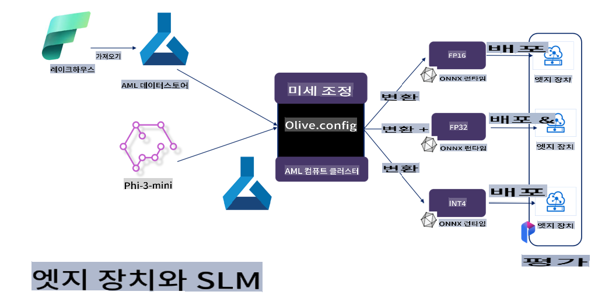

# **Microsoft Olive을 사용한 Phi-3 파인튜닝**

[Olive](https://github.com/microsoft/OLive?WT.mc_id=aiml-138114-kinfeylo)은 모델 압축, 최적화 및 컴파일 등 업계 선도 기술을 통합한 사용하기 쉬운 하드웨어 지향 모델 최적화 도구입니다.

이 도구는 머신러닝 모델 최적화 프로세스를 간소화하여 특정 하드웨어 아키텍처를 최대한 효율적으로 활용할 수 있도록 설계되었습니다.

클라우드 기반 애플리케이션이든 엣지 디바이스든 상관없이, Olive는 모델을 간단하고 효과적으로 최적화할 수 있도록 도와줍니다.

## 주요 기능:
- Olive는 원하는 하드웨어 타겟에 맞춰 최적화 기법을 통합하고 자동화합니다.
- 단일 최적화 기법이 모든 시나리오에 적합하지 않기 때문에, Olive는 업계 전문가들이 자신의 최적화 기술을 확장 가능하도록 지원합니다.

## 엔지니어링 노력 감소:
- 개발자는 종종 훈련된 모델을 배포하기 위해 여러 하드웨어 벤더의 툴체인을 배우고 활용해야 합니다.
- Olive는 원하는 하드웨어에 대한 최적화 기법을 자동화하여 이 과정을 간소화합니다.

## 사용 가능한 E2E 최적화 솔루션:

Olive는 통합된 기술을 조합하고 조정하여 엔드 투 엔드 최적화를 위한 통합 솔루션을 제공합니다.
모델을 최적화하는 동안 정확도와 지연 시간 같은 제약 조건을 고려합니다.

## Microsoft Olive를 사용한 파인튜닝

Microsoft Olive는 생성형 인공지능 분야에서 파인튜닝과 참조를 모두 포괄할 수 있는 사용하기 쉬운 오픈 소스 모델 최적화 도구입니다. 간단한 설정만으로 오픈 소스 소형 언어 모델과 관련 실행 환경(AzureML / 로컬 GPU, CPU, DirectML)을 결합하여 자동 최적화를 통해 모델의 파인튜닝이나 참조를 완료할 수 있습니다. 이를 통해 클라우드 또는 엣지 디바이스에 배포할 최적의 모델을 찾을 수 있습니다. 기업은 온프레미스와 클라우드에서 자체 산업 특화 모델을 구축할 수 있습니다.


## Microsoft Olive를 사용한 Phi-3 파인튜닝 



## Phi-3 Olive 샘플 코드 및 예제
이 예제에서는 Olive를 사용하여 다음 작업을 수행합니다:

- 문장을 Sad, Joy, Fear, Surprise로 분류하기 위해 LoRA 어댑터를 파인튜닝합니다.
- 어댑터 가중치를 기본 모델에 병합합니다.
- 모델을 int4로 최적화하고 양자화합니다.

[샘플 코드](../../code/03.Finetuning/olive-ort-example/README.md)

### Microsoft Olive 설정

Microsoft Olive 설치는 매우 간단하며, CPU, GPU, DirectML, Azure ML 모두 설치할 수 있습니다.

```bash
pip install olive-ai
```

ONNX 모델을 CPU에서 실행하려면 다음을 사용할 수 있습니다:

```bash
pip install olive-ai[cpu]
```

ONNX 모델을 GPU에서 실행하려면 다음을 사용할 수 있습니다:

```python
pip install olive-ai[gpu]
```

Azure ML을 사용하려면 다음을 사용하세요:

```python
pip install git+https://github.com/microsoft/Olive#egg=olive-ai[azureml]
```

**주의**
운영 체제 요구 사항: Ubuntu 20.04 / 22.04 

### **Microsoft Olive의 Config.json**

설치 후 Config 파일을 통해 데이터, 컴퓨팅, 훈련, 배포, 모델 생성 등 모델별 설정을 구성할 수 있습니다.

**1. 데이터**

Microsoft Olive에서는 로컬 데이터와 클라우드 데이터에서 훈련을 지원하며, 설정에서 이를 구성할 수 있습니다.

*로컬 데이터 설정*

파인튜닝을 위해 훈련해야 할 데이터 세트를 간단히 설정할 수 있습니다. 일반적으로 json 형식으로 되어 있으며 데이터 템플릿과 함께 사용됩니다. 이는 모델 요구 사항에 따라 조정해야 합니다(예: Microsoft Phi-3-mini에 필요한 형식에 맞추기. 다른 모델이 있는 경우 해당 모델의 파인튜닝 형식 요구 사항을 참조하여 처리).

```json

    "data_configs": [
        {
            "name": "dataset_default_train",
            "type": "HuggingfaceContainer",
            "load_dataset_config": {
                "params": {
                    "data_name": "json", 
                    "data_files":"dataset/dataset-classification.json",
                    "split": "train"
                }
            },
            "pre_process_data_config": {
                "params": {
                    "dataset_type": "corpus",
                    "text_cols": [
                            "phrase",
                            "tone"
                    ],
                    "text_template": "### Text: {phrase}\n### The tone is:\n{tone}",
                    "corpus_strategy": "join",
                    "source_max_len": 2048,
                    "pad_to_max_len": false,
                    "use_attention_mask": false
                }
            }
        }
    ],
```

**클라우드 데이터 소스 설정**

Azure AI Studio/Azure Machine Learning Service의 데이터 저장소를 연결하여 클라우드의 데이터를 연결하고, Microsoft Fabric 및 Azure Data를 통해 다양한 데이터 소스를 Azure AI Studio/Azure Machine Learning Service에 도입하여 파인튜닝 데이터를 지원할 수 있습니다.

```json

    "data_configs": [
        {
            "name": "dataset_default_train",
            "type": "HuggingfaceContainer",
            "load_dataset_config": {
                "params": {
                    "data_name": "json", 
                    "data_files": {
                        "type": "azureml_datastore",
                        "config": {
                            "azureml_client": {
                                "subscription_id": "Your Azure Subscrition ID",
                                "resource_group": "Your Azure Resource Group",
                                "workspace_name": "Your Azure ML Workspaces name"
                            },
                            "datastore_name": "workspaceblobstore",
                            "relative_path": "Your train_data.json Azure ML Location"
                        }
                    },
                    "split": "train"
                }
            },
            "pre_process_data_config": {
                "params": {
                    "dataset_type": "corpus",
                    "text_cols": [
                            "Question",
                            "Best Answer"
                    ],
                    "text_template": "<|user|>\n{Question}<|end|>\n<|assistant|>\n{Best Answer}\n<|end|>",
                    "corpus_strategy": "join",
                    "source_max_len": 2048,
                    "pad_to_max_len": false,
                    "use_attention_mask": false
                }
            }
        }
    ],
    
```

**2. 컴퓨팅 구성**

로컬에서 작업해야 할 경우 로컬 데이터 리소스를 직접 사용할 수 있습니다. Azure AI Studio/Azure Machine Learning Service의 리소스를 사용하려면 관련 Azure 매개변수와 컴퓨팅 파워 이름 등을 구성해야 합니다.

```json

    "systems": {
        "aml": {
            "type": "AzureML",
            "config": {
                "accelerators": ["gpu"],
                "hf_token": true,
                "aml_compute": "Your Azure AI Studio / Azure Machine Learning Service Compute Name",
                "aml_docker_config": {
                    "base_image": "Your Azure AI Studio / Azure Machine Learning Service docker",
                    "conda_file_path": "conda.yaml"
                }
            }
        },
        "azure_arc": {
            "type": "AzureML",
            "config": {
                "accelerators": ["gpu"],
                "aml_compute": "Your Azure AI Studio / Azure Machine Learning Service Compute Name",
                "aml_docker_config": {
                    "base_image": "Your Azure AI Studio / Azure Machine Learning Service docker",
                    "conda_file_path": "conda.yaml"
                }
            }
        }
    },
```

***주의***

Azure AI Studio/Azure Machine Learning Service에서 컨테이너를 통해 실행되므로 필요한 환경을 구성해야 합니다. 이는 conda.yaml 환경에서 구성됩니다.

```yaml

name: project_environment
channels:
  - defaults
dependencies:
  - python=3.8.13
  - pip=22.3.1
  - pip:
      - einops
      - accelerate
      - azure-keyvault-secrets
      - azure-identity
      - bitsandbytes
      - datasets
      - huggingface_hub
      - peft
      - scipy
      - sentencepiece
      - torch>=2.2.0
      - transformers
      - git+https://github.com/microsoft/Olive@jiapli/mlflow_loading_fix#egg=olive-ai[gpu]
      - --extra-index-url https://aiinfra.pkgs.visualstudio.com/PublicPackages/_packaging/ORT-Nightly/pypi/simple/ 
      - ort-nightly-gpu==1.18.0.dev20240307004
      - --extra-index-url https://aiinfra.pkgs.visualstudio.com/PublicPackages/_packaging/onnxruntime-genai/pypi/simple/
      - onnxruntime-genai-cuda

    

```

**3. SLM 선택**

Hugging Face에서 직접 모델을 사용할 수 있으며, Azure AI Studio/Azure Machine Learning의 Model Catalog와 결합하여 사용할 모델을 선택할 수도 있습니다. 아래 코드 예제에서는 Microsoft Phi-3-mini를 예로 사용합니다.

로컬에 모델이 있다면 이 방법을 사용할 수 있습니다:

```json

    "input_model":{
        "type": "PyTorchModel",
        "config": {
            "hf_config": {
                "model_name": "model-cache/microsoft/phi-3-mini",
                "task": "text-generation",
                "model_loading_args": {
                    "trust_remote_code": true
                }
            }
        }
    },
```

Azure AI Studio/Azure Machine Learning Service의 모델을 사용하려면 다음 방법을 사용할 수 있습니다:

```json

    "input_model":{
        "type": "PyTorchModel",
        "config": {
            "model_path": {
                "type": "azureml_registry_model",
                "config": {
                    "name": "microsoft/Phi-3-mini-4k-instruct",
                    "registry_name": "azureml-msr",
                    "version": "11"
                }
            },
             "model_file_format": "PyTorch.MLflow",
             "hf_config": {
                "model_name": "microsoft/Phi-3-mini-4k-instruct",
                "task": "text-generation",
                "from_pretrained_args": {
                    "trust_remote_code": true
                }
            }
        }
    },
```

**주의:**
Azure AI Studio/Azure Machine Learning Service와 통합해야 하므로 모델 설정 시 버전 번호 및 관련 명명을 참조하세요.

Azure의 모든 모델은 PyTorch.MLflow로 설정되어야 합니다.

Hugging Face 계정이 필요하며, Azure AI Studio/Azure Machine Learning의 키 값에 바인딩해야 합니다.

**4. 알고리즘**

Microsoft Olive는 Lora와 QLora 파인튜닝 알고리즘을 잘 캡슐화했습니다. 관련 매개변수만 일부 구성하면 됩니다. 여기서는 QLora를 예로 들어 설명합니다.

```json
        "lora": {
            "type": "LoRA",
            "config": {
                "target_modules": [
                    "o_proj",
                    "qkv_proj"
                ],
                "double_quant": true,
                "lora_r": 64,
                "lora_alpha": 64,
                "lora_dropout": 0.1,
                "train_data_config": "dataset_default_train",
                "eval_dataset_size": 0.3,
                "training_args": {
                    "seed": 0,
                    "data_seed": 42,
                    "per_device_train_batch_size": 1,
                    "per_device_eval_batch_size": 1,
                    "gradient_accumulation_steps": 4,
                    "gradient_checkpointing": false,
                    "learning_rate": 0.0001,
                    "num_train_epochs": 3,
                    "max_steps": 10,
                    "logging_steps": 10,
                    "evaluation_strategy": "steps",
                    "eval_steps": 187,
                    "group_by_length": true,
                    "adam_beta2": 0.999,
                    "max_grad_norm": 0.3
                }
            }
        },
```

양자화 변환을 원한다면, Microsoft Olive 메인 브랜치는 이미 onnxruntime-genai 방식을 지원합니다. 필요에 따라 설정할 수 있습니다:

1. 어댑터 가중치를 기본 모델에 병합
2. ModelBuilder를 통해 필요한 정밀도로 모델을 onnx 모델로 변환

예를 들어 양자화된 INT4로 변환:

```json

        "merge_adapter_weights": {
            "type": "MergeAdapterWeights"
        },
        "builder": {
            "type": "ModelBuilder",
            "config": {
                "precision": "int4"
            }
        }
```

**주의** 
- QLoRA를 사용할 경우, ONNXRuntime-genai의 양자화 변환은 현재 지원되지 않습니다.

- 위의 단계를 자신의 필요에 따라 설정할 수 있습니다. 모든 단계를 완전히 구성할 필요는 없습니다. 필요에 따라 알고리즘의 단계를 직접 사용할 수 있습니다. 마지막으로 관련 엔진을 구성해야 합니다.

```json

    "engine": {
        "log_severity_level": 0,
        "host": "aml",
        "target": "aml",
        "search_strategy": false,
        "execution_providers": ["CUDAExecutionProvider"],
        "cache_dir": "../model-cache/models/phi3-finetuned/cache",
        "output_dir" : "../model-cache/models/phi3-finetuned"
    }
```

**5. 파인튜닝 완료**

명령줄에서 olive-config.json 디렉토리에서 실행합니다:

```bash
olive run --config olive-config.json  
```

**면책 조항**:  
이 문서는 기계 기반 AI 번역 서비스를 사용하여 번역되었습니다. 정확성을 위해 노력하고 있지만, 자동 번역에는 오류나 부정확성이 포함될 수 있습니다. 원본 문서의 모국어 버전이 신뢰할 수 있는 권위 있는 자료로 간주되어야 합니다. 중요한 정보의 경우, 전문적인 인간 번역을 권장합니다. 이 번역 사용으로 인해 발생하는 오해나 잘못된 해석에 대해 당사는 책임을 지지 않습니다.