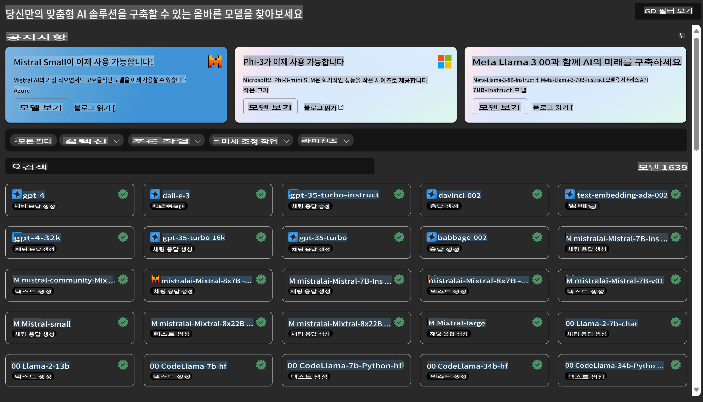

# **Azure Machine Learning 서비스 소개**

[Azure Machine Learning](https://ml.azure.com?WT.mc_id=aiml-138114-kinfeylo)은 머신 러닝(ML) 프로젝트 라이프사이클을 가속화하고 관리하기 위한 클라우드 서비스입니다.

ML 전문가, 데이터 과학자, 엔지니어는 일상적인 워크플로에서 이를 활용하여:

- 모델을 학습하고 배포할 수 있습니다.  
- 머신 러닝 운영(MLOps)을 관리할 수 있습니다.  
- Azure Machine Learning에서 모델을 생성하거나 PyTorch, TensorFlow, scikit-learn과 같은 오픈 소스 플랫폼에서 구축된 모델을 사용할 수 있습니다.  
- MLOps 도구를 통해 모델을 모니터링하고, 재학습시키고, 다시 배포할 수 있습니다.  

## Azure Machine Learning은 누구를 위한 것인가요?

**데이터 과학자 및 ML 엔지니어**

일상적인 워크플로를 가속화하고 자동화할 수 있는 도구를 사용할 수 있습니다.  
Azure ML은 공정성, 설명 가능성, 추적 가능성, 감사 가능성을 위한 기능을 제공합니다.  

**애플리케이션 개발자**

모델을 애플리케이션이나 서비스에 원활하게 통합할 수 있습니다.  

**플랫폼 개발자**

내구성이 뛰어난 Azure Resource Manager API로 지원되는 강력한 도구 세트를 이용할 수 있습니다.  
이를 통해 고급 ML 도구를 구축할 수 있습니다.  

**기업**

Microsoft Azure 클라우드에서 작업하며, 익숙한 보안 및 역할 기반 액세스 제어의 이점을 누릴 수 있습니다.  
프로젝트를 설정하여 보호된 데이터와 특정 작업에 대한 액세스를 제어할 수 있습니다.  

## 팀 전체를 위한 생산성 향상

ML 프로젝트는 종종 다양한 기술을 가진 팀이 구축 및 유지 관리를 필요로 합니다.  

Azure ML은 다음을 가능하게 하는 도구를 제공합니다:  
- 공유 노트북, 컴퓨팅 리소스, 서버리스 컴퓨팅, 데이터 및 환경을 통해 팀과 협업할 수 있습니다.  
- 공정성, 설명 가능성, 추적 가능성 및 감사 가능성을 갖춘 모델을 개발하여 계보 및 감사 준수 요구사항을 충족할 수 있습니다.  
- ML 모델을 신속하고 쉽게 대규모로 배포하고, MLOps를 통해 효율적으로 관리하고 운영할 수 있습니다.  
- 내장된 거버넌스, 보안, 준수를 통해 어디서든 머신 러닝 워크로드를 실행할 수 있습니다.  

## 크로스 호환 플랫폼 도구

ML 팀의 누구든지 선호하는 도구를 사용하여 작업을 완료할 수 있습니다.  
빠른 실험 실행, 하이퍼파라미터 튜닝, 파이프라인 구축, 추론 관리 등 어떤 작업이든 익숙한 인터페이스를 사용할 수 있습니다. 예를 들어:  
- Azure Machine Learning Studio  
- Python SDK (v2)  
- Azure CLI (v2)  
- Azure Resource Manager REST API  

모델을 세밀하게 조정하고 개발 주기 동안 협업할 때, Azure Machine Learning Studio UI 내에서 자산, 리소스, 메트릭을 공유하고 찾을 수 있습니다.  

## **Azure ML의 LLM/SLM**

Azure ML은 LLMOps와 SLMOps를 결합하여 엔터프라이즈 전반의 생성형 인공지능 기술 플랫폼을 구축하기 위해 여러 LLM/SLM 관련 기능을 추가했습니다.  

### **모델 카탈로그**

엔터프라이즈 사용자는 Model Catalog를 통해 다양한 비즈니스 시나리오에 따라 다양한 모델을 배포하고, 이를 Model as Service로 제공하여 엔터프라이즈 개발자 또는 사용자가 액세스할 수 있도록 합니다.  

Azure Machine Learning Studio의 Model Catalog는 생성형 AI 애플리케이션을 구축할 수 있는 다양한 모델을 발견하고 사용할 수 있는 허브입니다.  
Model Catalog는 Azure OpenAI 서비스, Mistral, Meta, Cohere, Nvidia, Hugging Face, Microsoft에서 학습된 모델 등 여러 모델 제공업체의 수백 개 모델을 제공합니다.  
Microsoft 이외의 제공업체의 모델은 Microsoft 제품 약관에서 정의한 바와 같이 비-Microsoft 제품이며, 모델과 함께 제공된 약관이 적용됩니다.  

### **작업 파이프라인**

머신 러닝 파이프라인의 핵심은 전체 머신 러닝 작업을 다단계 워크플로로 분리하는 것입니다.  
각 단계는 개별적으로 개발, 최적화, 구성, 자동화할 수 있는 관리 가능한 구성 요소입니다.  
단계는 명확히 정의된 인터페이스를 통해 연결됩니다. Azure Machine Learning 파이프라인 서비스는 파이프라인 단계 간의 모든 종속성을 자동으로 조율합니다.  

SLM / LLM의 파인튜닝에서, 파이프라인을 통해 데이터, 학습, 생성 프로세스를 관리할 수 있습니다.  

### **프롬프트 플로우**

Azure Machine Learning 프롬프트 플로우를 사용할 때의 이점  
Azure Machine Learning 프롬프트 플로우는 아이디어 구상에서 실험, 궁극적으로 LLM 기반 애플리케이션의 프로덕션 준비까지의 전환을 지원하는 다양한 이점을 제공합니다.  

**프롬프트 엔지니어링 민첩성**

- 상호작용적인 작성 경험: Azure Machine Learning 프롬프트 플로우는 플로우 구조의 시각적 표현을 제공하여 사용자가 프로젝트를 쉽게 이해하고 탐색할 수 있도록 합니다. 또한 효율적인 플로우 개발 및 디버깅을 위한 노트북과 같은 코딩 경험을 제공합니다.  
- 프롬프트 튜닝을 위한 변형: 사용자는 여러 프롬프트 변형을 생성하고 비교하여 반복적인 개선 프로세스를 촉진할 수 있습니다.  
- 평가: 내장된 평가 플로우를 통해 사용자는 프롬프트와 플로우의 품질과 효과를 평가할 수 있습니다.  
- 포괄적인 리소스: Azure Machine Learning 프롬프트 플로우는 개발의 출발점이 되는 도구, 샘플, 템플릿의 라이브러리를 포함하여 창의력을 자극하고 프로세스를 가속화합니다.  

**LLM 기반 애플리케이션을 위한 엔터프라이즈 준비**

- 협업: Azure Machine Learning 프롬프트 플로우는 팀 협업을 지원하여 여러 사용자가 프롬프트 엔지니어링 프로젝트에서 협력하고 지식을 공유하며 버전 관리를 유지할 수 있도록 합니다.  
- 올인원 플랫폼: Azure Machine Learning 프롬프트 플로우는 개발, 평가, 배포 및 모니터링에 이르는 전체 프롬프트 엔지니어링 프로세스를 간소화합니다. 사용자는 플로우를 Azure Machine Learning 엔드포인트로 쉽게 배포하고, 실시간으로 성능을 모니터링하여 최적의 운영과 지속적인 개선을 보장할 수 있습니다.  
- Azure Machine Learning 엔터프라이즈 준비 솔루션: 프롬프트 플로우는 Azure Machine Learning의 강력한 엔터프라이즈 준비 솔루션을 활용하여 안전하고 확장 가능하며 신뢰할 수 있는 기반을 제공하여 플로우 개발, 실험 및 배포를 지원합니다.  

Azure Machine Learning 프롬프트 플로우를 통해 사용자는 프롬프트 엔지니어링 민첩성을 발휘하고, 효과적으로 협업하며, 엔터프라이즈급 솔루션을 활용하여 성공적인 LLM 기반 애플리케이션 개발 및 배포를 할 수 있습니다.  

Azure ML의 컴퓨팅 파워, 데이터 및 다양한 구성 요소를 결합하여, 엔터프라이즈 개발자는 자신만의 인공지능 애플리케이션을 쉽게 구축할 수 있습니다.  

**면책 조항**:  
이 문서는 AI 기반 기계 번역 서비스를 사용하여 번역되었습니다. 정확성을 위해 최선을 다하고 있지만, 자동 번역에는 오류나 부정확성이 포함될 수 있음을 유의하시기 바랍니다. 원본 문서는 해당 언어로 작성된 문서를 권위 있는 출처로 간주해야 합니다. 중요한 정보의 경우, 전문적인 인간 번역을 권장합니다. 이 번역 사용으로 인해 발생하는 오해나 잘못된 해석에 대해 당사는 책임을 지지 않습니다.