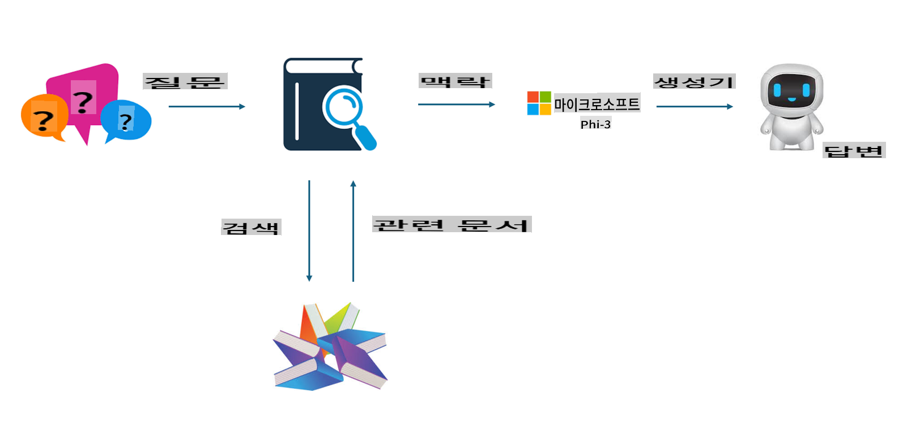
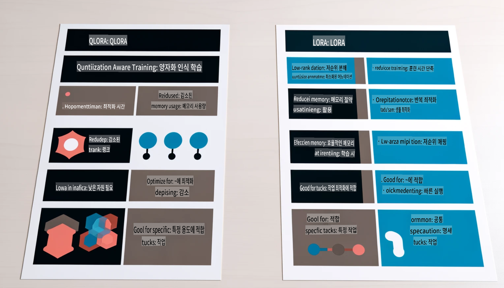

# **Phi-3을 업계 전문가로 만들기**

Phi-3 모델을 특정 산업에 도입하려면, 해당 산업의 비즈니스 데이터를 Phi-3 모델에 추가해야 합니다. 이를 구현하는 두 가지 방법이 있습니다. 첫 번째는 RAG(Retrieval Augmented Generation), 두 번째는 Fine-tuning입니다.

## **RAG vs Fine-tuning**

### **Retrieval Augmented Generation**

RAG는 데이터 검색 + 텍스트 생성을 결합한 방식입니다. 기업의 구조화된 데이터와 비구조화된 데이터가 벡터 데이터베이스에 저장됩니다. 관련 내용을 검색할 때, 관련 요약 및 콘텐츠를 찾아 맥락을 형성하고, LLM/SLM의 텍스트 완성 기능과 결합하여 콘텐츠를 생성합니다.

### **Fine-tuning**

Fine-tuning은 특정 모델을 개선하는 방법입니다. 모델 알고리즘부터 새로 시작할 필요는 없지만, 데이터를 지속적으로 축적해야 합니다. 산업 응용에서 더 정교한 용어와 언어 표현이 필요하다면 Fine-tuning이 더 나은 선택이 될 수 있습니다. 그러나 데이터가 자주 변경되는 경우 Fine-tuning은 복잡해질 수 있습니다.

### **어떻게 선택할까**

1. 답변에 외부 데이터의 도입이 필요하다면, RAG가 최적의 선택입니다.

2. 안정적이고 정밀한 산업 지식의 출력을 원한다면 Fine-tuning이 좋은 선택입니다. RAG는 관련 콘텐츠를 우선적으로 가져오지만, 항상 전문적인 뉘앙스를 정확히 전달하지는 못할 수 있습니다.

3. Fine-tuning은 고품질 데이터셋이 필요하며, 데이터 범위가 좁을 경우 큰 차이를 만들지 못합니다. RAG는 더 유연합니다.

4. Fine-tuning은 일종의 블랙박스로, 내부 메커니즘을 이해하기 어렵습니다. 반면, RAG는 데이터의 출처를 쉽게 찾을 수 있어 환각(hallucination)이나 콘텐츠 오류를 효과적으로 조정하고 더 나은 투명성을 제공합니다.

### **적용 시나리오**

1. 특정 전문 용어와 표현이 필요한 수직 산업의 경우, ***Fine-tuning***이 최적의 선택입니다.

2. 다양한 지식 포인트의 통합을 포함하는 QA 시스템의 경우, ***RAG***가 최적의 선택입니다.

3. 자동화된 비즈니스 흐름을 결합할 때는 ***RAG + Fine-tuning***이 최적의 선택입니다.

## **RAG 사용 방법**

벡터 데이터베이스는 데이터를 수학적 형태로 저장한 데이터의 집합입니다. 벡터 데이터베이스는 머신러닝 모델이 이전 입력을 더 잘 기억할 수 있도록 하며, 검색, 추천, 텍스트 생성과 같은 사용 사례를 지원할 수 있습니다. 데이터는 정확히 일치하지 않아도 유사성 기준으로 식별될 수 있어, 컴퓨터 모델이 데이터의 맥락을 이해할 수 있도록 합니다.

벡터 데이터베이스는 RAG를 실현하는 핵심입니다. text-embedding-3, jina-ai-embedding 등과 같은 벡터 모델을 통해 데이터를 벡터로 변환하여 저장할 수 있습니다.

RAG 애플리케이션 만들기에 대해 더 알아보세요: [https://github.com/microsoft/Phi-3CookBook](https://github.com/microsoft/Phi-3CookBook?WT.mc_id=aiml-138114-kinfeylo)

## **Fine-tuning 사용 방법**

Fine-tuning에서 일반적으로 사용되는 알고리즘은 Lora와 QLora입니다. 어떻게 선택해야 할까요?
- [샘플 노트북으로 더 알아보기](../../../../code/04.Finetuning/Phi_3_Inference_Finetuning.ipynb)
- [Python Fine-tuning 샘플 예제](../../../../code/04.Finetuning/FineTrainingScript.py)

### **Lora와 QLora**

LoRA(Low-Rank Adaptation)와 QLoRA(Quantized Low-Rank Adaptation)는 모두 Parameter Efficient Fine Tuning(PEFT)을 사용하여 대규모 언어 모델(LLMs)을 Fine-tuning하는 기술입니다. PEFT 기술은 전통적인 방법보다 더 효율적으로 모델을 학습시키도록 설계되었습니다.  
LoRA는 독립적인 Fine-tuning 기술로, 가중치 업데이트 행렬에 저랭크 근사법을 적용하여 메모리 사용량을 줄입니다. 이 방법은 빠른 학습 속도를 제공하며, 전통적인 Fine-tuning 방식에 근접한 성능을 유지합니다.

QLoRA는 LoRA의 확장 버전으로, 양자화 기술을 통합하여 메모리 사용량을 더욱 줄입니다. QLoRA는 사전 학습된 LLM의 가중치 파라미터를 4비트 정밀도로 양자화하여 LoRA보다 더 메모리 효율적입니다. 그러나 QLoRA는 추가적인 양자화 및 역양자화 단계로 인해 LoRA 학습보다 약 30% 느립니다.

QLoRA는 양자화 과정에서 발생하는 오류를 수정하기 위해 LoRA를 보조 도구로 사용합니다. QLoRA는 상대적으로 작은, 널리 사용 가능한 GPU에서도 수십억 개의 파라미터를 가진 대규모 모델을 Fine-tuning할 수 있습니다. 예를 들어, QLoRA는 70B 파라미터 모델을 36개의 GPU가 아닌 단 2개의 GPU로 Fine-tuning할 수 있습니다.

**면책 조항**:  
이 문서는 기계 기반 AI 번역 서비스를 사용하여 번역되었습니다. 정확성을 위해 노력하고 있지만, 자동 번역에는 오류나 부정확성이 포함될 수 있음을 유의하시기 바랍니다. 원어로 작성된 원본 문서를 신뢰할 수 있는 권위 있는 자료로 간주해야 합니다. 중요한 정보의 경우, 전문적인 인간 번역을 권장합니다. 이 번역 사용으로 인해 발생하는 오해나 오역에 대해 당사는 책임을 지지 않습니다.