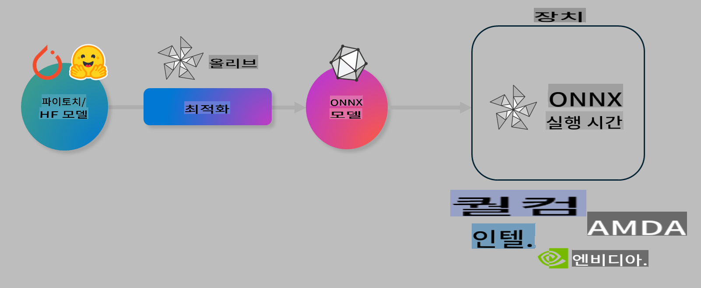

# Lab. AI 모델을 디바이스에서 추론할 수 있도록 최적화하기

## 소개 

> [!IMPORTANT]
> 이 실습에서는 **Nvidia A10 또는 A100 GPU**와 관련 드라이버 및 CUDA 툴킷(버전 12 이상)이 필요합니다.

> [!NOTE]
> 이 실습은 **35분** 동안 진행되며, OLIVE를 사용하여 디바이스 추론에 최적화된 모델을 만드는 핵심 개념을 실습해볼 수 있습니다.

## 학습 목표

이 실습이 끝나면 OLIVE를 사용하여 다음을 수행할 수 있습니다:

- AWQ 양자화 방법을 사용하여 AI 모델을 양자화하기.
- 특정 작업에 맞게 AI 모델을 미세 조정하기.
- ONNX Runtime에서 효율적인 디바이스 추론을 위한 LoRA 어댑터(미세 조정된 모델) 생성하기.

### Olive란?

Olive (*O*NNX *live*)는 ONNX runtime +++https://onnxruntime.ai+++용 모델을 품질과 성능에 맞게 최적화할 수 있는 CLI와 함께 제공되는 모델 최적화 툴킷입니다.



Olive의 입력은 일반적으로 PyTorch 또는 Hugging Face 모델이며, 출력은 ONNX runtime을 실행하는 디바이스(배포 대상)에서 실행되는 최적화된 ONNX 모델입니다. Olive는 Qualcomm, AMD, Nvidia, Intel과 같은 하드웨어 공급업체가 제공하는 배포 대상 AI 가속기(NPU, GPU, CPU)에 맞게 모델을 최적화합니다.

Olive는 *워크플로우*를 실행하며, 이는 개별 모델 최적화 작업(*패스*)의 순차적인 집합입니다. 예를 들어, 모델 압축, 그래프 캡처, 양자화, 그래프 최적화 등이 포함됩니다. 각 패스에는 정확도와 지연 시간과 같은 최적의 메트릭을 달성하기 위해 조정할 수 있는 매개변수 집합이 있습니다. Olive는 검색 알고리즘을 사용하여 각 패스를 하나씩 또는 여러 패스를 함께 자동 조정하는 검색 전략을 채택합니다.

#### Olive의 장점

- **그래프 최적화, 압축 및 양자화에 대한 수작업 실험의 좌절감과 시간을 줄여줍니다.** 품질 및 성능 제약 조건을 정의하면 Olive가 자동으로 최적의 모델을 찾아줍니다.
- **최첨단 기술을 포함한 40개 이상의 모델 최적화 구성 요소**를 제공합니다. 양자화, 압축, 그래프 최적화, 미세 조정 등 포함.
- **간편한 CLI**로 일반적인 모델 최적화 작업을 수행할 수 있습니다. 예: olive quantize, olive auto-opt, olive finetune.
- 모델 패키징 및 배포 기능이 내장되어 있습니다.
- **멀티 LoRA 서빙**을 위한 모델 생성 지원.
- YAML/JSON을 사용하여 모델 최적화 및 배포 작업을 조율하는 워크플로우 구성 가능.
- **Hugging Face** 및 **Azure AI** 통합.
- 비용 절감을 위한 **캐싱** 메커니즘 내장.

## 실습 지침
> [!NOTE]
> Lab 1에 따라 Azure AI Hub와 프로젝트를 준비하고 A100 컴퓨팅을 설정했는지 확인하세요.

### 0단계: Azure AI 컴퓨팅에 연결

**VS Code**의 원격 기능을 사용하여 Azure AI 컴퓨팅에 연결합니다.

1. **VS Code** 데스크톱 애플리케이션을 엽니다.
1. **Shift+Ctrl+P**를 눌러 **명령 팔레트**를 엽니다.
1. 명령 팔레트에서 **AzureML - remote: Connect to compute instance in New Window**를 검색합니다.
1. 화면의 지시에 따라 컴퓨팅에 연결합니다. 이 과정에서는 Lab 1에서 설정한 Azure 구독, 리소스 그룹, 프로젝트, 컴퓨팅 이름을 선택해야 합니다.
1. Azure ML 컴퓨팅 노드에 연결되면 **VS Code 왼쪽 하단**에 표시됩니다. `><Azure ML: Compute Name`

### 1단계: 이 저장소 복제

VS Code에서 **Ctrl+J**를 눌러 새 터미널을 열고 이 저장소를 복제합니다.

터미널에서 다음 프롬프트가 표시됩니다.

```
azureuser@computername:~/cloudfiles/code$ 
```
솔루션 복제:

```bash
cd ~/localfiles
git clone https://github.com/microsoft/phi-3cookbook.git
```

### 2단계: VS Code에서 폴더 열기

관련 폴더에서 VS Code를 열려면 터미널에서 다음 명령을 실행하여 새 창을 엽니다:

```bash
code phi-3cookbook/code/04.Finetuning/Olive-lab
```

또는 **파일** > **폴더 열기**를 선택하여 폴더를 열 수 있습니다.

### 3단계: 종속성 설치

Azure AI 컴퓨팅 인스턴스에서 VS Code의 터미널 창을 열고(**Ctrl+J**를 누르세요), 다음 명령을 실행하여 종속성을 설치합니다:

```bash
conda create -n olive-ai python=3.11 -y
conda activate olive-ai
pip install -r requirements.txt
az extension remove -n azure-cli-ml
az extension add -n ml
```

> [!NOTE]
> 모든 종속성을 설치하는 데 약 **5분**이 소요됩니다.

이 실습에서는 Azure AI 모델 카탈로그에 모델을 다운로드하고 업로드합니다. 모델 카탈로그에 액세스하려면 다음 명령을 사용하여 Azure에 로그인해야 합니다:

```bash
az login
```

> [!NOTE]
> 로그인 시 구독을 선택하라는 메시지가 표시됩니다. 이 실습에 제공된 구독을 선택했는지 확인하세요.

### 4단계: Olive 명령 실행

Azure AI 컴퓨팅 인스턴스에서 VS Code의 터미널 창을 열고(**Ctrl+J**) `olive-ai` Conda 환경이 활성화되었는지 확인합니다:

```bash
conda activate olive-ai
```

그런 다음, 명령줄에서 다음 Olive 명령을 실행합니다.

1. **데이터 검사:** 이 예제에서는 Phi-3.5-Mini 모델을 여행 관련 질문에 답하는 데 특화되도록 미세 조정합니다. 아래 코드는 JSON 라인 형식으로 된 데이터셋의 첫 몇 개 레코드를 표시합니다:
   
    ```bash
    head data/data_sample_travel.jsonl
    ```
1. **모델 양자화:** 모델을 훈련시키기 전에 Active Aware Quantization (AWQ) +++https://arxiv.org/abs/2306.00978+++라는 기술을 사용하는 다음 명령으로 양자화합니다. AWQ는 추론 중 생성된 활성화를 고려하여 모델의 가중치를 양자화합니다. 이는 실제 데이터 분포를 고려하므로 기존의 가중치 양자화 방법보다 모델 정확도를 더 잘 유지할 수 있습니다.
    
    ```bash
    olive quantize \
       --model_name_or_path microsoft/Phi-3.5-mini-instruct \
       --trust_remote_code \
       --algorithm awq \
       --output_path models/phi/awq \
       --log_level 1
    ```
    
    AWQ 양자화는 완료하는 데 약 **8분**이 소요되며, **모델 크기를 약 7.5GB에서 약 2.5GB로 줄입니다.**
   
   이 실습에서는 Hugging Face에서 모델을 가져오는 방법을 보여줍니다(예: `microsoft/Phi-3.5-mini-instruct`). However, Olive also allows you to input models from the Azure AI catalog by updating the `model_name_or_path` argument to an Azure AI asset ID (for example:  `azureml://registries/azureml/models/Phi-3.5-mini-instruct/versions/4`). 

1. **Train the model:** Next, the `olive finetune` 명령은 양자화된 모델을 미세 조정합니다. 양자화 후가 아닌 *전에* 모델을 미세 조정하면, 양자화로 인한 손실을 미세 조정 과정에서 일부 회복할 수 있어 더 나은 정확도를 제공합니다.
    
    ```bash
    olive finetune \
        --method lora \
        --model_name_or_path models/phi/awq \
        --data_files "data/data_sample_travel.jsonl" \
        --data_name "json" \
        --text_template "<|user|>\n{prompt}<|end|>\n<|assistant|>\n{response}<|end|>" \
        --max_steps 100 \
        --output_path ./models/phi/ft \
        --log_level 1
    ```
    
    미세 조정은 **100단계**에서 약 **6분**이 소요됩니다.

1. **최적화:** 모델 훈련이 완료되면 Olive의 `auto-opt` command, which will capture the ONNX graph and automatically perform a number of optimizations to improve the model performance for CPU by compressing the model and doing fusions. It should be noted, that you can also optimize for other devices such as NPU or GPU by just updating the `--device` and `--provider` 인수를 사용하여 모델을 최적화합니다. 이 실습에서는 CPU를 사용합니다.

    ```bash
    olive auto-opt \
       --model_name_or_path models/phi/ft/model \
       --adapter_path models/phi/ft/adapter \
       --device cpu \
       --provider CPUExecutionProvider \
       --use_ort_genai \
       --output_path models/phi/onnx-ao \
       --log_level 1
    ```
    
    최적화는 완료하는 데 약 **5분**이 소요됩니다.

### 5단계: 모델 추론 간단 테스트

모델 추론을 테스트하려면 **app.py**라는 이름의 Python 파일을 폴더에 생성하고 다음 코드를 복사하여 붙여넣습니다:

```python
import onnxruntime_genai as og
import numpy as np

print("loading model and adapters...", end="", flush=True)
model = og.Model("models/phi/onnx-ao/model")
adapters = og.Adapters(model)
adapters.load("models/phi/onnx-ao/model/adapter_weights.onnx_adapter", "travel")
print("DONE!")

tokenizer = og.Tokenizer(model)
tokenizer_stream = tokenizer.create_stream()

params = og.GeneratorParams(model)
params.set_search_options(max_length=100, past_present_share_buffer=False)
user_input = "what is the best thing to see in chicago"
params.input_ids = tokenizer.encode(f"<|user|>\n{user_input}<|end|>\n<|assistant|>\n")

generator = og.Generator(model, params)

generator.set_active_adapter(adapters, "travel")

print(f"{user_input}")

while not generator.is_done():
    generator.compute_logits()
    generator.generate_next_token()

    new_token = generator.get_next_tokens()[0]
    print(tokenizer_stream.decode(new_token), end='', flush=True)

print("\n")
```

다음 명령으로 코드를 실행합니다:

```bash
python app.py
```

### 6단계: 모델을 Azure AI에 업로드

모델을 Azure AI 모델 저장소에 업로드하면 개발 팀의 다른 구성원과 공유할 수 있고 모델 버전 관리도 처리됩니다. 모델을 업로드하려면 다음 명령을 실행합니다:

> [!NOTE]
> `{}` placeholders with the name of your resource group and Azure AI Project Name. 

To find your resource group ``resourceGroup"과 Azure AI 프로젝트 이름을 업데이트한 후 다음 명령을 실행하세요.

```
az ml workspace show
```

또는 +++ai.azure.com+++로 이동하여 **관리 센터** > **프로젝트** > **개요**를 선택할 수도 있습니다.

`{}` 플레이스홀더를 리소스 그룹 이름과 Azure AI 프로젝트 이름으로 업데이트합니다.

```bash
az ml model create \
    --name ft-for-travel \
    --version 1 \
    --path ./models/phi/onnx-ao \
    --resource-group {RESOURCE_GROUP_NAME} \
    --workspace-name {PROJECT_NAME}
```
그런 다음 업로드된 모델을 확인하고 https://ml.azure.com/model/list에서 모델을 배포할 수 있습니다.

**면책 조항**:  
이 문서는 AI 기반 기계 번역 서비스를 사용하여 번역되었습니다. 정확성을 위해 최선을 다하고 있지만, 자동 번역에는 오류나 부정확성이 포함될 수 있습니다. 원본 문서의 해당 언어 버전이 신뢰할 수 있는 권위 있는 자료로 간주되어야 합니다. 중요한 정보의 경우, 전문적인 인간 번역을 권장합니다. 이 번역 사용으로 인해 발생하는 오해나 잘못된 해석에 대해 당사는 책임을 지지 않습니다.