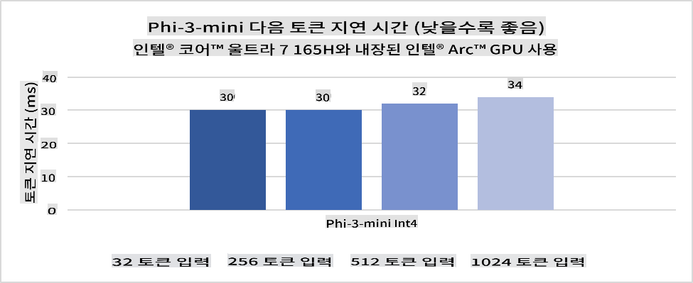
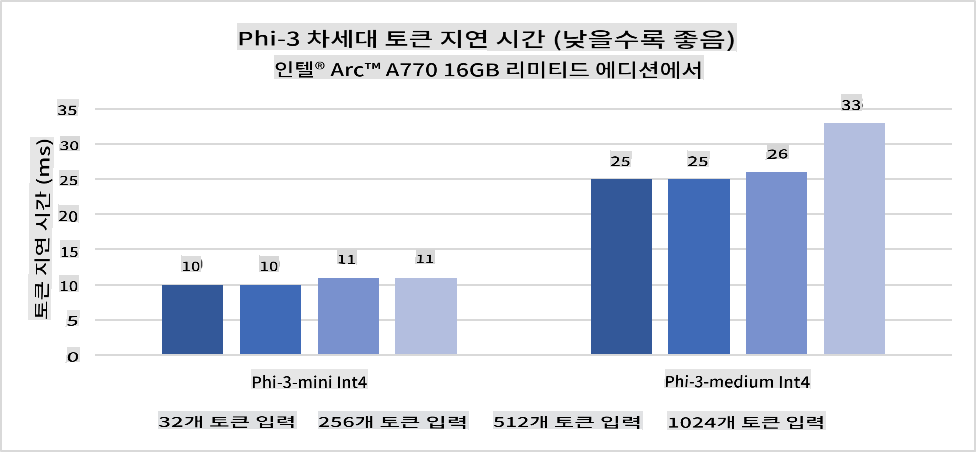
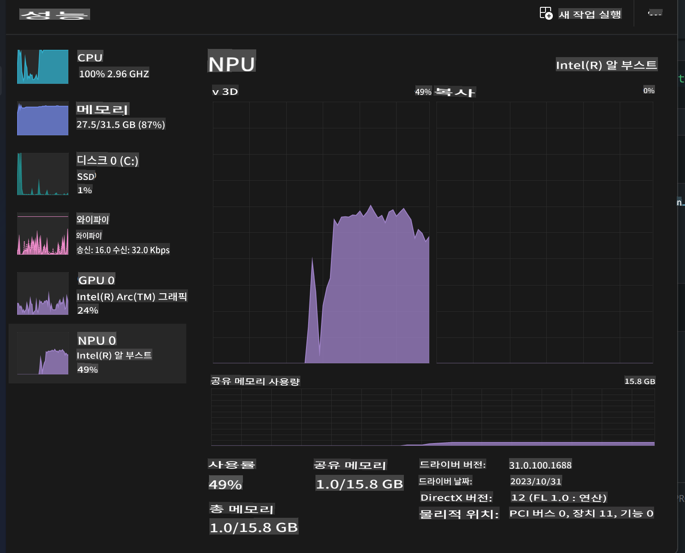
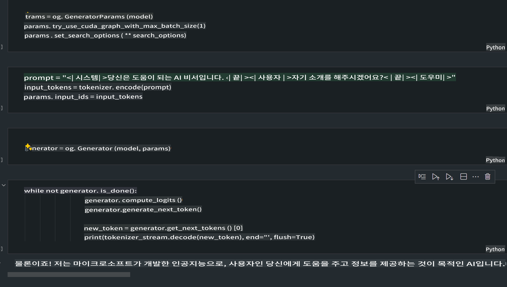
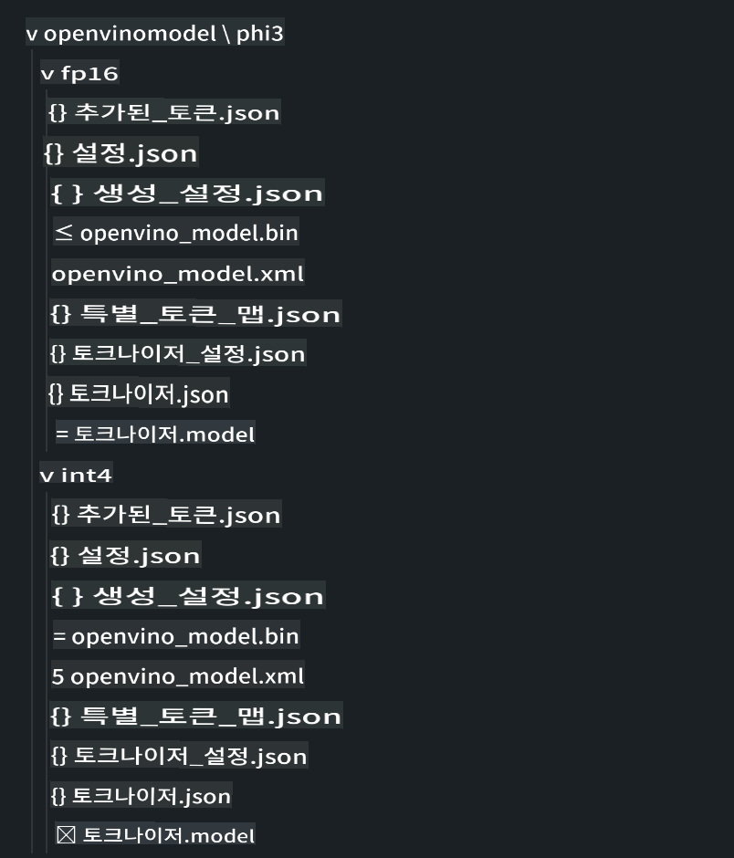
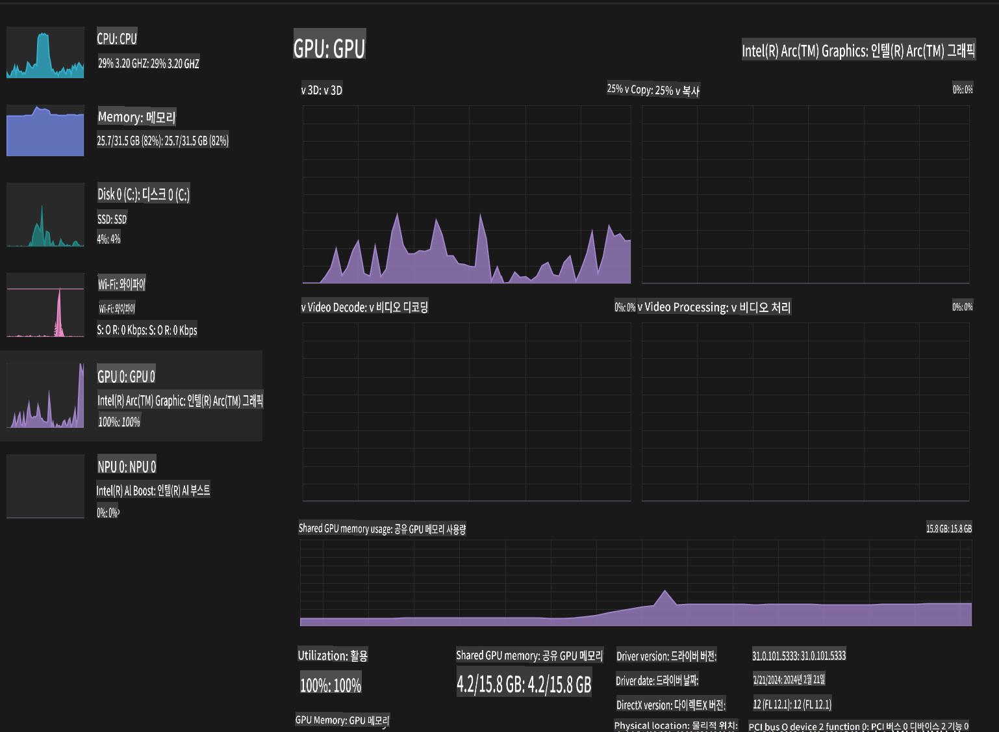

# **AI PC에서 Phi-3 추론**

생성형 AI의 발전과 엣지 디바이스 하드웨어 성능의 향상으로 인해, 이제 더 많은 생성형 AI 모델을 사용자의 BYOD(Bring Your Own Device) 디바이스에 통합할 수 있게 되었습니다. AI PC는 이러한 모델 중 하나입니다. 2024년부터 Intel, AMD, Qualcomm은 PC 제조업체와 협력하여 하드웨어 변경을 통해 로컬 생성형 AI 모델의 배포를 용이하게 하는 AI PC를 도입했습니다. 이번 논의에서는 Intel AI PC에 초점을 맞추고, Intel AI PC에서 Phi-3를 배포하는 방법을 살펴보겠습니다.

### **NPU란 무엇인가**

NPU(Neural Processing Unit)는 더 큰 SoC의 일부로, 신경망 작업과 AI 작업을 가속화하기 위해 특별히 설계된 전용 프로세서 또는 처리 장치입니다. 일반적인 CPU와 GPU와 달리, NPU는 데이터 중심의 병렬 컴퓨팅에 최적화되어 있어 비디오나 이미지와 같은 대규모 멀티미디어 데이터를 처리하고 신경망 데이터를 처리하는 데 매우 효율적입니다. 특히 음성 인식, 화상 통화 중 배경 흐림, 객체 탐지와 같은 사진 또는 비디오 편집 프로세스 등 AI 관련 작업을 처리하는 데 능숙합니다.

## **NPU vs GPU**
많은 AI와 머신러닝 작업이 GPU에서 실행되지만, GPU와 NPU 사이에는 중요한 차이점이 있습니다.
GPU는 병렬 컴퓨팅 기능으로 잘 알려져 있지만, 모든 GPU가 그래픽 처리 외의 작업에서 동일하게 효율적인 것은 아닙니다. 반면, NPU는 신경망 작업에 필요한 복잡한 계산을 위해 목적에 맞게 설계되어 AI 작업에 매우 효과적입니다.

요약하자면, NPU는 AI 계산을 가속화하는 수학 천재이며, AI PC의 등장 시대에 중요한 역할을 합니다!

***이 예시는 Intel의 최신 Intel Core Ultra Processor를 기반으로 합니다***

## **1. NPU를 사용하여 Phi-3 모델 실행**

Intel® NPU 장치는 Intel® Core™ Ultra 세대의 CPU(이전에는 Meteor Lake로 알려짐)부터 Intel 클라이언트 CPU에 통합된 AI 추론 가속기입니다. 이는 인공 신경망 작업을 에너지 효율적으로 실행할 수 있게 합니다.





**Intel NPU 가속 라이브러리**

Intel NPU 가속 라이브러리 [https://github.com/intel/intel-npu-acceleration-library](https://github.com/intel/intel-npu-acceleration-library)는 호환 가능한 하드웨어에서 Intel Neural Processing Unit(NPU)의 성능을 활용하여 애플리케이션의 효율성을 높이기 위해 설계된 Python 라이브러리입니다.

Intel® Core™ Ultra 프로세서로 구동되는 AI PC에서 Phi-3-mini의 예.


pip로 Python 라이브러리 설치

```bash

   pip install intel-npu-acceleration-library

```

***Note*** 프로젝트는 아직 개발 중이지만, 참조 모델은 이미 매우 완성도가 높습니다.

### **Intel NPU 가속 라이브러리로 Phi-3 실행**

Intel NPU 가속을 사용하면 이 라이브러리가 전통적인 인코딩 프로세스에 영향을 미치지 않습니다. 이 라이브러리를 사용하여 원래 Phi-3 모델을 양자화하기만 하면 됩니다, 예를 들어 FP16, INT8, INT4 등.

```python

from transformers import AutoTokenizer, pipeline,TextStreamer
import intel_npu_acceleration_library as npu_lib
import warnings

model_id = "microsoft/Phi-3-mini-4k-instruct"

model = npu_lib.NPUModelForCausalLM.from_pretrained(
                                    model_id,
                                    torch_dtype="auto",
                                    dtype=npu_lib.int4,
                                    trust_remote_code=True
                                )

tokenizer = AutoTokenizer.from_pretrained(model_id)

text_streamer = TextStreamer(tokenizer, skip_prompt=True)

```
양자화가 성공하면 계속 실행하여 NPU를 호출하여 Phi-3 모델을 실행합니다.

```python

generation_args = {
            "max_new_tokens": 1024,
            "return_full_text": False,
            "temperature": 0.3,
            "do_sample": False,
            "streamer": text_streamer,
        }

pipe = pipeline(
            "text-generation",
            model=model,
            tokenizer=tokenizer,
)

query = "<|system|>You are a helpful AI assistant.<|end|><|user|>Can you introduce yourself?<|end|><|assistant|>"

with warnings.catch_warnings():
    warnings.simplefilter("ignore")
    pipe(query, **generation_args)

```

코드를 실행할 때 작업 관리자를 통해 NPU의 실행 상태를 확인할 수 있습니다.



***Samples*** : [AIPC_NPU_DEMO.ipynb](../../../../code/03.Inference/AIPC/AIPC_NPU_DEMO.ipynb)

## **2. DirectML + ONNX Runtime을 사용하여 Phi-3 모델 실행**

### **DirectML이란**

[DirectML](https://github.com/microsoft/DirectML)은 머신러닝을 위한 고성능, 하드웨어 가속 DirectX 12 라이브러리입니다. DirectML은 AMD, Intel, NVIDIA, Qualcomm과 같은 공급업체의 모든 DirectX 12 지원 GPU를 포함한 광범위한 하드웨어 및 드라이버에서 일반적인 머신러닝 작업을 위한 GPU 가속을 제공합니다.

단독으로 사용할 때, DirectML API는 저수준 DirectX 12 라이브러리로, 프레임워크, 게임, 기타 실시간 애플리케이션과 같은 고성능, 저지연 애플리케이션에 적합합니다. DirectML의 Direct3D 12와의 원활한 상호 운용성, 낮은 오버헤드, 하드웨어 전반의 일관성 덕분에 높은 성능이 요구되고 하드웨어 전반의 결과 신뢰성과 예측 가능성이 중요한 경우 머신러닝 가속에 이상적입니다.

***Note*** : 최신 DirectML은 이미 NPU를 지원합니다 (https://devblogs.microsoft.com/directx/introducing-neural-processor-unit-npu-support-in-directml-developer-preview/)

### DirectML과 CUDA의 기능과 성능 비교:

**DirectML**은 Microsoft에서 개발한 머신러닝 라이브러리입니다. 데스크탑, 노트북, 엣지 디바이스를 포함한 Windows 디바이스에서 머신러닝 작업을 가속화하도록 설계되었습니다.
- DX12 기반: DirectML은 DirectX 12(DX12)를 기반으로 구축되어 NVIDIA와 AMD를 포함한 다양한 GPU 하드웨어를 지원합니다.
- 광범위한 지원: DX12를 활용하므로 DirectML은 통합 GPU를 포함한 DX12를 지원하는 모든 GPU에서 작동할 수 있습니다.
- 이미지 처리: DirectML은 이미지 인식, 객체 탐지 등과 같은 작업에 적합한 신경망을 사용하여 이미지를 처리합니다.
- 설치 용이성: DirectML 설정은 간단하며, GPU 제조업체의 특정 SDK나 라이브러리가 필요하지 않습니다.
- 성능: 특정 작업에서 DirectML은 잘 작동하며 CUDA보다 빠를 수 있습니다.
- 제한 사항: 그러나 float16 대규모 배치 크기에서는 DirectML이 더 느릴 수 있습니다.

**CUDA**는 NVIDIA의 병렬 컴퓨팅 플랫폼 및 프로그래밍 모델입니다. 개발자가 NVIDIA GPU의 성능을 활용하여 머신러닝 및 과학 시뮬레이션을 포함한 범용 컴퓨팅을 수행할 수 있게 합니다.
- NVIDIA 전용: CUDA는 NVIDIA GPU와 긴밀하게 통합되어 있으며, 이를 위해 특별히 설계되었습니다.
- 고도로 최적화됨: NVIDIA GPU를 사용할 때 GPU 가속 작업에 뛰어난 성능을 제공합니다.
- 널리 사용됨: 많은 머신러닝 프레임워크 및 라이브러리(예: TensorFlow 및 PyTorch)가 CUDA를 지원합니다.
- 커스터마이제이션: 개발자는 특정 작업에 대해 CUDA 설정을 미세 조정할 수 있어 최적의 성능을 얻을 수 있습니다.
- 제한 사항: 그러나 CUDA의 NVIDIA 하드웨어 의존성은 다양한 GPU에서의 호환성을 원할 경우 제한이 될 수 있습니다.

### DirectML과 CUDA 중 선택:
DirectML과 CUDA 중 선택은 특정 사용 사례, 하드웨어 가용성, 선호도에 따라 달라집니다.
광범위한 호환성과 설정의 용이성을 원한다면 DirectML이 좋은 선택일 수 있습니다. 그러나 NVIDIA GPU가 있고 고도로 최적화된 성능이 필요하다면 CUDA가 강력한 경쟁자입니다. 요약하자면, DirectML과 CUDA는 각각 장단점이 있으므로 결정을 내릴 때 요구 사항과 사용 가능한 하드웨어를 고려하십시오.

### **ONNX Runtime을 사용한 생성형 AI**

AI 시대에는 AI 모델의 이식성이 매우 중요합니다. ONNX Runtime을 사용하면 학습된 모델을 다양한 디바이스에 쉽게 배포할 수 있습니다. 개발자는 추론 프레임워크에 신경 쓰지 않고 통일된 API를 사용하여 모델 추론을 완료할 수 있습니다. 생성형 AI 시대에는 ONNX Runtime이 코드 최적화를 수행했습니다 (https://onnxruntime.ai/docs/genai/). 최적화된 ONNX Runtime을 통해 양자화된 생성형 AI 모델을 다양한 터미널에서 추론할 수 있습니다. ONNX Runtime을 사용한 생성형 AI에서는 Python, C#, C/C++을 통해 AI 모델 API를 추론할 수 있습니다. 물론, iPhone에 배포할 때는 C++의 Generative AI with ONNX Runtime API를 활용할 수 있습니다.

[샘플 코드](https://github.com/Azure-Samples/Phi-3MiniSamples/tree/main/onnx)

***ONNX Runtime 라이브러리로 생성형 AI 컴파일***

```bash

winget install --id=Kitware.CMake  -e

git clone https://github.com/microsoft/onnxruntime.git

cd .\onnxruntime\

./build.bat --build_shared_lib --skip_tests --parallel --use_dml --config Release

cd ../

git clone https://github.com/microsoft/onnxruntime-genai.git

cd .\onnxruntime-genai\

mkdir ort

cd ort

mkdir include

mkdir lib

copy ..\onnxruntime\include\onnxruntime\core\providers\dml\dml_provider_factory.h ort\include

copy ..\onnxruntime\include\onnxruntime\core\session\onnxruntime_c_api.h ort\include

copy ..\onnxruntime\build\Windows\Release\Release\*.dll ort\lib

copy ..\onnxruntime\build\Windows\Release\Release\onnxruntime.lib ort\lib

python build.py --use_dml

```

**라이브러리 설치**

```bash

pip install .\onnxruntime_genai_directml-0.3.0.dev0-cp310-cp310-win_amd64.whl

```

실행 결과는 다음과 같습니다.



***Samples*** : [AIPC_DirectML_DEMO.ipynb](../../../../code/03.Inference/AIPC/AIPC_DirectML_DEMO.ipynb)

## **3. Intel OpenVino를 사용하여 Phi-3 모델 실행**

### **OpenVINO란**

[OpenVINO](https://github.com/openvinotoolkit/openvino)는 딥러닝 모델을 최적화하고 배포하기 위한 오픈 소스 툴킷입니다. TensorFlow, PyTorch 등과 같은 인기 있는 프레임워크에서 비전, 오디오, 언어 모델의 딥러닝 성능을 향상시킵니다. OpenVINO를 사용하여 시작하십시오. OpenVINO는 CPU와 GPU를 결합하여 Phi3 모델을 실행할 수도 있습니다.

***Note***: 현재 OpenVINO는 NPU를 지원하지 않습니다.

### **OpenVINO 라이브러리 설치**

```bash

 pip install git+https://github.com/huggingface/optimum-intel.git

 pip install git+https://github.com/openvinotoolkit/nncf.git

 pip install openvino-nightly

```

### **OpenVINO로 Phi-3 실행**

NPU와 마찬가지로, OpenVINO는 양자화된 모델을 실행하여 생성형 AI 모델을 호출합니다. 우리는 먼저 Phi-3 모델을 양자화해야 하며, optimum-cli를 통해 명령줄에서 모델 양자화를 완료해야 합니다.

**INT4**

```bash

optimum-cli export openvino --model "microsoft/Phi-3-mini-4k-instruct" --task text-generation-with-past --weight-format int4 --group-size 128 --ratio 0.6  --sym  --trust-remote-code ./openvinomodel/phi3/int4

```

**FP16**

```bash

optimum-cli export openvino --model "microsoft/Phi-3-mini-4k-instruct" --task text-generation-with-past --weight-format fp16 --trust-remote-code ./openvinomodel/phi3/fp16

```

변환된 형식은 다음과 같습니다.



OVModelForCausalLM을 통해 모델 경로(model_dir), 관련 구성(ov_config = {"PERFORMANCE_HINT": "LATENCY", "NUM_STREAMS": "1", "CACHE_DIR": ""}), 하드웨어 가속 장치(GPU.0)를 로드합니다.

```python

ov_model = OVModelForCausalLM.from_pretrained(
     model_dir,
     device='GPU.0',
     ov_config=ov_config,
     config=AutoConfig.from_pretrained(model_dir, trust_remote_code=True),
     trust_remote_code=True,
)

```

코드를 실행할 때 작업 관리자를 통해 GPU의 실행 상태를 확인할 수 있습니다.



***Samples*** : [AIPC_OpenVino_Demo.ipynb](../../../../code/03.Inference/AIPC/AIPC_OpenVino_Demo.ipynb)

### ***Note*** : 위의 세 가지 방법은 각각 장점이 있지만, AI PC 추론에는 NPU 가속을 사용하는 것이 권장됩니다.

면책 조항: 이 번역은 원본을 AI 모델에 의해 번역된 것이며 완벽하지 않을 수 있습니다. 
출력을 검토하고 필요한 수정 사항을 반영해 주시기 바랍니다.