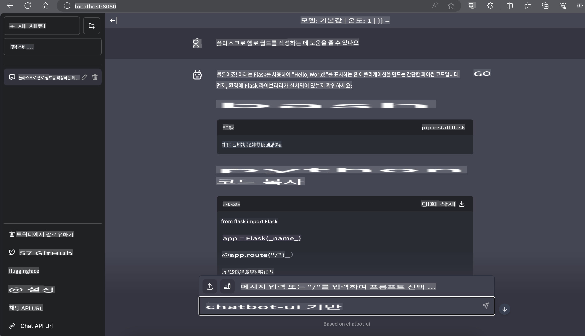

# **Inference Phi-3 in Nvidia Jetson**

Nvidia Jetson은 Nvidia의 임베디드 컴퓨팅 보드 시리즈입니다. Jetson TK1, TX1 및 TX2 모델 모두 ARM 아키텍처 중앙 처리 장치(CPU)를 통합한 Nvidia의 Tegra 프로세서(또는 SoC)를 탑재하고 있습니다. Jetson은 저전력 시스템으로, 머신 러닝 애플리케이션을 가속화하기 위해 설계되었습니다. Nvidia Jetson은 모든 산업 분야에서 획기적인 AI 제품을 만들기 위해 전문 개발자들이 사용하며, 학생과 애호가들이 실습을 통해 AI를 배우고 놀라운 프로젝트를 만들기 위해 사용합니다. SLM은 Jetson과 같은 엣지 디바이스에 배포되어 산업용 생성 AI 애플리케이션 시나리오의 더 나은 구현을 가능하게 합니다.

## NVIDIA Jetson에 배포:
자율 로봇 및 임베디드 디바이스에서 작업하는 개발자는 Phi-3 Mini를 활용할 수 있습니다. Phi-3의 상대적으로 작은 크기는 엣지 배포에 이상적입니다. 훈련 중 매개변수가 정밀하게 조정되어 높은 응답 정확도를 보장합니다.

### TensorRT-LLM 최적화:
NVIDIA의 [TensorRT-LLM 라이브러리](https://github.com/NVIDIA/TensorRT-LLM?WT.mc_id=aiml-138114-kinfeylo)는 대형 언어 모델 추론을 최적화합니다. 이는 Phi-3 Mini의 긴 컨텍스트 윈도우를 지원하여 처리량과 지연 시간을 모두 향상시킵니다. 최적화에는 LongRoPE, FP8 및 인플라이트 배칭과 같은 기술이 포함됩니다.

### 이용 가능성 및 배포:
개발자는 [NVIDIA의 AI](https://www.nvidia.com/en-us/ai-data-science/generative-ai/)에서 128K 컨텍스트 윈도우를 가진 Phi-3 Mini를 탐색할 수 있습니다. 이는 표준 API가 있는 마이크로서비스로 패키징되어 어디서든 배포할 수 있는 NVIDIA NIM으로 제공됩니다. 추가로, [GitHub의 TensorRT-LLM 구현](https://github.com/NVIDIA/TensorRT-LLM)을 참조하세요.

 ## **1. 준비**

a. Jetson Orin NX / Jetson NX

b. JetPack 5.1.2+
   
c. Cuda 11.8
   
d. Python 3.8+

 ## **2. Jetson에서 Phi-3 실행**

 우리는 [Ollama](https://ollama.com) 또는 [LlamaEdge](https://llamaedge.com)를 선택할 수 있습니다.

 클라우드와 엣지 디바이스에서 동시에 gguf를 사용하고 싶다면, LlamaEdge는 WasmEdge로 이해할 수 있습니다. WasmEdge는 클라우드 네이티브, 엣지 및 분산 애플리케이션에 적합한 경량, 고성능, 확장 가능한 WebAssembly 런타임입니다. 서버리스 애플리케이션, 임베디드 함수, 마이크로서비스, 스마트 계약 및 IoT 디바이스를 지원합니다. LlamaEdge를 통해 gguf의 정량화된 모델을 엣지 디바이스와 클라우드에 배포할 수 있습니다.


다음은 사용 방법입니다.

1. 관련 라이브러리와 파일 설치 및 다운로드

```bash

curl -sSf https://raw.githubusercontent.com/WasmEdge/WasmEdge/master/utils/install.sh | bash -s -- --plugin wasi_nn-ggml

curl -LO https://github.com/LlamaEdge/LlamaEdge/releases/latest/download/llama-api-server.wasm

curl -LO https://github.com/LlamaEdge/chatbot-ui/releases/latest/download/chatbot-ui.tar.gz

tar xzf chatbot-ui.tar.gz

```

**Note**: llama-api-server.wasm와 chatbot-ui는 동일한 디렉토리에 있어야 합니다.

2. 터미널에서 스크립트 실행

```bash

wasmedge --dir .:. --nn-preload default:GGML:AUTO:{Your gguf path} llama-api-server.wasm -p phi-3-chat

```

여기 실행 결과가 있습니다.



***샘플 코드*** [Phi-3 mini WASM Notebook Sample](https://github.com/Azure-Samples/Phi-3MiniSamples/tree/main/wasm)

요약하자면, Phi-3 Mini는 효율성, 컨텍스트 인식 및 NVIDIA의 최적화 역량을 결합하여 언어 모델링에서의 도약을 나타냅니다. 로봇이나 엣지 애플리케이션을 구축하든, Phi-3 Mini는 주목할 만한 강력한 도구입니다.

