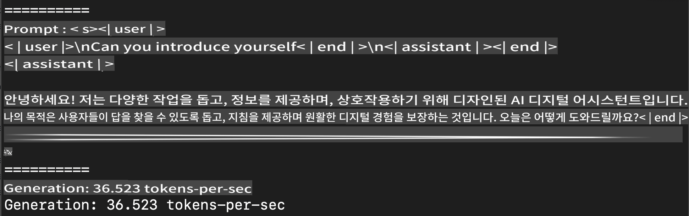
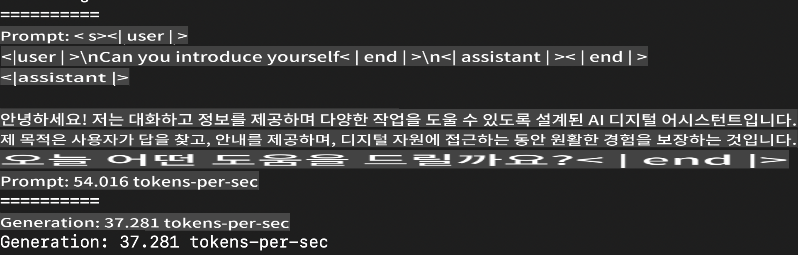

# **Apple MLX 프레임워크로 Phi-3 추론하기**

## **MLX 프레임워크란 무엇인가**

MLX는 Apple 실리콘에서 머신 러닝 연구를 위한 배열 프레임워크로, Apple 머신 러닝 연구팀이 제공합니다.

MLX는 머신 러닝 연구자들을 위해 설계되었습니다. 이 프레임워크는 사용자 친화적이지만 모델을 학습하고 배포하는 데 여전히 효율적입니다. 프레임워크의 설계 자체도 개념적으로 간단합니다. 연구자들이 새로운 아이디어를 빠르게 탐구할 수 있도록 MLX를 확장하고 개선하는 것을 쉽게 만드는 것이 목표입니다.

LLM은 Apple Silicon 장치에서 MLX를 통해 가속화될 수 있으며, 모델은 로컬에서 매우 편리하게 실행할 수 있습니다.

## **MLX를 사용하여 Phi-3-mini 추론하기**

### **1. MLX 환경 설정하기**

1. Python 3.11.x
2. MLX 라이브러리 설치하기


```bash

pip install mlx-lm

```

### **2. 터미널에서 MLX로 Phi-3-mini 실행하기**


```bash

python -m mlx_lm.generate --model microsoft/Phi-3-mini-4k-instruct --max-token 2048 --prompt  "<|user|>\nCan you introduce yourself<|end|>\n<|assistant|>"

```

결과 (내 환경은 Apple M1 Max, 64GB)는 다음과 같습니다



### **3. 터미널에서 MLX로 Phi-3-mini 양자화하기**


```bash

python -m mlx_lm.convert --hf-path microsoft/Phi-3-mini-4k-instruct

```

***Note：*** 모델은 mlx_lm.convert를 통해 양자화할 수 있으며, 기본 양자화는 INT4입니다. 이 예제에서는 Phi-3-mini를 INT4로 양자화합니다.

모델은 mlx_lm.convert를 통해 양자화할 수 있으며, 기본 양자화는 INT4입니다. 이 예제에서는 Phi-3-mini를 INT4로 양자화합니다. 양자화 후에는 기본 디렉토리 ./mlx_model에 저장됩니다.

터미널에서 MLX로 양자화된 모델을 테스트할 수 있습니다.


```bash

python -m mlx_lm.generate --model ./mlx_model/ --max-token 2048 --prompt  "<|user|>\nCan you introduce yourself<|end|>\n<|assistant|>"

```

결과는 다음과 같습니다




### **4. Jupyter Notebook에서 MLX로 Phi-3-mini 실행하기**


***Note:*** 이 샘플을 읽어보세요 [이 링크 클릭](../../../../code/03.Inference/MLX/MLX_DEMO.ipynb)


## **리소스**

1. Apple MLX 프레임워크에 대해 알아보기 [https://ml-explore.github.io](https://ml-explore.github.io/mlx/build/html/index.html)

2. Apple MLX GitHub Repo [https://github.com/ml-explore](https://github.com/ml-explore)

