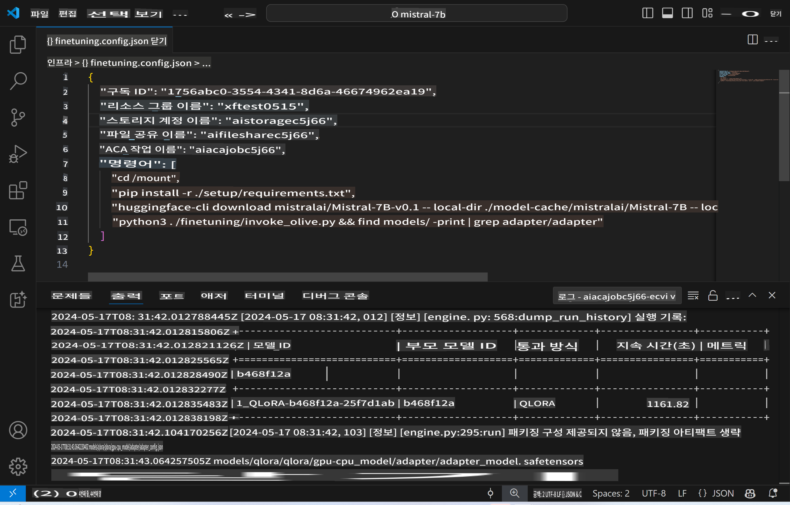
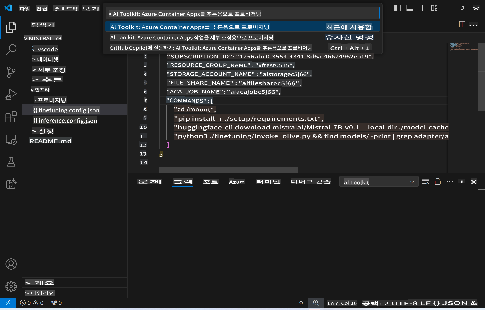
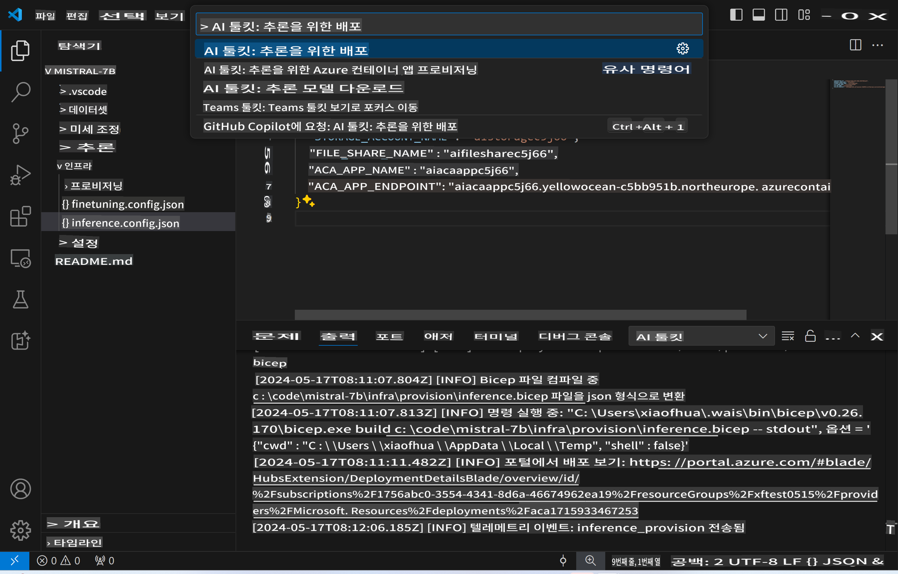
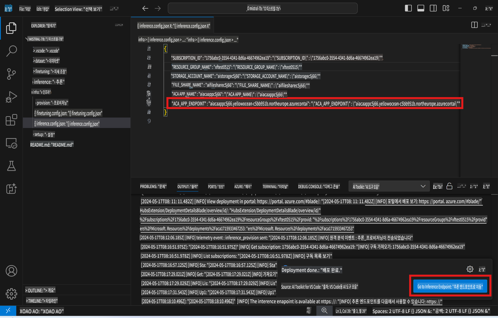

# 미세 조정된 모델로 원격 추론하기

어댑터가 원격 환경에서 학습된 후, 간단한 Gradio 애플리케이션을 사용하여 모델과 상호작용할 수 있습니다.



### Azure 리소스 준비하기
명령 팔레트에서 `AI Toolkit: Provision Azure Container Apps for inference`를 실행하여 원격 추론을 위한 Azure 리소스를 설정해야 합니다. 이 설정 중에 Azure 구독과 리소스 그룹을 선택하라는 메시지가 표시됩니다.  


기본적으로 추론을 위한 구독과 리소스 그룹은 미세 조정에 사용된 것과 동일해야 합니다. 추론은 동일한 Azure Container App Environment를 사용하고, 미세 조정 단계에서 생성된 Azure Files에 저장된 모델과 모델 어댑터에 접근하게 됩니다.

## AI Toolkit 사용하기

### 추론을 위한 배포  
추론 코드를 수정하거나 추론 모델을 다시 로드하려면 `AI Toolkit: Deploy for inference` 명령을 실행하십시오. 이 명령은 최신 코드를 ACA와 동기화하고 복제본을 재시작합니다.



배포가 성공적으로 완료되면, 이 엔드포인트를 사용하여 모델을 평가할 준비가 됩니다.

### 추론 API에 접근하기

VSCode 알림에 표시된 "*Go to Inference Endpoint*" 버튼을 클릭하여 추론 API에 접근할 수 있습니다. 또는 웹 API 엔드포인트는 `./infra/inference.config.json`의 `ACA_APP_ENDPOINT`와 출력 패널에서 찾을 수 있습니다.



> **Note:** 추론 엔드포인트가 완전히 작동하려면 몇 분이 걸릴 수 있습니다.

## 템플릿에 포함된 추론 구성 요소

| 폴더 | 내용 |
| ------ |--------- |
| `infra` | 원격 작업에 필요한 모든 구성을 포함합니다. |
| `infra/provision/inference.parameters.json` | Azure 리소스를 프로비저닝하는 데 사용되는 bicep 템플릿의 매개변수를 포함합니다. |
| `infra/provision/inference.bicep` | Azure 리소스를 프로비저닝하는 템플릿을 포함합니다. |
| `infra/inference.config.json` | `AI Toolkit: Provision Azure Container Apps for inference` 명령에 의해 생성된 구성 파일입니다. 다른 원격 명령 팔레트의 입력으로 사용됩니다. |

### AI Toolkit을 사용하여 Azure 리소스 프로비저닝 구성하기
[AI Toolkit](https://marketplace.visualstudio.com/items?itemName=ms-windows-ai-studio.windows-ai-studio)을 구성하십시오.

추론을 위한 Azure Container Apps 프로비저닝` 명령을 실행합니다.

구성 매개변수는 `./infra/provision/inference.parameters.json` 파일에서 찾을 수 있습니다. 자세한 내용은 다음과 같습니다:
| 매개변수 | 설명 |
| --------- |------------ |
| `defaultCommands` | 웹 API를 시작하는 명령입니다. |
| `maximumInstanceCount` | GPU 인스턴스의 최대 용량을 설정하는 매개변수입니다. |
| `location` | Azure 리소스가 프로비저닝되는 위치입니다. 기본값은 선택한 리소스 그룹의 위치와 동일합니다. |
| `storageAccountName`, `fileShareName` `acaEnvironmentName`, `acaEnvironmentStorageName`, `acaAppName`,  `acaLogAnalyticsName` | 이 매개변수들은 Azure 리소스의 이름을 지정하는 데 사용됩니다. 기본적으로 미세 조정 리소스 이름과 동일합니다. 사용자 정의 이름의 리소스를 생성하려면 새로 사용되지 않은 리소스 이름을 입력하거나, 기존 Azure 리소스를 사용하려면 해당 리소스의 이름을 입력하십시오. 자세한 내용은 [기존 Azure 리소스 사용](../../../../md/03.Inference) 섹션을 참조하십시오. |

### 기존 Azure 리소스 사용하기

기본적으로 추론 프로비저닝은 미세 조정에 사용된 동일한 Azure Container App Environment, Storage Account, Azure File Share, Azure Log Analytics를 사용합니다. 추론 API를 위해 별도의 Azure Container App이 생성됩니다.

미세 조정 단계에서 Azure 리소스를 사용자 정의했거나, 추론을 위해 기존 Azure 리소스를 사용하려는 경우, `./infra/inference.parameters.json` 파일에 해당 이름을 지정하십시오. 그런 다음, 명령 팔레트에서 `AI Toolkit: Provision Azure Container Apps for inference` 명령을 실행하십시오. 이는 지정된 리소스를 업데이트하고 누락된 리소스를 생성합니다.

예를 들어, 기존의 Azure 컨테이너 환경이 있는 경우, `./infra/finetuning.parameters.json` 파일은 다음과 같아야 합니다:

```json
{
    "$schema": "https://schema.management.azure.com/schemas/2019-04-01/deploymentParameters.json#",
    "contentVersion": "1.0.0.0",
    "parameters": {
      ...
      "acaEnvironmentName": {
        "value": "<your-aca-env-name>"
      },
      "acaEnvironmentStorageName": {
        "value": null
      },
      ...
    }
  }
```

### 수동 프로비저닝  
Azure 리소스를 수동으로 구성하려면 `./infra/provision` 폴더에 제공된 bicep 파일을 사용할 수 있습니다. AI Toolkit 명령 팔레트를 사용하지 않고 이미 모든 Azure 리소스를 설정 및 구성한 경우, `inference.config.json` 파일에 리소스 이름을 입력하기만 하면 됩니다.

예를 들어:

```json
{
  "SUBSCRIPTION_ID": "<your-subscription-id>",
  "RESOURCE_GROUP_NAME": "<your-resource-group-name>",
  "STORAGE_ACCOUNT_NAME": "<your-storage-account-name>",
  "FILE_SHARE_NAME": "<your-file-share-name>",
  "ACA_APP_NAME": "<your-aca-name>",
  "ACA_APP_ENDPOINT": "<your-aca-endpoint>"
}
```

면책 조항: 이 번역은 AI 모델에 의해 원본에서 번역되었으며 완벽하지 않을 수 있습니다. 
출력을 검토하고 필요한 수정 사항을 반영해 주시기 바랍니다.