# Azure AI Studio를 사용한 Phi-3 미니 모델 미세 조정

Microsoft의 Phi-3 Mini 언어 모델을 Azure AI Studio를 통해 어떻게 미세 조정할 수 있는지 살펴보겠습니다. 미세 조정은 Phi-3 Mini를 특정 작업에 맞게 조정하여 더욱 강력하고 상황 인식 능력을 향상시킵니다.

## 고려 사항

- **능력:** 어떤 모델이 미세 조정 가능합니까? 기본 모델을 어떻게 미세 조정할 수 있습니까?
- **비용:** 미세 조정의 가격 모델은 무엇입니까?
- **맞춤화:** 기본 모델을 얼마나 수정할 수 있습니까? 어떤 방식으로 수정할 수 있습니까?
- **편의성:** 미세 조정은 실제로 어떻게 이루어집니까? 사용자 정의 코드를 작성해야 합니까? 자체 컴퓨팅 리소스를 제공해야 합니까?
- **안전성:** 미세 조정된 모델은 안전성 위험이 있을 수 있습니다. 의도치 않은 피해를 방지하기 위한 안전 장치가 있습니까?

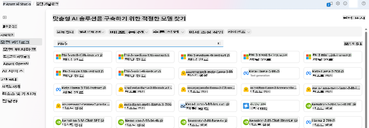

## 미세 조정을 위한 준비

### 사전 요구 사항

> [!NOTE]
> Phi-3 계열 모델의 경우, 사용한 만큼 지불하는 모델의 미세 조정 제공은 **East US 2** 지역에서 생성된 허브에서만 가능합니다.

- Azure 구독. Azure 구독이 없는 경우, [유료 Azure 계정](https://azure.microsoft.com/pricing/purchase-options/pay-as-you-go)을 생성하여 시작하십시오.

- [AI Studio 프로젝트](https://ai.azure.com?WT.mc_id=aiml-138114-kinfeylo).
- Azure 역할 기반 액세스 제어(Azure RBAC)는 Azure AI Studio에서 작업에 대한 액세스를 부여하는 데 사용됩니다. 이 문서의 단계를 수행하려면 사용자 계정이 리소스 그룹에 대해 __Azure AI 개발자 역할__로 할당되어야 합니다.

### 구독 제공자 등록

구독이 `Microsoft.Network` 리소스 제공자에 등록되어 있는지 확인합니다.

1. [Azure 포털](https://portal.azure.com)에 로그인합니다.
1. 왼쪽 메뉴에서 **구독**을 선택합니다.
1. 사용하려는 구독을 선택합니다.
1. 왼쪽 메뉴에서 **AI 프로젝트 설정** > **리소스 제공자**를 선택합니다.
1. **Microsoft.Network**가 리소스 제공자 목록에 있는지 확인합니다. 그렇지 않으면 추가합니다.

### 데이터 준비

모델을 미세 조정하기 위해 훈련 및 검증 데이터를 준비합니다. 훈련 데이터와 검증 데이터 세트는 모델이 수행해야 할 입력 및 출력 예제를 포함합니다.

모든 훈련 예제가 추론에 대한 예상 형식을 따르도록 합니다. 모델을 효과적으로 미세 조정하려면 균형 잡힌 다양한 데이터 세트를 확보하십시오.

이 작업에는 데이터 균형을 유지하고 다양한 시나리오를 포함하며, 실제 기대치에 맞추기 위해 주기적으로 훈련 데이터를 정제하는 것이 포함됩니다. 이는 궁극적으로 더 정확하고 균형 잡힌 모델 응답을 이끌어냅니다.

다른 모델 유형은 다른 형식의 훈련 데이터를 요구합니다.

### 채팅 완료

사용하는 훈련 및 검증 데이터는 **반드시** JSON Lines(JSONL) 문서 형식이어야 합니다. `Phi-3-mini-128k-instruct`의 경우, 미세 조정 데이터 세트는 채팅 완료 API에서 사용하는 대화 형식으로 형식화되어야 합니다.

### 예제 파일 형식

```json
    {"messages": [{"role": "system", "content": "당신은 Xbox 고객 지원 에이전트입니다. 주요 목표는 Xbox 장치에 문제가 있는 사용자들을 돕는 것입니다. 친절하고 간결합니다. Xbox와 관련 없는 답변은 제공하지 않습니다."}, {"role": "user", "content": "Xbox가 PlayStation보다 나은가요?"}, {"role": "assistant", "content": "죄송하지만 개인적인 의견은 제공할 수 없습니다. 제 주요 업무는 Xbox 장치와 관련된 문제를 돕는 것입니다. Xbox와 관련된 문제가 있습니까?"}]}
    {"messages": [{"role": "system", "content": "당신은 Xbox 고객 지원 에이전트입니다. 주요 목표는 Xbox 장치에 문제가 있는 사용자들을 돕는 것입니다. 친절하고 간결합니다. Xbox와 관련 없는 답변은 제공하지 않습니다."}, {"role": "user", "content": "PC 게임을 Xbox에서 할 수 있나요?"}, {"role": "assistant", "content": "Xbox 콘솔은 기본적으로 PC 게임을 지원하지 않지만, 많은 Xbox 게임을 플레이할 수 있습니다. 많은 게임이 PC에서도 사용할 수 있습니다. Xbox 장치와 호환되는 게임을 찾는 데 도움을 드릴까요?"}]}
    {"messages": [{"role": "system", "content": "당신은 Xbox 고객 지원 에이전트입니다. 주요 목표는 Xbox 장치에 문제가 있는 사용자들을 돕는 것입니다. 친절하고 간결합니다. Xbox와 관련 없는 답변은 제공하지 않습니다."}, {"role": "user", "content": "Xbox를 Wi-Fi에 연결하는 데 문제가 있습니다."}, {"role": "assistant", "content": "걱정 마세요, Xbox의 네트워크 설정을 살펴봅시다. Wi-Fi에 연결하려고 할 때 어떤 일이 발생하는지 알려주세요."}]}
```

지원되는 파일 형식은 JSON Lines입니다. 파일은 기본 데이터 저장소에 업로드되고 프로젝트에서 사용할 수 있게 됩니다.

## Azure AI Studio를 사용한 Phi-3 미세 조정

Azure AI Studio를 사용하면 미세 조정이라는 프로세스를 통해 대규모 언어 모델을 개인 데이터 세트에 맞게 조정할 수 있습니다. 미세 조정은 특정 작업 및 애플리케이션에 맞춤화 및 최적화를 가능하게 하여 상당한 가치를 제공합니다. 이는 성능 향상, 비용 효율성, 지연 시간 감소 및 맞춤형 출력을 이끌어냅니다.

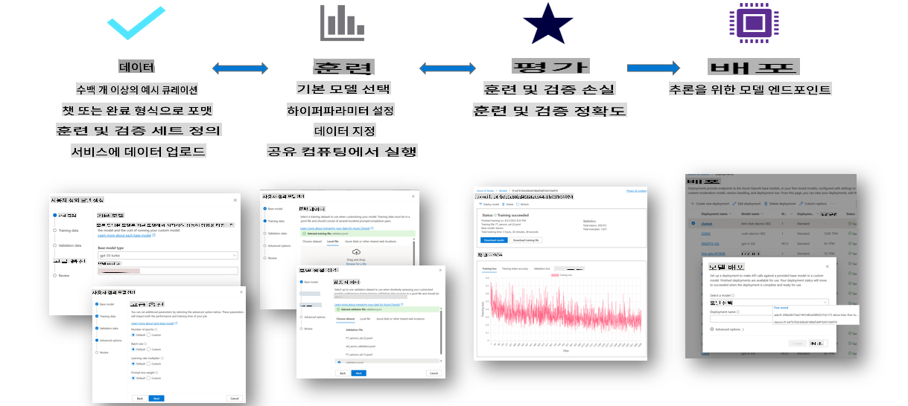

### 새 프로젝트 생성

1. [Azure AI Studio](https://ai.azure.com)에 로그인합니다.

1. **+새 프로젝트**를 선택하여 Azure AI Studio에서 새 프로젝트를 생성합니다.

    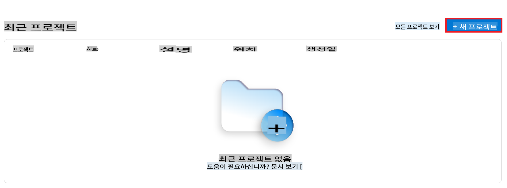

1. 다음 작업을 수행합니다:

    - 프로젝트 **허브 이름**을 입력합니다. 고유한 값이어야 합니다.
    - 사용할 **허브**를 선택합니다(필요한 경우 새로 생성).

    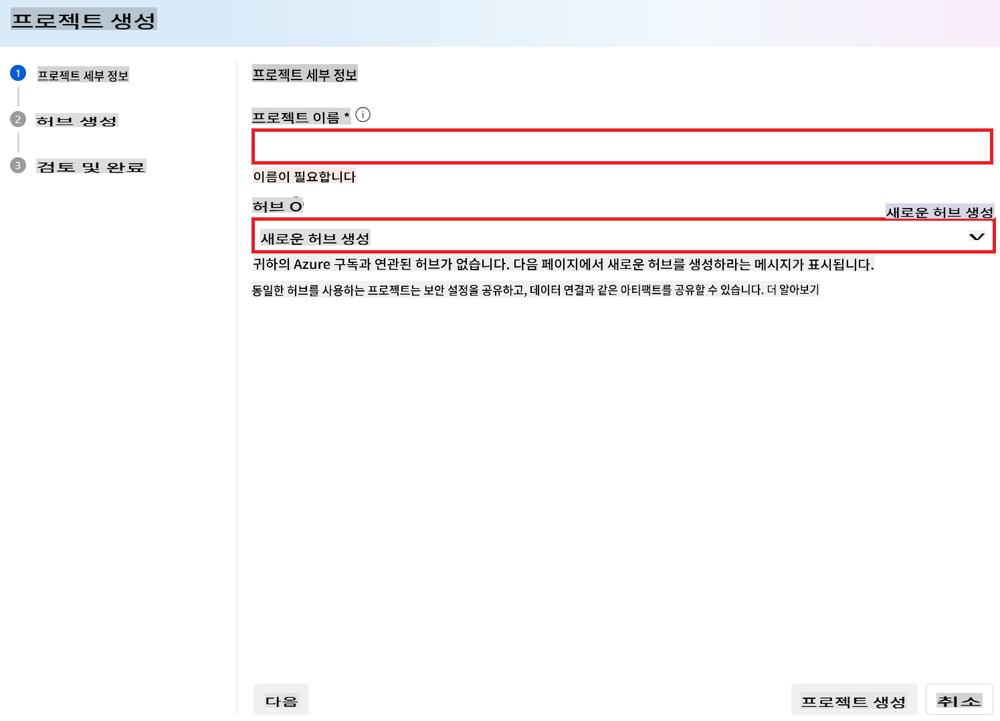

1. 새 허브를 생성하기 위해 다음 작업을 수행합니다:

    - **허브 이름**을 입력합니다. 고유한 값이어야 합니다.
    - Azure **구독**을 선택합니다.
    - 사용할 **리소스 그룹**을 선택합니다(필요한 경우 새로 생성).
    - 사용할 **위치**를 선택합니다.
    - 사용할 **Azure AI 서비스 연결**을 선택합니다(필요한 경우 새로 생성).
    - **Azure AI 검색 연결**을 선택하여 **연결 건너뛰기**를 선택합니다.

    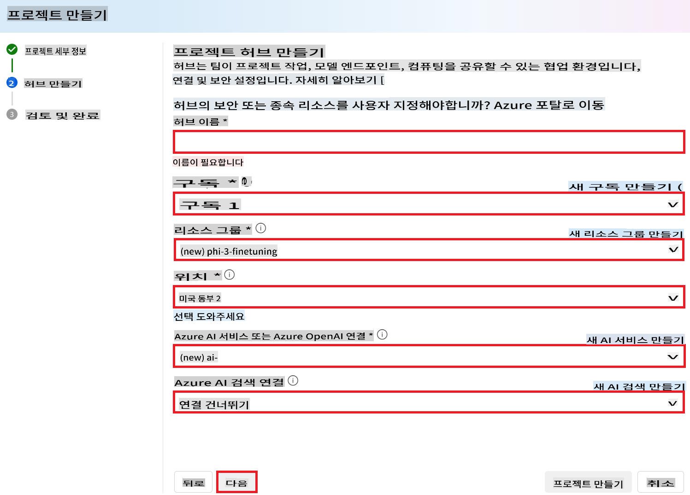

1. **다음**을 선택합니다.
1. **프로젝트 생성**을 선택합니다.

### 데이터 준비

미세 조정 전에, 작업과 관련된 데이터 세트를 수집하거나 생성하십시오. 예를 들어 채팅 지침, 질문-답변 쌍 또는 기타 관련 텍스트 데이터를 준비합니다. 노이즈 제거, 누락 값 처리 및 텍스트 토큰화 등을 통해 데이터를 정리하고 전처리합니다.

### Azure AI Studio에서 Phi-3 모델 미세 조정

> [!NOTE]
> Phi-3 모델의 미세 조정은 현재 East US 2에 위치한 프로젝트에서 지원됩니다.

1. 왼쪽 탭에서 **모델 카탈로그**를 선택합니다.

1. **검색 창**에 *phi-3*을 입력하고 사용하려는 phi-3 모델을 선택합니다.

    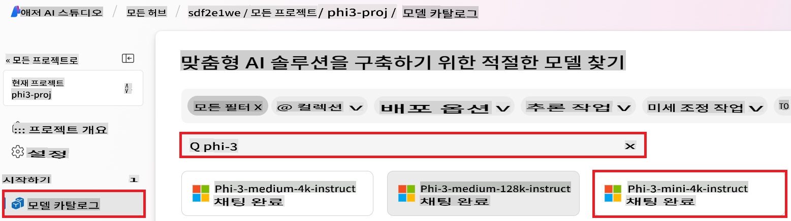

1. **미세 조정**을 선택합니다.

    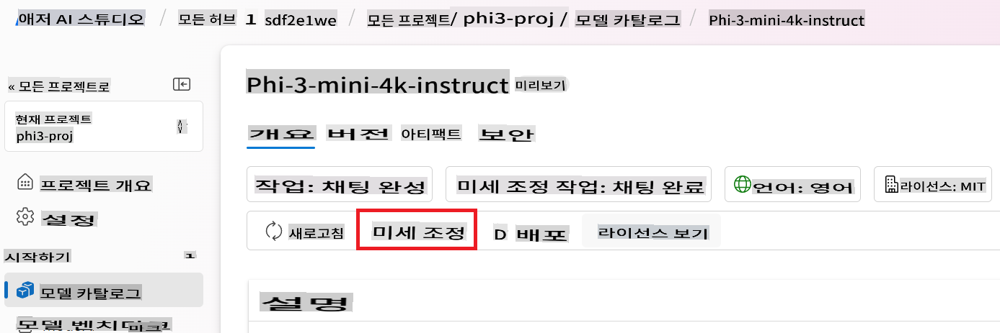

1. **미세 조정된 모델 이름**을 입력합니다.

    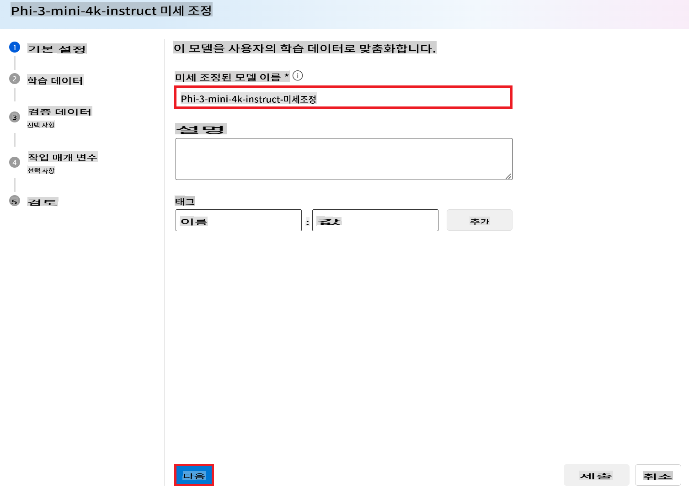

1. **다음**을 선택합니다.

1. 다음 작업을 수행합니다:

    - **작업 유형**을 **채팅 완료**로 선택합니다.
    - 사용할 **훈련 데이터**를 선택합니다. Azure AI Studio의 데이터 또는 로컬 환경에서 업로드할 수 있습니다.

    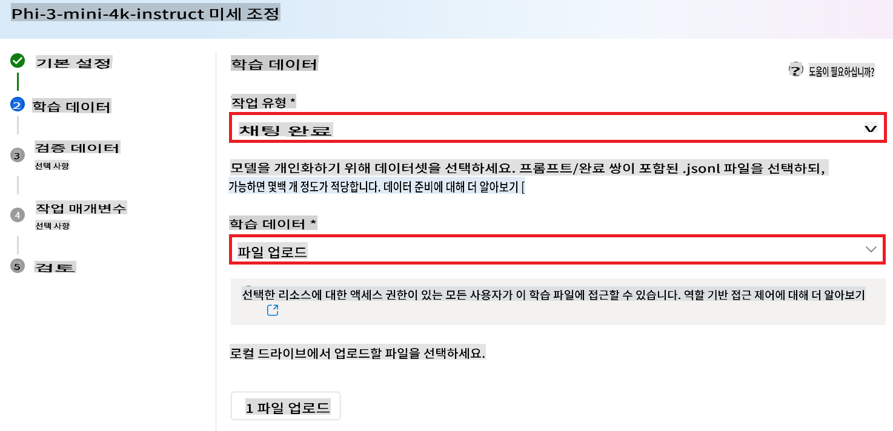

1. **다음**을 선택합니다.

1. 사용할 **검증 데이터**를 업로드하거나 **훈련 데이터의 자동 분할**을 선택할 수 있습니다.

    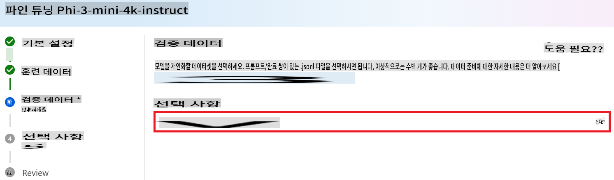

1. **다음**을 선택합니다.

1. 다음 작업을 수행합니다:

    - 사용할 **배치 크기 배수**를 선택합니다.
    - 사용할 **학습률**을 선택합니다.
    - 사용할 **에포크**를 선택합니다.

    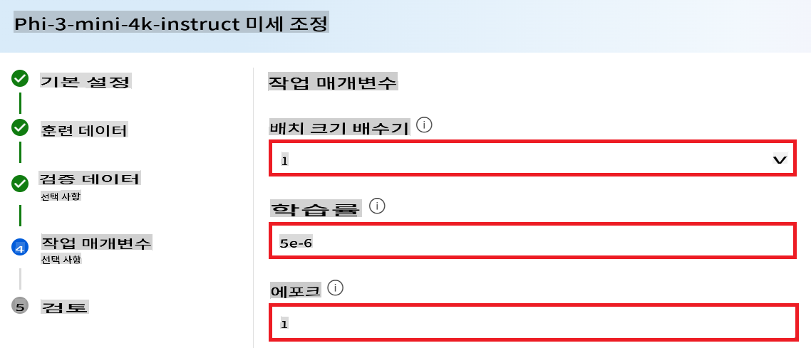

1. **제출**을 선택하여 미세 조정 프로세스를 시작합니다.

    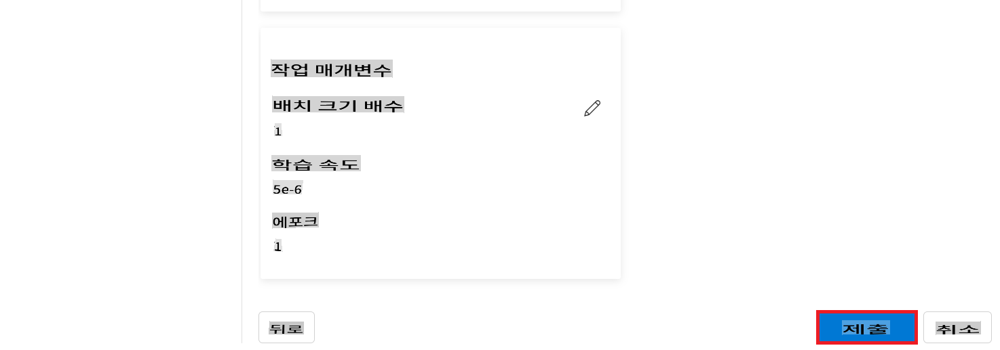

1. 모델이 미세 조정되면 상태가 **완료됨**으로 표시됩니다. 이제 모델을 배포하여 자체 애플리케이션, 플레이그라운드 또는 프롬프트 흐름에서 사용할 수 있습니다. 자세한 내용은 [Azure AI Studio를 사용하여 Phi-3 소형 언어 모델 배포 방법](https://learn.microsoft.com/azure/ai-studio/how-to/deploy-models-phi-3?tabs=phi-3-5&pivots=programming-language-python)을 참조하십시오.

    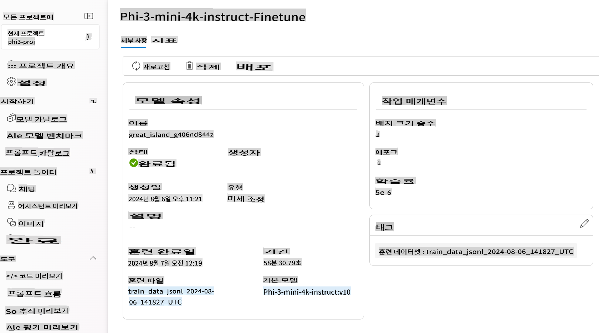

> [!NOTE]
> Phi-3 미세 조정에 대한 자세한 정보는 [Azure AI Studio에서 Phi-3 모델 미세 조정](https://learn.microsoft.com/azure/ai-studio/how-to/fine-tune-phi-3?tabs=phi-3-mini)을 참조하십시오.

## 미세 조정된 모델 정리

미세 조정된 모델은 [Azure AI Studio](https://ai.azure.com)의 미세 조정 모델 목록이나 모델 세부 정보 페이지에서 삭제할 수 있습니다. 미세 조정 페이지에서 삭제할 모델을 선택한 다음 삭제 버튼을 선택하여 미세 조정된 모델을 삭제합니다.

> [!NOTE]
> 기존 배포가 있는 경우 사용자 정의 모델을 삭제할 수 없습니다. 사용자 정의 모델을 삭제하기 전에 모델 배포를 먼저 삭제해야 합니다.

## 비용 및 할당량

### 서비스로서 미세 조정된 Phi-3 모델의 비용 및 할당량 고려 사항

Microsoft에서 제공하고 Azure AI Studio와 통합된 서비스로서 미세 조정된 Phi 모델을 사용할 수 있습니다. 모델을 [배포](https://learn.microsoft.com/azure/ai-studio/how-to/deploy-models-phi-3?tabs=phi-3-5&pivots=programming-language-python)하거나 미세 조정할 때 배포 마법사의 가격 및 조건 탭에서 가격을 확인할 수 있습니다.

## 콘텐츠 필터링

사용한 만큼 지불하는 서비스로 배포된 모델은 Azure AI 콘텐츠 안전성으로 보호됩니다. 실시간 엔드포인트에 배포될 때 이 기능을 선택 해제할 수 있습니다. Azure AI 콘텐츠 안전성이 활성화되면 프롬프트와 완료 모두 유해한 콘텐츠 출력을 탐지하고 방지하는 분류 모델 그룹을 통과합니다. 콘텐츠 필터링 시스템은 입력 프롬프트와 출력 완료 모두에서 특정 카테고리의 잠재적으로 유해한 콘텐츠를 탐지하고 조치를 취합니다. 자세한 내용은 [Azure AI 콘텐츠 안전성](https://learn.microsoft.com/azure/ai-studio/concepts/content-filtering)을 참조하십시오.

**미세 조정 구성**

하이퍼파라미터: 학습률, 배치 크기 및 훈련 에포크 수와 같은 하이퍼파라미터를 정의합니다.

**손실 함수**

작업에 적합한 손실 함수를 선택합니다(예: 교차 엔트로피).

**옵티마이저**

훈련 중 경사 업데이트를 위해 옵티마이저(예: Adam)를 선택합니다.

**미세 조정 과정**

- 사전 훈련된 모델 로드: Phi-3 Mini 체크포인트를 로드합니다.
- 사용자 정의 레이어 추가: 작업에 맞는 레이어를 추가합니다(예: 채팅 지침용 분류 헤드).

**모델 훈련**
준비된 데이터 세트를 사용하여 모델을 미세 조정합니다. 훈련 진행 상황을 모니터링하고 필요에 따라 하이퍼파라미터를 조정합니다.

**평가 및 검증**

검증 세트: 데이터를 훈련 세트와 검증 세트로 나눕니다.

**성능 평가**

정확도, F1 점수 또는 혼란도를 사용하여 모델 성능을 평가합니다.

## 미세 조정된 모델 저장

**체크포인트**
미래 사용을 위해 미세 조정된 모델 체크포인트를 저장합니다.

## 배포

- 웹 서비스로 배포: 미세 조정된 모델을 Azure AI Studio에서 웹 서비스로 배포합니다.
- 엔드포인트 테스트: 배포된 엔드포인트에 테스트 쿼리를 보내 기능을 확인합니다.

## 반복 및 개선

반복: 성능이 만족스럽지 않으면 하이퍼파라미터를 조정하거나 더 많은 데이터를 추가하거나 추가 에포크 동안 미세 조정하여 반복합니다.

## 모니터링 및 정제

모델의 동작을 지속적으로 모니터링하고 필요에 따라 정제합니다.

## 맞춤화 및 확장

사용자 정의 작업: Phi-3 Mini는 채팅 지침 외에도 다양한 작업에 미세 조정될 수 있습니다. 다른 사용 사례를 탐구해보세요!
실험: 다양한 아키텍처, 레이어 조합 및 기술을 시도하여 성능을 향상시킵니다.

> [!NOTE]
> 미세 조정은 반복적인 과정입니다. 실험하고 배우며 모델을 조정하여 특정 작업에 최상의 결과를 얻으세요!

