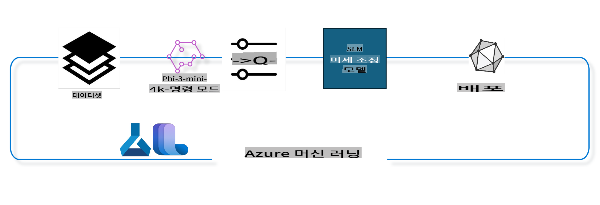

## Azure ML 시스템 레지스트리의 채팅-완료 구성 요소를 사용하여 모델 미세 조정하는 방법

이 예제에서는 ultrachat_200k 데이터셋을 사용하여 두 사람 간의 대화를 완성하는 Phi-3-mini-4k-instruct 모델을 미세 조정하는 작업을 수행합니다.



이 예제는 Azure ML SDK와 Python을 사용하여 미세 조정을 수행한 후, 실시간 추론을 위해 온라인 엔드포인트에 미세 조정된 모델을 배포하는 방법을 보여줍니다.

### 훈련 데이터

우리는 ultrachat_200k 데이터셋을 사용할 것입니다. 이 데이터셋은 UltraChat 데이터셋의 필터링된 버전으로, 최첨단 7b 채팅 모델인 Zephyr-7B-β를 훈련시키는 데 사용되었습니다.

### 모델

우리는 Phi-3-mini-4k-instruct 모델을 사용하여 사용자가 채팅-완료 작업을 위해 모델을 미세 조정하는 방법을 보여줍니다. 이 노트북을 특정 모델 카드에서 열었다면, 해당 모델 이름으로 바꾸는 것을 잊지 마세요.

### 작업

- 미세 조정할 모델 선택
- 훈련 데이터 선택 및 탐색
- 미세 조정 작업 구성
- 미세 조정 작업 실행
- 훈련 및 평가 지표 검토
- 미세 조정된 모델 등록
- 실시간 추론을 위해 미세 조정된 모델 배포
- 리소스 정리

## 1. 사전 준비 설정

- 종속성 설치
- AzureML 작업 영역에 연결. SDK 인증 설정에 대해 자세히 알아보세요. 아래의 <WORKSPACE_NAME>, <RESOURCE_GROUP>, <SUBSCRIPTION_ID>를 대체하세요.
- azureml 시스템 레지스트리에 연결
- 실험 이름을 선택적으로 설정
- 컴퓨팅 자원 확인 또는 생성

> [!NOTE]
> 요구 사항: 하나의 GPU 노드에 여러 GPU 카드가 있을 수 있습니다. 예를 들어, Standard_NC24rs_v3의 한 노드에는 4개의 NVIDIA V100 GPU가 있고, Standard_NC12s_v3에는 2개의 NVIDIA V100 GPU가 있습니다. 이 정보는 문서를 참조하세요. 노드당 GPU 카드 수는 아래의 gpus_per_node 매개변수에 설정됩니다. 이 값을 올바르게 설정하면 노드의 모든 GPU를 사용할 수 있습니다. 권장 GPU 컴퓨팅 SKU는 여기와 여기를 참조하세요.

### Python 라이브러리

아래 셀을 실행하여 종속성을 설치하세요. 새로운 환경에서 실행 중이라면 이 단계는 선택 사항이 아닙니다.

```bash
pip install azure-ai-ml
pip install azure-identity
pip install datasets==2.9.0
pip install mlflow
pip install azureml-mlflow
```

### Azure ML과 상호작용

1. 이 Python 스크립트는 Azure Machine Learning (Azure ML) 서비스와 상호작용하는 데 사용됩니다. 여기서 수행하는 작업은 다음과 같습니다:

    - 필요한 모듈을 azure.ai.ml, azure.identity, azure.ai.ml.entities 패키지에서 가져옵니다. 또한 time 모듈을 가져옵니다.

    - DefaultAzureCredential()을 사용하여 인증을 시도합니다. 이 방법은 Azure 클라우드에서 실행되는 애플리케이션을 빠르게 개발할 수 있도록 단순화된 인증 경험을 제공합니다. 인증이 실패하면 InteractiveBrowserCredential()로 대체되어 인터랙티브 로그인 프롬프트를 제공합니다.

    - from_config 메서드를 사용하여 기본 구성 파일(config.json)에서 구성 정보를 읽어 MLClient 인스턴스를 생성하려고 시도합니다. 실패하면 subscription_id, resource_group_name, workspace_name을 수동으로 제공하여 MLClient 인스턴스를 생성합니다.

    - "azureml"이라는 이름의 Azure ML 레지스트리를 위한 또 다른 MLClient 인스턴스를 생성합니다. 이 레지스트리는 모델, 미세 조정 파이프라인 및 환경이 저장되는 곳입니다.

    - experiment_name을 "chat_completion_Phi-3-mini-4k-instruct"로 설정합니다.

    - 현재 시간(에포크 이후의 초 단위 시간)을 정수로 변환한 후 문자열로 변환하여 고유한 타임스탬프를 생성합니다. 이 타임스탬프는 고유한 이름과 버전을 생성하는 데 사용할 수 있습니다.

    ```python
    # Import necessary modules from Azure ML and Azure Identity
    from azure.ai.ml import MLClient
    from azure.identity import (
        DefaultAzureCredential,
        InteractiveBrowserCredential,
    )
    from azure.ai.ml.entities import AmlCompute
    import time  # Import time module
    
    # Try to authenticate using DefaultAzureCredential
    try:
        credential = DefaultAzureCredential()
        credential.get_token("https://management.azure.com/.default")
    except Exception as ex:  # If DefaultAzureCredential fails, use InteractiveBrowserCredential
        credential = InteractiveBrowserCredential()
    
    # Try to create an MLClient instance using the default config file
    try:
        workspace_ml_client = MLClient.from_config(credential=credential)
    except:  # If that fails, create an MLClient instance by manually providing the details
        workspace_ml_client = MLClient(
            credential,
            subscription_id="<SUBSCRIPTION_ID>",
            resource_group_name="<RESOURCE_GROUP>",
            workspace_name="<WORKSPACE_NAME>",
        )
    
    # Create another MLClient instance for the Azure ML registry named "azureml"
    # This registry is where models, fine-tuning pipelines, and environments are stored
    registry_ml_client = MLClient(credential, registry_name="azureml")
    
    # Set the experiment name
    experiment_name = "chat_completion_Phi-3-mini-4k-instruct"
    
    # Generate a unique timestamp that can be used for names and versions that need to be unique
    timestamp = str(int(time.time()))
    ```

## 2. 미세 조정할 기본 모델 선택

1. Phi-3-mini-4k-instruct는 Phi-2에 사용된 데이터셋을 기반으로 구축된 3.8B 파라미터의 경량 최첨단 오픈 모델입니다. 이 모델은 Phi-3 모델 패밀리에 속하며, Mini 버전은 4K와 128K의 두 가지 변형으로 제공됩니다. 이는 지원할 수 있는 컨텍스트 길이(토큰 수)입니다. 특정 목적을 위해 모델을 미세 조정해야 합니다. AzureML Studio의 모델 카탈로그에서 채팅-완료 작업을 필터링하여 이러한 모델을 탐색할 수 있습니다. 이 예제에서는 Phi-3-mini-4k-instruct 모델을 사용합니다. 다른 모델을 사용하려면 모델 이름과 버전을 적절히 변경하세요.

    > [!NOTE]
    > 모델의 모델 ID 속성입니다. 이는 미세 조정 작업의 입력으로 전달됩니다. 이는 또한 AzureML Studio 모델 카탈로그의 모델 세부 정보 페이지에서 자산 ID 필드로 제공됩니다.

2. 이 Python 스크립트는 Azure Machine Learning (Azure ML) 서비스와 상호작용하고 있습니다. 여기서 수행하는 작업은 다음과 같습니다:

    - model_name을 "Phi-3-mini-4k-instruct"로 설정합니다.

    - registry_ml_client 객체의 models 속성의 get 메서드를 사용하여 Azure ML 레지스트리에서 지정된 이름의 최신 버전을 검색합니다. get 메서드는 두 개의 인수, 즉 모델 이름과 최신 버전을 검색하도록 지정하는 라벨을 사용합니다.

    - 미세 조정에 사용할 모델의 이름, 버전 및 ID를 콘솔에 출력하는 메시지를 표시합니다. 문자열의 format 메서드를 사용하여 모델의 이름, 버전 및 ID를 메시지에 삽입합니다. 모델의 이름, 버전 및 ID는 foundation_model 객체의 속성으로 액세스됩니다.

    ```python
    # Set the model name
    model_name = "Phi-3-mini-4k-instruct"
    
    # Get the latest version of the model from the Azure ML registry
    foundation_model = registry_ml_client.models.get(model_name, label="latest")
    
    # Print the model name, version, and id
    # This information is useful for tracking and debugging
    print(
        "\n\nUsing model name: {0}, version: {1}, id: {2} for fine tuning".format(
            foundation_model.name, foundation_model.version, foundation_model.id
        )
    )
    ```

## 3. 작업에 사용할 컴퓨팅 생성

미세 조정 작업은 GPU 컴퓨팅과만 작동합니다. 컴퓨팅의 크기는 모델의 크기에 따라 다르며, 대부분의 경우 작업에 적합한 컴퓨팅을 식별하는 것이 까다로울 수 있습니다. 이 셀에서는 사용자가 작업에 적합한 컴퓨팅을 선택하는 방법을 안내합니다.

> [!NOTE]
> 아래 나열된 컴퓨팅은 가장 최적화된 구성과 함께 작동합니다. 구성 변경은 Cuda Out Of Memory 오류로 이어질 수 있습니다. 이러한 경우 더 큰 컴퓨팅 크기로 업그레이드해 보세요.

> [!NOTE]
> 아래에서 compute_cluster_size를 선택할 때, 컴퓨팅이 리소스 그룹에 사용 가능한지 확인하세요. 특정 컴퓨팅이 사용 가능하지 않은 경우, 컴퓨팅 리소스에 대한 액세스를 요청할 수 있습니다.

### 미세 조정 지원 모델 확인

1. 이 Python 스크립트는 Azure Machine Learning (Azure ML) 모델과 상호작용하고 있습니다. 여기서 수행하는 작업은 다음과 같습니다:

    - ast 모듈을 가져옵니다. 이 모듈은 Python 추상 구문 트리의 기능을 처리하는 함수를 제공합니다.

    - foundation_model 객체(이는 Azure ML의 모델을 나타냄)에 finetune_compute_allow_list라는 태그가 있는지 확인합니다. Azure ML의 태그는 필터링 및 정렬에 사용할 수 있는 키-값 쌍입니다.

    - finetune_compute_allow_list 태그가 있으면, ast.literal_eval 함수를 사용하여 태그의 값을 안전하게 Python 리스트로 파싱합니다. 이 리스트는 computes_allow_list 변수에 할당됩니다. 그런 다음 리스트에서 컴퓨팅을 생성해야 한다는 메시지를 출력합니다.

    - finetune_compute_allow_list 태그가 없으면, computes_allow_list를 None으로 설정하고 모델의 태그에 finetune_compute_allow_list 태그가 포함되지 않았다는 메시지를 출력합니다.

    - 요약하면, 이 스크립트는 모델의 메타데이터에서 특정 태그를 확인하고, 태그의 값을 리스트로 변환하며, 사용자에게 이에 대한 피드백을 제공합니다.

    ```python
    # Import the ast module, which provides functions to process trees of the Python abstract syntax grammar
    import ast
    
    # Check if the 'finetune_compute_allow_list' tag is present in the model's tags
    if "finetune_compute_allow_list" in foundation_model.tags:
        # If the tag is present, use ast.literal_eval to safely parse the tag's value (a string) into a Python list
        computes_allow_list = ast.literal_eval(
            foundation_model.tags["finetune_compute_allow_list"]
        )  # convert string to python list
        # Print a message indicating that a compute should be created from the list
        print(f"Please create a compute from the above list - {computes_allow_list}")
    else:
        # If the tag is not present, set computes_allow_list to None
        computes_allow_list = None
        # Print a message indicating that the 'finetune_compute_allow_list' tag is not part of the model's tags
        print("`finetune_compute_allow_list` is not part of model tags")
    ```

### 컴퓨팅 인스턴스 확인

1. 이 Python 스크립트는 Azure Machine Learning (Azure ML) 서비스와 상호작용하고 있으며, 컴퓨팅 인스턴스에 대한 여러 검사를 수행합니다. 여기서 수행하는 작업은 다음과 같습니다:

    - compute_cluster에 저장된 이름으로 Azure ML 작업 영역에서 컴퓨팅 인스턴스를 검색하려고 시도합니다. 컴퓨팅 인스턴스의 프로비저닝 상태가 "failed"이면 ValueError를 발생시킵니다.

    - computes_allow_list가 None이 아닌지 확인합니다. None이 아니면, 리스트의 모든 컴퓨팅 크기를 소문자로 변환하고 현재 컴퓨팅 인스턴스의 크기가 리스트에 있는지 확인합니다. 없으면 ValueError를 발생시킵니다.

    - computes_allow_list가 None이면, 컴퓨팅 인스턴스의 크기가 지원되지 않는 GPU VM 크기 리스트에 있는지 확인합니다. 있으면 ValueError를 발생시킵니다.

    - 작업 영역의 모든 사용 가능한 컴퓨팅 크기 리스트를 검색합니다. 그런 다음 이 리스트를 반복하여, 각 컴퓨팅 크기에 대해 현재 컴퓨팅 인스턴스의 크기와 이름이 일치하는지 확인합니다. 일치하면 해당 컴퓨팅 크기의 GPU 수를 검색하고 gpu_count_found를 True로 설정합니다.

    - gpu_count_found가 True이면, 컴퓨팅 인스턴스의 GPU 수를 출력합니다. gpu_count_found가 False이면 ValueError를 발생시킵니다.

    - 요약하면, 이 스크립트는 Azure ML 작업 영역의 컴퓨팅 인스턴스에 대한 여러 검사를 수행하고 있으며, 프로비저닝 상태, 허용 리스트 또는 거부 리스트에 대한 크기 확인, GPU 수 확인 등을 수행합니다.

    ```python
    # Print the exception message
    print(e)
    # Raise a ValueError if the compute size is not available in the workspace
    raise ValueError(
        f"WARNING! Compute size {compute_cluster_size} not available in workspace"
    )
    
    # Retrieve the compute instance from the Azure ML workspace
    compute = workspace_ml_client.compute.get(compute_cluster)
    # Check if the provisioning state of the compute instance is "failed"
    if compute.provisioning_state.lower() == "failed":
        # Raise a ValueError if the provisioning state is "failed"
        raise ValueError(
            f"Provisioning failed, Compute '{compute_cluster}' is in failed state. "
            f"please try creating a different compute"
        )
    
    # Check if computes_allow_list is not None
    if computes_allow_list is not None:
        # Convert all compute sizes in computes_allow_list to lowercase
        computes_allow_list_lower_case = [x.lower() for x in computes_allow_list]
        # Check if the size of the compute instance is in computes_allow_list_lower_case
        if compute.size.lower() not in computes_allow_list_lower_case:
            # Raise a ValueError if the size of the compute instance is not in computes_allow_list_lower_case
            raise ValueError(
                f"VM size {compute.size} is not in the allow-listed computes for finetuning"
            )
    else:
        # Define a list of unsupported GPU VM sizes
        unsupported_gpu_vm_list = [
            "standard_nc6",
            "standard_nc12",
            "standard_nc24",
            "standard_nc24r",
        ]
        # Check if the size of the compute instance is in unsupported_gpu_vm_list
        if compute.size.lower() in unsupported_gpu_vm_list:
            # Raise a ValueError if the size of the compute instance is in unsupported_gpu_vm_list
            raise ValueError(
                f"VM size {compute.size} is currently not supported for finetuning"
            )
    
    # Initialize a flag to check if the number of GPUs in the compute instance has been found
    gpu_count_found = False
    # Retrieve a list of all available compute sizes in the workspace
    workspace_compute_sku_list = workspace_ml_client.compute.list_sizes()
    available_sku_sizes = []
    # Iterate over the list of available compute sizes
    for compute_sku in workspace_compute_sku_list:
        available_sku_sizes.append(compute_sku.name)
        # Check if the name of the compute size matches the size of the compute instance
        if compute_sku.name.lower() == compute.size.lower():
            # If it does, retrieve the number of GPUs for that compute size and set gpu_count_found to True
            gpus_per_node = compute_sku.gpus
            gpu_count_found = True
    # If gpu_count_found is True, print the number of GPUs in the compute instance
    if gpu_count_found:
        print(f"Number of GPU's in compute {compute.size}: {gpus_per_node}")
    else:
        # If gpu_count_found is False, raise a ValueError
        raise ValueError(
            f"Number of GPU's in compute {compute.size} not found. Available skus are: {available_sku_sizes}."
            f"This should not happen. Please check the selected compute cluster: {compute_cluster} and try again."
        )
    ```

## 4. 모델 미세 조정을 위한 데이터셋 선택

1. 우리는 ultrachat_200k 데이터셋을 사용합니다. 이 데이터셋은 Supervised fine-tuning (sft)에 적합한 네 가지 분할을 가지고 있습니다. 생성 랭킹(gen). 각 분할의 예제 수는 다음과 같습니다:

    ```bash
    train_sft test_sft  train_gen  test_gen
    207865  23110  256032  28304
    ```

1. 다음 몇 개의 셀은 미세 조정을 위한 기본 데이터 준비를 보여줍니다:

### 데이터 행 시각화

이 샘플이 빠르게 실행되도록 하기 위해, 이미 잘린 행의 5%를 포함하는 train_sft, test_sft 파일을 저장합니다. 이는 미세 조정된 모델의 정확도가 낮아져 실제 사용에 적합하지 않을 수 있음을 의미합니다. download-dataset.py는 ultrachat_200k 데이터셋을 다운로드하고 데이터셋을 미세 조정 파이프라인 구성 요소에서 사용할 수 있는 형식으로 변환하는 데 사용됩니다. 또한 데이터셋이 크기 때문에 여기서는 데이터셋의 일부만 사용합니다.

1. 아래 스크립트를 실행하면 데이터의 5%만 다운로드됩니다. dataset_split_pc 매개변수를 원하는 비율로 변경하여 이 값을 늘릴 수 있습니다.

    > [!NOTE]
    > 일부 언어 모델은 다른 언어 코드를 가지고 있으므로 데이터셋의 열 이름도 동일하게 반영되어야 합니다.

1. 데이터가 어떻게 생겼는지에 대한 예시는 다음과 같습니다.
채팅-완료 데이터셋은 각 항목이 다음 스키마를 사용하는 parquet 형식으로 저장됩니다:

    - 이는 JSON (JavaScript Object Notation) 문서로, 인기 있는 데이터 교환 형식입니다. 실행 가능한 코드는 아니지만 데이터를 저장하고 전송하는 방법입니다. 구조는 다음과 같습니다:

    - "prompt": 이 키는 AI 어시스턴트에게 제시된 작업이나 질문을 나타내는 문자열 값을 가집니다.

    - "messages": 이 키는 객체 배열을 가집니다. 각 객체는 사용자와 AI 어시스턴트 간의 대화에서 메시지를 나타냅니다. 각 메시지 객체는 두 개의 키를 가집니다:

    - "content": 이 키는 메시지의 내용을 나타내는 문자열 값을 가집니다.
    - "role": 이 키는 메시지를 보낸 주체의 역할을 나타내는 문자열 값을 가집니다. "user" 또는 "assistant"일 수 있습니다.
    - "prompt_id": 이 키는 프롬프트의 고유 식별자를 나타내는 문자열 값을 가집니다.

1. 이 특정 JSON 문서에서는 사용자가 AI 어시스턴트에게 디스토피아 이야기의 주인공을 만들어 달라고 요청하는 대화가 나타나 있습니다. 어시스턴트가 응답하고, 사용자가 더 많은 세부 정보를 요청합니다. 어시스턴트는 더 많은 세부 정보를 제공하겠다고 동의합니다. 전체 대화는 특정 프롬프트 ID와 연관되어 있습니다.

    ```python
    {
        // The task or question posed to an AI assistant
        "prompt": "Create a fully-developed protagonist who is challenged to survive within a dystopian society under the rule of a tyrant. ...",
        
        // An array of objects, each representing a message in a conversation between a user and an AI assistant
        "messages":[
            {
                // The content of the user's message
                "content": "Create a fully-developed protagonist who is challenged to survive within a dystopian society under the rule of a tyrant. ...",
                // The role of the entity that sent the message
                "role": "user"
            },
            {
                // The content of the assistant's message
                "content": "Name: Ava\n\n Ava was just 16 years old when the world as she knew it came crashing down. The government had collapsed, leaving behind a chaotic and lawless society. ...",
                // The role of the entity that sent the message
                "role": "assistant"
            },
            {
                // The content of the user's message
                "content": "Wow, Ava's story is so intense and inspiring! Can you provide me with more details.  ...",
                // The role of the entity that sent the message
                "role": "user"
            }, 
            {
                // The content of the assistant's message
                "content": "Certainly! ....",
                // The role of the entity that sent the message
                "role": "assistant"
            }
        ],
        
        // A unique identifier for the prompt
        "prompt_id": "d938b65dfe31f05f80eb8572964c6673eddbd68eff3db6bd234d7f1e3b86c2af"
    }
    ```

### 데이터 다운로드

1. 이 Python 스크립트는 download-dataset.py라는 헬퍼 스크립트를 사용하여 데이터셋을 다운로드하는 데 사용됩니다. 여기서 수행하는 작업은 다음과 같습니다:

    - os 모듈을 가져옵니다. 이 모듈은 운영 체제 종속 기능을 사용할 수 있는 이식 가능한 방법을 제공합니다.

    - os.system 함수를 사용하여 특정 명령줄 인수를 사용하여 download-dataset.py 스크립트를 셸에서 실행합니다. 인수는 다운로드할 데이터셋(HuggingFaceH4/ultrachat_200k), 다운로드할 디렉토리(ultrachat_200k_dataset) 및 데이터셋을 분할할 비율(5)을 지정합니다. os.system 함수는 실행된 명령의 종료 상태를 반환하며, 이 상태는 exit_status 변수에 저장됩니다.

    - exit_status가 0이 아닌지 확인합니다. Unix 계열 운영 체제에서 종료 상태가 0이면 명령이 성공했음을 나타내며, 다른 숫자는 오류를 나타냅니다. exit_status가 0이 아니면 데이터셋을 다운로드하는 데 오류가 있었다는 메시지와 함께 예외를 발생시킵니다.

    - 요약하면, 이 스크립트는 헬퍼 스크립트를 사용하여 데이터셋을 다운로드하는 명령을 실행하며, 명령이 실패하면 예외를 발생시킵니다.

    ```python
    # Import the os module, which provides a way of using operating system dependent functionality
    import os
    
    # Use the os.system function to run the download-dataset.py script in the shell with specific command-line arguments
    # The arguments specify the dataset to download (HuggingFaceH4/ultrachat_200k), the directory to download it to (ultrachat_200k_dataset), and the percentage of the dataset to split (5)
    # The os.system function returns the exit status of the command it executed; this status is stored in the exit_status variable
    exit_status = os.system(
        "python ./download-dataset.py --dataset HuggingFaceH4/ultrachat_200k --download_dir ultrachat_200k_dataset --dataset_split_pc 5"
    )
    
    # Check if exit_status is not 0
    # In Unix-like operating systems, an exit status of 0 usually indicates that a command has succeeded, while any other number indicates an error
    # If exit_status is not 0, raise an Exception with a message indicating that there was an error downloading the dataset
    if exit_status != 0:
        raise Exception("Error downloading dataset")
    ```

### 데이터프레임에 데이터 로드

1. 이 Python 스크립트는 JSON Lines 파일을 pandas 데이터프레임으로 로드하고 첫 5개의 행을 표시합니다. 여기서 수행하는 작업은 다음과 같습니다:

    - pandas 라이브러리를 가져옵니다. 이는 강력한 데이터 조작 및 분석 라이브러리입니다.

    - pandas의 display 옵션에서 최대 열 너비를 0으로 설정합니다. 이는 데이터프레임을 출력할 때 각 열의 전체 텍스트가 잘리지 않고 표시됨을 의미합니다.

    - pd.read_json 함수를 사용하여 ultrachat_200k_dataset 디렉토리에서 train_sft.jsonl 파일을 데이터프레임으로 로드합니다. lines=True 인수는 파일이 JSON Lines 형식임을 나타내며, 각 줄이 별도의 JSON 객체입니다.

    - head 메서드를 사용하여 데이터프레임의 첫 5개 행을 표시합니다. 데이터프레임에 5개 미만의 행이 있으면 모든 행을 표시합니다.

    - 요약하면, 이 스크립트는 JSON Lines 파일을 데이터프레임으로 로드하고 첫 5개 행을 전체 열 텍스트와 함께 표시합니다.

    ```python
    # Import the pandas library, which is a powerful data manipulation and analysis library
    import pandas as pd
    
    # Set the maximum column width for pandas' display options to 0
    # This means that the full text of each column will be displayed without truncation when the DataFrame is printed
    pd.set_option("display.max_colwidth", 0)
    
    # Use the pd.read_json function to load the train_sft.jsonl file from the ultrachat_200k_dataset directory into a DataFrame
    # The lines=True argument indicates that the file is in JSON Lines format, where each line is a separate JSON object
    df = pd.read_json("./ultrachat_200k_dataset/train_sft.jsonl", lines=True)
    
    # Use the head method to display the first 5 rows of the DataFrame
    # If the DataFrame has less than 5 rows, it will display all of them
    df.head()
    ```

## 5. 모델과 데이터를 입력으로 사용하여 미세 조정 작업 제출

채팅-완료 파이프라인 구성 요소를 사용하는 작업을 생성합니다. 미세 조정을 위해 지원되는 모든 매개변수에 대해 자세히 알아보세요.

### 미세 조정 매개변수 정의

1. 미세 조정 매개변수는 두 가지 범주로 그룹화할 수 있습니다 - 훈련 매개변수, 최적화 매개변수

1. 훈련 매개변수는 훈련 측면을 정의합니다 -

    - 사용할 옵티마이저, 스케줄러
    - 미세 조정을 최적화할 메트릭
    - 훈련 단계 수와 배치 크기 등
    - 최적화 매개변수는 GPU 메모리를 최적화하고 컴퓨팅 자원을 효과적으로 사용하는 데 도움이 됩니다.

1. 아래는 이 범주에 속하는 몇 가지 매개변수입니다. 최적화 매개변수는 각 모델마다 다르며, 이러한 변형을 처리하기 위해 모델과 함께 패키징됩니다.

    - deepspeed 및 LoRA 활성화
    - 혼합 정밀도 훈련 활성화
    - 멀티 노드 훈련 활성화

> [!NOTE]
> 감독된 미세 조정은 정렬 손실 또는 치명적인 망각을 초래할 수 있습니다. 이 문제를 확인하고 미세 조정 후 정렬 단계를 실행하는 것을 권장합니다.

### 미세 조정 매개변수

1. 이 Python 스크립트는 기계 학습 모델을 미세 조정하기 위한 매개변수를 설정하고 있습니다. 여기서 수행하는 작업은 다음과 같습니다:

    - 훈련 에포크 수, 훈련 및 평가 배치 크기, 학습률 및 학습률 스케줄러 유형과 같은 기본 훈련 매개변수를 설정합니다.
    - Layer-wise Relevance Propagation (LoRa)와 DeepSpeed를 적용할지 여부 및 DeepSpeed 단계를 설정하는 등의 기본 최적화 매개변수를 설정합니다.
    - 훈련 및 최적화 매개변수를 finetune_parameters라는 단일 딕셔너리로 결합합니다.
    - foundation_model에 모델별 기본 매개변수가 있는지 확인합니다. 있으면 경고 메시지를 출력하고 ast.literal_eval 함수를 사용하여 모델별 기본 매
훈련 파이프라인을 다양한 매개변수에 따라 설정하고, 이 디스플레이 이름을 출력합니다. ```python
    # Define a function to generate a display name for the training pipeline
    def get_pipeline_display_name():
        # Calculate the total batch size by multiplying the per-device batch size, the number of gradient accumulation steps, the number of GPUs per node, and the number of nodes used for fine-tuning
        batch_size = (
            int(finetune_parameters.get("per_device_train_batch_size", 1))
            * int(finetune_parameters.get("gradient_accumulation_steps", 1))
            * int(gpus_per_node)
            * int(finetune_parameters.get("num_nodes_finetune", 1))
        )
        # Retrieve the learning rate scheduler type
        scheduler = finetune_parameters.get("lr_scheduler_type", "linear")
        # Retrieve whether DeepSpeed is applied
        deepspeed = finetune_parameters.get("apply_deepspeed", "false")
        # Retrieve the DeepSpeed stage
        ds_stage = finetune_parameters.get("deepspeed_stage", "2")
        # If DeepSpeed is applied, include "ds" followed by the DeepSpeed stage in the display name; if not, include "nods"
        if deepspeed == "true":
            ds_string = f"ds{ds_stage}"
        else:
            ds_string = "nods"
        # Retrieve whether Layer-wise Relevance Propagation (LoRa) is applied
        lora = finetune_parameters.get("apply_lora", "false")
        # If LoRa is applied, include "lora" in the display name; if not, include "nolora"
        if lora == "true":
            lora_string = "lora"
        else:
            lora_string = "nolora"
        # Retrieve the limit on the number of model checkpoints to keep
        save_limit = finetune_parameters.get("save_total_limit", -1)
        # Retrieve the maximum sequence length
        seq_len = finetune_parameters.get("max_seq_length", -1)
        # Construct the display name by concatenating all these parameters, separated by hyphens
        return (
            model_name
            + "-"
            + "ultrachat"
            + "-"
            + f"bs{batch_size}"
            + "-"
            + f"{scheduler}"
            + "-"
            + ds_string
            + "-"
            + lora_string
            + f"-save_limit{save_limit}"
            + f"-seqlen{seq_len}"
        )
    
    # Call the function to generate the display name
    pipeline_display_name = get_pipeline_display_name()
    # Print the display name
    print(f"Display name used for the run: {pipeline_display_name}")
    ``` ### 파이프라인 구성 이 Python 스크립트는 Azure Machine Learning SDK를 사용하여 머신 러닝 파이프라인을 정의하고 구성합니다. 다음은 이 스크립트가 수행하는 작업의 요약입니다: 1. Azure AI ML SDK에서 필요한 모듈을 가져옵니다. 1. 레지스트리에서 "chat_completion_pipeline"이라는 파이프라인 구성 요소를 가져옵니다. 1. `@pipeline` decorator and the function `create_pipeline`. The name of the pipeline is set to `pipeline_display_name`.

1. Inside the `create_pipeline` function, it initializes the fetched pipeline component with various parameters, including the model path, compute clusters for different stages, dataset splits for training and testing, the number of GPUs to use for fine-tuning, and other fine-tuning parameters.

1. It maps the output of the fine-tuning job to the output of the pipeline job. This is done so that the fine-tuned model can be easily registered, which is required to deploy the model to an online or batch endpoint.

1. It creates an instance of the pipeline by calling the `create_pipeline` function.

1. It sets the `force_rerun` setting of the pipeline to `True`, meaning that cached results from previous jobs will not be used.

1. It sets the `continue_on_step_failure` setting of the pipeline to `False`를 사용하여 파이프라인 작업을 정의합니다. 이는 파이프라인의 어느 단계에서든 실패하면 파이프라인이 중지된다는 것을 의미합니다. 1. 요약하자면, 이 스크립트는 Azure Machine Learning SDK를 사용하여 채팅 완료 작업을 위한 머신 러닝 파이프라인을 정의하고 구성합니다. ```python
    # Import necessary modules from the Azure AI ML SDK
    from azure.ai.ml.dsl import pipeline
    from azure.ai.ml import Input
    
    # Fetch the pipeline component named "chat_completion_pipeline" from the registry
    pipeline_component_func = registry_ml_client.components.get(
        name="chat_completion_pipeline", label="latest"
    )
    
    # Define the pipeline job using the @pipeline decorator and the function create_pipeline
    # The name of the pipeline is set to pipeline_display_name
    @pipeline(name=pipeline_display_name)
    def create_pipeline():
        # Initialize the fetched pipeline component with various parameters
        # These include the model path, compute clusters for different stages, dataset splits for training and testing, the number of GPUs to use for fine-tuning, and other fine-tuning parameters
        chat_completion_pipeline = pipeline_component_func(
            mlflow_model_path=foundation_model.id,
            compute_model_import=compute_cluster,
            compute_preprocess=compute_cluster,
            compute_finetune=compute_cluster,
            compute_model_evaluation=compute_cluster,
            # Map the dataset splits to parameters
            train_file_path=Input(
                type="uri_file", path="./ultrachat_200k_dataset/train_sft.jsonl"
            ),
            test_file_path=Input(
                type="uri_file", path="./ultrachat_200k_dataset/test_sft.jsonl"
            ),
            # Training settings
            number_of_gpu_to_use_finetuning=gpus_per_node,  # Set to the number of GPUs available in the compute
            **finetune_parameters
        )
        return {
            # Map the output of the fine tuning job to the output of pipeline job
            # This is done so that we can easily register the fine tuned model
            # Registering the model is required to deploy the model to an online or batch endpoint
            "trained_model": chat_completion_pipeline.outputs.mlflow_model_folder
        }
    
    # Create an instance of the pipeline by calling the create_pipeline function
    pipeline_object = create_pipeline()
    
    # Don't use cached results from previous jobs
    pipeline_object.settings.force_rerun = True
    
    # Set continue on step failure to False
    # This means that the pipeline will stop if any step fails
    pipeline_object.settings.continue_on_step_failure = False
    ``` ### 작업 제출 1. 이 Python 스크립트는 Azure Machine Learning 작업 공간에 머신 러닝 파이프라인 작업을 제출하고 작업이 완료될 때까지 기다립니다. 다음은 이 스크립트가 수행하는 작업의 요약입니다: - workspace_ml_client의 jobs 객체의 create_or_update 메서드를 호출하여 파이프라인 작업을 제출합니다. 실행할 파이프라인은 pipeline_object로 지정되고, 작업이 실행되는 실험은 experiment_name으로 지정됩니다. - 그런 다음 workspace_ml_client의 jobs 객체의 stream 메서드를 호출하여 파이프라인 작업이 완료될 때까지 기다립니다. 기다릴 작업은 pipeline_job 객체의 name 속성으로 지정됩니다. - 요약하자면, 이 스크립트는 Azure Machine Learning 작업 공간에 머신 러닝 파이프라인 작업을 제출하고 작업이 완료될 때까지 기다립니다. ```python
    # Submit the pipeline job to the Azure Machine Learning workspace
    # The pipeline to be run is specified by pipeline_object
    # The experiment under which the job is run is specified by experiment_name
    pipeline_job = workspace_ml_client.jobs.create_or_update(
        pipeline_object, experiment_name=experiment_name
    )
    
    # Wait for the pipeline job to complete
    # The job to wait for is specified by the name attribute of the pipeline_job object
    workspace_ml_client.jobs.stream(pipeline_job.name)
    ``` ## 6. 미세 조정된 모델을 작업 공간에 등록하기 우리는 미세 조정 작업의 출력에서 모델을 등록할 것입니다. 이를 통해 미세 조정된 모델과 미세 조정 작업 간의 계보를 추적할 수 있습니다. 미세 조정 작업은 더 나아가 기본 모델, 데이터 및 훈련 코드로의 계보를 추적합니다. ### ML 모델 등록 1. 이 Python 스크립트는 Azure Machine Learning 파이프라인에서 훈련된 머신 러닝 모델을 등록합니다. 다음은 이 스크립트가 수행하는 작업의 요약입니다: - Azure AI ML SDK에서 필요한 모듈을 가져옵니다. - workspace_ml_client의 jobs 객체의 get 메서드를 호출하고 outputs 속성에 접근하여 훈련된 모델 출력이 파이프라인 작업에서 사용 가능한지 확인합니다. - 파이프라인 작업의 이름과 출력("trained_model")의 이름을 사용하여 훈련된 모델의 경로를 구성합니다. - 원래 모델 이름에 "-ultrachat-200k"를 추가하고 모든 슬래시를 하이픈으로 대체하여 미세 조정된 모델의 이름을 정의합니다. - 모델의 경로, 모델의 유형(MLflow 모델), 모델의 이름과 버전, 모델의 설명 등 다양한 매개변수를 포함하는 Model 객체를 생성하여 모델을 등록할 준비를 합니다. - Model 객체를 인수로 하여 workspace_ml_client의 models 객체의 create_or_update 메서드를 호출하여 모델을 등록합니다. - 등록된 모델을 출력합니다. 1. 요약하자면, 이 스크립트는 Azure Machine Learning 파이프라인에서 훈련된 머신 러닝 모델을 등록합니다. ```python
    # Import necessary modules from the Azure AI ML SDK
    from azure.ai.ml.entities import Model
    from azure.ai.ml.constants import AssetTypes
    
    # Check if the `trained_model` output is available from the pipeline job
    print("pipeline job outputs: ", workspace_ml_client.jobs.get(pipeline_job.name).outputs)
    
    # Construct a path to the trained model by formatting a string with the name of the pipeline job and the name of the output ("trained_model")
    model_path_from_job = "azureml://jobs/{0}/outputs/{1}".format(
        pipeline_job.name, "trained_model"
    )
    
    # Define a name for the fine-tuned model by appending "-ultrachat-200k" to the original model name and replacing any slashes with hyphens
    finetuned_model_name = model_name + "-ultrachat-200k"
    finetuned_model_name = finetuned_model_name.replace("/", "-")
    
    print("path to register model: ", model_path_from_job)
    
    # Prepare to register the model by creating a Model object with various parameters
    # These include the path to the model, the type of the model (MLflow model), the name and version of the model, and a description of the model
    prepare_to_register_model = Model(
        path=model_path_from_job,
        type=AssetTypes.MLFLOW_MODEL,
        name=finetuned_model_name,
        version=timestamp,  # Use timestamp as version to avoid version conflict
        description=model_name + " fine tuned model for ultrachat 200k chat-completion",
    )
    
    print("prepare to register model: \n", prepare_to_register_model)
    
    # Register the model by calling the create_or_update method of the models object in the workspace_ml_client with the Model object as the argument
    registered_model = workspace_ml_client.models.create_or_update(
        prepare_to_register_model
    )
    
    # Print the registered model
    print("registered model: \n", registered_model)
    ``` ## 7. 미세 조정된 모델을 온라인 엔드포인트에 배포하기 온라인 엔드포인트는 모델을 사용해야 하는 애플리케이션과 통합할 수 있는 안정적인 REST API를 제공합니다. ### 엔드포인트 관리 1. 이 Python 스크립트는 Azure Machine Learning에서 등록된 모델을 위한 관리형 온라인 엔드포인트를 생성합니다. 다음은 이 스크립트가 수행하는 작업의 요약입니다: - Azure AI ML SDK에서 필요한 모듈을 가져옵니다. - "ultrachat-completion-" 문자열에 타임스탬프를 추가하여 온라인 엔드포인트의 고유한 이름을 정의합니다. - 엔드포인트의 이름, 엔드포인트의 설명, 인증 모드("key") 등 다양한 매개변수를 포함하는 ManagedOnlineEndpoint 객체를 생성하여 온라인 엔드포인트를 생성할 준비를 합니다. - ManagedOnlineEndpoint 객체를 인수로 하여 workspace_ml_client의 begin_create_or_update 메서드를 호출하여 온라인 엔드포인트를 생성합니다. 그런 다음 wait 메서드를 호출하여 생성 작업이 완료될 때까지 기다립니다. 1. 요약하자면, 이 스크립트는 Azure Machine Learning에서 등록된 모델을 위한 관리형 온라인 엔드포인트를 생성합니다. ```python
    # Import necessary modules from the Azure AI ML SDK
    from azure.ai.ml.entities import (
        ManagedOnlineEndpoint,
        ManagedOnlineDeployment,
        ProbeSettings,
        OnlineRequestSettings,
    )
    
    # Define a unique name for the online endpoint by appending a timestamp to the string "ultrachat-completion-"
    online_endpoint_name = "ultrachat-completion-" + timestamp
    
    # Prepare to create the online endpoint by creating a ManagedOnlineEndpoint object with various parameters
    # These include the name of the endpoint, a description of the endpoint, and the authentication mode ("key")
    endpoint = ManagedOnlineEndpoint(
        name=online_endpoint_name,
        description="Online endpoint for "
        + registered_model.name
        + ", fine tuned model for ultrachat-200k-chat-completion",
        auth_mode="key",
    )
    
    # Create the online endpoint by calling the begin_create_or_update method of the workspace_ml_client with the ManagedOnlineEndpoint object as the argument
    # Then wait for the creation operation to complete by calling the wait method
    workspace_ml_client.begin_create_or_update(endpoint).wait()
    ``` > [!NOTE]
> 배포를 지원하는 SKU 목록은 여기에서 찾을 수 있습니다 - [Managed online endpoints SKU list](https://learn.microsoft.com/azure/machine-learning/reference-managed-online-endpoints-vm-sku-list)

### ML 모델 배포

1. 이 Python 스크립트는 Azure Machine Learning에서 관리형 온라인 엔드포인트에 등록된 머신 러닝 모델을 배포합니다. 다음은 이 스크립트가 수행하는 작업의 요약입니다:

    - Python 추상 구문 트리(grammar)의 트리를 처리하는 함수를 제공하는 ast 모듈을 가져옵니다.

    - 배포의 인스턴스 유형을 "Standard_NC6s_v3"로 설정합니다.

    - foundation 모델에 inference_compute_allow_list 태그가 있는지 확인합니다. 태그가 있으면 태그 값을 문자열에서 Python 리스트로 변환하고 inference_computes_allow_list에 할당합니다. 태그가 없으면 inference_computes_allow_list를 None으로 설정합니다.

    - 지정된 인스턴스 유형이 허용 목록에 있는지 확인합니다. 목록에 없으면 사용자가 허용 목록에서 인스턴스 유형을 선택하도록 메시지를 출력합니다.

    - 배포의 이름, 엔드포인트의 이름, 모델의 ID, 인스턴스 유형 및 수, 라이브니스 프로브 설정, 요청 설정 등 다양한 매개변수를 포함하는 ManagedOnlineDeployment 객체를 생성하여 배포를 생성할 준비를 합니다.

    - ManagedOnlineDeployment 객체를 인수로 하여 workspace_ml_client의 begin_create_or_update 메서드를 호출하여 배포를 생성합니다. 그런 다음 wait 메서드를 호출하여 생성 작업이 완료될 때까지 기다립니다.

    - 엔드포인트의 트래픽을 "demo" 배포로 100% 전송하도록 설정합니다.

    - endpoint 객체를 인수로 하여 workspace_ml_client의 begin_create_or_update 메서드를 호출하여 엔드포인트를 업데이트합니다. 그런 다음 result 메서드를 호출하여 업데이트 작업이 완료될 때까지 기다립니다.

1. 요약하자면, 이 스크립트는 Azure Machine Learning에서 관리형 온라인 엔드포인트에 등록된 머신 러닝 모델을 배포합니다.

    ```python
    # Import the ast module, which provides functions to process trees of the Python abstract syntax grammar
    import ast
    
    # Set the instance type for the deployment
    instance_type = "Standard_NC6s_v3"
    
    # Check if the `inference_compute_allow_list` tag is present in the foundation model
    if "inference_compute_allow_list" in foundation_model.tags:
        # If it is, convert the tag value from a string to a Python list and assign it to `inference_computes_allow_list`
        inference_computes_allow_list = ast.literal_eval(
            foundation_model.tags["inference_compute_allow_list"]
        )
        print(f"Please create a compute from the above list - {computes_allow_list}")
    else:
        # If it's not, set `inference_computes_allow_list` to `None`
        inference_computes_allow_list = None
        print("`inference_compute_allow_list` is not part of model tags")
    
    # Check if the specified instance type is in the allow list
    if (
        inference_computes_allow_list is not None
        and instance_type not in inference_computes_allow_list
    ):
        print(
            f"`instance_type` is not in the allow listed compute. Please select a value from {inference_computes_allow_list}"
        )
    
    # Prepare to create the deployment by creating a `ManagedOnlineDeployment` object with various parameters
    demo_deployment = ManagedOnlineDeployment(
        name="demo",
        endpoint_name=online_endpoint_name,
        model=registered_model.id,
        instance_type=instance_type,
        instance_count=1,
        liveness_probe=ProbeSettings(initial_delay=600),
        request_settings=OnlineRequestSettings(request_timeout_ms=90000),
    )
    
    # Create the deployment by calling the `begin_create_or_update` method of the `workspace_ml_client` with the `ManagedOnlineDeployment` object as the argument
    # Then wait for the creation operation to complete by calling the `wait` method
    workspace_ml_client.online_deployments.begin_create_or_update(demo_deployment).wait()
    
    # Set the traffic of the endpoint to direct 100% of the traffic to the "demo" deployment
    endpoint.traffic = {"demo": 100}
    
    # Update the endpoint by calling the `begin_create_or_update` method of the `workspace_ml_client` with the `endpoint` object as the argument
    # Then wait for the update operation to complete by calling the `result` method
    workspace_ml_client.begin_create_or_update(endpoint).result()
    ```

## 8. 샘플 데이터로 엔드포인트 테스트

테스트 데이터셋에서 샘플 데이터를 가져와 온라인 엔드포인트에 제출하여 추론을 수행합니다. 그런 다음 예측된 라벨과 실제 라벨을 나란히 표시합니다.

### 결과 읽기

1. 이 Python 스크립트는 JSON Lines 파일을 pandas DataFrame으로 읽어 들이고, 무작위 샘플을 추출하고, 인덱스를 재설정합니다. 다음은 이 스크립트가 수행하는 작업의 요약입니다:

    - ./ultrachat_200k_dataset/test_gen.jsonl 파일을 pandas DataFrame으로 읽어 들입니다. read_json 함수는 파일이 각 줄이 별도의 JSON 객체인 JSON Lines 형식이므로 lines=True 인수와 함께 사용됩니다.

    - DataFrame에서 1개의 무작위 행 샘플을 추출합니다. sample 함수는 n=1 인수와 함께 사용되어 선택할 무작위 행의 수를 지정합니다.

    - DataFrame의 인덱스를 재설정합니다. reset_index 함수는 drop=True 인수와 함께 사용되어 원래 인덱스를 삭제하고 기본 정수 값의 새 인덱스로 대체합니다.

    - head 함수와 인수 2를 사용하여 DataFrame의 첫 2개의 행을 표시합니다. 그러나 샘플링 후 DataFrame에 1개의 행만 포함되므로 이 행만 표시됩니다.

1. 요약하자면, 이 스크립트는 JSON Lines 파일을 pandas DataFrame으로 읽어 들이고, 1개의 무작위 행 샘플을 추출하고, 인덱스를 재설정하고, 첫 번째 행을 표시합니다.
    
    ```python
    # Import pandas library
    import pandas as pd
    
    # Read the JSON Lines file './ultrachat_200k_dataset/test_gen.jsonl' into a pandas DataFrame
    # The 'lines=True' argument indicates that the file is in JSON Lines format, where each line is a separate JSON object
    test_df = pd.read_json("./ultrachat_200k_dataset/test_gen.jsonl", lines=True)
    
    # Take a random sample of 1 row from the DataFrame
    # The 'n=1' argument specifies the number of random rows to select
    test_df = test_df.sample(n=1)
    
    # Reset the index of the DataFrame
    # The 'drop=True' argument indicates that the original index should be dropped and replaced with a new index of default integer values
    # The 'inplace=True' argument indicates that the DataFrame should be modified in place (without creating a new object)
    test_df.reset_index(drop=True, inplace=True)
    
    # Display the first 2 rows of the DataFrame
    # However, since the DataFrame only contains one row after the sampling, this will only display that one row
    test_df.head(2)
    ```

### JSON 객체 생성

1. 이 Python 스크립트는 특정 매개변수를 사용하여 JSON 객체를 생성하고 파일에 저장합니다. 다음은 이 스크립트가 수행하는 작업의 요약입니다:

    - JSON 데이터를 처리하는 함수를 제공하는 json 모듈을 가져옵니다.

    - "temperature", "top_p", "do_sample", "max_new_tokens" 키와 각각의 값이 0.6, 0.9, True, 200인 매개변수를 나타내는 키와 값을 포함하는 딕셔너리 parameters를 생성합니다.

    - 두 개의 키 "input_data"와 "params"를 가진 또 다른 딕셔너리 test_json을 생성합니다. "input_data"의 값은 키 "input_string"과 "parameters"를 가진 또 다른 딕셔너리입니다. "input_string"의 값은 test_df DataFrame의 첫 번째 메시지를 포함하는 리스트입니다. "parameters"의 값은 이전에 생성된 parameters 딕셔너리입니다. "params"의 값은 빈 딕셔너리입니다.

    - sample_score.json이라는 파일을 엽니다.

    ```python
    # Import the json module, which provides functions to work with JSON data
    import json
    
    # Create a dictionary `parameters` with keys and values that represent parameters for a machine learning model
    # The keys are "temperature", "top_p", "do_sample", and "max_new_tokens", and their corresponding values are 0.6, 0.9, True, and 200 respectively
    parameters = {
        "temperature": 0.6,
        "top_p": 0.9,
        "do_sample": True,
        "max_new_tokens": 200,
    }
    
    # Create another dictionary `test_json` with two keys: "input_data" and "params"
    # The value of "input_data" is another dictionary with keys "input_string" and "parameters"
    # The value of "input_string" is a list containing the first message from the `test_df` DataFrame
    # The value of "parameters" is the `parameters` dictionary created earlier
    # The value of "params" is an empty dictionary
    test_json = {
        "input_data": {
            "input_string": [test_df["messages"][0]],
            "parameters": parameters,
        },
        "params": {},
    }
    
    # Open a file named `sample_score.json` in the `./ultrachat_200k_dataset` directory in write mode
    with open("./ultrachat_200k_dataset/sample_score.json", "w") as f:
        # Write the `test_json` dictionary to the file in JSON format using the `json.dump` function
        json.dump(test_json, f)
    ```

### 엔드포인트 호출

1. 이 Python 스크립트는 Azure Machine Learning에서 온라인 엔드포인트를 호출하여 JSON 파일을 점수화합니다. 다음은 이 스크립트가 수행하는 작업의 요약입니다:

    - workspace_ml_client 객체의 online_endpoints 속성의 invoke 메서드를 호출합니다. 이 메서드는 온라인 엔드포인트에 요청을 보내고 응답을 받는 데 사용됩니다.

    - endpoint_name 및 deployment_name 인수로 엔드포인트와 배포의 이름을 지정합니다. 이 경우 엔드포인트 이름은 online_endpoint_name 변수에 저장되고 배포 이름은 "demo"입니다.

    - request_file 인수로 점수화할 JSON 파일의 경로를 지정합니다. 이 경우 파일은 ./ultrachat_200k_dataset/sample_score.json입니다.

    - 엔드포인트의 응답을 response 변수에 저장합니다.

    - 원시 응답을 출력합니다.

1. 요약하자면, 이 스크립트는 Azure Machine Learning에서 온라인 엔드포인트를 호출하여 JSON 파일을 점수화하고 응답을 출력합니다.

    ```python
    # Invoke the online endpoint in Azure Machine Learning to score the `sample_score.json` file
    # The `invoke` method of the `online_endpoints` property of the `workspace_ml_client` object is used to send a request to an online endpoint and get a response
    # The `endpoint_name` argument specifies the name of the endpoint, which is stored in the `online_endpoint_name` variable
    # The `deployment_name` argument specifies the name of the deployment, which is "demo"
    # The `request_file` argument specifies the path to the JSON file to be scored, which is `./ultrachat_200k_dataset/sample_score.json`
    response = workspace_ml_client.online_endpoints.invoke(
        endpoint_name=online_endpoint_name,
        deployment_name="demo",
        request_file="./ultrachat_200k_dataset/sample_score.json",
    )
    
    # Print the raw response from the endpoint
    print("raw response: \n", response, "\n")
    ```

## 9. 온라인 엔드포인트 삭제

1. 온라인 엔드포인트를 삭제하지 않으면 엔드포인트에서 사용되는 컴퓨팅에 대한 청구 미터가 계속 작동하므로 이를 잊지 마세요. 이 Python 코드 줄은 Azure Machine Learning에서 온라인 엔드포인트를 삭제합니다. 다음은 이 코드 줄이 수행하는 작업의 요약입니다:

    - workspace_ml_client 객체의 online_endpoints 속성의 begin_delete 메서드를 호출합니다. 이 메서드는 온라인 엔드포인트 삭제를 시작하는 데 사용됩니다.

    - name 인수로 삭제할 엔드포인트의 이름을 지정합니다. 이 경우 엔드포인트 이름은 online_endpoint_name 변수에 저장됩니다.

    - wait 메서드를 호출하여 삭제 작업이 완료될 때까지 기다립니다. 이는 차단 작업으로, 삭제가 완료될 때까지 스크립트의 실행을 중지합니다.

    - 요약하자면, 이 코드 줄은 Azure Machine Learning에서 온라인 엔드포인트 삭제를 시작하고 작업이 완료될 때까지 기다립니다.

    ```python
    # Delete the online endpoint in Azure Machine Learning
    # The `begin_delete` method of the `online_endpoints` property of the `workspace_ml_client` object is used to start the deletion of an online endpoint
    # The `name` argument specifies the name of the endpoint to be deleted, which is stored in the `online_endpoint_name` variable
    # The `wait` method is called to wait for the deletion operation to complete. This is a blocking operation, meaning that it will prevent the script from continuing until the deletion is finished
    workspace_ml_client.online_endpoints.begin_delete(name=online_endpoint_name).wait()
    ```

**면책 조항**:
이 문서는 기계 기반 AI 번역 서비스를 사용하여 번역되었습니다. 우리는 정확성을 위해 노력하지만, 자동 번역에는 오류나 부정확성이 포함될 수 있습니다. 원본 문서는 해당 언어로 작성된 것이 권위 있는 자료로 간주되어야 합니다. 중요한 정보에 대해서는 전문 인간 번역을 권장합니다. 이 번역 사용으로 인해 발생하는 오해나 오역에 대해서는 책임을 지지 않습니다.