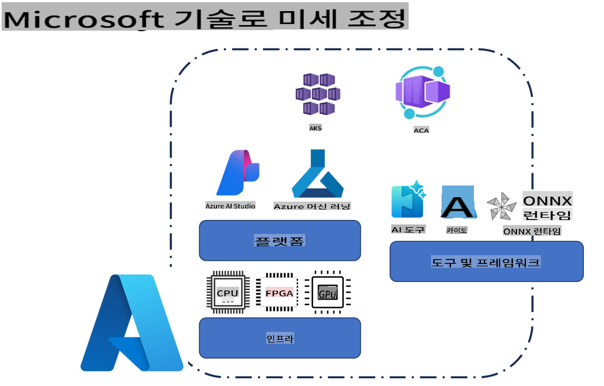
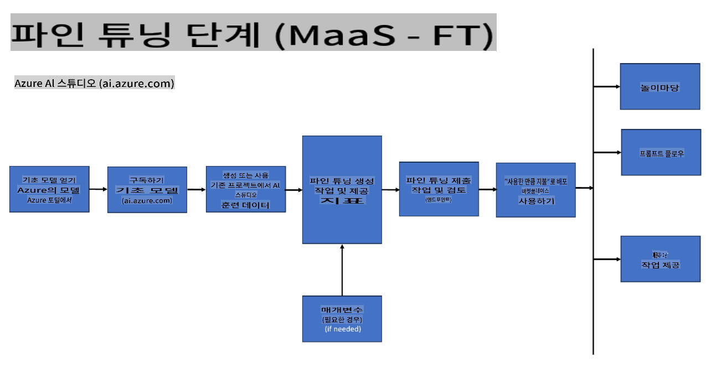
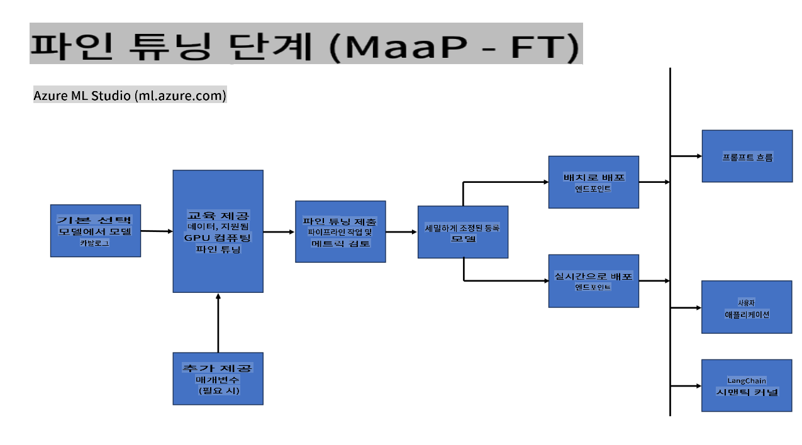
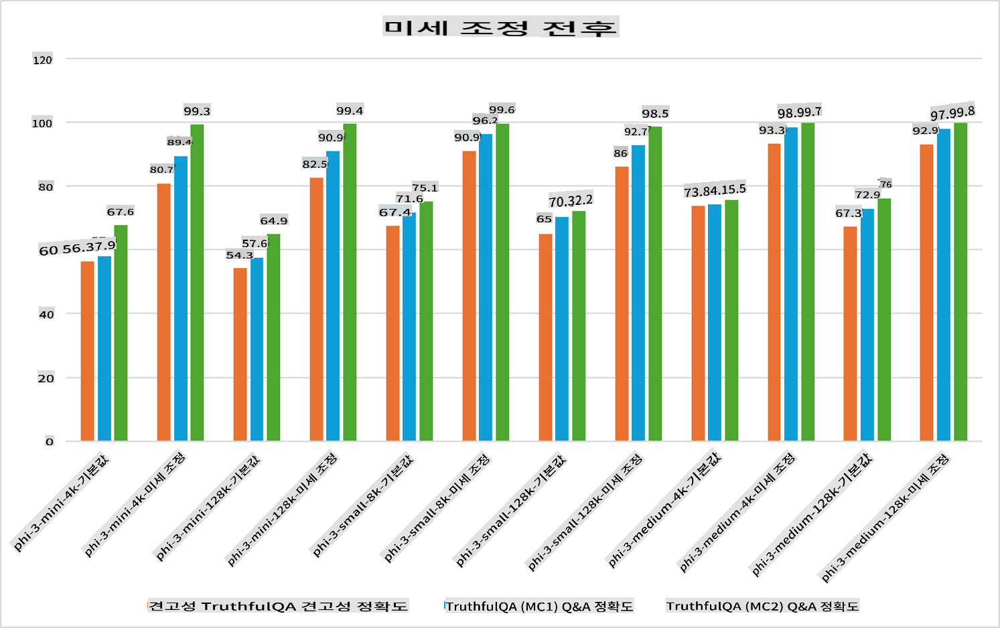

## 미세 조정 시나리오

**플랫폼** 여기에는 Azure AI Foundry, Azure Machine Learning, AI Tools, Kaito, ONNX Runtime 등의 다양한 기술이 포함됩니다.

**인프라** 여기에는 미세 조정 과정에서 필수적인 CPU와 FPGA가 포함됩니다. 각 기술의 아이콘을 보여드리겠습니다.

**도구 및 프레임워크** 여기에는 ONNX Runtime과 ONNX Runtime이 포함됩니다. 각 기술의 아이콘을 보여드리겠습니다.
[ONNX Runtime과 ONNX Runtime의 아이콘 삽입]

Microsoft 기술을 이용한 미세 조정 과정은 다양한 구성 요소와 도구를 포함합니다. 이러한 기술을 이해하고 활용함으로써 애플리케이션을 효과적으로 미세 조정하고 더 나은 솔루션을 만들 수 있습니다.

## 서비스로서의 모델

호스팅된 미세 조정을 사용하여, 컴퓨팅을 생성하고 관리할 필요 없이 모델을 미세 조정합니다.

서버리스 미세 조정은 Phi-3-mini 및 Phi-3-medium 모델에서 사용할 수 있으며, 개발자는 컴퓨팅을 준비할 필요 없이 클라우드 및 엣지 시나리오에 맞게 모델을 신속하고 쉽게 사용자 지정할 수 있습니다. 또한, Phi-3-small 모델이 Models-as-a-Service 제공을 통해 이제 사용 가능하다고 발표했습니다. 이를 통해 개발자는 기본 인프라를 관리할 필요 없이 AI 개발을 빠르고 쉽게 시작할 수 있습니다.

[미세 조정 샘플](https://github.com/microsoft/Phi-3CookBook/blob/main/md/04.Fine-tuning/FineTuning_AIStudio.md)

## 플랫폼으로서의 모델

사용자가 직접 컴퓨팅을 관리하여 모델을 미세 조정합니다.

[미세 조정 샘플](https://github.com/Azure/azureml-examples/blob/main/sdk/python/foundation-models/system/finetune/chat-completion/chat-completion.ipynb)

## 미세 조정 시나리오

| | | | | | | |
|-|-|-|-|-|-|-|
|시나리오|LoRA|QLoRA|PEFT|DeepSpeed|ZeRO|DORA|
|사전 훈련된 LLM을 특정 작업 또는 도메인에 맞게 조정|예|예|예|예|예|예|
|텍스트 분류, 명명된 개체 인식, 기계 번역 등의 NLP 작업을 위한 미세 조정|예|예|예|예|예|예|
|QA 작업을 위한 미세 조정|예|예|예|예|예|예|
|챗봇에서 사람 같은 응답을 생성하기 위한 미세 조정|예|예|예|예|예|예|
|음악, 예술 또는 기타 창의적인 형태를 생성하기 위한 미세 조정|예|예|예|예|예|예|
|계산 및 재정 비용 절감|예|예|아니오|예|예|아니오|
|메모리 사용량 절감|아니오|예|아니오|예|예|예|
|효율적인 미세 조정을 위해 적은 매개변수 사용|아니오|예|예|아니오|아니오|예|
|사용 가능한 모든 GPU 장치의 집합적 GPU 메모리에 액세스할 수 있는 메모리 효율적인 형태의 데이터 병렬 처리|아니오|아니오|아니오|예|예|예|

## 미세 조정 성능 예시

**면책 조항**:
이 문서는 기계 기반 AI 번역 서비스를 사용하여 번역되었습니다. 정확성을 위해 노력하지만, 자동 번역에는 오류나 부정확성이 포함될 수 있습니다. 원어로 작성된 원본 문서를 권위 있는 출처로 간주해야 합니다. 중요한 정보에 대해서는 전문 인간 번역을 권장합니다. 이 번역 사용으로 인한 오해나 잘못된 해석에 대해서는 책임지지 않습니다.