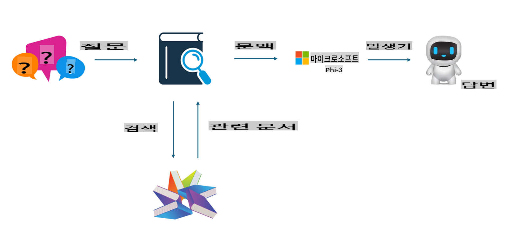

## 파인튜닝 vs RAG

## 검색 증강 생성 (RAG)

RAG는 데이터 검색 + 텍스트 생성을 의미합니다. 기업의 구조화된 데이터와 비구조화된 데이터는 벡터 데이터베이스에 저장됩니다. 관련 내용을 검색할 때, 관련 요약 및 콘텐츠를 찾아 컨텍스트를 형성하고, LLM/SLM의 텍스트 완성 기능과 결합하여 콘텐츠를 생성합니다.

## RAG 프로세스

## 파인튜닝
파인튜닝은 특정 모델의 개선을 기반으로 합니다. 모델 알고리즘에서 시작할 필요는 없지만, 데이터는 지속적으로 축적되어야 합니다. 산업 응용에서 더 정확한 용어와 언어 표현이 필요하다면, 파인튜닝이 더 나은 선택이 될 수 있습니다. 그러나 데이터가 자주 변경된다면, 파인튜닝은 복잡해질 수 있습니다.

## 선택 방법
외부 데이터의 도입이 필요한 답변이 요구된다면, RAG가 최선의 선택입니다.

안정적이고 정확한 산업 지식을 출력해야 한다면, 파인튜닝이 좋은 선택이 될 것입니다. RAG는 관련 콘텐츠를 우선적으로 가져오지만, 항상 특화된 뉘앙스를 정확히 짚어내지는 못할 수 있습니다.

파인튜닝은 고품질의 데이터 세트를 필요로 하며, 데이터 범위가 작다면 큰 차이를 만들지 못할 것입니다. RAG는 더 유연합니다.
파인튜닝은 블랙박스와 같아서 내부 메커니즘을 이해하기 어렵습니다. 하지만 RAG는 데이터 출처를 쉽게 찾을 수 있어 환각이나 콘텐츠 오류를 효과적으로 조정하고 더 나은 투명성을 제공합니다.

면책 조항: 이 번역은 AI 모델에 의해 원본에서 번역되었으며 완벽하지 않을 수 있습니다.
출력을 검토하고 필요한 수정 사항을 반영해 주세요.