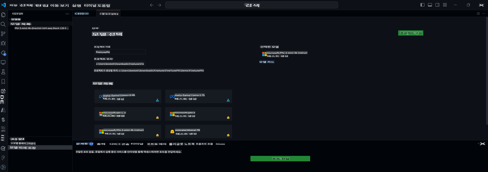

## VS Code AI Toolkit에 오신 것을 환영합니다

[VS Code용 AI Toolkit](https://github.com/microsoft/vscode-ai-toolkit/tree/main)은 Azure AI Studio Catalog 및 Hugging Face와 같은 기타 카탈로그의 다양한 모델을 통합합니다. 이 툴킷은 다음을 통해 생성 AI 도구 및 모델을 사용하여 AI 앱을 개발하는 일반적인 작업을 간소화합니다:
- 모델 검색 및 플레이그라운드 시작하기.
- 로컬 컴퓨팅 자원을 사용한 모델 미세 조정 및 추론.
- Azure 자원을 사용한 원격 미세 조정 및 추론.

[VSCode용 AI Toolkit 설치](https://marketplace.visualstudio.com/items?itemName=ms-windows-ai-studio.windows-ai-studio)



**[Private Preview]** 클라우드에서 모델 미세 조정 및 추론을 실행하기 위한 Azure Container Apps의 원클릭 프로비저닝.

이제 AI 앱 개발을 시작해 봅시다:

- [로컬 개발](../../../../md/04.Fine-tuning)
    - [준비 사항](../../../../md/04.Fine-tuning)
    - [Conda 활성화](../../../../md/04.Fine-tuning)
    - [기본 모델 미세 조정만](../../../../md/04.Fine-tuning)
    - [모델 미세 조정 및 추론](../../../../md/04.Fine-tuning)
- [**[Private Preview]** 원격 개발](../../../../md/04.Fine-tuning)
    - [사전 요구 사항](../../../../md/04.Fine-tuning)
    - [원격 개발 프로젝트 설정](../../../../md/04.Fine-tuning)
    - [Azure 자원 프로비저닝](../../../../md/04.Fine-tuning)
    - [[선택 사항] Huggingface 토큰을 Azure Container App 비밀로 추가](../../../../md/04.Fine-tuning)
    - [미세 조정 실행](../../../../md/04.Fine-tuning)
    - [추론 엔드포인트 프로비저닝](../../../../md/04.Fine-tuning)
    - [추론 엔드포인트 배포](../../../../md/04.Fine-tuning)
    - [고급 사용법](../../../../md/04.Fine-tuning)

## 로컬 개발
### 준비 사항

1. 호스트에 NVIDIA 드라이버가 설치되어 있는지 확인하세요.
2. 데이터셋 사용을 위해 HF를 사용하는 경우 `huggingface-cli login`을 실행하세요.
3. `Olive` 키 설정 설명은 메모리 사용량을 변경하는 모든 항목에 대해 설명합니다.

### Conda 활성화
WSL 환경을 사용하고 공유되므로 conda 환경을 수동으로 활성화해야 합니다. 이 단계 이후에 미세 조정이나 추론을 실행할 수 있습니다.

```bash
conda activate [conda-env-name] 
```

### 기본 모델 미세 조정만
기본 모델을 미세 조정 없이 시도해 보려면 conda를 활성화한 후 이 명령을 실행할 수 있습니다.

```bash
cd inference

# 웹 브라우저 인터페이스를 통해 최대 새 토큰 길이, 온도 등 몇 가지 매개변수를 조정할 수 있습니다.
# 사용자는 gradio가 연결을 시작한 후 브라우저에서 링크(e.g. http://0.0.0.0:7860)를 수동으로 열어야 합니다.
python gradio_chat.py --baseonly
```

### 모델 미세 조정 및 추론

워크스페이스가 개발 컨테이너에서 열리면 터미널을 열고(기본 경로는 프로젝트 루트) 아래 명령을 실행하여 선택한 데이터셋에서 LLM을 미세 조정하세요.

```bash
python finetuning/invoke_olive.py 
```

체크포인트와 최종 모델은 `models` 폴더에 저장됩니다.

다음으로, `콘솔`, `웹 브라우저` 또는 `프롬프트 플로우`에서 채팅을 통해 미세 조정된 모델로 추론을 실행하세요.

```bash
cd inference

# 콘솔 인터페이스.
python console_chat.py

# 웹 브라우저 인터페이스를 통해 최대 새 토큰 길이, 온도 등 몇 가지 매개변수를 조정할 수 있습니다.
# 사용자는 gradio가 연결을 시작한 후 브라우저에서 링크(e.g. http://127.0.0.1:7860)를 수동으로 열어야 합니다.
python gradio_chat.py
```

VS Code에서 `프롬프트 플로우`를 사용하려면 이 [빠른 시작](https://microsoft.github.io/promptflow/how-to-guides/quick-start.html)을 참조하세요.

### 모델 미세 조정

다음으로, 장치의 GPU 사용 가능 여부에 따라 다음 모델을 다운로드하세요.

QLoRA를 사용하여 로컬 미세 조정 세션을 시작하려면 카탈로그에서 미세 조정할 모델을 선택하세요.
| 플랫폼 | GPU 사용 가능 | 모델 이름 | 크기 (GB) |
|---------|---------|--------|--------|
| Windows | Yes | Phi-3-mini-4k-**directml**-int4-awq-block-128-onnx | 2.13GB |
| Linux | Yes | Phi-3-mini-4k-**cuda**-int4-onnx | 2.30GB |
| Windows<br>Linux | No | Phi-3-mini-4k-**cpu**-int4-rtn-block-32-acc-level-4-onnx | 2.72GB |

**_참고_** 모델을 다운로드하는 데 Azure 계정이 필요하지 않습니다.

Phi3-mini (int4) 모델은 약 2GB-3GB 크기입니다. 네트워크 속도에 따라 다운로드하는 데 몇 분이 걸릴 수 있습니다.

프로젝트 이름과 위치를 선택하여 시작하세요.
다음으로, 모델 카탈로그에서 모델을 선택하세요. 프로젝트 템플릿을 다운로드하라는 메시지가 표시됩니다. 그런 다음 "프로젝트 구성"을 클릭하여 다양한 설정을 조정할 수 있습니다.

### Microsoft Olive 

우리는 [Olive](https://microsoft.github.io/Olive/why-olive.html)를 사용하여 카탈로그의 PyTorch 모델에서 QLoRA 미세 조정을 실행합니다. 모든 설정은 메모리를 최적화하여 로컬에서 미세 조정 프로세스를 실행할 수 있도록 기본값으로 설정되어 있지만, 사용자의 시나리오에 맞게 조정할 수 있습니다.

### 미세 조정 샘플 및 리소스

- [미세 조정 시작 가이드](https://learn.microsoft.com/windows/ai/toolkit/toolkit-fine-tune)
- [HuggingFace 데이터셋으로 미세 조정](https://github.com/microsoft/vscode-ai-toolkit/blob/main/archive/walkthrough-hf-dataset.md)
- [Simple DataSet으로 미세 조정](https://github.com/microsoft/vscode-ai-toolkit/blob/main/archive/walkthrough-simple-dataset.md)

## **[Private Preview]** 원격 개발
### 사전 요구 사항
1. 원격 Azure Container App 환경에서 모델 미세 조정을 실행하려면 구독에 충분한 GPU 용량이 있는지 확인하세요. 애플리케이션에 필요한 용량을 요청하려면 [지원 티켓](https://azure.microsoft.com/support/create-ticket/)을 제출하세요. [GPU 용량에 대한 자세한 정보](https://learn.microsoft.com/azure/container-apps/workload-profiles-overview)
2. HuggingFace의 개인 데이터셋을 사용하는 경우, [HuggingFace 계정](https://huggingface.co/)을 만들고 [액세스 토큰을 생성](https://huggingface.co/docs/hub/security-tokens)하세요.
3. VS Code용 AI Toolkit에서 원격 미세 조정 및 추론 기능 플래그를 활성화하세요.
   1. *파일 -> 기본 설정 -> 설정*을 선택하여 VS Code 설정을 엽니다.
   2. *확장*으로 이동하여 *AI Toolkit*을 선택합니다.
   3. *"원격 미세 조정 및 추론 활성화"* 옵션을 선택합니다.
   4. 효과를 적용하려면 VS Code를 다시 로드하세요.

- [원격 미세 조정](https://github.com/microsoft/vscode-ai-toolkit/blob/main/archive/remote-finetuning.md)

### 원격 개발 프로젝트 설정
1. 명령 팔레트에서 `AI Toolkit: Focus on Resource View` 명령을 실행합니다.
2. *모델 미세 조정*으로 이동하여 모델 카탈로그에 액세스합니다. 프로젝트에 이름을 지정하고 위치를 선택합니다. 그런 다음 *"프로젝트 구성"* 버튼을 클릭합니다.
3. 프로젝트 구성
    1. *"로컬에서 미세 조정"* 옵션을 활성화하지 마세요.
    2. Olive 구성 설정이 기본값으로 표시됩니다. 필요한 경우 이 구성을 조정하고 채워 주세요.
    3. *프로젝트 생성* 단계로 이동합니다. 이 단계에서는 WSL을 활용하여 새로운 Conda 환경을 설정하고, 향후 업데이트에는 Dev Containers가 포함됩니다.
4. *"워크스페이스에서 창 다시 실행"*을 클릭하여 원격 개발 프로젝트를 엽니다.

> **참고:** 프로젝트는 현재 VS Code용 AI Toolkit 내에서 로컬 또는 원격으로만 작동합니다. 프로젝트 생성 중에 *"로컬에서 미세 조정"*을 선택하면 WSL에서만 작동하며 원격 개발 기능은 사용할 수 없습니다. 반면, *"로컬에서 미세 조정"*을 활성화하지 않으면 프로젝트는 원격 Azure Container App 환경에서만 작동합니다.

### Azure 자원 프로비저닝
시작하려면 원격 미세 조정을 위한 Azure 자원을 프로비저닝해야 합니다. 명령 팔레트에서 `AI Toolkit: Provision Azure Container Apps job for fine-tuning` 명령을 실행하여 이 작업을 수행하세요.

출력 채널에 표시된 링크를 통해 프로비저닝 진행 상황을 모니터링하세요.

### [선택 사항] Huggingface 토큰을 Azure Container App 비밀로 추가
개인 HuggingFace 데이터셋을 사용하는 경우, HuggingFace 토큰을 환경 변수로 설정하여 Hugging Face Hub에 수동으로 로그인할 필요가 없도록 합니다.
`AI Toolkit: Add Azure Container Apps Job secret for fine-tuning` 명령을 사용하여 이 작업을 수행할 수 있습니다. 이 명령을 사용하여 비밀 이름을 [`HF_TOKEN`](https://huggingface.co/docs/huggingface_hub/package_reference/environment_variables#hftoken)으로 설정하고 Hugging Face 토큰을 비밀 값으로 사용하세요.

### 미세 조정 실행
원격 미세 조정 작업을 시작하려면 `AI Toolkit: Run fine-tuning` 명령을 실행하세요.

시스템 및 콘솔 로그를 보려면 출력 패널의 링크를 사용하여 Azure 포털을 방문할 수 있습니다(자세한 단계는 [Azure에서 로그 보기 및 쿼리](https://aka.ms/ai-toolkit/remote-provision#view-and-query-logs-on-azure)). 또는, 명령 `AI Toolkit: Show the running fine-tuning job streaming logs`를 실행하여 VSCode 출력 패널에서 직접 콘솔 로그를 볼 수 있습니다.
> **참고:** 리소스가 부족하여 작업이 대기 중일 수 있습니다. 로그가 표시되지 않으면 명령 `AI Toolkit: Show the running fine-tuning job streaming logs`를 실행하고 잠시 기다린 후 다시 명령을 실행하여 스트리밍 로그에 다시 연결하세요.

이 과정에서 QLoRA가 미세 조정에 사용되며, 추론 중에 모델에서 사용할 LoRA 어댑터를 생성합니다.
미세 조정 결과는 Azure Files에 저장됩니다.

### 추론 엔드포인트 프로비저닝
원격 환경에서 어댑터가 훈련된 후, 간단한 Gradio 애플리케이션을 사용하여 모델과 상호작용합니다.
미세 조정 과정과 유사하게, 명령 팔레트에서 `AI Toolkit: Provision Azure Container Apps for inference` 명령을 실행하여 원격 추론을 위한 Azure 자원을 설정해야 합니다.

기본적으로, 추론을 위한 구독 및 리소스 그룹은 미세 조정에 사용된 것과 일치해야 합니다. 추론은 동일한 Azure Container App 환경을 사용하며, 미세 조정 단계에서 생성된 Azure Files에 저장된 모델 및 모델 어댑터에 액세스합니다.

### 추론 엔드포인트 배포
추론 코드를 수정하거나 추론 모델을 다시 로드하려면 `AI Toolkit: Deploy for inference` 명령을 실행하세요. 이 명령은 최신 코드를 Azure Container App과 동기화하고 복제를 다시 시작합니다.

배포가 성공적으로 완료되면 VSCode 알림에 표시된 "*Go to Inference Endpoint*" 버튼을 클릭하여 추론 API에 액세스할 수 있습니다. 또는, 웹 API 엔드포인트는 `./infra/inference.config.json`의 `ACA_APP_ENDPOINT` 및 출력 패널에서 찾을 수 있습니다. 이제 이 엔드포인트를 사용하여 모델을 평가할 준비가 되었습니다.

### 고급 사용법
AI Toolkit을 사용한 원격 개발에 대한 자세한 내용은 [원격으로 모델 미세 조정](https://aka.ms/ai-toolkit/remote-provision) 및 [미세 조정된 모델로 추론](https://aka.ms/ai-toolkit/remote-inference) 문서를 참조하세요.

면책 조항: 이 번역은 AI 모델에 의해 원본에서 번역된 것이며 완벽하지 않을 수 있습니다. 
출력을 검토하고 필요한 수정을 해 주시기 바랍니다.